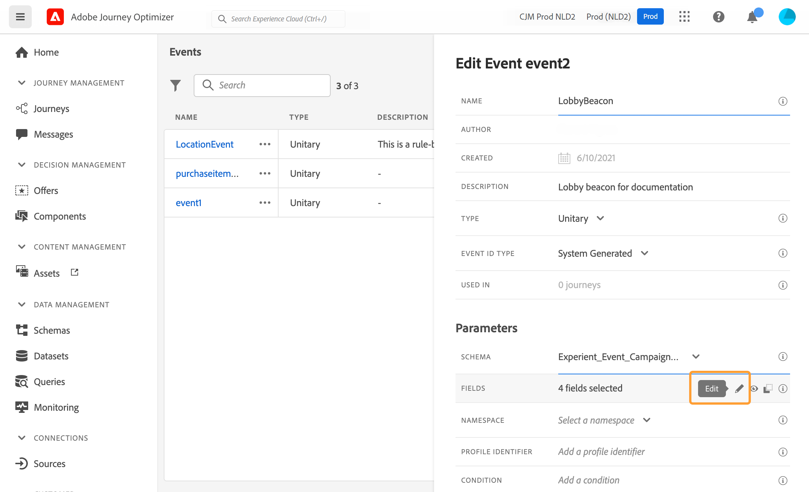
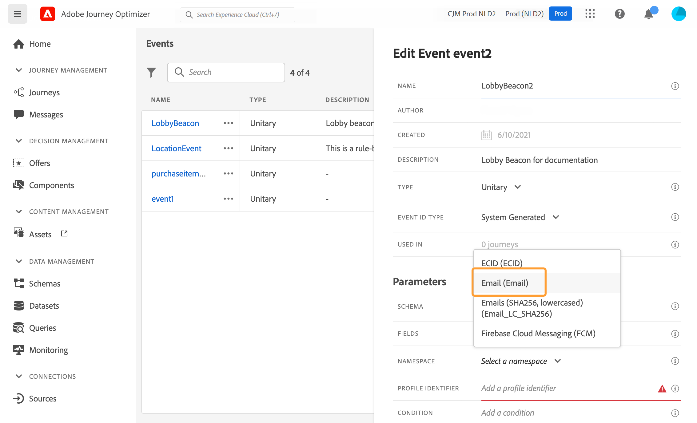
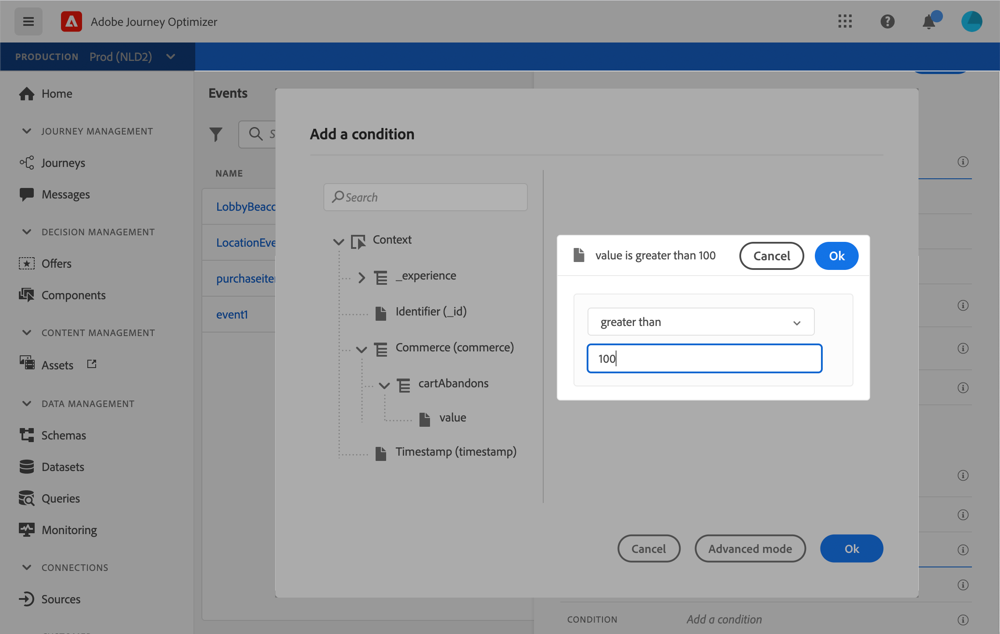
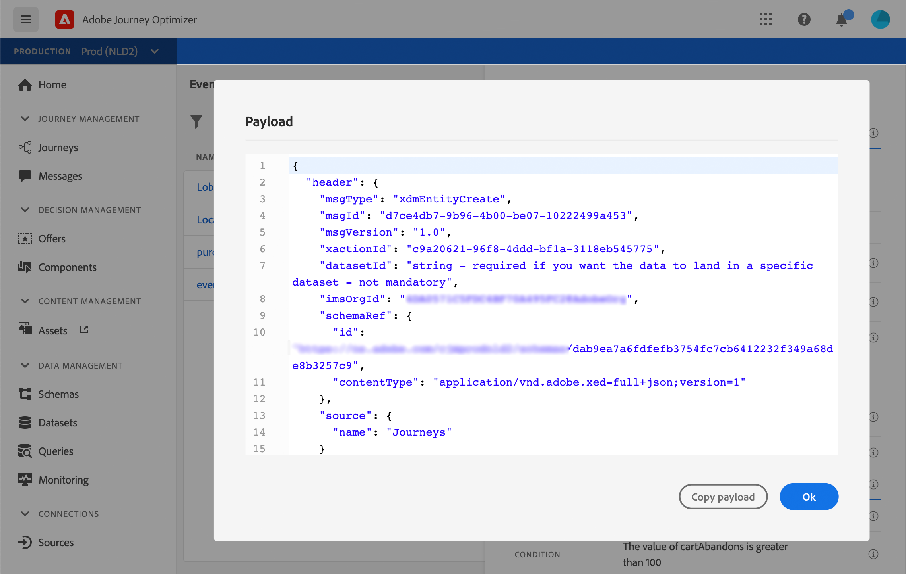

# Configurar um evento unitário {#configure-an-event}

Os eventos unitários são vinculados a um perfil específico. Eles podem ser baseados em regras ou gerados pelo sistema.  Leia mais no evento unitário [nesta seção](../event/about-events.md).

Estas são as primeiras etapas para configurar um novo evento:

1. Na seção ADMINISTRATION , navegue até **[!UICONTROL Configurations]** e clique em **[!UICONTROL Events]**. A lista dos eventos é exibida.

   

1. Clique em **[!UICONTROL Add]** para criar um novo evento. O painel de configuração do evento é aberto no lado direito da tela.

   

1. Insira o nome do evento. Você também pode adicionar uma descrição.

   

   >[!NOTE]
   >
   >Não use espaços ou caracteres especiais. Não use mais de 30 caracteres.

1. No campo **[!UICONTROL Type]**, escolha **Unitary events**.

   

1. No campo **[!UICONTROL Event ID type]**, selecione o tipo de ID de evento que deseja usar: **Baseado em regras** ou **Gerado pelo sistema**. Leia mais sobre tipos de ID de evento em [esta seção](../event/about-events.md#event-id-type).

   

1. O número de jornadas que usam esse evento é exibido no campo **[!UICONTROL Used in]**. Você pode clicar no ícone **[!UICONTROL View journeys]** para exibir a lista de jornadas usando esse evento.

1. Defina os campos schema e payload: é aqui que você seleciona as informações do evento (normalmente chamadas de carga útil) que o jornada espera receber. Você poderá então usar essas informações em sua jornada. Consulte [esta seção](../event/about-creating.md#define-the-payload-fields).

   

   >[!NOTE]
   >
   >Quando você seleciona o tipo **[!UICONTROL System Generated]** , somente os esquemas que têm o tipo eventID mixin estão disponíveis. Quando você seleciona o tipo **[!UICONTROL Rule Based]** , todos os esquemas do Evento de experiência ficam disponíveis.

1. Para eventos baseados em regras, clique dentro do campo **[!UICONTROL Event ID condition]**. Usando o editor de expressões simples, defina a condição que será usada pelo sistema para identificar os eventos que acionarão sua jornada.
   

   Em nosso exemplo, escrevemos uma condição baseada na cidade do perfil. Isso significa que sempre que o sistema receber um evento que corresponda a essa condição (campo **[!UICONTROL City]** e valor **[!UICONTROL Paris]**), ele o passará para o jornada.

1. Adicione um namespace. Esta etapa é opcional, mas é recomendada, pois a adição de namespace permite que você aproveite as informações armazenadas no Serviço de perfil do cliente em tempo real. Ela define o tipo de chave que o evento tem. Consulte [esta seção](../event/about-creating.md#select-the-namespace).
1. Defina a chave: escolha um campo a partir dos campos de carga útil ou defina uma fórmula para identificar a pessoa associada ao evento. Essa chave é configurada automaticamente (mas ainda pode ser editada) se você selecionar um namespace. Na verdade, o jornada escolhe a chave que deve corresponder ao namespace (por exemplo, se você selecionar um namespace de email, a chave de email será selecionada). Consulte [esta seção](../event/about-creating.md#define-the-event-key).

   

1. Para eventos gerados pelo sistema, é possível adicionar uma condição. Esta etapa é opcional. Ela permite que o sistema processe apenas os eventos que atendem à condição. A condição só pode ter como base as informações contidas no evento. Consulte [esta seção](../event/about-creating.md#add-a-condition).
1. Clique em **[!UICONTROL Save]**.

   

   Agora o evento está configurado e pronto para ser lançado em uma jornada. Etapas de configuração adicionais são necessárias para receber eventos. Consulte [esta página](../event/additional-steps-to-send-events-to-journey-orchestration.md).

## Defina os campos de carga {#define-the-payload-fields}

A definição de carga permite escolher as informações que o sistema espera receber do evento em sua jornada e a chave para identificar qual pessoa está associada ao evento. A carga é baseada na definição do campo Experience Cloud XDM. Para obter mais informações sobre XDM, consulte [esta página](https://experienceleague.adobe.com/docs/experience-platform/xdm/home.html?lang=pt-BR).

1. Selecione um esquema XDM na lista e clique no campo **[!UICONTROL Payload]** ou no ícone **[!UICONTROL Edit]**.

   

   Todos os campos definidos no schema são exibidos. A lista de campos varia de um schema para outro. Você pode pesquisar um campo específico ou usar os filtros para exibir todos os nós e campos ou somente os campos selecionados. De acordo com a definição do schema, alguns campos podem ser obrigatórios e pré-selecionados. Não é possível desmarcá-los. Todos os campos obrigatórios para o evento ser recebido corretamente pelo jornada são selecionados por padrão.

   >[!NOTE]
   >
   >Certifique-se de ter adicionado o mixin &quot;orquestration&quot; ao esquema XDM. Isso garantirá que o esquema contenha todas as informações necessárias para funcionar com [!DNL Journey Optimizer].

   

1. Selecione os campos que você espera receber do evento. Esses são os campos que o usuário empresarial aproveitará na jornada. Eles também devem incluir a chave que será usada para identificar a pessoa associada ao evento (consulte [esta seção](../event/about-creating.md#define-the-event-key)).

   

   >[!NOTE]
   >
   >Para eventos gerados pelo sistema, o campo **[!UICONTROL eventID]** é adicionado automaticamente na lista de campos selecionados para que [!DNL Journey Optimizer] possa identificar o evento. O sistema que envia o evento não deve gerar uma ID, mas deve usar a disponível na pré-visualização de carga. Consulte [esta seção](../event/about-creating.md#preview-the-payload).

1. Quando terminar de selecionar os campos necessários, clique em **[!UICONTROL Save]** ou pressione **[!UICONTROL Enter]**.

   

   O número de campos selecionados aparece no campo **[!UICONTROL Payload]**.

   

## Selecione o namespace {#select-the-namespace}

O namespace permite definir o tipo de chave usada para identificar a pessoa associada ao evento. Sua configuração é opcional. É necessário se você quiser recuperar, em suas jornadas, informações adicionais provenientes do [Real-time Customer Profile](https://experienceleague.adobe.com/docs/experience-platform/profile/home.html). A definição do namespace não é necessária se você estiver usando apenas dados provenientes de um sistema de terceiros por meio de uma fonte de dados personalizada.

Você pode usar um dos predefinidos ou criar um novo usando o serviço Namespace de identidade. Consulte esta [página](https://experienceleague.adobe.com/docs/experience-platform/identity/home.html).

Se você selecionar um esquema que tenha uma identidade primária, os campos **[!UICONTROL Key]** e **[!UICONTROL Namespace]** serão pré-preenchidos. Se não houver identidade definida, selecionamos _identityMap > id_ como a chave primária. Em seguida, é necessário selecionar um namespace e a chave será pré-preenchida (abaixo do campo **[!UICONTROL Namespace]**) usando _identityMap > id_.

Ao selecionar campos, os campos de identidade primários são marcados.

Selecione um namespace na lista suspensa.

Somente um namespace é permitido por jornada. Se você usar vários eventos na mesma jornada, eles precisarão usar o mesmo namespace. Consulte [esta página](../building-journeys/journey.md).

## Definir a chave de evento {#define-the-event-key}

A chave é o campo ou combinação de campos que faz parte dos dados de carga do evento e que permitirá que o sistema identifique a pessoa associada ao evento. A chave pode ser, por exemplo, a ID do Experience Cloud, uma ID do CRM ou um endereço de email.

Se você planeja aproveitar os dados armazenados no banco de dados do Perfil do cliente em tempo real, deve selecionar, como a chave do evento, as informações definidas como a identidade de um perfil no [Serviço de perfil do cliente em tempo real](https://experienceleague.adobe.com/docs/experience-platform/profile/home.html).

Isso permitirá que o sistema execute a reconciliação entre o evento e o perfil do indivíduo. Se você selecionar um esquema que tenha uma identidade primária, os campos **[!UICONTROL Key]** e **[!UICONTROL Namespace]** serão pré-preenchidos. Se não houver identidade definida, selecionamos _identityMap > id_ como a chave primária. Em seguida, é necessário selecionar um namespace e a chave será pré-preenchida (abaixo do campo **[!UICONTROL Namespace]**) usando _identityMap > id_.

Ao selecionar campos, os campos de identidade primários são marcados.

Se você precisar usar uma chave diferente, como uma ID do CRM ou um endereço de email, é necessário adicioná-la manualmente:

1. Clique dentro do campo **[!UICONTROL Key]** ou no ícone de lápis.

   

1. Selecione o campo escolhido como a chave na lista de campos de carga útil. Você também pode alternar para o editor de expressão avançado para criar chaves mais complexas (por exemplo, uma concatenação de dois campos dos eventos). Veja abaixo, nesta seção.

   

Quando o evento for recebido, o valor da chave permitirá que o sistema identifique a pessoa associada ao evento. Associada a um namespace (consulte [esta seção](../event/about-creating.md#select-the-namespace)), a chave pode ser usada para executar consultas no Adobe Experience Platform. Consulte [esta página](../building-journeys/about-journey-activities.md#orchestration-activities).
A chave também é usada para verificar se uma pessoa está em uma jornada. Na verdade, uma pessoa não pode estar em dois lugares diferentes na mesma jornada. Como resultado, o sistema não permite que a mesma chave, por exemplo, a chave CRMID=3224, esteja em lugares diferentes na mesma jornada.

Você também tem acesso às funções de expressão avançada (**[!UICONTROL Advanced mode]**) se desejar executar manipulações adicionais. Essas funções permitem manipular os valores usados para realizar consultas específicas, como formatos móveis, realizar concatenações de campo, levando em conta apenas uma parte de um campo (por exemplo, os 10 primeiros caracteres). Consulte [esta página](https://experienceleague.adobe.com/docs/journeys/using/building-advanced-conditions-journeys/expressionadvanced.html).

## Adicionar uma condição {#add-a-condition}

A condição só está disponível para eventos gerados pelo sistema. Você pode definir uma condição de evento que permite que o sistema filtre o processamento de eventos. Se a condição for verdadeira, o evento será processado. Se a condição não for verdadeira, o evento será ignorado.

A condição nos eventos só pode ser baseada nos dados transmitidos no payload do evento. A condição definida no nível do evento não pode ser alterada na tela por um profissional de marketing. O objetivo é proteger essa condição quando esse evento for usado. Por exemplo, se você nunca quiser que profissionais de marketing usem eventos de abandono de carrinho se o valor do carrinho for muito pequeno, poderá criar uma condição no campo de evento &quot;valor do carrinho&quot; e impor um valor acima de 100 dólares.

Você pode usar o editor de expressão simples ou o editor de expressão avançado para configurar condições em eventos. Consulte [esta página](https://experienceleague.adobe.com/docs/journeys/using/building-advanced-conditions-journeys/expressionadvanced.html).

Por exemplo, é possível definir uma condição para processar apenas os eventos de um tipo de evento específico e ignorar os outros tipos. Ou se o evento for um abandono de carrinho e a carga incluir o campo de valor do carrinho, você poderá definir uma condição de evento para processar os eventos somente se o valor do carrinho for maior que 100 dólares.

## Visualizar a carga {#preview-the-payload}

A pré-visualização de carga permite validar a definição da carga útil.

>[!NOTE]
>
>Para eventos gerados pelo sistema, ao criar um evento, antes de visualizar a pré-visualização do payload, salve o evento e abra-o novamente. Essa etapa é necessária para gerar uma ID de evento no payload.

1. Clique no ícone **[!UICONTROL View Payload]** para visualizar a carga esperada pelo sistema.

   

   Observe que os campos selecionados são exibidos.

   

1. Verifique a pré-visualização para validar a definição da carga útil.

1. Em seguida, você pode compartilhar a pré-visualização de carga com a pessoa responsável pelo envio do evento. Essa carga útil pode ajudá-lo a projetar a configuração de um evento que leva para [!DNL Journey Optimizer]. Consulte [esta página](../event/additional-steps-to-send-events-to-journey-orchestration.md).
