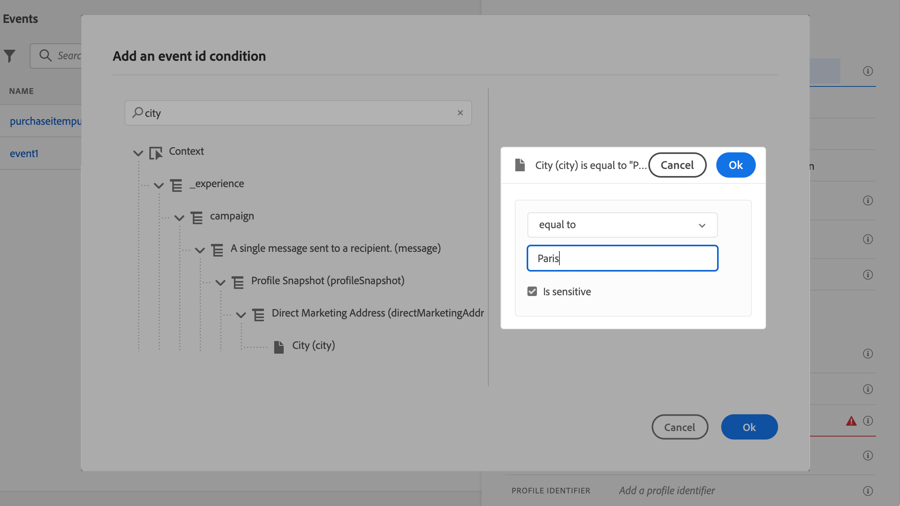
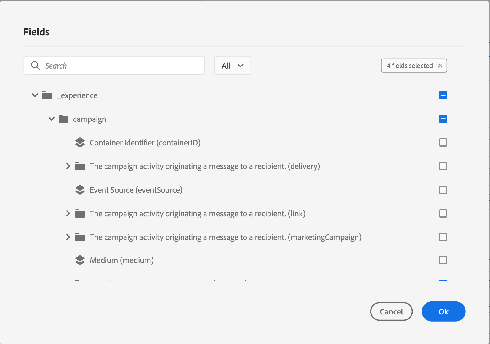
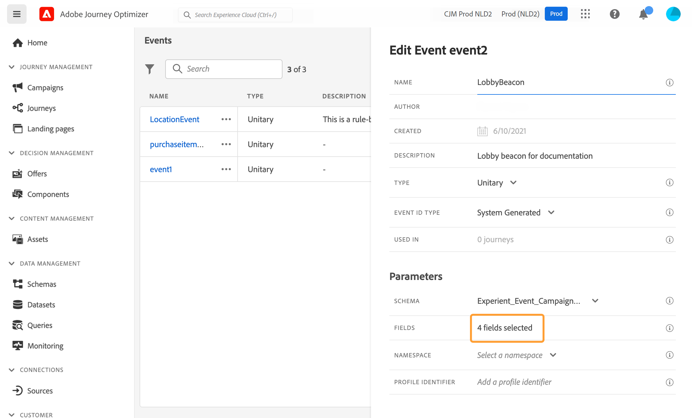
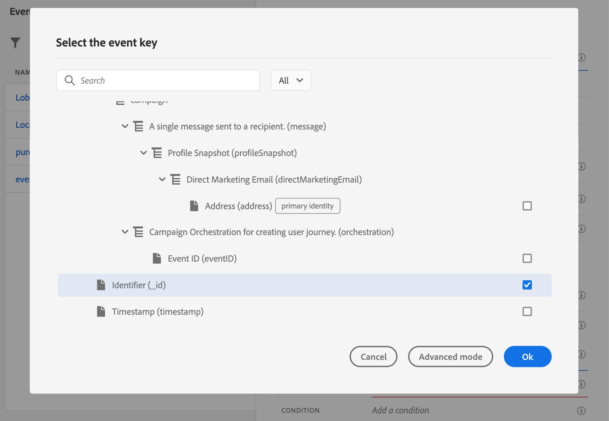
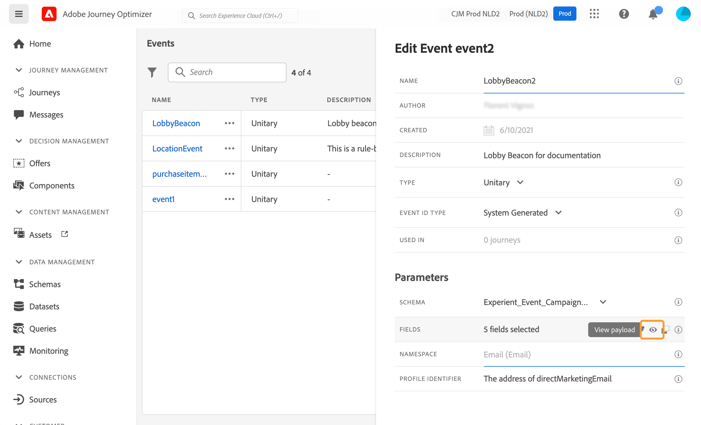

# Configurar um evento unitário {#configure-an-event}

Os eventos unitários são vinculados a um perfil específico. Eles podem ser baseados em regras ou gerados pelo sistema.  Leia mais no evento unitário [esta seção](../event/about-events.md).

Estas são as primeiras etapas para configurar um novo evento:

1. Na seção do menu ADMINISTRATION (ADMINISTRAÇÃO), selecione **[!UICONTROL Configurations]**. No  **[!UICONTROL Events]** seção , clique em **[!UICONTROL Manage]**. A lista dos eventos é exibida.

   

1. Clique em **[!UICONTROL Create Event]** para criar um novo evento. O painel de configuração do evento é aberto no lado direito da tela.

   

1. Insira o nome do evento. Você também pode adicionar uma descrição.

   

   >[!NOTE]
   >
   >Não use espaços ou caracteres especiais. Não use mais de 30 caracteres.

1. No **[!UICONTROL Type]** , escolha **Unitário**.

   

1. No **[!UICONTROL Event ID type]** selecione o tipo de ID de evento que deseja usar: **Baseado em regras** ou **Sistema gerado**. Leia mais sobre os tipos de IDs de evento em [esta seção](../event/about-events.md#event-id-type).

   

1. O número de jornadas que usam esse evento é exibido no campo **[!UICONTROL Used in]**. Você pode clicar no ícone **[!UICONTROL View journeys]** para exibir a lista de jornadas usando esse evento.

1. Defina os campos schema e payload: é aqui que você seleciona as informações do evento (normalmente chamadas de carga útil) que o jornada espera receber. Você poderá então usar essas informações em sua jornada. Consulte [esta seção](../event/about-creating.md#define-the-payload-fields).

   

   >[!NOTE]
   >
   >Ao selecionar a variável **[!UICONTROL System Generated]** , somente os esquemas que têm o campo do tipo eventID estão disponíveis. Ao selecionar a variável **[!UICONTROL Rule Based]** , todos os esquemas de Evento de experiência estão disponíveis.

1. Para eventos baseados em regras, clique dentro do **[!UICONTROL Event ID condition]** campo. Usando o editor de expressões simples, defina a condição que será usada pelo sistema para identificar os eventos que acionarão sua jornada.
   

   Em nosso exemplo, escrevemos uma condição baseada na cidade do perfil. Isso significa que sempre que o sistema receber um evento que corresponda a essa condição (**[!UICONTROL City]** e **[!UICONTROL Paris]** ), ele a passará para o jornada.

   >[!NOTE]
   >
   >O editor de expressão avançado não está disponível ao definir a variável **[!UICONTROL Event ID condition]**. No editor de expressões simples, nem todos os operadores estão disponíveis, eles dependem do tipo de dados. Por exemplo, para um tipo de string de campo, é possível usar &quot;contains&quot; ou &quot;equal to&quot;.

1. Adicione um namespace. Esta etapa é opcional, mas é recomendada, pois a adição de namespace permite que você aproveite as informações armazenadas no Serviço de perfil do cliente em tempo real. Ela define o tipo de chave que o evento tem. Consulte [esta seção](../event/about-creating.md#select-the-namespace).
1. Defina o identificador do perfil: escolha um campo a partir dos campos de carga útil ou defina uma fórmula para identificar a pessoa associada ao evento. Essa chave é configurada automaticamente (mas ainda pode ser editada) se você selecionar um namespace. Na verdade, o jornada escolhe a chave que deve corresponder ao namespace (por exemplo, se você selecionar um namespace de email, a chave de email será selecionada). Consulte [esta seção](../event/about-creating.md#define-the-event-key).

   

1. Clique em **[!UICONTROL Save]**.

   Agora o evento está configurado e pronto para ser lançado em uma jornada. Etapas de configuração adicionais são necessárias para receber eventos. Consulte [esta página](../event/additional-steps-to-send-events-to-journey-orchestration.md).

## Definir os campos de carga {#define-the-payload-fields}

A definição de carga permite escolher as informações que o sistema espera receber do evento em sua jornada e a chave para identificar qual pessoa está associada ao evento. A carga é baseada na definição do campo Experience Cloud XDM. Para obter mais informações sobre XDM, consulte [Documentação do Adobe Experience Platform](https://experienceleague.adobe.com/docs/experience-platform/xdm/home.html?lang=pt-BR){target=&quot;_blank&quot;}.

1. Selecione um esquema XDM na lista e clique no botão **[!UICONTROL Fields]** ou no **[!UICONTROL Edit]** ícone .

   

   Todos os campos definidos no schema são exibidos. A lista de campos varia de um schema para outro. Você pode pesquisar um campo específico ou usar os filtros para exibir todos os nós e campos ou somente os campos selecionados. De acordo com a definição do schema, alguns campos podem ser obrigatórios e pré-selecionados. Não é possível desmarcá-los. Todos os campos obrigatórios para o evento ser recebido corretamente pelo jornada são selecionados por padrão.

   >[!NOTE]
   >
   >Para eventos gerados pelo sistema, verifique se você adicionou o grupo de campos &quot;orquestração&quot; ao esquema XDM. Isso garantirá que o esquema contenha todas as informações necessárias para funcionar com [!DNL Journey Optimizer].

   

1. Selecione os campos que você espera receber do evento. Esses são os campos que o usuário empresarial aproveitará na jornada. Eles também devem incluir a chave que será usada para identificar a pessoa associada ao evento (consulte [esta seção](../event/about-creating.md#define-the-event-key)).

   >[!NOTE]
   >
   >Para eventos gerados pelo sistema, a variável **[!UICONTROL eventID]** é adicionado automaticamente na lista de campos selecionados para que [!DNL Journey Optimizer] pode identificar o evento. O sistema que envia o evento não deve gerar uma ID, mas deve usar a disponível na pré-visualização de carga. Consulte [esta seção](../event/about-creating.md#preview-the-payload).

1. Quando terminar de selecionar os campos necessários, clique em **[!UICONTROL Ok]** ou pressione **[!UICONTROL Enter]**.

   O número de campos selecionados é exibido na **[!UICONTROL Fields]** campo.

   

## Selecionar namespace {#select-the-namespace}

O namespace permite definir o tipo de chave usada para identificar a pessoa associada ao evento. Sua configuração é opcional. É necessário se você quiser recuperar, em suas jornadas, informações adicionais provenientes do [Perfil do cliente em tempo real](https://experienceleague.adobe.com/docs/experience-platform/profile/home.html?lang=pt-BR){target=&quot;_blank&quot;}. A definição do namespace não é necessária se você estiver usando apenas dados provenientes de um sistema de terceiros por meio de uma fonte de dados personalizada.

Você pode usar um dos predefinidos ou criar um novo usando o serviço Namespace de identidade. Consulte [Documentação do Adobe Experience Platform](https://experienceleague.adobe.com/docs/experience-platform/identity/home.html?lang=pt-BR){target=&quot;_blank&quot;}.

Se você selecionar um esquema que tenha uma identidade primária, a variável **[!UICONTROL Profiler identifier]** e **[!UICONTROL Namespace]** Os campos são pré-preenchidos. Se não houver identidade definida, selecionamos _identityMap > id_ como a chave primária. Em seguida, é necessário selecionar um namespace e a chave será pré-preenchida (abaixo de **[!UICONTROL Namespace]** campo) usando _identityMap > id_.

Ao selecionar campos, os campos de identidade primários são marcados.

Selecione um namespace na lista suspensa.

Somente um namespace é permitido por jornada. Se você usar vários eventos na mesma jornada, eles precisarão usar o mesmo namespace. Consulte [esta página](../building-journeys/journey.md).

## Definir o identificador de perfil {#define-the-event-key}

A chave é o campo ou combinação de campos que faz parte dos dados de carga do evento e que permitirá que o sistema identifique a pessoa associada ao evento. A chave pode ser, por exemplo, a ID do Experience Cloud, uma ID do CRM ou um endereço de email.

Se você planeja aproveitar os dados armazenados no banco de dados do Perfil do cliente em tempo real, é necessário selecionar, como a chave do evento, as informações definidas como a identidade de um perfil no [Serviço de perfil do cliente em tempo real](https://experienceleague.adobe.com/docs/experience-platform/profile/home.html){target=&quot;_blank&quot;}.

Isso permitirá que o sistema execute a reconciliação entre o evento e o perfil do indivíduo. Se você selecionar um esquema que tenha uma identidade primária, a variável **[!UICONTROL Profile identifier]** e **[!UICONTROL Namespace]** Os campos são pré-preenchidos. Se não houver identidade definida, selecionamos _identityMap > id_ como a chave primária. Em seguida, é necessário selecionar um namespace e a chave será pré-preenchida (abaixo de **[!UICONTROL Namespace]** campo) usando _identityMap > id_.

Ao selecionar campos, os campos de identidade primários são marcados.

Se você precisar usar uma chave diferente, como uma ID do CRM ou um endereço de email, é necessário adicioná-la manualmente:

1. Clique dentro do **[!UICONTROL Profile identifier]** ou no ícone de lápis.

   

1. Selecione o campo escolhido como a chave na lista de campos de carga útil. Você também pode alternar para o editor de expressão avançado para criar chaves mais complexas (por exemplo, uma concatenação de dois campos dos eventos). Veja abaixo, nesta seção.

   

Quando o evento for recebido, o valor da chave permitirá que o sistema identifique a pessoa associada ao evento. Associado a um namespace (consulte [esta seção](../event/about-creating.md#select-the-namespace)), a chave pode ser usada para executar consultas no Adobe Experience Platform. Consulte [esta página](../building-journeys/about-journey-activities.md#orchestration-activities).
A chave também é usada para verificar se uma pessoa está em uma jornada. Na verdade, uma pessoa não pode estar em dois lugares diferentes na mesma jornada. Como resultado, o sistema não permite que a mesma chave, por exemplo, a chave CRMID=3224, esteja em lugares diferentes na mesma jornada.

Também é possível acessar as funções de expressão avançadas (**[!UICONTROL Advanced mode]**) se você quiser realizar manipulações adicionais. Essas funções permitem manipular os valores usados para realizar consultas específicas, como formatos móveis, realizar concatenações de campo, levando em conta apenas uma parte de um campo (por exemplo, os 10 primeiros caracteres). Consulte [Documentação do Journey Orchestration](../building-journeys/expression/expressionadvanced.md).

## Visualizar a carga {#preview-the-payload}

A pré-visualização de carga permite validar a definição da carga útil.

>[!NOTE]
>
>Para eventos gerados pelo sistema, ao criar um evento, antes de visualizar a pré-visualização do payload, salve o evento e abra-o novamente. Essa etapa é necessária para gerar uma ID de evento no payload.

1. Clique no botão **[!UICONTROL View Payload]** ícone para visualizar a carga esperada pelo sistema.

   

   Observe que os campos selecionados são exibidos.

   

1. Verifique a pré-visualização para validar a definição da carga útil.

1. Em seguida, você pode compartilhar a pré-visualização de carga com a pessoa responsável pelo envio do evento. Essa carga útil pode ajudá-los a projetar a configuração de um evento que é enviado para o [!DNL Journey Optimizer]. Consulte [esta página](../event/additional-steps-to-send-events-to-journey-orchestration.md).
