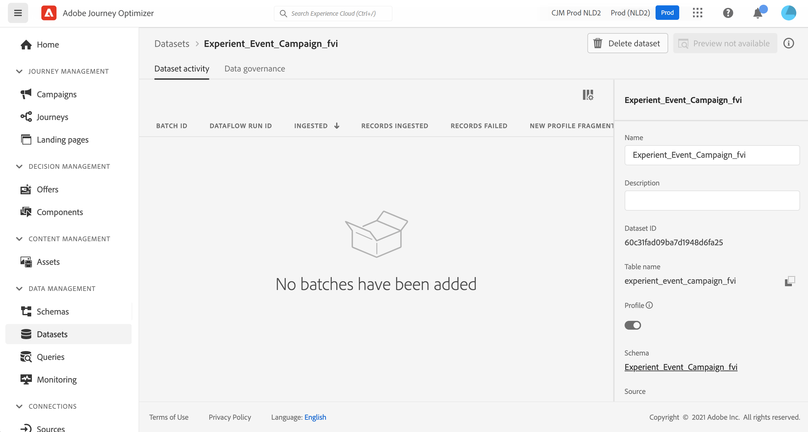
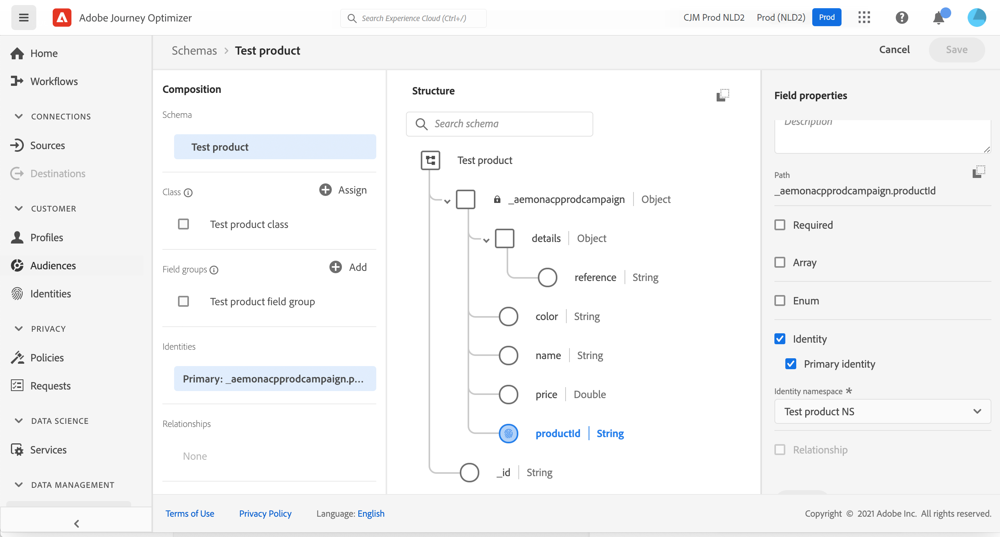
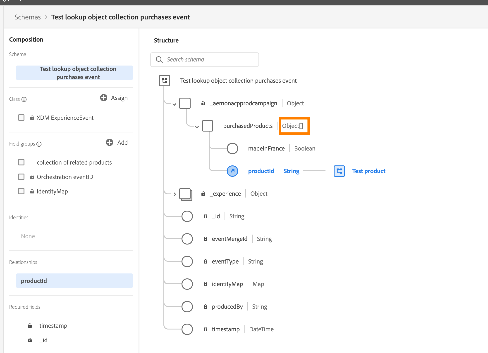

# Sobre Esquemas ExperienceEvent para [!DNL Journey Optimizer] Eventos {#about-experienceevent-schemas}

[!DNL Journey Optimizer] eventos são Eventos de experiência XDM enviados para o Adobe Experience Platform por meio da assimilação de streaming.

Assim, um pré-requisito importante para configurar eventos para o [!DNL Journey Optimizer] é que você esteja familiarizado com o Experience Data Model (ou XDM) da Adobe Experience Platform e saiba como compor esquemas de Evento de experiência XDM, bem como transmitir dados formatados em XDM para a Adobe Experience Platform.

>[!CAUTION]
>
>Pesquisas de eventos de experiência em condições de jornada não são mais suportadas. Procure práticas recomendadas alternativas aqui. Se você tiver um caso de uso de jornada acionado por evento que ainda precise de pesquisa de eventos de experiência e não possa ser compatível por meio de nenhuma das alternativas listadas, entre em contato com o representante da Adobe e ajudaremos você a atingir sua meta.
>
>O acesso ao contexto do evento inicial de uma jornada não é afetado.

## Requisitos de esquema para [!DNL Journey Optimizer] eventos  {#schema-requirements}

A primeira etapa na configuração de um evento para [!DNL Journey Optimizer] é garantir que você tenha um esquema XDM definido para representar o evento e um conjunto de dados criado para registrar instâncias do evento no Adobe Experience Platform. Ter um conjunto de dados para seus eventos não é estritamente necessário, mas enviar os eventos para um conjunto de dados específico permitirá manter o histórico de eventos dos usuários para referência e análise futuras, sempre sendo uma boa ideia. Se você ainda não tiver um esquema e um conjunto de dados adequados para o seu evento, essas duas tarefas poderão ser feitas na interface da Web do Adobe Experience Platform.

Qualquer esquema XDM que será usado para [!DNL Journey Optimizer] eventos deve atender aos seguintes requisitos:

* O esquema deve ser da classe XDM ExperienceEvent.

  

* Para eventos gerados pelo sistema, o esquema deve incluir o grupo de campos Orchestration eventID. [!DNL Journey Optimizer] usa este campo para identificar eventos usados em jornadas.

  

* Declarar um campo de identidade para identificar perfis individuais no evento. Se nenhuma identidade for especificada, um mapa de identidade poderá ser usado. Isso não é recomendado.

  

* Se quiser que esses dados estejam disponíveis para o perfil, marque o esquema e o conjunto de dados para o perfil. [Saiba mais](../data/lookup-aep-data.md)

  

  

* Sinta-se à vontade para incluir campos de dados para capturar quaisquer outros dados de contexto que deseja incluir com o evento, como informações sobre o usuário, o dispositivo do qual o evento foi gerado, o local ou qualquer outra circunstância significativa relacionada ao evento.

  

  

<!--
## Leverage schema relationships{#leverage_schema_relationships}

Adobe Experience Platform allows you to define relationships between schemas in order to use one dataset as a lookup table for another. 

Let's say your brand data model has a schema capturing purchases. You also have a schema for the product catalog. You can capture the product ID in the purchase schema and use a relationship to look up more complete product details from the product catalog. This allows you to create an audience for all customers who bought a laptop, for example, without having to explicitly list out all laptop IDs or capture every single product details in transactional systems.

To define a relationship, you need to have a dedicated field in the source schema, in this case the product ID field in the purchase schema. This field needs to reference the product ID field in the destination schema. The source and destination tables must be enabled for profiles and the destination schema must have that common field defined as its primary identity. 

Here is the product catalog schema enabled for profile with the product ID defined as the primary identity. 

Here is the purchase schema with the relationship defined on the product ID field.

>[!NOTE]
>
>Learn more about schema relationships in the [Experience Platform documentation](https://experienceleague.adobe.com/docs/platform-learn/tutorials/schemas/configure-relationships-between-schemas.html?lang=pt-BR).

In Journey Optimizer, you can then leverage all the fields from the linked tables:

* when configuring a business or unitary event, [Read more](../event/experience-event-schema.md#unitary_event_configuration) 
* when using conditions in a journey, [Read more](../event/experience-event-schema.md#journey_conditions_using_event_context) 
* in message personalization, [Read more](../event/experience-event-schema.md#message_personalization) 
* in custom action personalization, [Read more](../event/experience-event-schema.md#custom_action_personalization_with_journey_event_context) 

### Arrays{#relationships_limitations}

You can define a schema relationship on an array of strings, for example, a list of product IDs.

You can also define a schema relationship with an attribute inside of an array of objects, for example a list of purchase information (product ID, product name, price, discount). The lookup values will be available in journeys (conditions, custom actions, etc.) and message personalization. 

### Event configuration{#unitary_event_configuration}

The linked schema fields are available in unitary and business event configuration:

* when browsing through the event schema fields in the event configuration screen.
* when defining a condition for system-generated events.

The linked fields are not available:

* in the event key formula
* in event id condition (rule-based events)

To learn how to configure a unitary event, refer to this [page](../event/about-creating.md).

### Journey conditions using event context{#journey_conditions_using_event_context}

You can use data from a lookup table linked to an event used in a journey for condition building (expression editor).

Add a condition in a journey, edit the expression and unfold the event node in the expression editor. 

To learn how to define journey conditions, refer to this [page](../building-journeys/condition-activity.md).

### Message personalization{#message_personalization}

The linked fields are available when personalizing a message. The related fields are displayed in the context passed from the journey to the message.

To learn how to personalize a message with contextual journey information, refer to this [page](../personalization/personalization-use-case.md).

### Custom action personalization with journey event context{#custom_action_personalization_with_journey_event_context}

The linked fields are available when configuring the action parameters of a journey custom action activity. 

To learn how to use custom actions, refer to this [page](../building-journeys/using-custom-actions.md).
-->
