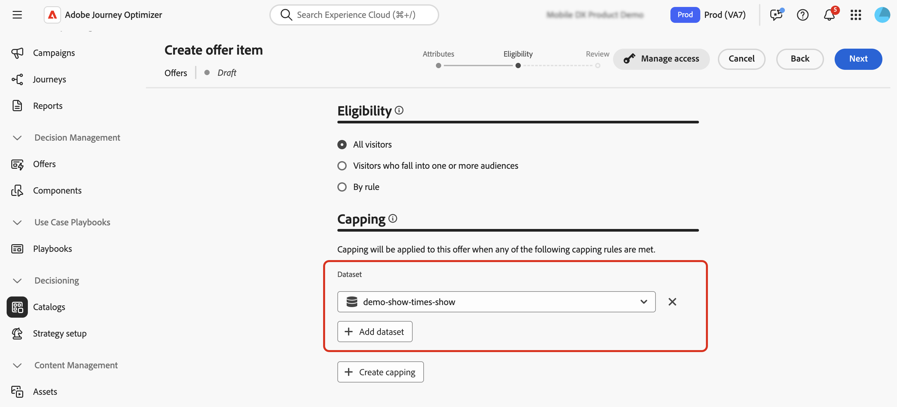

# Usar dados da Adobe Experience Platform para o serviço de decisão {#aep-data}

>[!CONTEXTUALHELP]
>id="ajo_exd_catalogs_dataset"
>title="Pesquisa de conjunto de dados"
>abstract="Para usar atributos da Adobe Experience Platform na tomada de decisões, é necessário criar um mapeamento para definir como o conjunto de dados da Adobe Experience Platform se une aos dados no [!DNL Journey Optimizer]."

>[!CONTEXTUALHELP]
>id="ajo_exd_catalogs_dataset_create"
>title="Pesquisa de conjunto de dados"
>abstract="Selecione o conjunto de dados com os atributos necessários entre todos os conjuntos de dados da Adobe Experience Platform que foram habilitados para pesquisa e escolha uma chave de mapeamento (por exemplo, número do voo ou ID do cliente) que exista nos atributos do item de decisão e no conjunto de dados."

>[!CONTEXTUALHELP]
>id="ajo_exd_rules_dataset_lookup"
>title="Pesquisa de conjunto de dados"
>abstract="Selecione o conjunto de dados da Adobe Experience Platform com os atributos necessários. Se o conjunto de dados não for exibido na lista, verifique se ele foi habilitado para pesquisa e se você criou um mapeamento de pesquisa de conjunto de dados."

>[!CONTEXTUALHELP]
>id="ajo_exd_formula_dataset_lookup"
>title="Pesquisa de conjunto de dados"
>abstract="Use atributos de conjuntos de dados da [!DNL Adobe Experience Platform] para ajustar dinamicamente a lógica de classificação e refletir condições reais. Clique em **[!UICONTROL Adicionar conjunto de dados]** para selecionar o conjunto de dados da Adobe Experience Platform com os atributos necessários. Se o conjunto de dados não for exibido na lista, verifique se ele foi habilitado para pesquisa e se você criou um mapeamento de pesquisa de conjunto de dados."

>[!CONTEXTUALHELP]
>id="ajo_exd_item_capping_dataset"
>title="Adicionar conjunto de dados"
>abstract="Use atributos de conjuntos de dados da [!DNL Adobe Experience Platform] para definir critérios de limite com base em atributos dinâmicos e externos. Clique em **[!UICONTROL Adicionar conjunto de dados]** para selecionar o conjunto de dados da Adobe Experience Platform com os atributos necessários. Se o conjunto de dados não for exibido na lista, verifique se ele foi habilitado para pesquisa e se você criou um mapeamento de pesquisa de conjunto de dados."

[!DNL Journey Optimizer] permite que você aproveite os dados de [!DNL Adobe Experience Platform] para a Decisão. Isso permite estender a definição dos atributos de decisão para dados adicionais nos conjuntos de dados para atualizações em massa que mudam periodicamente, sem precisar atualizar manualmente os atributos um de cada vez. Por exemplo, disponibilidade, tempos de espera etc.

>[!AVAILABILITY]
>
>No momento, esse recurso está disponível para todos os clientes como uma versão de disponibilidade limitada.

## Medidas de proteção e limitações {#guardrails}

* **Canais com suporte** - A pesquisa de conjunto de dados com o Decisioning funciona para todos os canais nos quais o Decisioning está disponível: experiência baseada em código (entrada), Email, Push, SMS e o nó de decisão de conteúdo no jornada.
* **Uso de atributo** - A funcionalidade de pesquisa do conjunto de dados para a tomada de decisão estende as definições de item de decisão com atributos adicionais — ela não estende atributos aos perfis.
* **Limites de pesquisa**: [!DNL Journey Optimizer] dá suporte a até 1.000 pesquisas por política de decisão única.

## Pré-requisitos

### Habilitar conjuntos de dados para pesquisa

Antes de iniciar, os conjuntos de dados necessários para a decisão devem ser habilitados para pesquisa. Siga as etapas detalhadas nesta seção: [Usar dados do Adobe Experience Platform](../data/lookup-aep-data.md).

### Criar mapeamentos

Para usar atributos do Adobe Experience Platform para a tomada de decisões, é necessário criar um mapeamento para definir como o conjunto de dados do Adobe Experience Platform se une aos dados no [!DNL Journey Optimizer]. Para fazer isso, siga estes passos:

1. Navegue até **[!UICONTROL Catálogos]** / **[!UICONTROL Pesquisa de conjunto de dados]** e clique em **[!UICONTROL Criar]**.

   

1. Configure o mapeamento:

   1. Clique em **[!UICONTROL Selecionar conjunto de dados]** para exibir todos os conjuntos de dados do Adobe Experience Platform que foram habilitados para pesquisa. Selecione o conjunto de dados com os atributos necessários.

   1. Clique em **[!UICONTROL Selecionar chave]** para escolher uma chave de associação (por exemplo, número do voo ou ID do cliente) que exista nos atributos do item de decisão e no conjunto de dados.

   

1. Clique em **[!UICONTROL Salvar]**.

## Aproveitar os dados do Adobe Experience Platform {#leverage-aep-data}

Depois que um conjunto de dados é ativado para pesquisa e que os mapeamentos são criados, você pode usar os dados para enriquecer a lógica de decisão com dados externos. Isso é especialmente útil para atributos que mudam com frequência, como disponibilidade de produtos ou preços em tempo real.

Os atributos dos conjuntos de dados do Adobe Experience Platform podem ser usados em duas partes da lógica de decisão:

* **Regras de decisão**: defina se um item de decisão está qualificado para ser exibido.
* **Fórmulas de classificação**: priorizar itens de decisão com base em dados externos.
* **Regras de limitação**: use dados externos para calcular o limite para regras de limitação.

As próximas seções explicam como usar os dados do Adobe Experience Platform nesses contextos.

### Regras de decisão {#rules}

Usar dados do Adobe Experience Platform em regras de decisão permite definir critérios de qualificação com base em atributos dinâmicos e externos, garantindo que os itens de decisão sejam exibidos somente quando relevantes.

Por exemplo, digamos que uma retailer online queira promover recomendações de produto com base no inventário da loja local. Um produto só deve ser qualificado para recomendação se estiver em estoque no local mais próximo. Um conjunto de dados contendo atualizações diárias de inventário é carregado para o Adobe Experience Platform. A lógica da regra verifica se o `inventory_count` de um determinado produto é maior que 0 para a loja preferencial do cliente. Em caso afirmativo, o item de decisão é elegível.

Para usar os dados do Adobe Experience Platform em regras de decisão, siga estas etapas:

1. Vá para o menu **[!UICONTROL Configuração de estratégia]** / **[!UICONTROL Regras de decisão]** e selecione **[!UICONTROL Criar regra com conjunto de dados]**.

   

1. Clique em **[!UICONTROL Adicionar conjunto de dados]** e selecione o conjunto de dados com os atributos necessários.

   

1. Clique em **[!UICONTROL Continuar]**. Agora você pode acessar os atributos do conjunto de dados no menu **[!UICONTROL Pesquisa de conjunto de dados]** e usá-los nas condições da regra. [Saiba como criar uma regra de decisão](../experience-decisioning/rules.md#create)

   

### Fórmulas de classificação {#ranking-formulas}

As fórmulas de classificação definem a prioridade dos itens de decisão. Ao usar atributos de conjunto de dados do [!DNL Adobe Experience Platform], você pode ajustar dinamicamente a lógica de classificação para refletir condições reais.

Por exemplo, considere que uma companhia aérea use uma fórmula de classificação para priorizar ofertas de atualização. Se um cliente tiver um nível de fidelidade alto e a disponibilidade atual de vagas for baixa (com base em um conjunto de dados atualizado por hora), ele receberá prioridade mais alta. O conjunto de dados inclui campos como `flight_number`, `available_seats` e `loyalty_score`.

Para usar os dados do Adobe Experience Platform em fórmulas de classificação, siga estas etapas:

1. Criar ou editar uma fórmula de classificação.

1. Na seção **[!UICONTROL Pesquisa de conjunto de dados]**, clique em **[!UICONTROL Adicionar conjunto de dados]**.

1. Selecione o conjunto de dados apropriado.

   

   >[!NOTE]
   >
   >Se o conjunto de dados que você está procurando não for exibido na lista, verifique se você o ativou para pesquisa e criou um mapeamento de pesquisa de conjunto de dados. Para obter mais detalhes, consulte a seção [Pré-requisitos](#prerequisites).

1. Use os campos do conjunto de dados para criar a fórmula de classificação como de costume. [Saiba como criar uma fórmula de classificação](ranking/ranking-formulas.md#create-ranking-formula)

   

### Regras de limite {#capping-rules}

As regras de limitação são usadas como restrições para definir o número máximo de vezes que um item de decisão pode ser apresentado. Usar dados do Adobe Experience Platform nas regras de limite permite definir critérios de limite com base em atributos dinâmicos e externos. Isso é feito usando uma expressão em sua regra de limite para calcular o limite de limite desejado.

Por exemplo, uma retailer pode querer limitar uma oferta com base no inventário de produtos em tempo real. Em vez de definir um limite fixo de 500, eles usam uma expressão que faz referência ao campo `inventory_count` de um conjunto de dados do Adobe Experience Platform. Se o conjunto de dados mostrar que 275 itens permanecem no estoque, a oferta só será entregue até esse número.

>[!NOTE]
>
>A regra de limite **expressões** estão disponíveis no momento como um recurso de Disponibilidade Limitada para todos os usuários e têm suporte somente para o tipo de limite **[!UICONTROL No total]**.

Para usar dados do Adobe Experience Platform em expressões de regras de limite, siga estas etapas:

1. Criar ou editar um item de decisão.

1. Ao definir a qualificação do item, clique em **[!UICONTROL Adicionar conjunto de dados]** e selecione o conjunto de dados apropriado.

   

   >[!NOTE]
   >
   >Se o conjunto de dados que você está procurando não for exibido na lista, verifique se você o ativou para pesquisa e criou um mapeamento de pesquisa de conjunto de dados. Para obter mais detalhes, consulte a seção [Pré-requisitos](#prerequisites).

1. Selecione o tipo de limite **[!UICONTROL No total]** e habilite a opção **[!UICONTROL Expression]**.

   

   >[!NOTE]
   >
   >Se o conjunto de dados que você está procurando não for exibido na lista, verifique se você o ativou para pesquisa e criou um mapeamento de pesquisa de conjunto de dados. Para obter mais detalhes, consulte a seção [Pré-requisitos](#prerequisites).

1. Edite a expressão e use os campos do conjunto de dados para criar a expressão.

   

1. Conclua a configuração do limite e do item de decisão da regra como de costume. [Saiba como definir regras de limitação](../experience-decisioning/items.md#capping)
