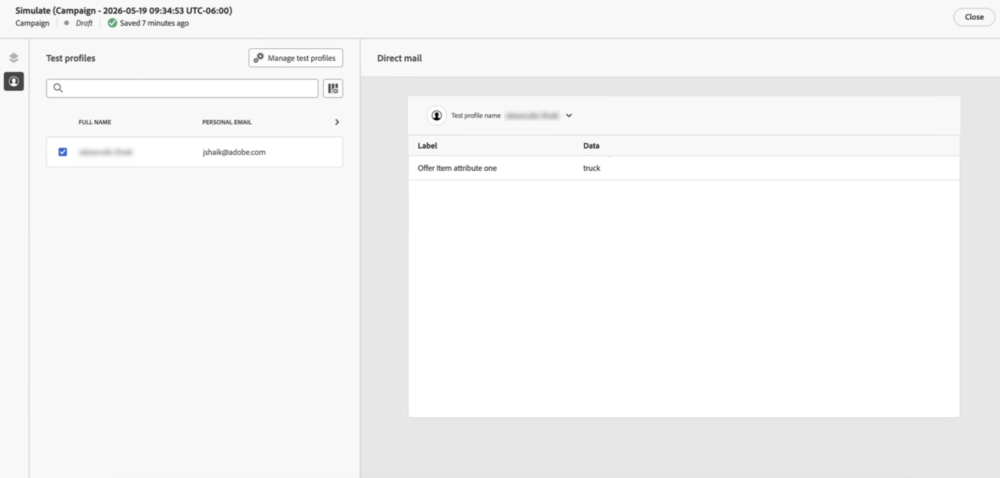

# Decisão em lote na correspondência direta {#batch-decisioning-direct-mail}

Com a decisão em lote, o Decisioning seleciona o(s) melhor(is) item(ns) de decisão para cada perfil e inclui esses resultados no arquivo de extração de correspondência direta. Você pode retornar vários itens por perfil definindo **[!UICONTROL Número de itens]** ao configurar a política de decisão. O arquivo exportado pode ser usado para personalização de correspondência direta ou para casos de uso em lote em que você exporta perfis e atributos de decisão para outro sistema.

A decisão em lote na correspondência direta aceita dois casos de uso principais:

* **Correspondência direta com decisão** - Personalizar correio físico por destinatário. Por exemplo, escolha a melhor imagem ou oferta para cada perfil usando regras de elegibilidade e classificação (prioridade ou fórmulas). O arquivo de extração inclui dados do perfil mais atributos do item ou itens de decisão selecionados (por exemplo, o URL da imagem da oferta) para seu provedor de correspondência direta.
* **Exportação em lote para sistemas downstream** - Exporte perfis e seus resultados de decisão (por exemplo, IDs de oferta, atributos) para usar em outro sistema. Você executa a decisão em lote e exporta o arquivo para o servidor; as ferramentas de downstream (por exemplo, um provedor de serviços de email de terceiros) consomem esses dados para suas próprias campanhas ou processos.

>[!NOTE]
>
>Esta página foca nos aspectos específicos do Decisioning sobre o uso do batch decisioning com mala direta. Para obter detalhes completos sobre a configuração e o uso do canal de correspondência direta, incluindo roteamento de arquivos, configuração de canal e configuração de extração de arquivos, consulte [Introdução à correspondência direta](../direct-mail/get-started-direct-mail.md) e [Criar uma mensagem de correspondência direta](../direct-mail/create-direct-mail.md).

## Visão geral do fluxo de trabalho {#workflow}

1. **Criar uma campanha ou jornada de correspondência direta**: crie uma jornada ou campanha, selecione a ação **[!UICONTROL Correspondência direta]**, escolha uma configuração de correspondência direta e defina a audiência.

   ➡️ [Saiba como criar uma mensagem de correspondência direta](../direct-mail/create-direct-mail.md)

1. **Adicionar uma política de decisão**:

   1. Clique em **[!UICONTROL Editar conteúdo]** para configurar o arquivo de extração.
   1. Adicione uma coluna ao arquivo de extração e abra o editor de personalização usando o ícone .

      

   1. Navegue até o menu **[!UICONTROL Decisão]** para criar uma política de decisão. Na configuração da política, defina **[!UICONTROL Número de itens]** se precisar de mais de um item de decisão por perfil, configure a estratégia de seleção e o fallback opcional.

      

   ➡️ [Saiba como adicionar e configurar uma política de decisão na correspondência direta](create-decision-policy.md#add)

1. **Personalize o arquivo de correspondência direta com atributos de decisão**: para colunas que devem conter o resultado da decisão, abra o Editor do Personalization, navegue até **[!UICONTROL Políticas de decisão]** e selecione **[!UICONTROL Inserir política]** para adicionar o código da sua política de decisão.

   Use os atributos do item de decisão retornado para que as informações da oferta selecionada sejam incluídas no arquivo de extração de cada perfil. Quando vários itens forem retornados, mapeie os atributos de cada item nas colunas usando o loop da política `#each`.

   ➡️ [Saiba como usar políticas de decisão em mensagens - guia Correspondência direta](use-decision-policy.md)

1. Use **[!UICONTROL Simular conteúdo]** com um perfil de teste para visualizar a linha exportada (incluindo o valor de decisão).

   

   ➡️ [Saiba como visualizar e testar seu conteúdo](../content-management/preview-test.md)

1. Ative a campanha ou publique a jornada para gerar e exportar o arquivo (CSV ou delimitado por texto) para o servidor configurado.

   ➡️ [Saiba como revisar e ativar uma campanha](../campaigns/review-activate-campaign.md) | [Saiba como publicar uma jornada](../building-journeys/publish-journey.md)

## Correspondência direta + exemplo de decisão {#example-direct-mail}

Exemplo: um retailer fitness envia um cartão postal personalizado para cada cliente com uma das dez imagens possíveis. Eles usam o Decisioning para escolher a melhor imagem por perfil.

1. Crie 10 itens de decisão (um por imagem), cada um com regras de qualificação (por exemplo, idade, sexo).
2. Adicione-os a uma coleção e crie uma estratégia de seleção com um método de classificação (por exemplo, prioridade manual ou fórmula).
3. Em uma campanha ou jornada de correspondência direta, ative a decisão e adicione uma política de decisão que use essa estratégia de seleção.
4. No arquivo de extração, adicione uma coluna cujos dados são o atributo de item de decisão que contém a imagem escolhida (por exemplo, URL da imagem da oferta). Outras colunas podem ser nome completo, endereço, estado, CEP etc.
5. Quando a campanha é executada, cada perfil recebe uma linha na exportação com a imagem selecionada para esse perfil. O provedor de correspondência direta usa esse arquivo para produzir a correspondência física.

Você pode usar **[!UICONTROL Simular conteúdo]** com um perfil de teste para ver o resultado da decisão (por exemplo, a imagem) que seria exportada para esse perfil.

## Caso de uso de exportação em lote (middleware) {#example-batch-export}

Alguns clientes usam a decisão em lote para exportar perfis e seus resultados de decisão para uso em outros sistemas (por exemplo, um CRM ou provedor de serviços de email). O fluxo é:

1. Configure a correspondência direta (roteamento de arquivos + configuração de canal) conforme acima.
2. Crie uma campanha ou jornada de correspondência direta e adicione uma política de decisão.
3. Adicione colunas para campos de perfil e para os atributos de item de decisão necessários na exportação.
4. Ative a campanha. O arquivo é exportado para o servidor (por exemplo, Amazon S3 ou SFTP).
5. O sistema downstream recupera o arquivo e usa os dados do perfil e da decisão para suas próprias campanhas ou processos.

Isso oferece suporte a casos de uso de decisão em lote por meio do canal de correspondência direta com o Experience Decisioning.

## Documentação relacionada {#related}

* [Criar uma mensagem de correspondência direta](../direct-mail/create-direct-mail.md) - Configurar o arquivo de extração e habilitar a decisão
* [Criar políticas de decisão](create-decision-policy.md#add) - Adicionar uma política de decisão na guia Mala Direta
* [Configuração de correspondência direta](../direct-mail/direct-mail-configuration.md) - Configuração de canal e roteamento de arquivos
* [Introdução à Decisão](gs-experience-decisioning.md) - Conceitos e medidas de proteção
