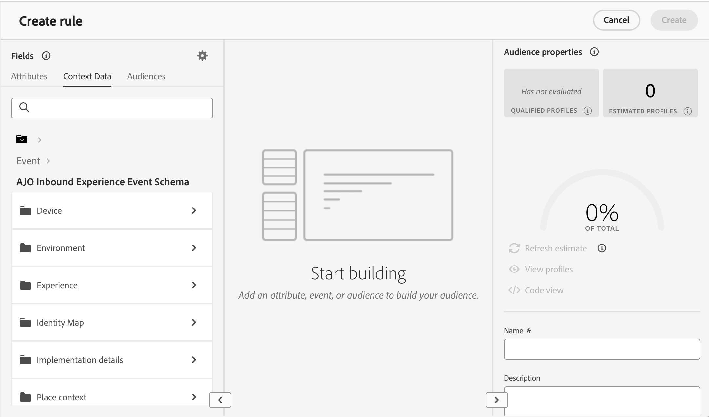

# Aproveitar dados de contexto no Decisioning {#context}

Com o Decisioning, você pode aproveitar todas as informações disponíveis no Adobe Experience Platform para executar várias ações, como criar [regras de decisão](rules.md) ou [fórmulas de classificação](ranking/ranking.md).

Por exemplo, você pode projetar uma regra de decisão que exija que o tempo atual seja ≥ 80 graus no momento em que a solicitação de decisão é feita.

>[!NOTE]
>
>Os dados de contexto são definidos no Adobe Experience Platform e enviados no momento de uma solicitação de decisão. Ela não inclui dados históricos.

Para usar dados de contexto, primeiro é necessário definir os dados que deseja disponibilizar no Decisioning. Depois de concluídos, esses dados se integram perfeitamente à Decisão na guia **[!UICONTROL Dados de contexto]** disponível ao criar uma regra de decisão. Você também pode aproveitar os dados ao editar uma fórmula de classificação.

As etapas para alimentar a Decisão com dados do Adobe Experience Platform são as seguintes:

1. Crie um **esquema de Evento de Experiência** no Adobe Experience Platform e seu **conjunto de dados** associado. [Saiba como criar esquemas](https://experienceleague.adobe.com/en/docs/experience-platform/xdm/ui/resources/schemas){target="_blank"}

1. Criar um novo fluxo de dados do Adobe Experience Platform:

   1. Navegue até o menu **[!UICONTROL Datastreams]** e selecione **[!UICONTROL Novo Datastream]**.

   1. Na lista suspensa **[!UICONTROL Esquema de evento]**, selecione o esquema de Evento de experiência criado anteriormente e clique em **[!UICONTROL Salvar]**.

      

   1. Clique em **[!UICONTROL Adicionar serviço]** e selecione &quot;Adobe Experience Platform&quot; como o serviço. Na lista suspensa **[!UICONTROL Conjunto de Dados do Evento]**, selecione o conjunto de dados do evento criado anteriormente e habilite a opção **[!UICONTROL Adobe Journey Optimizer]**.

      

Depois que a sequência de dados é salva, as informações do conjunto de dados selecionado são buscadas automaticamente e integradas ao Decisioning, normalmente ficando disponíveis em aproximadamente 24 horas.

Para obter mais orientações sobre como trabalhar com o Adobe Experience Platform, explore os seguintes recursos:

* [Esquemas do Experience Data Model (XDM)](https://experienceleague.adobe.com/en/docs/experience-platform/xdm/schema/composition){target="_blank"}
* [Conjuntos de dados](https://experienceleague.adobe.com/en/docs/experience-platform/catalog/datasets/overview){target="_blank"}
* [Sequências de dados](https://experienceleague.adobe.com/en/docs/experience-platform/datastreams/overview){target="_blank"}
