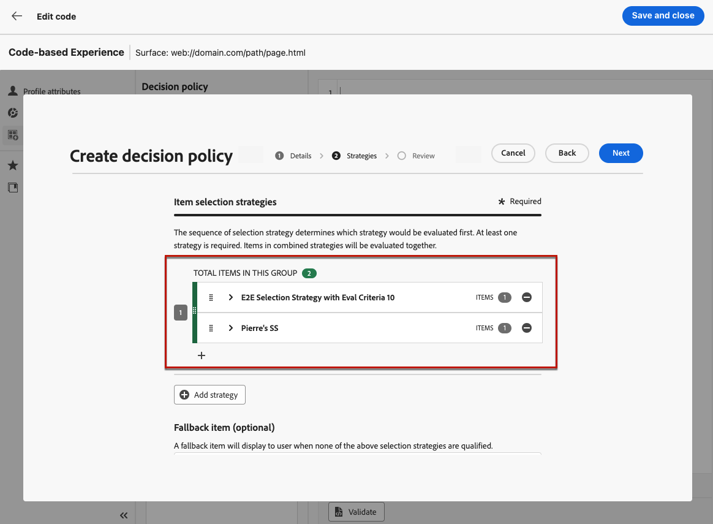

# Criar políticas de decisão {#create-decision}

>[!CONTEXTUALHELP]
>id="ajo_code_based_item_number"
>title="Defina o número de itens a serem retornados"
>abstract="Selecione o número de itens de decisão que deseja que sejam retornados. Por exemplo, se você selecionar 2, as duas melhores ofertas elegíveis serão apresentadas para a configuração atual."

>[!CONTEXTUALHELP]
>id="ajo_code_based_fallback"
>title="Selecione uma alternativa"
>abstract="Um item alternativo é exibido ao usuário(a) quando nenhuma das estratégias de seleção definidas para essa política de decisão está qualificada."

>[!CONTEXTUALHELP]
>id="ajo_code_based_strategy"
>title="O que é uma estratégia?"
>abstract="A sequência da estratégia de seleção determina qual estratégia será avaliada primeiro. Pelo menos uma estratégia é necessária. Os itens de decisão em estratégias combinadas serão avaliados em conjunto."
>additional-url="https://experienceleague.adobe.com/pt-br/docs/journey-optimizer/using/decisioning/offer-decisioning/get-started-decision/starting-offer-decisioning" text="Criação de estratégias"

Para apresentar a melhor oferta dinâmica e experiência aos seus clientes, adicione uma política de decisão ao seu conteúdo em uma campanha ou jornada e configure os itens a serem retornados e a estratégia de seleção a ser usada. Para isso, siga as etapas abaixo:

1. [Adicionar uma política de decisão](#add) - Do editor do Personalization ou do Designer de email.
1. [Configurar a política de decisão](#configurre) - Adicione um nome e especifique o número de itens a serem retornados.
1. [Configurar uma sequência de estratégia](#strategy) - Selecione os itens a serem retornados com a política de decisão.
1. [Selecionar ofertas substitutas](#fallback) (opcional) - Selecione os itens a serem exibidos se nenhum item ou estratégia de seleção estiver qualificado.
1. [Revisar e salvar](#review) a estratégia de seleção

>[!AVAILABILITY]
>
>Por enquanto, as políticas de decisão estão disponíveis para todos os clientes para o canal de **Experiência baseada em código**. Eles estão disponíveis para o canal **Email** como uma Disponibilidade Limitada. Entre em contato com o representante da Adobe para obter acesso.

## Adicionar uma política de decisão {#add}

1. Abra uma jornada ou campanha, selecione uma [ação de canal](../building-journeys/journeys-message.md) e edite o conteúdo da sua mensagem.

1. Para emails, alterne a opção **[!UICONTROL Habilitar decisão]**.

   

   >[!IMPORTANT]
   >
   >A ativação da decisão apaga o conteúdo de email existente. Se você já criou seu email, salve o conteúdo como um modelo antes.
   >
   >Observe que qualquer política de decisão configurada no email não será salva no modelo. Se você aplicar o template a outro email, precisará reconfigurar a política.

1. Abra o **editor de personalização** para criar a política de decisão. Para emails, você também pode usar um menu dedicado no **Designer de email** para criar uma política de decisão. Expanda as seções abaixo para explorar os dois métodos.

   +++Criar uma política de decisão pelo editor do Personalization

   1. Abra o editor de personalização e selecione **[!UICONTROL Política de decisão]**.
   1. Clique no botão **[!UICONTROL Adicionar política de decisão]** para criar uma nova política.

      

   +++

   +++Criar uma política de decisão por meio do Designer de email

   Selecione um componente no seu conteúdo de email, clique no ícone **[!UICONTROL Decisão]** na barra de ferramentas ou no painel de propriedades e selecione **[!UICONTROL Adicionar nova política]**.

   A **[!UICONTROL Reutilizar saída de decisão]** permite reutilizar uma política de decisão que já foi criada neste email.

   

   +++

## Configurar a política de decisão {#configure}

Após ter adicionado uma nova política de decisão ao seu conteúdo, a tela de configuração da política de decisão é aberta.

1. Forneça um nome para a política de decisão e selecione um catálogo (atualmente limitado ao catálogo padrão **[!UICONTROL Ofertas]**).

1. Selecione o número de itens para retornar. Por exemplo, se você selecionar 2, as duas melhores ofertas elegíveis serão apresentadas para a configuração atual.

   

   Para o canal Email, o campo **[!UICONTROL Número de itens]** é definido como 1 por padrão e não pode ser modificado a menos que a política de decisão seja adicionada de um componente de **[!UICONTROL Grade de Repetição]**. Expanda a seção abaixo para obter mais detalhes:

   +++Retorne vários itens de decisão por email usando um componente **[!UICONTROL Repetir grade]**

   1. Arraste um componente **[!UICONTROL Repetir Grade]** no seu email e configure-o como desejado usando o painel **[!UICONTROL Configurações]**.

      

   1. Clique no ícone **[!UICONTROL Decisão]** na barra de ferramentas da tela ou abra o painel **[!UICONTROL Decisão]** e selecione **[!UICONTROL Adicionar política de decisão]**.

   1. Especifique o número de itens a serem retornados no campo **[!UICONTROL Número de itens]** e configure a política de decisão conforme documentado abaixo. O número máximo de itens que você pode selecionar é limitado pelo número de blocos definido no componente **[!UICONTROL Repetir grade]**.

   

   +++

1. Clique em **[!UICONTROL Next]**.

## Configurar uma sequência de estratégia {#strategy}

A seção **[!UICONTROL Sequência de estratégia]** permite selecionar os itens de decisão e configurar estratégias de seleção para apresentar com a política de decisão.

1. Clique em **[!UICONTROL Adicionar]** e escolha o tipo de objeto a ser incluído na política:

   

   * **[!UICONTROL Estratégia de seleção]** - As estratégias de decisão usam coleções associadas a restrições de qualificação e métodos de classificação para determinar os itens a serem mostrados. Você pode selecionar uma ou várias estratégias de seleção existentes ou criar uma nova usando o botão **[!UICONTROL Criar estratégia de seleção]**. [Saiba como criar estratégias de seleção](selection-strategies.md)

   * **[!UICONTROL Item de decisão]** - Selecione itens de decisão únicos sem precisar executar uma estratégia de seleção. Você só pode selecionar um item de decisão por vez. Quaisquer restrições de qualificação definidas para o item serão aplicadas.

   >[!NOTE]
   >
   >Uma política de decisão suporta até 10 estratégias de seleção e itens de decisão combinados. [Saiba mais sobre as medidas de proteção e limitações da decisão](gs-experience-decisioning.md#guardrails)

1. Ao adicionar vários itens e/ou estratégias de decisão, eles serão avaliados em uma ordem específica. O primeiro objeto adicionado à sequência será avaliado primeiro e assim por diante. Para alterar a sequência padrão, arraste e solte os objetos e/ou grupos para reordená-los como desejado. Expanda a seção abaixo para obter mais detalhes.

   +++Gerenciar ordem de avaliação em uma política de decisão

   Depois de adicionar itens de decisão e estratégias de seleção à sua política, você pode organizar a ordem para determinar a ordem de avaliação e combinar estratégias de seleção para avaliá-los juntos.

   A **ordem sequencial** na qual os itens e as estratégias serão avaliados é indicada com números à esquerda de cada objeto ou grupo de objetos. Para mover a posição de uma estratégia de seleção (ou um grupo de estratégias) dentro da sequência, arraste e solte-a em outra posição.

   

   >[!NOTE]
   >
   >Somente estratégias de seleção podem ser arrastadas e soltas em uma sequência. Para alterar a posição de um item de decisão, é necessário removê-lo e adicioná-lo novamente usando o botão **[!UICONTROL Adicionar]** depois de adicionar os outros itens que você deseja avaliar antes.

   Você também pode **combinar** várias estratégias de seleção em grupos para que sejam avaliadas juntas e não separadamente. Para fazer isso, clique no botão **`+`** em uma estratégia de seleção para combiná-la com outra. Você também pode arrastar e soltar uma estratégia de seleção em outra para agrupar as duas estratégias em um grupo.

   >[!NOTE]
   >
   >Os itens de decisão não podem ser agrupados com outros itens ou estratégias de seleção.

   Várias estratégias e seus agrupamentos determinam a prioridade das estratégias e a classificação das ofertas elegíveis. A primeira estratégia tem a prioridade mais alta e as estratégias combinadas dentro do mesmo grupo têm a mesma prioridade.

   Por exemplo, você tem duas coleções, uma na estratégia A e uma na estratégia B. A solicitação é para que dois itens de decisão sejam enviados de volta. Digamos que haja duas ofertas qualificadas da estratégia A e três ofertas qualificadas da estratégia B.

   * Se as duas estratégias forem **não combinadas** ou em ordem sequencial (1 e 2), as duas principais ofertas qualificadas da primeira estratégia serão retornadas na primeira linha. Se não houver duas ofertas elegíveis para a primeira estratégia, o mecanismo de decisão seguirá para a próxima estratégia em sequência para encontrar quantas ofertas ainda são necessárias e, em última análise, retornará um fallback, se necessário.

     

   * Se as duas coleções forem **avaliadas ao mesmo tempo**, como há duas ofertas qualificadas da estratégia A e três ofertas qualificadas da estratégia B, as cinco ofertas serão empilhadas juntas com base no valor determinado pelos respectivos métodos de classificação. Duas ofertas são solicitadas, portanto, as duas principais ofertas qualificadas dessas cinco ofertas serão retornadas.

     

   **Exemplo com várias estratégias**

   Agora, vamos considerar um exemplo em que você tem várias estratégias divididas em grupos diferentes. Você definiu três estratégias. A Estratégia 1 e a Estratégia 2 são combinadas no Grupo 1 e a Estratégia 3 é independente (Grupo 2). As ofertas elegíveis para cada estratégia e sua prioridade (usada na avaliação da função de classificação) são as seguintes:

   * Grupo 1:
      * Estratégia 1 - (Oferta 1, Oferta 2, Oferta 3) - Prioridade 1
      * Estratégia 2 - (Oferta 3, Oferta 4, Oferta 5) - Prioridade 1

   * Grupo 2:
      * Estratégia 3 - (Oferta 5, Oferta 6) - Prioridade 0

   As ofertas de estratégia de maior prioridade são avaliadas primeiro e adicionadas à lista de ofertas classificadas.

   * **Iteração 1:**

     As ofertas de Estratégia 1 e Estratégia 2 são avaliadas juntas (Oferta 1, Oferta 2, Oferta 3, Oferta 4, Oferta 5). Digamos que o resultado seja:

     Oferta 1 - 10
Oferta 2 - 20
Oferta 3 - 30 da Estratégia 1, 45 da Estratégia 2. O mais alto de ambos será considerado, portanto, 45 é considerado.
Oferta 4 - 40
Oferta 5 - 50

     As ofertas classificadas agora são: Oferta 5, Oferta 3, Oferta 4, Oferta 2, Oferta 1.

   * **Iteração 2:**

     As ofertas da Estratégia 3 são avaliadas (Oferta 5, Oferta 6). Digamos que o resultado seja:

      * Oferta 5 - Não será avaliado, pois já existe no resultado acima.
      * Oferta 6 - 60

     As ofertas classificadas agora são as seguintes: Oferta 5 , Oferta 3, Oferta 4, Oferta 2, Oferta 1, Oferta 6.

   +++

1. Quando a estratégia de seleção estiver pronta, clique em **[!UICONTROL Avançar]**.

## Adicionar ofertas substitutas {#fallback}

Depois de selecionar itens de decisão e/ou estratégias de seleção, você pode adicionar ofertas substitutas para exibir se nenhum dos itens ou estratégias de seleção acima for qualificado.

Você pode selecionar qualquer item da lista, que exibe todos os itens de decisão criados na sandbox atual. Se nenhuma estratégia de seleção for qualificada, o fallback será exibido para o usuário, independentemente das datas e da restrição de qualificação aplicada ao item selecionado<!--nor frequency capping when available - TO CLARIFY-->.

>[!NOTE]
> Os fallbacks são opcionais. É possível selecionar até o número de itens solicitados. Se nenhum for elegível e nenhum fallback for definido, nada será exibido.

## Revisar e salvar a política de decisão {#review}

Após configurar uma estratégia de seleção e adicionar ofertas substitutas, clique em **[!UICONTROL Avançar]** para revisar e salvar sua política de decisão e em **[!UICONTROL Criar]** para confirmar a criação da política.

>[!IMPORTANT]
>
>Depois que uma política de decisão é criada, as alterações feitas nela podem levar até 15 minutos para se propagarem por todas as regiões de dados e até 30 minutos para o Canadá. Isso inclui alterações como adicionar um novo item de decisão a uma coleção, alterar uma regra em um item, alterar o conteúdo do item ou atualizar uma fórmula.

Você pode editar ou excluir uma política de decisão a qualquer momento usando o botão de reticências no editor de personalização ou no menu **[!UICONTROL Decisão]** no painel de propriedades do componente.

>[!BEGINTABS]

>[!TAB Editar ou excluir uma política do editor de personalização]

>[!TAB Editar ou excluir uma política das propriedades do componente]

>[!ENDTABS]

## Atribuir uma inserção (email) {#placement}

Para emails, é necessário definir um posicionamento para o componente associado à política de decisão. Para fazer isso, clique no botão **[!UICONTROL Decisão]** no painel de propriedades do componente e selecione **[!UICONTROL Atribuir posicionamento]**. [Saiba como trabalhar com posicionamentos](../experience-decisioning/placements.md)

## Próximas etapas {#next-steps}

Agora que você entende como criar uma política de decisão, está pronto para usá-la em [!DNL Journey Optimizer] canais para entregar ofertas.

➡️ [Saiba como usar políticas de decisão em mensagens](../experience-decisioning/use-decision-policy.md)

