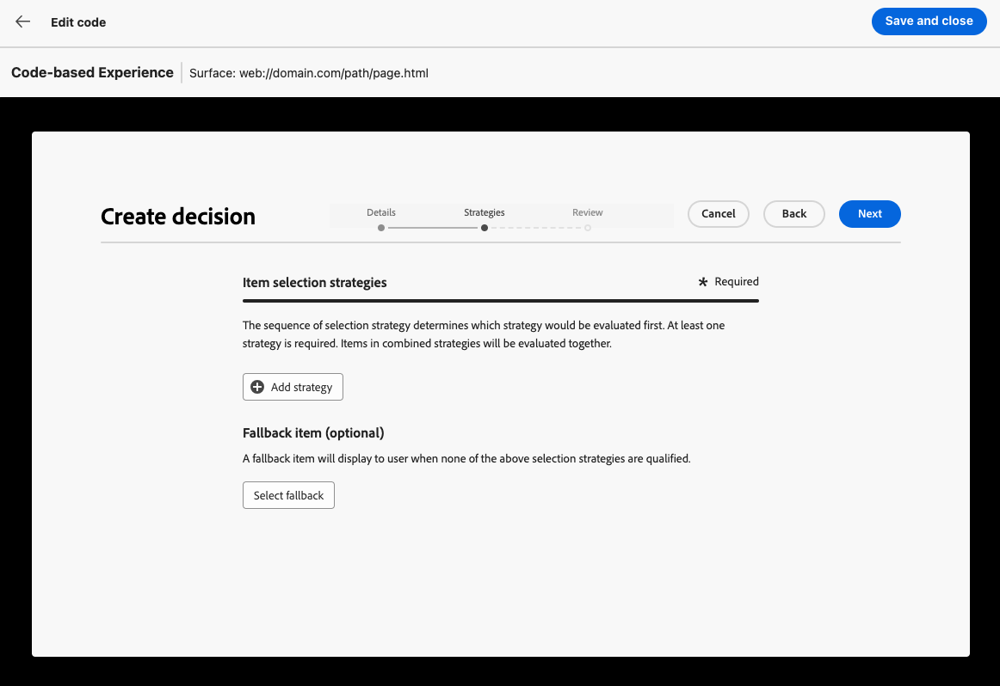
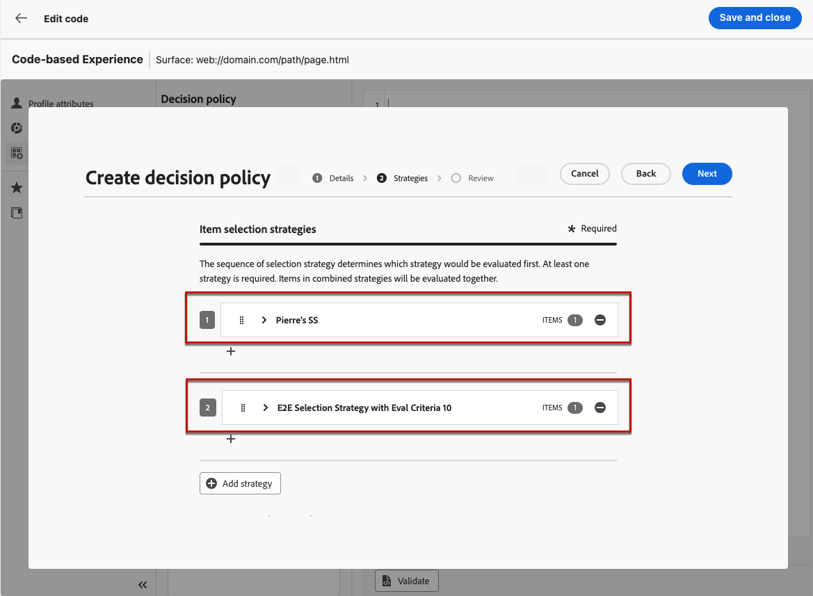
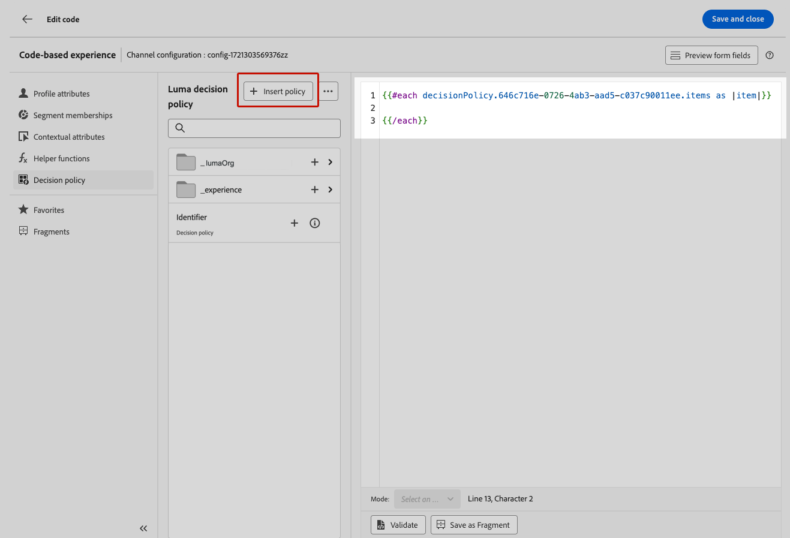

# Criar políticas de decisão {#create-decision}

>[!CONTEXTUALHELP]
>id="ajo_code_based_decision"
>title="O que é uma decisão?"
>abstract="As políticas de decisão contêm toda a lógica de seleção, para que o mecanismo de decisão escolha o melhor conteúdo. As políticas de decisão são específicas de cada campanha. Sua finalidade é selecionar as melhores ofertas para cada perfil, enquanto a criação da campanha permite indicar como os itens de decisão selecionados devem ser apresentados, incluindo quais atributos dos itens devem ser incluídos na mensagem."
>additional-url="https://experienceleague.adobe.com/pt-br/docs/journey-optimizer/using/decisioning/offer-decisioning/get-started-decision/starting-offer-decisioning" text="Sobre a Escolha de experiências"

As políticas de decisão são containers para suas ofertas que aproveitam o mecanismo do Experience Decisioning para escolher o melhor conteúdo a ser entregue, dependendo do público.

As políticas de decisão contêm toda a lógica de seleção, para que o mecanismo de decisão escolha o melhor conteúdo. As políticas de decisão são específicas de cada campanha. Sua finalidade é selecionar as melhores ofertas para cada perfil, enquanto a criação da campanha permite indicar como os itens de decisão selecionados devem ser apresentados, incluindo quais atributos dos itens devem ser incluídos na mensagem.

>[!NOTE]
>
>Na interface do usuário [!DNL Journey Optimizer], as políticas de decisão são rotuladas como decisões<!--but they are decision policies. TBC if this note is needed-->.

## Adicionar uma política de decisão a uma campanha baseada em código {#add-decision}

>[!CONTEXTUALHELP]
>id="ajo_code_based_item_number"
>title="Defina o número de itens a serem retornados"
>abstract="Selecione o número de itens de decisão que deseja que sejam retornados. Por exemplo, se você selecionar 2, as 2 melhores ofertas qualificadas serão apresentadas para a configuração atual."

>[!CONTEXTUALHELP]
>id="ajo_code_based_fallback"
>title="Selecione uma alternativa"
>abstract="Um item alternativo é exibido ao usuário(a) quando nenhuma das estratégias de seleção definidas para essa política de decisão está qualificada."

>[!CONTEXTUALHELP]
>id="ajo_code_based_strategy"
>title="O que é uma estratégia?"
>abstract="A sequência da estratégia de seleção determina qual estratégia será avaliada primeiro. Pelo menos uma estratégia é necessária. Os itens de decisão em estratégias combinadas serão avaliados em conjunto."
>additional-url="https://experienceleague.adobe.com/pt-br/docs/journey-optimizer/using/decisioning/offer-decisioning/get-started-decision/starting-offer-decisioning" text="Criação de estratégias"
>additional-url="https://experienceleague.adobe.com/pt-br/docs/journey-optimizer/using/decisioning/offer-decisioning/get-started-decision/starting-offer-decisioning" text="Ordem de avaliação"

Para apresentar a melhor oferta dinâmica e experiência aos visitantes em seu site ou aplicativo móvel, adicione uma política de decisão a uma campanha baseada em código. Para isso, siga as etapas abaixo.

1. Crie uma campanha e selecione a ação **[!UICONTROL Experiência baseada em código]**. [Saiba mais](../code-based/create-code-based.md)

1. No [editor de código](../code-based/create-code-based.md#edit-code), selecione o ícone da **[!UICONTROL Política de decisão]** e clique em **[!UICONTROL Adicionar política de decisão]**.

   

1. Preencha os detalhes da sua política de decisão: adicione um nome e selecione um catálogo.

   >[!NOTE]
   >
   >Atualmente, apenas o catálogo padrão **[!UICONTROL Ofertas]** está disponível.

   

1. Selecione o número de itens que você deseja retornar. Por exemplo, se você selecionar 2, as 2 melhores ofertas qualificadas serão apresentadas para a configuração atual. Clique em **[!UICONTROL Avançar]**

1. Use o botão **[!UICONTROL Adicionar estratégia]** para definir as estratégias de seleção para sua política de decisão. Cada estratégia consiste em uma coleção de ofertas associada a uma restrição de qualificação e um método de classificação para determinar as ofertas a serem exibidas. [Saiba mais](selection-strategies.md)

   

   >[!NOTE]
   >
   >Pelo menos uma estratégia é necessária. Não é possível adicionar mais de 10 estratégias.

1. Na tela **[!UICONTROL Adicionar estratégia]**, você também pode criar uma estratégia. O botão **[!UICONTROL Criar estratégia de seleção]** redireciona você para o menu **[!UICONTROL Decisão da experiência]** > **[!UICONTROL Configuração da estratégia]**. [Saiba mais](selection-strategies.md)

   

1. Ao adicionar várias estratégias, elas serão avaliadas em uma ordem específica. A primeira estratégia que foi adicionada à sequência será avaliada primeiro e assim por diante. [Saiba mais](#evaluation-order)

   Para alterar a sequência padrão, você pode arrastar e soltar as estratégias e/ou os grupos para reorganizá-los como desejado.

   

1. Adicione um fallback. Um item de fallback será exibido para o usuário se nenhuma das estratégias de seleção acima for qualificada.

   

   Você pode selecionar qualquer item da lista, que exibe todos os itens de decisão criados na sandbox atual. Se nenhuma estratégia de seleção for qualificada, o fallback será exibido para o usuário, independentemente das datas e da restrição de qualificação aplicada ao item selecionado<!--nor frequency capping when available - TO CLARIFY-->.

   >[!NOTE]
   >
   >Um fallback é opcional. Se nenhum fallback for selecionado e nenhuma estratégia for qualificada, nada será exibido por [!DNL Journey Optimizer].

1. Salve sua seleção e clique em **[!UICONTROL Criar]**. Agora que a política de decisão foi criada, você pode usar os atributos de decisão dentro do conteúdo de experiência baseado em código. [Saiba mais](#use-decision-policy)

   

## Ordem de avaliação {#evaluation-order}

Conforme descrito acima, uma estratégia consiste em uma coleção, um método de classificação e restrições de qualificação.

É possível:

* Defina a ordem sequencial que deseja para que as estratégias sejam avaliadas,
* Combine várias estratégias para que sejam avaliadas juntas e não separadamente.

Várias estratégias e seus agrupamentos determinam a prioridade das estratégias e a classificação das ofertas elegíveis. A primeira estratégia tem a prioridade mais alta e as estratégias combinadas dentro do mesmo grupo têm a mesma prioridade.

Por exemplo, você tem duas coleções, uma na estratégia A e uma na estratégia B. A solicitação é para que dois itens de decisão sejam enviados de volta. Digamos que haja duas ofertas qualificadas da estratégia A e três ofertas qualificadas da estratégia B.

* Se as duas estratégias forem **não combinadas** ou em ordem sequencial (1 e 2), as duas principais ofertas qualificadas da primeira estratégia serão retornadas na primeira linha. Se não houver duas ofertas elegíveis para a primeira estratégia, o mecanismo de decisão seguirá para a próxima estratégia em sequência para encontrar quantas ofertas ainda são necessárias e, em última análise, retornará um fallback, se necessário.

  

* Se as duas coleções forem **avaliadas ao mesmo tempo**, como há duas ofertas qualificadas da estratégia A e três ofertas qualificadas da estratégia B, as cinco ofertas serão empilhadas juntas com base no valor determinado pelos respectivos métodos de classificação. Duas ofertas são solicitadas, portanto, as duas principais ofertas qualificadas dessas cinco ofertas serão retornadas.

  

+++ **Exemplo com várias estratégias**

Agora, vamos considerar um exemplo em que você tem várias estratégias divididas em grupos diferentes.

Você definiu três estratégias. A Estratégia 1 e a Estratégia 2 são combinadas no Grupo 1 e a Estratégia 3 é independente (Grupo 2).

As ofertas elegíveis para cada estratégia e sua prioridade (usada na avaliação da função de classificação) são as seguintes:

* Grupo 1:
   * Estratégia 1 - (Oferta 1, Oferta 2, Oferta 3) - Prioridade 1
   * Estratégia 2 - (Oferta 3, Oferta 4, Oferta 5) - Prioridade 1

* Grupo 2:
   * Estratégia 3 - (Oferta 5, Oferta 6) - Prioridade 0

As ofertas de estratégia de maior prioridade são avaliadas primeiro e adicionadas à lista de ofertas classificadas.

**Iteração 1:**

As ofertas de Estratégia 1 e Estratégia 2 são avaliadas juntas (Oferta 1, Oferta 2, Oferta 3, Oferta 4, Oferta 5). Digamos que o resultado seja:

Oferta 1 - 10
Oferta 2 - 20
Oferta 3 - 30 da Estratégia 1, 45 da Estratégia 2. O mais alto de ambos será considerado, portanto, 45 é considerado.
Oferta 4 - 40
Oferta 5 - 50

As ofertas classificadas agora são: Oferta 5, Oferta 3, Oferta 4, Oferta 2, Oferta 1.

**Iteração 2:**

As ofertas da Estratégia 3 são avaliadas (Oferta 5, Oferta 6). Digamos que o resultado seja:

* Oferta 5 - Não será avaliado, pois já existe no resultado acima.
* Oferta 6 - 60

As ofertas classificadas agora são as seguintes: Oferta 5 , Oferta 3, Oferta 4, Oferta 2, Oferta 1, Oferta 6.

+++

## Usar a política de decisão no editor de código {#use-decision-policy}

Depois de criada, a política de decisão pode ser usada no [editor de personalização](../code-based/create-code-based.md#edit-code). Para isso, siga as etapas abaixo.

>[!NOTE]
>
>A experiência baseada em código aproveita o editor de personalização do [!DNL Journey Optimizer] com todos os seus recursos de personalização e criação. [Saiba mais](../personalization/personalization-build-expressions.md)

1. Clique no botão **[!UICONTROL Inserir política]**. O código correspondente à política de decisão é adicionado.

   

   >[!NOTE]
   >
   >Essa sequência será repetida o número de vezes que você deseja que a política de decisão seja retornada. Por exemplo, se você optar por retornar dois itens ao [criar a decisão](#add-decision), a mesma sequência será repetida duas vezes.

1. Agora você pode adicionar todos os atributos de decisão desejados dentro desse código. Os atributos disponíveis são armazenados no esquema do catálogo **[!UICONTROL Ofertas]**. Os atributos personalizados são armazenados na pasta **`_<imsOrg`>** e os atributos padrão na pasta **`_experience`**. [Saiba mais sobre o esquema do catálogo de ofertas](catalogs.md)

   

   >[!NOTE]
   >
   >Para o rastreamento de itens da política de decisão, o atributo `trackingToken` precisa ser adicionado da seguinte maneira para o conteúdo da política de decisão:
   >`trackingToken: {{item._experience.decisioning.decisionitem.trackingToken}}`

1. Clique em cada pasta para expandi-la. Coloque o cursor do mouse no local desejado e clique no ícone + ao lado do atributo que deseja adicionar. Você pode adicionar quantos atributos desejar ao código.

   

1. Você também pode adicionar qualquer outro atributo disponível no editor de personalização, como atributos de perfil.

   

## Relatórios no Customer Journey Analytics {#cja}

Se estiver trabalhando com o Customer Journey Analytics, você pode criar painéis de relatórios personalizados para suas campanhas baseadas em código aproveitando o Experience Decisioning.

As principais etapas estão listadas abaixo. Informações detalhadas sobre como trabalhar com o Customer Journey Analytics estão disponíveis na [documentação sobre o Customer Journey Analytics](https://experienceleague.adobe.com/en/docs/analytics-platform/using/cja-landing){target="_blank"}.

1. Crie e configure uma **conexão** no Customer Journey Analytics. Isso permite que você se conecte ao conjunto de dados para o qual deseja relatórios. [Saiba como criar uma conexão](https://experienceleague.adobe.com/en/docs/analytics-platform/using/cja-connections/create-connection){target="_blank"}

1. Crie uma **visualização de dados** e associe-a à conexão criada anteriormente. Na guia **[!UICONTROL Componentes]**, escolha os campos de esquema relevantes que deseja exibir nos relatórios. Para o Experience Decisioning, inclua os campos **propositioninteraction** e **propositiondisplay**. [Saiba como criar e configurar visualizações de dados](https://experienceleague.adobe.com/en/docs/analytics-platform/using/cja-dataviews/create-dataview){target="_blank"}

1. Combine componentes de dados, tabelas e visualizações em **projetos do espaço de trabalho** para criar e compartilhar relatórios para sua campanha baseada em código.[Saiba como criar projetos do espaço de trabalho](https://experienceleague.adobe.com/en/docs/analytics-platform/using/cja-workspace/build-workspace-project/create-projects){target="_blank"}
