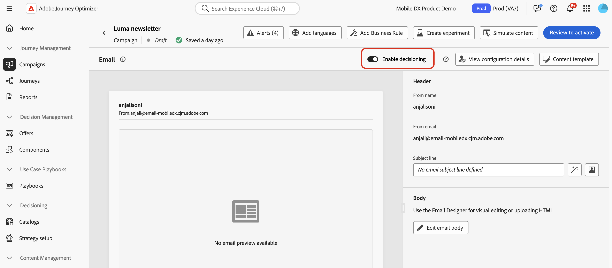

# Criar políticas de decisão {#create-decision}

>[!CONTEXTUALHELP]
>id="ajo_code_based_decision"
>title="O que é uma decisão?"
>abstract="As políticas de decisão contêm toda a lógica de seleção, para que o mecanismo de decisão escolha o melhor conteúdo. As políticas de decisão são específicas de cada campanha. Sua finalidade é selecionar as melhores ofertas para cada perfil, enquanto a criação da campanha permite indicar como os itens de decisão selecionados devem ser apresentados, incluindo quais atributos dos itens devem ser incluídos na mensagem."
>additional-url="https://experienceleague.adobe.com/pt-br/docs/journey-optimizer/using/decisioning/offer-decisioning/get-started-decision/starting-offer-decisioning" text="Sobre a decisão"

>[!CONTEXTUALHELP]
>id="ajo_journey_decision_policy"
>title="Defina uma política de decisão"
>abstract="Uma política de decisão permite selecionar os melhores itens do mecanismo de decisão e entregá-los ao público-alvo correto."
>additional-url="https://experienceleague.adobe.com/pt-br/docs/journey-optimizer/using/decisioning/offer-decisioning/get-started-decision/starting-offer-decisioning" text="Sobre a decisão"

>[!CONTEXTUALHELP]
>id="ajo_exd_decision_policy"
>title="Política de decisão"
>abstract="Uma política de decisão permite selecionar os melhores itens do mecanismo de decisão e entregá-los a cada público-alvo."

>[!CONTEXTUALHELP]
>id="ajo_exd_placements"
>title="Posicionamento"
>abstract="Um posicionamento determina onde os itens retornados do mecanismo de decisão aparecem em uma mensagem. Você pode acompanhar o desempenho em diferentes posicionamentos nos relatórios."

>[!CONTEXTUALHELP]
>id="ajo_exd_decision_attribute"
>title="Selecionar atributos de decisão do catálogo"
>abstract="Os atributos de decisão são armazenados no esquema do catálogo. Selecione um atributo que deseja usar aqui no catálogo selecionado."

As políticas de decisão são containers para suas ofertas que aproveitam o mecanismo de decisão para retornar dinamicamente o melhor conteúdo a ser entregue para cada membro do público. O objetivo é selecionar as melhores ofertas para cada perfil, enquanto a criação de campanha/jornada permite indicar como os itens de decisão selecionados devem ser apresentados, incluindo quais atributos de item devem ser incluídos na mensagem.

## Principais etapas {#key}

As principais etapas para aproveitar as políticas de decisão em suas mensagens são as seguintes:

1. [Criar uma política de decisão em uma experiência baseada em email ou código](#add-decision)

   Defina uma política de decisão em seu email ou experiência baseada em código escolhendo o número de itens a serem retornados, configurando estratégias de seleção, opções de fallback e ordem de avaliação.

1. [Usar a política de decisão em seu conteúdo](#use-decision-policy)

   Personalize o conteúdo com a saída da política de decisão e os atributos dos itens de decisão que você deseja exibir na mensagem.

1. [Criar painéis de relatórios](cja-reporting.md)

   Crie painéis personalizados do Customer Journey Analytics para medir o desempenho e obter insights sobre como as políticas e ofertas de decisão estão sendo fornecidas e envolvidas.

## Medidas de proteção e limitações

* **Disponibilidade limitada - Política de decisão em emails** - Por enquanto, a criação de política de decisão em emails está disponível em Disponibilidade limitada. Entre em contato com seu representante da Adobe para obter acesso.
* **Mirror pages** - Por enquanto, os itens de decisão não são renderizados em mirror pages de email.
* **Tipo de rastreamento e links** - Para rastrear links gerados pela decisão, defina-os no esquema como &quot;Assets de decisão&quot;. Os links baseados em atributos não são rastreáveis.
* **Aninhamento da política de decisão em emails** - Não é possível aninhar várias políticas de decisão em um componente de email principal que já tenha uma política de decisão associada.
* **jornadas/campanhas duplicadas com decisão** - Se você duplicar uma jornada ou campanha que inclui uma política de decisão, a versão duplicada fará referência ao email original ou à experiência baseada em código, causando erros. Sempre reconfigure a política de decisão após a duplicação.
* **Políticas de consentimento** - As atualizações das políticas de consentimento podem levar até 24 horas para entrarem em vigor. Se uma política de decisão fizer referência a um atributo vinculado a uma política de consentimento atualizada recentemente, as alterações não serão aplicadas imediatamente.

  Da mesma forma, se novos atributos de perfil sujeitos a uma política de consentimento forem adicionados a uma política de decisão, eles serão utilizáveis, mas a política de consentimento associada a eles não será aplicada até que o atraso tenha passado.

  As políticas de consentimento só estão disponíveis para organizações com o Adobe Healthcare Shield ou o complemento Privacy and Security Shield.

* **Classificação de IA** - Por enquanto, a classificação de IA não é compatível com o canal de email em jornadas com decisão.

## Criar uma política de decisão em uma experiência baseada em email ou código {#add-decision}

>[!CONTEXTUALHELP]
>id="ajo_code_based_item_number"
>title="Defina o número de itens a serem retornados"
>abstract="Selecione o número de itens de decisão que deseja que sejam retornados. Por exemplo, se você selecionar 2, as duas melhores ofertas elegíveis serão apresentadas para a configuração atual."

>[!CONTEXTUALHELP]
>id="ajo_code_based_fallback"
>title="Selecione uma alternativa"
>abstract="Um item alternativo é exibido ao usuário(a) quando nenhuma das estratégias de seleção definidas para essa política de decisão está qualificada."

>[!CONTEXTUALHELP]
>id="ajo_code_based_strategy"
>title="O que é uma estratégia?"
>abstract="A sequência da estratégia de seleção determina qual estratégia será avaliada primeiro. Pelo menos uma estratégia é necessária. Os itens de decisão em estratégias combinadas serão avaliados em conjunto."
>additional-url="https://experienceleague.adobe.com/pt-br/docs/journey-optimizer/using/decisioning/offer-decisioning/get-started-decision/starting-offer-decisioning" text="Criação de estratégias"

Para apresentar a melhor oferta dinâmica e experiência aos recipients e visitantes de seus emails em seu site ou aplicativo móvel, adicione uma política de decisão a um email ou a uma campanha ou jornada baseada em código. Para isso, siga as etapas abaixo.

### Criar uma política de decisão {#add}

1. Em uma jornada ou campanha, adicione uma ação **[!UICONTROL Email]** ou **[!UICONTROL Experiência baseada em código]**.

1. Para emails, alterne **[!UICONTROL Habilitar decisão]** na tela de configuração.

   

   >[!IMPORTANT]
   >
   >A ativação da decisão apaga o conteúdo de email existente. Se você já criou seu email, salve o conteúdo como um modelo antes.
   >
   >Observe que qualquer política de decisão configurada no email não será salva no modelo. Se você aplicar o template a outro email, precisará reconfigurar a política.

1. As políticas podem ser criadas em experiências de email e baseadas em código usando o editor de personalização. Eles também podem ser criados em emails em um menu dedicado no Designer de email. Expanda as seções abaixo para obter mais detalhes.

   +++editor do Personalization

   1. Abra o editor de personalização e selecione **[!UICONTROL Política de decisão]**.
   1. Clique no botão **[!UICONTROL Adicionar política de decisão]** para criar uma nova política.

      

+++

   +++Menu de decisão do Designer **[!UICONTROL email]**

   1. Selecione um componente, clique no ícone **[!UICONTROL Decisão]** na barra de ferramentas ou no painel de propriedades e selecione **[!UICONTROL Adicionar nova política]**.

   1. Selecione **[!UICONTROL Reutilizar saída de decisão]** para reutilizar uma política de decisão que já foi criada neste email.

      

+++

1. Forneça um nome e selecione um catálogo (atualmente limitado ao catálogo padrão **[!UICONTROL Ofertas]**).

1. Selecione o número de itens para retornar. Por exemplo, se você selecionar 2, as duas melhores ofertas elegíveis serão apresentadas para a configuração atual.

   

   Para emails, vários itens só podem ser retornados em um componente de conteúdo de **[!UICONTROL Grade de repetição]**. Expanda a seção abaixo para obter mais detalhes:

+++ Retornar vários itens de decisão por email

   1. Arraste um componente **[!UICONTROL Repetir Grade]** para a tela e configure-o conforme desejado usando o painel **[!UICONTROL Configurações]**.

      

   1. Clique no ícone **[!UICONTROL Decisão]** na barra de ferramentas da tela ou abra o painel **[!UICONTROL Decisão]** e selecione **[!UICONTROL Adicionar política de decisão]**.

   1. Especifique o número de itens a serem retornados no campo **[!UICONTROL Número de itens]** e configure a política de decisão conforme documentado abaixo. O número máximo de itens que você pode selecionar é limitado pelo número de blocos definido no componente **[!UICONTROL Repetir grade]**.

   

+++

1. Clique em **[!UICONTROL Next]**.

### Selecionar itens e estratégias de seleção {#select}

A seção **[!UICONTROL Sequência de estratégia]** permite selecionar os itens de decisão e as estratégias de seleção a serem apresentados com a política de decisão.

1. Clique em **[!UICONTROL Adicionar]** e escolha o tipo de objeto a ser incluído na política:

   * **[!UICONTROL Estratégia de seleção]**: adicione uma ou várias estratégias de seleção. As estratégias de decisão usam coleções associadas a restrições de qualificação e métodos de classificação para determinar os itens a serem mostrados. Você pode selecionar uma estratégia de seleção existente ou criar uma nova usando o botão **[!UICONTROL Criar estratégia de seleção]**. [Saiba como criar estratégias de seleção](selection-strategies.md)

   * **[!UICONTROL Item de decisão]**: adicione itens de decisão únicos para apresentar sem ter que executar uma estratégia de seleção. Você só pode selecionar um item de decisão por vez. Quaisquer restrições de qualificação definidas para o item serão aplicadas.

   

   >[!NOTE]
   >
   >Uma política de decisão suporta até 10 estratégias de seleção e itens de decisão combinados. [Saiba mais sobre as medidas de proteção e limitações da decisão](gs-experience-decisioning.md#guardrails)

1. Ao adicionar vários itens e/ou estratégias de decisão, eles serão avaliados em uma ordem específica. O primeiro objeto adicionado à sequência será avaliado primeiro e assim por diante. Para alterar a sequência padrão, arraste e solte os objetos e/ou grupos para reordená-los como desejado. Expanda a seção abaixo para obter mais informações.

   +++Gerenciar ordem de avaliação em uma política de decisão

   Depois de adicionar itens de decisão e estratégias de seleção à sua política, você pode organizar a ordem para determinar a ordem de avaliação e combinar estratégias de seleção para avaliá-los juntos.

   A **ordem sequencial** na qual os itens e as estratégias serão avaliados é indicada com números à esquerda de cada objeto ou grupo de objetos. Para mover a posição de uma estratégia de seleção (ou um grupo de estratégias) dentro da sequência, arraste e solte-a em outra posição.

   

   >[!NOTE]
   >
   >Somente estratégias de seleção podem ser arrastadas e soltas em uma sequência. Para alterar a posição de um item de decisão, é necessário removê-lo e adicioná-lo novamente usando o botão **[!UICONTROL Adicionar]** depois de adicionar os outros itens que você deseja avaliar antes.

   Você também pode **combinar** várias estratégias de seleção em grupos para que sejam avaliadas juntas e não separadamente. Para fazer isso, clique no botão **`+`** em uma estratégia de seleção para combiná-la com outra. Você também pode arrastar e soltar uma estratégia de seleção em outra para agrupar as duas estratégias em um grupo.

   >[!NOTE]
   >
   >Os itens de decisão não podem ser agrupados com outros itens ou estratégias de seleção.

   Várias estratégias e seus agrupamentos determinam a prioridade das estratégias e a classificação das ofertas elegíveis. A primeira estratégia tem a prioridade mais alta e as estratégias combinadas dentro do mesmo grupo têm a mesma prioridade.

   Por exemplo, você tem duas coleções, uma na estratégia A e uma na estratégia B. A solicitação é para que dois itens de decisão sejam enviados de volta. Digamos que haja duas ofertas qualificadas da estratégia A e três ofertas qualificadas da estratégia B.

   * Se as duas estratégias forem **não combinadas** ou em ordem sequencial (1 e 2), as duas principais ofertas qualificadas da primeira estratégia serão retornadas na primeira linha. Se não houver duas ofertas elegíveis para a primeira estratégia, o mecanismo de decisão seguirá para a próxima estratégia em sequência para encontrar quantas ofertas ainda são necessárias e, em última análise, retornará um fallback, se necessário.

     

   * Se as duas coleções forem **avaliadas ao mesmo tempo**, como há duas ofertas qualificadas da estratégia A e três ofertas qualificadas da estratégia B, as cinco ofertas serão empilhadas juntas com base no valor determinado pelos respectivos métodos de classificação. Duas ofertas são solicitadas, portanto, as duas principais ofertas qualificadas dessas cinco ofertas serão retornadas.

     

   **Exemplo com várias estratégias**

   Agora, vamos considerar um exemplo em que você tem várias estratégias divididas em grupos diferentes. Você definiu três estratégias. A Estratégia 1 e a Estratégia 2 são combinadas no Grupo 1 e a Estratégia 3 é independente (Grupo 2). As ofertas elegíveis para cada estratégia e sua prioridade (usada na avaliação da função de classificação) são as seguintes:

   * Grupo 1:
      * Estratégia 1 - (Oferta 1, Oferta 2, Oferta 3) - Prioridade 1
      * Estratégia 2 - (Oferta 3, Oferta 4, Oferta 5) - Prioridade 1

   * Grupo 2:
      * Estratégia 3 - (Oferta 5, Oferta 6) - Prioridade 0

   As ofertas de estratégia de maior prioridade são avaliadas primeiro e adicionadas à lista de ofertas classificadas.

   * **Iteração 1:**

     As ofertas de Estratégia 1 e Estratégia 2 são avaliadas juntas (Oferta 1, Oferta 2, Oferta 3, Oferta 4, Oferta 5). Digamos que o resultado seja:

     Oferta 1 - 10
Oferta 2 - 20
Oferta 3 - 30 da Estratégia 1, 45 da Estratégia 2. O mais alto de ambos será considerado, portanto, 45 é considerado.
Oferta 4 - 40
Oferta 5 - 50

     As ofertas classificadas agora são: Oferta 5, Oferta 3, Oferta 4, Oferta 2, Oferta 1.

   * **Iteração 2:**

     As ofertas da Estratégia 3 são avaliadas (Oferta 5, Oferta 6). Digamos que o resultado seja:

      * Oferta 5 - Não será avaliado, pois já existe no resultado acima.
      * Oferta 6 - 60

     As ofertas classificadas agora são as seguintes: Oferta 5 , Oferta 3, Oferta 4, Oferta 2, Oferta 1, Oferta 6.

+++

1. Clique em **[!UICONTROL Avançar]**

### Adicionar ofertas substitutas {#fallback}

Depois de selecionar itens de decisão e/ou estratégias de seleção, você pode adicionar ofertas substitutas para exibir se nenhum dos itens ou estratégias de seleção acima for qualificado.

Você pode selecionar qualquer item da lista, que exibe todos os itens de decisão criados na sandbox atual. Se nenhuma estratégia de seleção for qualificada, o fallback será exibido para o usuário, independentemente das datas e da restrição de qualificação aplicada ao item selecionado<!--nor frequency capping when available - TO CLARIFY-->.

>[!NOTE]
> Os fallbacks são opcionais. É possível selecionar até o número de itens solicitados. Se nenhum for elegível e nenhum fallback for definido, nada será exibido.

### Salvar e gerenciar políticas de decisão {#save}

Quando a política de decisão estiver pronta, salve-a e clique em **[!UICONTROL Criar]**.

Para emails, é necessário definir um posicionamento para o componente associado à política de decisão. Para fazer isso, clique no botão **[!UICONTROL Decisão]** no painel de propriedades do componente e selecione **[!UICONTROL Atribuir posicionamento]**. [Saiba como trabalhar com posicionamentos](../experience-decisioning/placements.md)

Você pode editar ou excluir uma política de decisão a qualquer momento usando o botão de reticências no editor de personalização ou no menu **[!UICONTROL Decisão]** no painel de propriedades do componente.

>[!BEGINTABS]

>[!TAB Editar ou excluir uma política do editor de personalização]

>[!TAB Editar ou excluir uma política das propriedades do componente]

>[!ENDTABS]

## Usar uma política de decisão em seu conteúdo {#use-decision-policy}

Depois de criada, a política de decisão e os atributos vinculados aos itens de decisão retornados podem ser usados em seu conteúdo para personalizar seu conteúdo. Para fazer isso, siga estas etapas.

### Inserir o código de política de decisão {#insert-code}

1. Abra o editor de personalização e acesse o menu de **[!UICONTROL Política de decisão]**.

1. Para emails, clique em **[!UICONTROL Inserir sintaxe]** para adicionar o código correspondente à política de decisão. Para experiências baseadas em código, clique em **[!UICONTROL Inserir política]**.

   +++Inserir código de política de decisão em emails

   

   Para emails, se nenhum posicionamento tiver sido associado ao componente anteriormente, selecione um na lista e clique em **[!UICONTROL Atribuir]**.

   

+++

   +++Inserir código de política de decisão na experiência baseada em código

   

+++

   >[!NOTE]
   >
   >Se o botão de inserção de código não for exibido, uma política de decisão pode já ter sido configurada para o componente principal.

1. O código da política de decisão é adicionado. Essa sequência será repetida o número de vezes que você deseja que a política de decisão seja retornada. Por exemplo, se você optar por retornar dois itens ao [criar a decisão](#add-decision), a mesma sequência será repetida duas vezes.

### Aproveitar atributos de itens de decisão {#attributes}

Agora você pode adicionar todos os atributos de decisão desejados dentro desse código. Os atributos disponíveis são armazenados no esquema do catálogo **[!UICONTROL Ofertas]**. Os atributos personalizados são armazenados na pasta **`_<imsOrg`>** e os atributos padrão na pasta **`_experience`**. [Saiba mais sobre o esquema do catálogo de Ofertas](catalogs.md)

>[!NOTE]
>
>Para o rastreamento de itens da política de decisão, o atributo `trackingToken` precisa ser adicionado da seguinte maneira para o conteúdo da política de decisão:
>>`trackingToken: {{item._experience.decisioning.decisionitem.trackingToken}}`

1. Clique em cada pasta para expandi-la. Coloque o cursor do mouse no local desejado e clique no ícone + ao lado do atributo que deseja adicionar. Você pode adicionar quantos atributos desejar ao código.

   

1. Certifique-se de envolver o loop `#each` dentro de um par de colchetes `[ ]` e adicionar uma vírgula antes de fechar `/each`.

   

1. Você também pode adicionar qualquer outro atributo disponível no editor de personalização, como atributos de perfil.

   

## Etapas finais {#final-steps}

Quando o conteúdo estiver pronto, revise e publique sua campanha ou jornada:

* [Publicar uma jornada](../building-journeys/publishing-the-journey.md)
* [Revisar como ativar uma campanha](../campaigns/review-activate-campaign.md)
* [Publicar e ativar uma experiência baseada em código](../code-based/publish-code-based.md)

Para experiências baseadas em código, assim que o desenvolvedor fizer uma chamada de API ou SDK para buscar conteúdo para a superfície definida na configuração do canal, as alterações serão aplicadas à página da Web ou aplicativo.

>[!NOTE]
>
>Atualmente não é possível simular o conteúdo da interface do usuário em uma campanha ou jornada de [experiência baseada em código](../code-based/create-code-based.md) usando decisões. Uma solução alternativa está disponível em [esta seção](../code-based/code-based-decisioning-implementations.md).

Para ver o desempenho de suas decisões, você pode criar [painéis de relatórios personalizados do Customer Journey Analytics](cja-reporting.md).
