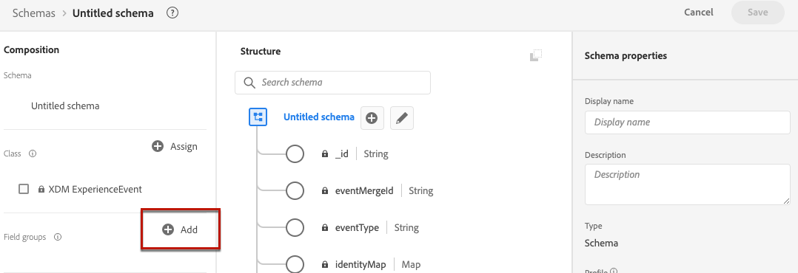

# Criar um conjunto de dados para coletar eventos {#create-dataset}

Para coletar eventos de experiência, primeiro é necessário criar um conjunto de dados para onde esses eventos serão enviados.

Comece criando o esquema que será usado no seu conjunto de dados:

1. No menu **[!UICONTROL Data Management]**, selecione **[!UICONTROL Schema]**.

1. Clique em **[!UICONTROL Criar esquema]**, na parte superior direita, selecione **[!UICONTROL Evento de experiência]** e clique em **Avançar**.

   

   >[!NOTE]
   >
   >Saiba mais sobre esquemas XDM e grupos de campos na [documentação de visão geral do sistema XDM](https://experienceleague.adobe.com/docs/experience-platform/xdm/home.html?lang=pt-BR){target="_blank"}.

1. Insira um nome e uma descrição para o esquema e clique em **Concluir**.
   

1. Na seção **[!UICONTROL Grupos de campos]** à esquerda, selecione **[!UICONTROL Adicionar]**.

   

1. No campo **[!UICONTROL Pesquisa]**, digite &quot;interação de proposta&quot;.

1. Selecione o grupo de campos **[!UICONTROL Evento de experiência - Interações de apresentação]** e clique em **[!UICONTROL Adicionar grupos de campos]**.

   

   >[!CAUTION]
   >
   >O esquema que será usado no seu conjunto de dados deve ter o grupo de campos **[!UICONTROL Evento de experiência - Interações de apresentação]** associado a ele. Caso contrário, você não poderá usá-lo no modelo de IA.

1. Salve o esquema.

>[!NOTE]
>
>Saiba mais sobre a criação de esquemas em [Noções básicas sobre a composição de esquemas](https://experienceleague.adobe.com/docs/experience-platform/xdm/schema/composition.html#understanding-schemas){target="_blank"}.

agora você está pronto para criar um conjunto de dados usando esse esquema. Para fazer isso, siga as etapas abaixo:

1. No menu **[!UICONTROL Data Management]**, selecione **[!UICONTROL Datasets]** e vá para a guia **[!UICONTROL Browse]**.

1. Clique em **[!UICONTROL Criar conjunto de dados]** e selecione **[!UICONTROL Criar conjunto de dados do esquema]**.

   

1. Selecione o esquema que acabou de criar na lista e clique em **[!UICONTROL Avançar]**.

1. Forneça um nome exclusivo para o conjunto de dados no campo **[!UICONTROL Nome]** e clique em **[!UICONTROL Concluir]**.

   

>[!NOTE]
>
>Este conjunto de dados agora pode ser selecionado para coletar dados do evento ao [criar um modelo de IA]().
