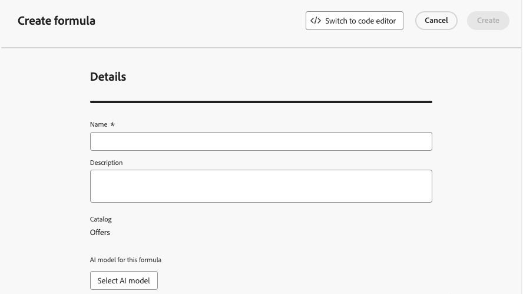
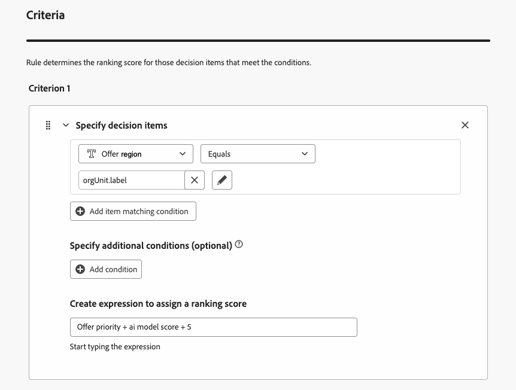
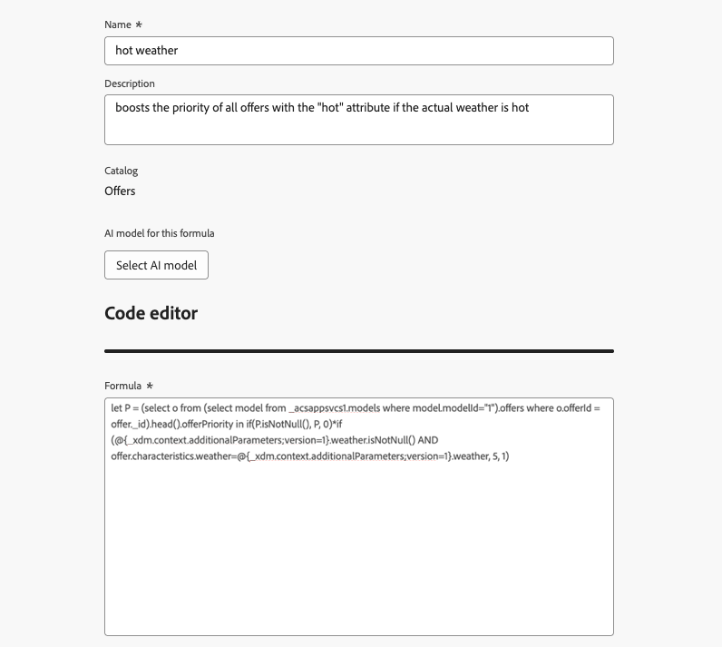

# Usar o construtor de fórmulas de IA {#create-ranking-formulas}

**As fórmulas de classificação** permitem definir regras que determinarão qual oferta deve ser apresentada primeiro, em vez de considerar as pontuações de prioridade.

Para criar essas regras, o construtor de fórmulas de IA no **[!UICONTROL Adobe Journey Optimizer]** fornece maior flexibilidade e controle sobre como as ofertas são classificadas. Em vez de depender apenas de uma prioridade de oferta estática, agora é possível definir fórmulas de classificação personalizadas que combinam pontuações do modelo de IA, prioridades de oferta, atributos de perfil, atributos de oferta e sinais contextuais por meio de uma interface guiada.

Essa abordagem permite ajustar dinamicamente a classificação de ofertas com base em qualquer combinação de propensão orientada por IA, valor comercial e contexto em tempo real, facilitando o alinhamento da decisão com as metas de marketing e as necessidades do cliente. O construtor de fórmulas do AI é compatível com fórmulas simples ou avançadas, dependendo de quanto controle você deseja aplicar.

Depois que uma fórmula de classificação é criada, é possível atribuí-la a uma [estratégia de seleção](selection-strategies.md). Se várias ofertas forem elegíveis para serem apresentadas ao usar essa estratégia de seleção, o mecanismo de decisão usará a fórmula selecionada para calcular qual oferta entregar primeiro.

## Criar uma fórmula de classificação {#create-ranking-formula}

>[!CONTEXTUALHELP]
>id="ajo_exd_config_formulas"
>title="Criar fórmulas de classificação"
>abstract="As fórmulas permitem definir regras que determinarão qual item de decisão deve ser apresentado primeiro, em vez de considerar as pontuações de prioridade dos itens. Depois que uma fórmula de classificação é criada, é possível atribuí-la a uma estratégia de seleção."

Para criar uma fórmula de classificação, siga as etapas abaixo.

1. Acesse o menu **[!UICONTROL Configuração de estratégia]** e selecione a guia **[!UICONTROL Fórmulas de classificação]**. A lista de fórmulas criadas anteriormente é exibida.

   

1. Clique em **[!UICONTROL Criar fórmula]**.

1. Especifique o nome da fórmula e adicione uma descrição, se desejar.

   {width="80%"}

1. Opcionalmente, clique em **[!UICONTROL Selecionar modelo de IA]** para definir o modelo que será usado como referência para criar sua fórmula de classificação. Toda vez que você se refere a uma pontuação de modelo ao definir sua fórmula abaixo, o modelo de IA selecionado será usado.

   >[!CAUTION]
   >
   >Ao usar um modelo de IA incorporado a uma fórmula de classificação, os dados não são refletidos no [Relatório de taxa de conversão para tráfego de Retenção e Orientado por Modelo](../reports/campaign-global-report-cja-code.md#conversion-rate).

1. Defina as condições que determinarão a pontuação de classificação para os itens de decisão correspondentes. Você pode:

   * preencher a seção **[!UICONTROL Critérios]** da [interface do usuário](#ranking-select-criteria),
   * ou alterne para o [editor de código](#ranking-code-editor).

<!--## Select an ELS dataset {#els-dataset}

To leverage data from an AEP dataset, you can select it in the **[!UICONTROL ELS settings]** section.

1. Select an ELS dataset from the list.

1. Select a decision attribute. This action is mandatory.

{width="80%"}

-->

## Definir critérios usando o construtor de fórmulas {#ranking-select-criteria}

Com uma interface intuitiva, você pode ajustar as decisões ajustando as pontuações da IA (propensão), o valor de oferta (prioridade), as alavancas contextuais e as propensões do perfil externo — individualmente ou em combinação — para otimizar cada interação. <!--Whether you're maximizing revenue, promoting strategic offers, or balancing business goals with real-time context, the formula builder gives you total control in defining ranking strategies.-->

Para definir critérios diretamente da interface, siga as etapas abaixo.

<!--{width="80%"}-->

1. Na seção **[!UICONTROL Critério 1]**, especifique os itens de decisão aos quais você deseja aplicar uma pontuação de classificação fazendo o seguinte:
   * selecione um [atributo de item de decisão](items.md#attributes),
   * selecione um operador lógico,
   * adicione uma condição correspondente - você pode digitar um valor ou selecionar um atributo de perfil ou [dados de contexto](context-data.md).

   {width="70%"}

1. Como opção, você pode especificar elementos adicionais para refinar as condições de correspondência para seus critérios serem verdadeiros.

   {width="80%"}

   Por exemplo, você definiu o Critério 1, como o *Tempo* atributo personalizado *É igual* à condição *aquecimento*. Além disso, você pode adicionar outra condição, como se a primeira condição fosse atendida e se a temperatura excedesse 75 graus no momento da solicitação, o Critério 1 seria verdadeiro.<!--Add a screenshot with the example-->

1. Crie uma expressão que atribuirá uma pontuação de classificação aos itens de decisão que atenderem à condição definida acima. Você pode referenciar qualquer um dos seguintes:

   * a pontuação obtida do modelo de IA que você selecionou opcionalmente na seção **[!UICONTROL Detalhes]** [acima](#create-ranking-formula);
   * a prioridade do item de decisão, que é um valor atribuído manualmente ao [criar um item de decisão](items.md#attributes); <!--If a profile qualifies for multiple decision items, a higher priority grants the item precedence over others.-->
   * qualquer atributo que possa existir no perfil, como qualquer pontuação de propensão derivada externamente;
   * um valor estático que pode ser atribuído em um formato livre;
   * qualquer combinação de todos os itens acima.

   {width="70%"}

   >[!NOTE]
   >
   >Clique no ícone ao lado do campo para adicionar variáveis predefinidas.

1. Clique em **[!UICONTROL Adicionar critério]** para adicionar um ou mais critérios quantas vezes forem necessárias. A lógica é a seguinte:
   * Se o primeiro critério for verdadeiro para um determinado item de decisão, ele terá precedência sobre os próximos.
   * Se não for verdadeiro, o mecanismo de decisão passará para o segundo critério e assim por diante.

1. No último campo, é possível criar uma expressão que será atribuída a todos os itens de decisão que não atendam aos critérios acima.

   {width="70%"}

1. Clique em **[!UICONTROL Criar]** para concluir a fórmula de classificação. Agora você pode selecioná-lo na lista para visualizar seus detalhes e editá-lo ou excluí-lo. Ele está pronto para ser usado em uma [estratégia de seleção](selection-strategies.md) para classificar itens de decisão qualificados.

### Exemplo de fórmula de classificação

Considere o exemplo abaixo:

{width="80%"}

Se a região do item de decisão (atributo personalizado) for igual ao rótulo geográfico do perfil (atributo de perfil), a pontuação de classificação expressa aqui (que é uma combinação da prioridade do item de decisão, da pontuação do modelo de IA e de um valor estático) será aplicada a todos os itens de decisão que atenderem a essa condição.

## Usar o editor de código {#ranking-code-editor}

Para expressar fórmulas de classificação na **sintaxe do PQL**, alterne para o editor de código usando o botão dedicado na parte superior direita da tela. Para obter mais informações sobre como usar a sintaxe do PQL, consulte a [documentação dedicada](https://experienceleague.adobe.com/docs/experience-platform/segmentation/pql/overview.html?lang=pt-BR).

>[!CAUTION]
>
>Esta ação impedirá a reversão para a exibição padrão do construtor desta fórmula.

Você pode aproveitar os atributos de perfil, [dados de contexto](context-data.md) e [atributos de item de decisão](items.md#attributes).

Por exemplo, você deseja aumentar a prioridade de todas as ofertas com o atributo &quot;quente&quot; se o tempo real estiver quente. Para fazer isso, o **contextData.weather=hot** foi passado na chamada de decisão. <!--[Learn how to work with context data](context-data.md)-->

{width="80%"}

>[!IMPORTANT]
>
>Ao criar uma fórmula de classificação, a retrospectiva de um período anterior não é compatível, como adicionar um evento de experiência que ocorreu no último mês como um componente da fórmula. Qualquer tentativa de incluir um período de lookback durante a criação de uma fórmula acionará um erro ao salvá-la.

### Exemplos de PQL da fórmula de classificação {#ranking-formula-examples}

Você pode criar muitas fórmulas de classificação diferentes de acordo com suas necessidades. Abaixo estão alguns exemplos.

+++Aumentar ofertas com determinado atributo de oferta com base no atributo de perfil

Se o perfil estiver na cidade correspondente à oferta, duplique a prioridade para todas as ofertas nessa cidade.

**Fórmula de classificação:**

```
if( offer.characteristics.get("city") = homeAddress.city, offer.rank.priority * 2, offer.rank.priority)
```

+++

+++Impulsionar ofertas em que a data de término é daqui a menos de 24 horas

**Fórmula de classificação:**

```
if( offer.selectionConstraint.endDate occurs <= 24 hours after now, offer.rank.priority * 3, offer.rank.priority)
```

+++

+++Aumente as ofertas com base na propensão dos clientes para comprar o produto oferecido

Você pode aumentar a pontuação de uma oferta com base em uma pontuação de propensão do cliente.

Neste exemplo, o locatário da instância é *_salesvelocity* e o esquema de perfil contém um intervalo de pontuações armazenadas em uma matriz:


Diante disso, para um perfil como:

```
{"_salesvelocity": {"individualScoring": [
                    {"core": {
                            "category":"insurance",
                            "propensityScore": 96.9
                        }},
                    {"core": {
                            "category":"personalLoan",
                            "propensityScore": 45.3
                        }},
                    {"core": {
                            "category":"creditCard",
                            "propensityScore": 78.1
                        }}
                    ]}
}
```

+++

+++Impulsionar ofertas com base nos dados de contexto {#context-data}

[!DNL Journey Optimizer] permite que você impulsione determinadas ofertas com base nos dados de contexto que estão sendo transmitidos na chamada. Por exemplo, se `contextData.weather=hot` for passado, a prioridade de todas as ofertas com `attribute=hot` deverá ser aumentada. Informações detalhadas sobre como passar dados de contexto usando as APIs da **Decisão do Edge** e da **Decisão**. Consulte [esta seção](context-data.md)

Observe que ao usar a API **Decisão**, os dados de contexto são adicionados ao elemento do perfil no corpo da solicitação, como no exemplo abaixo.

```
"xdm:profiles": [
{
    "xdm:identityMap": {
        "crmid": [
            {
            "xdm:id": "CRMID1"
            }
        ]
    },
    "xdm:contextData": [
        {
            "@type":"_xdm.context.additionalParameters;version=1",
            "xdm:data":{
                "xdm:weather":"hot"
            }
        }
    ]
    
}],
```

+++

