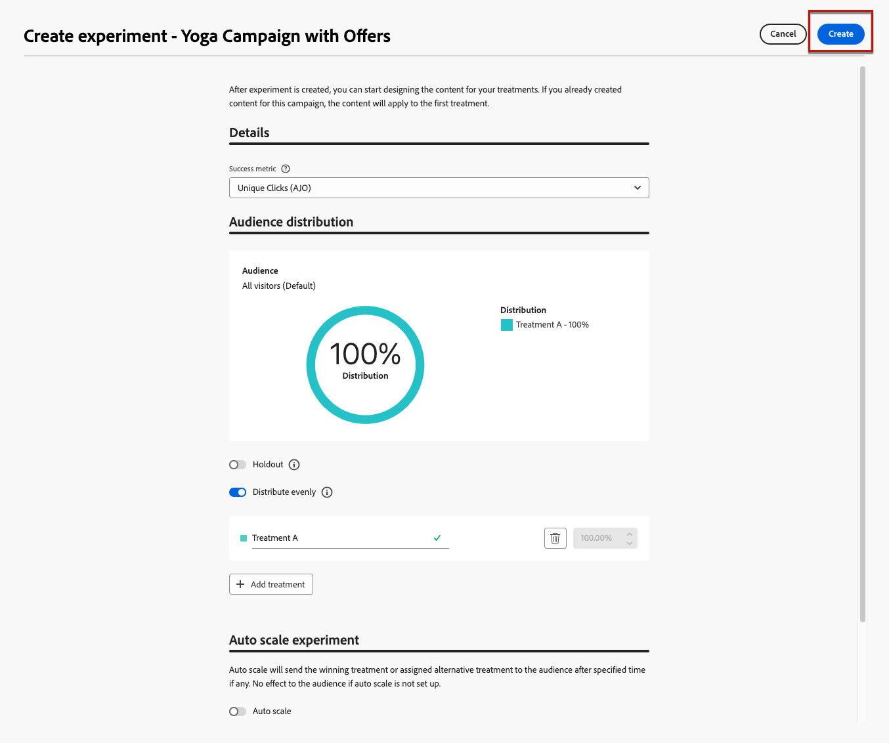
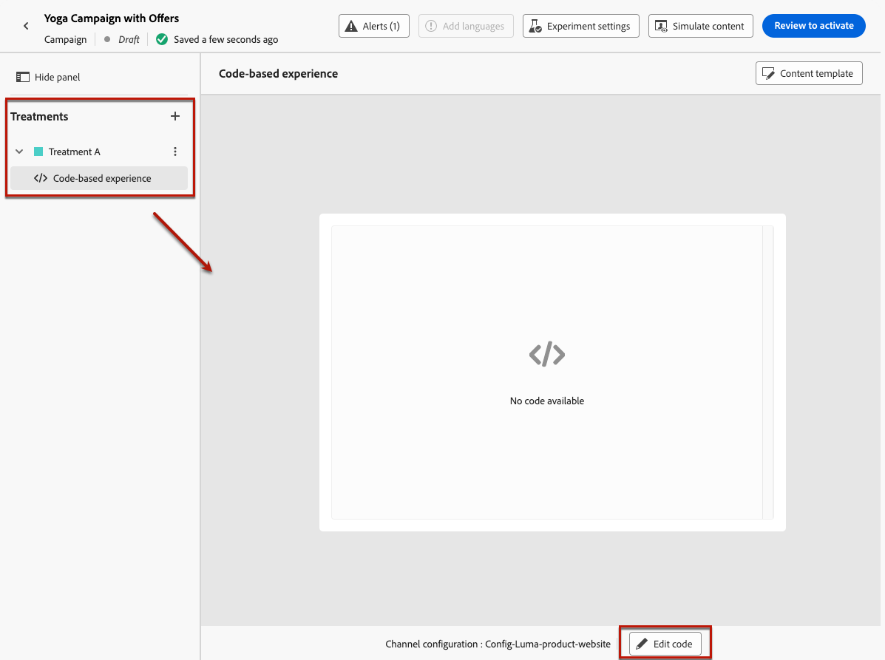

# Caso de uso de decisão {#experience-decisioning-uc}

Este caso de uso apresenta todas as etapas necessárias para usar a Decisão com o canal baseado em código [!DNL Journey Optimizer].

<!--In this use case, you create a campaign where you define two delivery treatments - each containing a different decision policy in order to measure which one performs best for your target audience.-->

Nesse caso de uso, você não tem certeza se uma fórmula de classificação específica terá melhor desempenho do que as prioridades de oferta pré-atribuídas.

Para medir qual deles tem melhor desempenho para seu público-alvo, crie uma campanha usando o [Experimento de Conteúdo](../content-management/content-experiment.md), no qual você define dois tratamentos de entrega:

<!--Set up the experiment such that:-->

* O primeiro tratamento contém uma estratégia de seleção com prioridade como o método de classificação.
* O segundo tratamento contém uma estratégia de seleção diferente para a qual uma fórmula é o método de classificação.

## Criar estratégias de seleção

Primeiro, é necessário criar duas estratégias de seleção: uma com prioridade como o método de classificação e outra com uma fórmula como o método de classificação.

### Criar a primeira estratégia de seleção

Na primeira estratégia de seleção, selecione prioridade como o método de classificação. Siga as etapas abaixo.

1. Criar um item de decisão. [Saiba como](items.md)

1. Defina a **[!UICONTROL Prioridade]** do item de decisão em comparação a outros. Se um perfil se qualificar para vários itens, uma prioridade mais alta concederá ao item prioridade sobre outros.

   

   >[!NOTE]
   >
   >A prioridade é um tipo de dados inteiro. Todos os atributos que são tipos de dados inteiros devem conter valores inteiros (sem decimais).

1. Defina a qualificação do item de decisão:

   * Defina públicos ou regras para restringir o item somente a perfis específicos. [Saiba mais](items.md#eligibility)

   * Defina regras de limite para definir o número máximo de vezes que uma oferta pode ser apresentada. [Saiba mais](items.md#capping)

1. Se necessário, repita as etapas acima para criar itens de decisão adicionais.

1. Crie uma **coleção** onde seus itens de decisão serão incluídos. [Saiba mais](collections.md)

1. Crie uma [estratégia de seleção](selection-strategies.md#create-selection-strategy) e selecione a [coleção](collections.md) que contém a(s) oferta(s) a serem consideradas.

1. [Escolha o método de classificação](#select-ranking-method) a ser usado para selecionar a melhor oferta para cada perfil.

   Nesse caso, selecione **[!UICONTROL Prioridade da oferta]**: se várias ofertas estiverem qualificadas para essa estratégia, o mecanismo do Decisioning usará o valor definido como **[!UICONTROL Prioridade]** nas ofertas. [Saiba mais](selection-strategies.md#offer-priority)

   

### Criar a segunda estratégia de seleção

Na segunda estratégia de seleção, selecione uma fórmula como o método de classificação. Siga as etapas abaixo.

1. Criar um item de decisão. [Saiba como](items.md)

<!--1. Set the same **[!UICONTROL Priority]** as for the first decision item. TBC?-->

1. Defina a qualificação do item de decisão:

   * Defina públicos ou regras para restringir o item somente a perfis específicos. [Saiba mais](items.md#eligibility)

   * Defina regras de limite para definir o número máximo de vezes que uma oferta pode ser apresentada. [Saiba mais](items.md#capping)

1. Se necessário, repita as etapas acima para criar itens de decisão adicionais.

1. Crie uma **coleção** onde seus itens de decisão serão incluídos. [Saiba mais](collections.md)

1. Crie uma [estratégia de seleção](selection-strategies.md#create-selection-strategy) e selecione a [coleção](collections.md) que contém a(s) oferta(s) a serem consideradas.

1. [Escolha o método de classificação](#select-ranking-method) que deseja usar para selecionar a melhor oferta para cada perfil.

   Nesse caso, selecione **[!UICONTROL Formula]** para usar uma pontuação calculada específica para escolher qual oferta qualificada fornecer. [Saiba mais](selection-strategies.md#ranking-formula)

   

## Criar uma campanha de experiência baseada em código

<!--To present the best dynamic offer and experience to your visitors on your website or mobile app, add a decision policy to a code-based campaign.

Define two delivery treatments each containing a different decision policy.-->

Depois de configurar as duas estratégias de seleção, crie uma campanha de experiência baseada em código, na qual você define um tratamento diferente para cada estratégia para comparar qual tem melhor desempenho.

1. Crie uma campanha e selecione a ação **[!UICONTROL Experiência baseada em código]**. [Saiba mais](../code-based/create-code-based.md)

1. Na página de resumo da campanha, clique em **[!UICONTROL Criar experimento]** para começar a configurar seu experimento de conteúdo. [Saiba mais](../content-management/content-experiment.md)

   

1. Clique em **[!UICONTROL Editar conteúdo]**.

<!--1. Sart personalizing **Treatment A** by clicking **[!UICONTROL Create]**.

    -->

1. Na janela de edição de conteúdo, comece a personalizar o **Tratamento A** clicando em **[!UICONTROL Editar código]**.

   

1. Selecione a **[!UICONTROL Política de decisão]**, clique em **[!UICONTROL Adicionar política de decisão]** e preencha os detalhes da decisão. [Saiba mais](create-decision.md)

   

1. Selecione a primeira estratégia que você criou. Clique em **[!UICONTROL Adicionar estratégia]**.

1. Clique em **[!UICONTROL Criar]**. A nova decisão é adicionada em **[!UICONTROL Decisões]**.

   

1. Clique no ícone de mais ações (três pontos) e selecione **[!UICONTROL Adicionar]**. Agora você pode adicionar todos os atributos de decisão desejados aqui.

   

1. Você também pode adicionar qualquer outro atributo disponível no editor de personalização, como atributos de perfil.

   

1. Na janela de edição de conteúdo, selecione **Tratamento B** e repita as etapas acima para criar outra política de decisão e selecione a segunda estratégia de seleção criada.

   

1. Salve o conteúdo.
