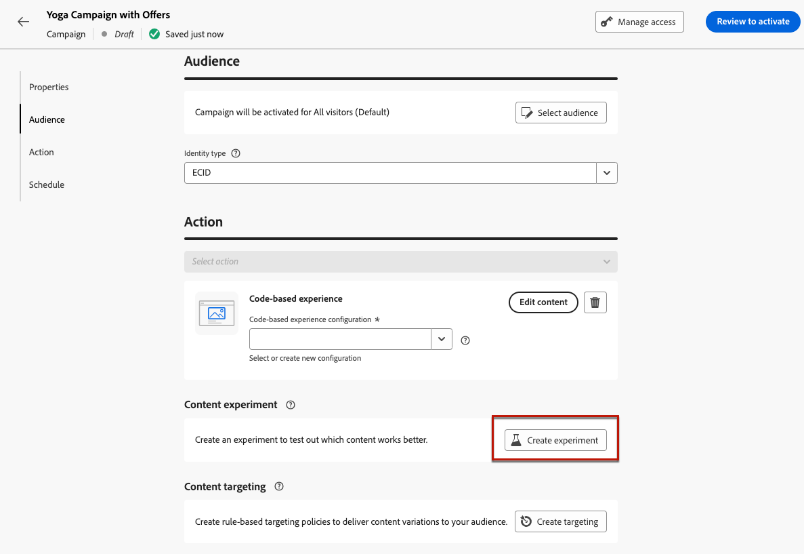
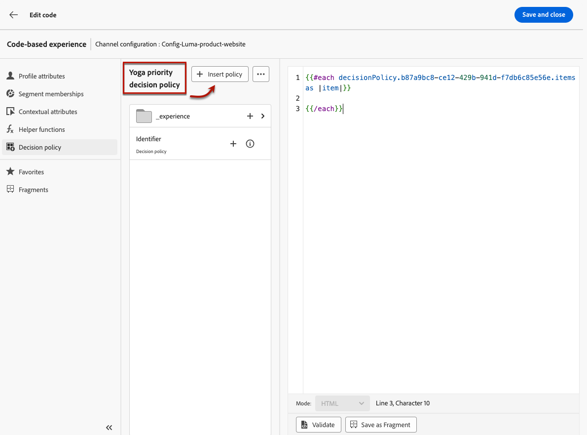

# Caso de uso de decisão {#experience-decisioning-uc}

Este caso de uso apresenta todas as etapas necessárias para usar a Decisão com o canal baseado em código [!DNL Journey Optimizer].

Neste exemplo, você não tem certeza se uma fórmula de classificação específica terá melhor desempenho do que as prioridades de oferta pré-atribuídas.

Para medir qual deles tem melhor desempenho para seu público-alvo, crie uma campanha usando o [Experimento de Conteúdo](../content-management/content-experiment.md), no qual você define dois tratamentos de entrega:

* O primeiro tratamento usa a prioridade como o método de classificação.
* O segundo tratamento usa uma fórmula é o método de classificação.

## Criar estratégias de seleção

Primeiro, é necessário criar duas estratégias de seleção: uma com prioridade como o método de classificação e outra com uma fórmula como o método de classificação.

>[!NOTE]
>
>Você também pode criar itens de decisão únicos sem precisar executar uma estratégia de seleção. A prioridade definida para cada item será aplicada.

### Criar a primeira estratégia de seleção

Para criar a primeira estratégia de seleção com prioridade como o método de classificação, siga as etapas abaixo.

1. Criar um item de decisão. [Saiba como](items.md)

1. Defina a **[!UICONTROL Prioridade]** do item de decisão em comparação a outros. Se um perfil se qualificar para vários itens, uma prioridade mais alta concederá ao item prioridade sobre outros.

   {width="80%"}

   >[!NOTE]
   >
   >A prioridade é um tipo de dados inteiro. Todos os atributos que são tipos de dados inteiros devem conter valores inteiros (sem decimais).

1. Defina a qualificação do item de decisão:

   * Defina públicos ou regras para restringir o item somente a perfis específicos. [Saiba mais](items.md#eligibility)

   * Defina regras de limite para definir o número máximo de vezes que uma oferta pode ser apresentada. [Saiba mais](items.md#capping)

1. Se necessário, repita as etapas acima para criar itens de decisão adicionais.

1. Crie uma **coleção** onde seus itens de decisão serão incluídos. [Saiba mais](collections.md)

1. Crie uma [estratégia de seleção](selection-strategies.md#create-selection-strategy) e selecione a [coleção](collections.md) que contém a(s) oferta(s) a serem consideradas.

1. [Escolha o método de classificação](#select-ranking-method) a ser usado para selecionar a melhor oferta para cada perfil. Nesse caso, selecione **[!UICONTROL Prioridade da oferta]**: se várias ofertas estiverem qualificadas para essa estratégia, o mecanismo do Decisioning usará o valor definido como **[!UICONTROL Prioridade]** nas ofertas. [Saiba mais](selection-strategies.md#offer-priority)

   {width="80%"}

### Criar a segunda estratégia de seleção

Para criar a segunda estratégia de seleção com uma fórmula selecionada como o método de classificação, siga as etapas abaixo.

1. Criar um item de decisão. [Saiba como](items.md)

   <!--Do you need to set the same **[!UICONTROL Priority]** as for the first decision item, or it won't be considered at all?-->

1. Defina a qualificação do item de decisão:

   * Defina públicos ou regras para restringir o item somente a perfis específicos. [Saiba mais](items.md#eligibility)

   * Defina regras de limite para definir o número máximo de vezes que uma oferta pode ser apresentada. [Saiba mais](items.md#capping)

1. Se necessário, repita as etapas acima para criar itens de decisão adicionais.

1. Crie uma **coleção** onde seus itens de decisão serão incluídos. [Saiba mais](collections.md)

1. Crie uma [estratégia de seleção](selection-strategies.md#create-selection-strategy) e selecione a [coleção](collections.md) que contém a(s) oferta(s) a serem consideradas.

1. [Escolha o método de classificação](#select-ranking-method) que deseja usar para selecionar a melhor oferta para cada perfil. Nesse caso, selecione **[!UICONTROL Formula]** para usar uma pontuação calculada específica para determinar qual oferta qualificada fornecer. [Saiba mais](selection-strategies.md#ranking-formula)

   

## Criar uma campanha de experiência baseada em código

<!--To present the best dynamic offer and experience to your visitors on your website or mobile app, add a decision policy to a code-based campaign.

Define two delivery treatments each containing a different decision policy.-->

Depois de configurar as duas estratégias de seleção, crie uma campanha de experiência baseada em código, na qual você define um tratamento diferente para cada estratégia, a fim de comparar qual tem melhor desempenho.

1. Crie uma campanha e selecione a ação **[!UICONTROL Experiência baseada em código]**. [Saiba mais](../code-based/create-code-based.md)

1. Na página de resumo da campanha, clique em **[!UICONTROL Criar experimento]** para começar a configurar seu experimento de conteúdo. [Saiba mais](../content-management/content-experiment.md)

   {width="80%"}

1. Na página de resumo da campanha, selecione uma configuração baseada em código e clique em **[!UICONTROL Editar conteúdo]**.

   {width="80%"}

1. Na janela de edição de conteúdo, para começar a personalizar o **Tratamento A**, clique em **[!UICONTROL Editar código]**.

   {width="80%"}

1. No [editor de código](../code-based/create-code-based.md#edit-code), selecione **[!UICONTROL Política de decisão]**, clique em **[!UICONTROL Adicionar política de decisão]** e preencha os detalhes da decisão. [Saiba mais](create-decision.md#add)

   

1. Na seção **[!UICONTROL Sequência de estratégia]**, clique no botão **[!UICONTROL Adicionar]** e escolha **[!UICONTROL Estratégia de seleção]**. [Saiba mais](create-decision.md#select)

   {width="80%"}

   >[!NOTE]
   >
   >Você também pode selecionar **[!UICONTROL Item de decisão]** para adicionar itens únicos sem precisar executar uma estratégia de seleção. A prioridade definida para cada item será aplicada.

1. Selecione a primeira estratégia que você criou.

   {width="80%"}

1. Salve as alterações e clique em **[!UICONTROL Criar]**. A nova decisão foi adicionada em **[!UICONTROL Política de decisão]**.

1. Clique no botão **[!UICONTROL Inserir política]**. O código correspondente à política de decisão é adicionado. Em seguida, adicione todos os atributos desejados ao código, incluindo atributos de perfil. [Saiba mais](create-decision.md#use-decision-policy)

   {width="80%"}

1. Salve as alterações.

1. Volte para a janela de edição de conteúdo, selecione o botão + para adicionar **Tratamento B**, selecione-o e clique em **[!UICONTROL Editar código]**.

   {width="80%"}

1. Repita as etapas acima para criar outra política de decisão e selecione a segunda estratégia de seleção criada. <!--Do you need to create exactly the same content to compare only the ranking method?-->

1. Salve suas alterações e [publique sua campanha de experiência baseada em código](../code-based/publish-code-based.md).

Você pode acompanhar o desempenho de sua campanha com o [relatório de campanha de experimentação](../reports/campaign-global-report-cja-experimentation.md) e o [relatório sobre decisões](cja-reporting.md). <!--TBC how to check which treatment performs best-->