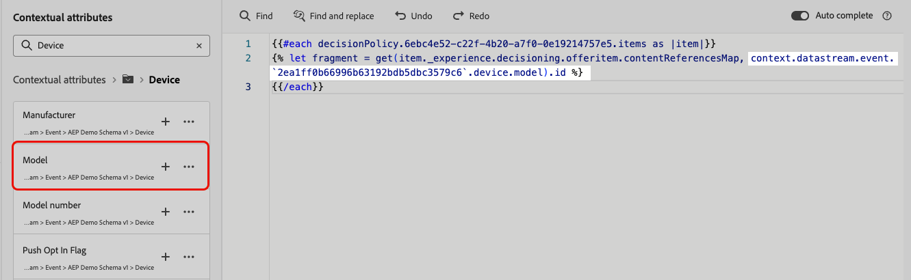

# Aproveitar fragmentos em políticas de decisão {#fragments}

Se a política de decisão contiver itens de decisão, incluindo fragmentos, você poderá aproveitar esses fragmentos no código de política de decisão. [Saiba mais sobre fragmentos](../content-management/fragments.md)

>[!AVAILABILITY]
>
>Este recurso está disponível na Disponibilidade Limitada para os canais de **Experiência baseada em código** e **Email**. Para solicitar acesso, entre em contato com o representante da Adobe.

Por exemplo, digamos que você queira exibir conteúdos diferentes para vários modelos de dispositivos móveis. Certifique-se de ter adicionado fragmentos correspondentes a esses dispositivos ao item de decisão que você está usando na política de decisão. [Saiba como](items.md#attributes).

{width=70%}

Depois de concluído, você pode usar um dos seguintes métodos:

>[!BEGINTABS]

>[!TAB Inserir o código diretamente]

Basta copiar e colar o bloco de código abaixo no código de política de decisão. Substitua `variable` pela ID do fragmento e `placement` pela chave de referência do fragmento:

```handlebars

{{fragment id = variable}}
```

>[!TAB Siga as etapas detalhadas]

1. Navegue até as **[!UICONTROL funções auxiliares]** e adicione a **função Let** ` {{variable}}` ao painel de código, onde você pode declarar a variável para o fragmento.

   

1. Use a função **de** Mapa **>** Obter`` para criar sua expressão. O mapa é o fragmento referenciado no item de decisão. A cadeia de caracteres pode ser o modelo de dispositivo inserido no item de decisão como a **[!UICONTROL Chave de referência do fragmento]**.

   

1. Você também pode usar um atributo contextual que contenha essa ID de modelo de dispositivo.

   

1. Adicione a variável escolhida para o fragmento como a ID do fragmento.

   

>[!ENDTABS]

A ID do fragmento e a chave de referência serão selecionadas na seção **[!UICONTROL Fragmentos]** do item de decisão.

>[!WARNING]
>
>Se a chave do fragmento estiver incorreta ou se o conteúdo do fragmento não for válido, a renderização falhará, causando erro na chamada do Edge.

## Medidas de proteção ao usar fragmentos {#fragments-guardrails}

**Simular fragmentos de conteúdo e expressão em emails**

Para o canal de **Email**, os fragmentos de expressão associados a um item de decisão são exibidos corretamente quando você **[!UICONTROL Envia prova]** ou quando a campanha é ativada. No entanto, **[!UICONTROL Simular conteúdo]** não exibe o fragmento de expressão do item de decisão.

**Fragmentos visuais e itens de decisão em emails**

Você não pode atribuir um **[!UICONTROL Fragmento visual]** a um item de decisão. Somente **fragmentos de expressão** são suportados neste contexto.

**Atributos de item de decisão e de contexto**

Atributos de item de decisão e atributos contextuais não são suportados por padrão em fragmentos [!DNL Journey Optimizer]. No entanto, você pode usar variáveis globais, conforme descrito abaixo.

Digamos que você queira usar a variável *sport* no fragmento.

1. Faça referência a essa variável no fragmento, por exemplo:

   ```text
   Elevate your practice with new {{sport}} gear!
   ```

1. Defina a variável com a função **Let** no bloco de política de decisão. No exemplo abaixo, *sport* é definido com o atributo de item de decisão:

   ```handlebars
   {#each decisionPolicy.13e1d23d-b8a7-4f71-a32e-d833c51361e0.items as |item|}}
   
   {{fragment id = get(item._experience.decisioning.offeritem.contentReferencesMap, "placement1").id }}
   {{/each}}
   ```

**Validação do conteúdo do fragmento do item de decisão**

* Devido à natureza dinâmica desses fragmentos, quando usados em uma campanha, a validação da mensagem durante a criação do conteúdo da campanha é ignorada para fragmentos referenciados em itens de decisão.

* A validação do conteúdo do fragmento ocorre somente durante a criação e a publicação do fragmento.

* Para fragmentos de expressão do tipo JSON, o conteúdo é validado sintaticamente ao salvar o fragmento. Os erros de validação são exibidos como alertas.

No tempo de execução, o conteúdo da campanha (incluindo o conteúdo de fragmentos de itens de decisão) é validado. No caso de uma falha de validação, a campanha não será renderizada.
