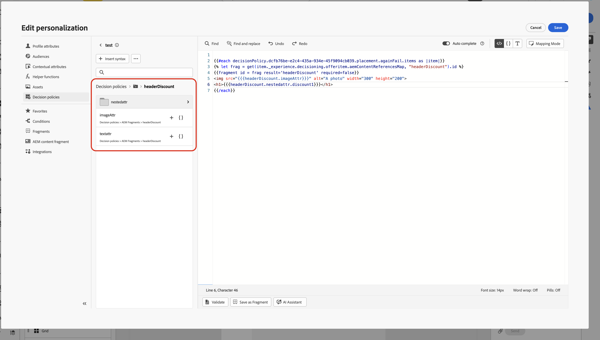
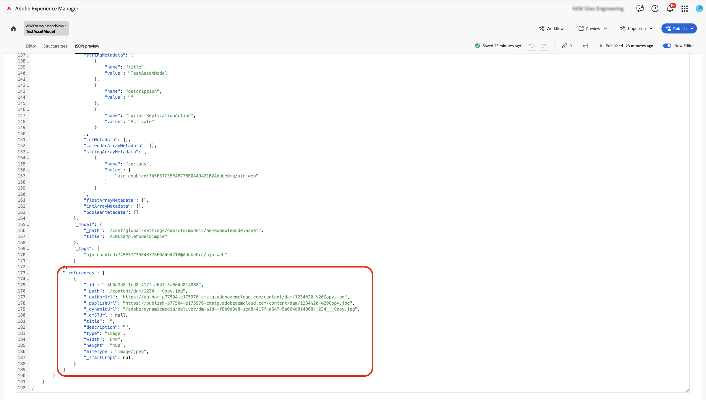
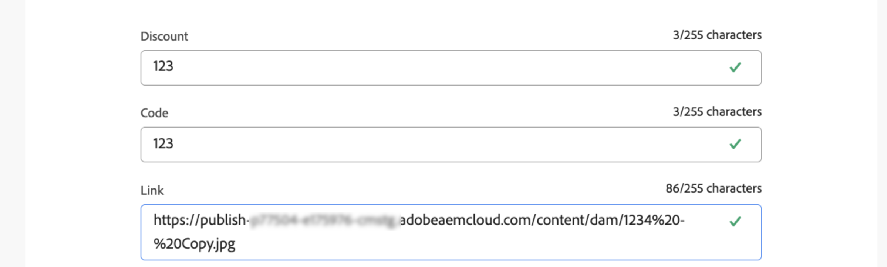
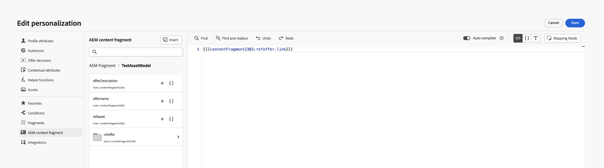

# Aproveitar fragmentos em políticas de decisão {#fragments}

>[!BEGINSHADEBOX]

**Nesta página:** aproveite os fragmentos de conteúdo do Journey Optimizer e os Fragmentos de conteúdo do AEM nas políticas de decisão para que você possa personalizar e otimizar os envios de decisões de conteúdo entre canais.

>[!ENDSHADEBOX]

Os itens de decisão são compatíveis com dois tipos de conteúdo de fragmento que podem ser aproveitados ao criar mensagens em uma política de decisão:

* **Fragmentos de conteúdo do Journey Optimizer** — fragmentos de expressão reutilizáveis criados no Journey Optimizer e adicionados à seção **[!UICONTROL Fragmentos]** do item de decisão. [Saiba mais sobre os fragmentos de conteúdo do AJO](../content-management/fragments.md)
* **Fragmentos de conteúdo do AEM** — conteúdo criado no Adobe Experience Manager, mapeado para os atributos do item de decisão e selecionado no editor de personalização por nome de chave. [Saiba como vincular um Fragmento de conteúdo do AEM a um item de decisão](items.md#aem-fragments)

## Fragmentos de conteúdo do Journey Optimizer {#ajo-fragments}

Se a política de decisão contiver itens de decisão, incluindo fragmentos de conteúdo do AJO, você poderá aproveitar esses fragmentos ao criar uma mensagem na política de decisão em todos os canais nos quais a Decisão está disponível (experiência baseada em código, email, push, SMS e jornadas).

Por exemplo, digamos que você queira exibir conteúdos diferentes para vários modelos de dispositivos móveis. Adicione os fragmentos especificados, cada um pertencente a um modelo de telefone diferente, ao item de decisão que você está usando na política de decisão. [Saiba como adicionar fragmentos a um item de decisão](items.md#attributes).

{width=70%}

Depois de concluído, você pode usar um dos seguintes métodos:

>[!BEGINTABS]

>[!TAB Inserir o código diretamente]

Basta copiar e colar o bloco de código abaixo no código de política de decisão. Substitua `variable` pela ID do fragmento e `placement` pela chave de referência do fragmento:

```handlebars

{{fragment id = variable required=false}}
```

>[!TAB Siga as etapas detalhadas]

1. Navegue até as **[!UICONTROL funções auxiliares]** e adicione a **função Let** ` {{variable}}` ao painel de código, onde você pode declarar a variável para o fragmento.

   

1. Use a função `` de **Mapa** > **Obter** para criar sua expressão. O mapa é o fragmento referenciado no item de decisão. A cadeia de caracteres pode ser o modelo de dispositivo inserido no item de decisão como a **[!UICONTROL Chave de referência do fragmento]**.

   

1. Você também pode usar um atributo contextual que contenha essa ID de modelo de dispositivo.

   

1. Adicione a variável escolhida para o fragmento como a ID do fragmento.

   

>[!ENDTABS]

A ID do fragmento e a chave de referência serão selecionadas na seção **[!UICONTROL Fragmentos]** do item de decisão.

>[!WARNING]
>
>Se a chave do fragmento estiver incorreta ou se o conteúdo do fragmento não for válido, a renderização poderá falhar e causar um erro na chamada do Edge.
>
>Para evitar falhas quando um fragmento estiver temporariamente indisponível, o sinalizador `required=false` é usado para que o fragmento seja ignorado. [Saiba mais sobre fragmentos temporariamente indisponíveis](#temporary-unavailable-fragments)

### Uso e medidas de proteção {#fragments-guardrails}

As seguintes medidas de proteção se aplicam especificamente aos **fragmentos de conteúdo do AJO** usados em itens de decisão.

+++Simular fragmentos de conteúdo e expressão em emails

Para o canal de **Email**, os fragmentos de expressão associados a um item de decisão são exibidos corretamente quando você **[!UICONTROL Envia prova]** ou quando a campanha é ativada. No entanto, **[!UICONTROL Simular conteúdo]** não exibe o fragmento de expressão do item de decisão.

+++

+++Fragmentos visuais e itens de decisão em emails

Você não pode atribuir um **[!UICONTROL Fragmento visual]** a um item de decisão. Somente **fragmentos de expressão** são suportados neste contexto.

+++

+++Atributos de item de decisão e contexto

Atributos de item de decisão e atributos contextuais não são suportados por padrão em fragmentos [!DNL Journey Optimizer]. No entanto, você pode usar variáveis globais, conforme descrito abaixo.

Digamos que você queira usar a variável *sport* no fragmento.

1. Faça referência a essa variável no fragmento, por exemplo:

   ```text
   Elevate your practice with new {{sport}} gear!
   ```

1. Defina a variável com a função **Let** no bloco de política de decisão. No exemplo abaixo, *sport* é definido com o atributo de item de decisão:

   ```handlebars
   {#each decisionPolicy.13e1d23d-b8a7-4f71-a32e-d833c51361e0.items as |item|}}
   
   {{fragment id = get(item._experience.decisioning.offeritem.contentReferencesMap, "placement1").id }}
   {{/each}}
   ```

+++

+++Validação do conteúdo do fragmento do item de decisão

* Devido à natureza dinâmica desses fragmentos, quando usados em uma campanha, a validação da mensagem durante a criação do conteúdo da campanha é ignorada para fragmentos referenciados em itens de decisão.

* A validação do conteúdo do fragmento ocorre somente durante a criação e a publicação do fragmento.

* Para fragmentos de expressão do tipo JSON, o conteúdo é validado sintaticamente ao salvar o fragmento. Os erros de validação são exibidos como alertas.

No tempo de execução, o conteúdo da campanha (incluindo o conteúdo de fragmentos de itens de decisão) é validado. No caso de uma falha de validação, a campanha não será renderizada.

+++

+++Fragmentos indisponíveis temporariamente são ignorados {#temporary-unavailable-fragments}

Quando jornadas ou campanhas fazem referência a fragmentos anexados a itens de decisão, pode haver pequenos atrasos de sincronização antes que os fragmentos atualizados estejam disponíveis no Edge.

Para evitar falhas quando um fragmento estiver temporariamente indisponível, os fragmentos agora têm o sinalizador `required` definido como `false` por padrão, para que sejam ignorados em vez de causar falha na jornada ou na campanha.

Isso significa que, se o fragmento estiver temporariamente indisponível no Edge, ele será simplesmente ignorado. Se o fragmento estiver disponível, ele será renderizado normalmente.

**Exemplo**

Se sua política de decisão se qualificar para duas ofertas e cada uma tiver um fragmento — por exemplo, &quot;20% de desconto&quot; e &quot;30% de desconto&quot; — e o segundo fragmento estiver temporariamente indisponível, com `required=false` o sistema renderiza a oferta disponível (20% de desconto) e ignora o outro fragmento (30% de desconto) em vez de falhar na jornada ou campanha. Isso aumenta a confiabilidade quando o conteúdo ainda está sincronizando.

+++

>[!NOTE]
>
>Você ainda pode marcar um fragmento como obrigatório definindo o sinalizador `required` como `true`. No entanto, se um fragmento estiver temporariamente ausente, isso poderá causar falha na renderização da jornada ou da campanha.

## Fragmentos de conteúdo do AEM {#aem-fragments-decisioning}

>[!AVAILABILITY]
>
>Esse recurso está disponível para canais de saída com suporte à Decisão.

Antes de aproveitar os fragmentos de conteúdo do AEM em uma política de decisão, verifique se você tem:

* Criou seu fragmento de conteúdo no Adobe Experience Manager e o marcou com `ajo-enabled:{OrgId}/{SandboxName}` para que ele possa ser descoberto pelo Journey Optimizer. [Saiba como criar e atribuir uma marca](../integrations/aem-fragments.md#create-tag)
* Vinculou o fragmento à seção **[!UICONTROL Fragmentos do AEM]** do item de oferta atribuindo a ele um nome de referência exclusivo. [Saiba como vincular um Fragmento de conteúdo do AEM a um item de decisão](items.md#attributes)

No editor de personalização, todos os Fragmentos de conteúdo do AEM associados aos itens de decisão selecionados pela política estão disponíveis. Uma pasta é exibida por nome de chave do fragmento.

➡️ [Saiba como usar Fragmentos de conteúdo do AEM com o Journey Optimizer Decisioning em vídeo](#video)

Neste exemplo, a política de decisão inclui dois itens de decisão que têm fragmentos de AEM vinculados a eles por meio de seu nome de referência.


1. Clique no botão + para adicionar o fragmento desejado à expressão.

   Como um único nome de referência pode ter vários fragmentos vinculados a ele em diferentes itens de oferta, o Decisioning determina o melhor a ser entregue a cada cliente com base nos critérios de classificação da política de decisão.

1. Depois que o fragmento for selecionado, você poderá aproveitar seus atributos, como URLs de imagem, campos de texto ou outro conteúdo, e usar o Decisioning para exibir o conteúdo correto ao cliente certo na hora certa.

   

1. Antes de ativar sua campanha ou jornada, use qualquer um dos métodos de simulação para visualizar como os valores de campo do Fragmento de conteúdo do AEM serão renderizados. [Saiba mais sobre como simular conteúdo](../content-management/preview-test.md)

### Usar fragmentos de conteúdo do AEM em canais {#aem-fragments-channels}

A forma como você insere atributos de fragmento de conteúdo do AEM de uma política de decisão depende do canal em que você está trabalhando.

>[!BEGINTABS]

>[!TAB Email]

Para inserir atributos de Fragmento de conteúdo do AEM no email usando uma política de decisão:

1. Abra seu rascunho de email no Designer de email e clique no ícone **[!UICONTROL Decisão]** no painel direito para abrir o painel de política de decisão.
1. Selecione a estratégia de seleção que você reuniu e especifique um **posicionamento** para definir a área do email onde a oferta será preenchida.
1. Clique no ícone **+** e selecione o campo específico do fragmento de conteúdo do AEM que deve ser renderizado nessa área — por exemplo, o campo de URL da imagem herói.

   

1. Antes de publicar, clique em **[!UICONTROL Simular conteúdo]** para visualizar o resultado e verificar se a oferta de maior prioridade e seu fragmento de conteúdo são renderizados conforme esperado para um perfil de teste.

>[!TAB Experiência baseada em código (JSON)]

Ao criar uma experiência baseada em código JSON, use a seguinte estrutura para renderizar atributos de fragmento de conteúdo do AEM a partir de uma política de decisão.

```handlebars
[
{{#each decisionPolicy.YOUR_POLICY_ID.items as |item|}}

{{fragment id = frag result='YOUR_REFERENCE_KEY' required=false}}
{
  "fieldName": "{{{YOUR_REFERENCE_KEY.fieldName}}}"
},
{{/each}}
]
```

>[!NOTE]
>
>Os Fragmentos de conteúdo do AEM usam `aemContentReferencesMap` para pesquisar fragmentos por chave de referência. Isso é diferente de `contentReferencesMap`, que é usado para fragmentos de conteúdo do Journey Optimizer.

Lembre-se do seguinte ao criar sua carga JSON:

* Coloque os colchetes de matriz JSON `[` e `]` **fora** do loop `#each`.
* Use **chaves triplas** `{{{ }}}` para valores de campo dentro de cadeias de caracteres JSON para impedir o escape de caracteres especiais pela HTML e garantir uma saída JSON válida.
* O parâmetro `result='YOUR_REFERENCE_KEY'` captura o conteúdo do fragmento resolvido sob esse nome para que você possa fazer referência a seus campos com `YOUR_REFERENCE_KEY.fieldName`.


>[!TAB Experiência baseada em código (HTML)]

Para experiências baseadas em código do HTML, use chaves duplas padrão para renderização de campo:

```handlebars
{{#each decisionPolicy.YOUR_POLICY_ID.items as |item|}}

{{fragment id = frag result='YOUR_REFERENCE_KEY' required=false}}
<div>{{YOUR_REFERENCE_KEY.fieldName}}</div>
{{/each}}
```

>[!ENDTABS]

### Usar ativos dos fragmentos de conteúdo do AEM {#aem-cf-assets}

Os fragmentos de conteúdo do AEM podem incluir campos de imagem que fazem referência a ativos armazenados no AEM. Como o Journey Optimizer recebe apenas o **caminho relativo** desses ativos, as imagens podem não ser carregadas, a menos que a URL de publicação completa seja anexada como prefixo.

>[!NOTE]
>
>A resolução nativa de referências de ativos do AEM dentro de Fragmentos de conteúdo ainda não é compatível. As abordagens abaixo são soluções alternativas disponíveis até que esse suporte seja adicionado.

>[!BEGINTABS]

>[!TAB Preceder o domínio de publicação do AEM]

1. No URL da instância do AEM, identifique o domínio do autor — por exemplo, `author-p12345-e67890.adobeaemcloud.com`.

   

1. Substitua `author` por `publish` para obter o domínio de publicação: `publish-p12345-e67890.adobeaemcloud.com`.

1. No editor de personalização do Journey Optimizer, inclua esse domínio de publicação como prefixo ao campo de referência do ativo do Fragmento de conteúdo.

   

A imagem agora será resolvida para o URL de publicação completo no momento do delivery.

>[!TAB Armazenar a URL de publicação em um campo de texto]

1. Abra o fragmento de conteúdo no AEM.
1. Acesse a visualização JSON e verifique a seção **Referências** para localizar a URL do ativo publicada.

   

1. Copie o URL de publicação e cole-o em um campo de texto dedicado no Fragmento de conteúdo.

   

1. No Journey Optimizer, referencie esse campo de texto diretamente como a fonte de imagem na sua expressão de personalização.

   

Essa abordagem evita a construção manual de URL e mantém o URL de publicação dentro do próprio Fragmento de conteúdo.

>[!ENDTABS]

## Vídeo tutorial {#video}

Saiba como usar fragmentos de conteúdo do Adobe Experience Manager com o Journey Optimizer Decisioning para personalizar e otimizar o conteúdo.

>[!VIDEO](https://video.tv.adobe.com/v/3492215/?learn=on&enablevpops)
