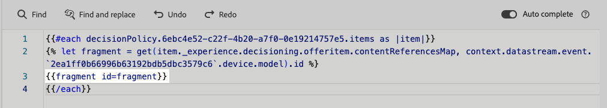

# Aproveitar fragmentos em políticas de decisão {#fragments}

Se a política de decisão contiver itens de decisão, incluindo fragmentos, você poderá aproveitar esses fragmentos no código de política de decisão. [Saiba mais sobre fragmentos](../content-management/fragments.md)

>[!AVAILABILITY]
>
>No momento, esse recurso só está disponível para o canal de **experiência baseada em código** e para um conjunto de organizações (Disponibilidade limitada). Para obter mais informações, entre em contato com o seu representante da Adobe.

Por exemplo, digamos que você queira exibir conteúdos diferentes para vários modelos de dispositivos móveis. Certifique-se de ter adicionado fragmentos correspondentes a esses dispositivos ao item de decisão que você está usando na política de decisão. [Saiba como](items.md#attributes).

{width=70%}

Depois de concluído, você pode usar um dos seguintes métodos:

>[!BEGINTABS]

>[!TAB Inserir o código diretamente]

Basta copiar e colar o bloco de código abaixo no código de política de decisão. Substitua `variable` pela ID do fragmento e `placement` pela chave de referência do fragmento:

```

{{fragment id = variable}}
```

>[!TAB Siga as etapas detalhadas]

1. Navegue até as **[!UICONTROL funções auxiliares]** e adicione a **função Let** ` {{variable}}` ao painel de código, onde você pode declarar a variável para o fragmento.

   

1. Use a função **de** Mapa **>** Obter`` para criar sua expressão. O mapa é o fragmento referenciado no item de decisão e a sequência pode ser o modelo de dispositivo inserido no item de decisão como a **[!UICONTROL Chave de referência do fragmento]**.

   

1. Você também pode usar um atributo contextual que contenha essa ID de modelo de dispositivo.

   

1. Adicione a variável escolhida para o fragmento como a ID do fragmento.

   

>[!ENDTABS]

A ID do fragmento e a chave de referência serão selecionadas na seção **[!UICONTROL Fragmentos]** do item de decisão.

>[!WARNING]
>
>Se a chave do fragmento estiver incorreta ou se o conteúdo do fragmento não for válido, a renderização falhará, causando erro na chamada do Edge.

## Medidas de proteção ao usar fragmentos {#fragments-guardrails}

**Atributos de item de decisão e de contexto**

Por padrão, os atributos de item de decisão e o atributo contextual não têm suporte em fragmentos [!DNL Journey Optimizer]. No entanto, você pode usar variáveis globais, conforme descrito abaixo.

Digamos que você queira usar a variável *sport* no fragmento.

1. Faça referência a essa variável no fragmento, por exemplo:

   ```
   Elevate your practice with new {{sport}} gear!
   ```

1. Defina a variável com a função **Let** no bloco de política de decisão. No exemplo abaixo, *sport* é definido com o atributo de item de decisão:

   ```
   {#each decisionPolicy.13e1d23d-b8a7-4f71-a32e-d833c51361e0.items as |item|}}
   
   {{fragment id = get(item._experience.decisioning.offeritem.contentReferencesMap, "placement1").id }}
   {{/each}}
   ```

**Validação do conteúdo do fragmento do item de decisão**

* Devido à natureza dinâmica desses fragmentos, quando usados em uma campanha, a validação da mensagem durante a criação do conteúdo da campanha é ignorada para fragmentos referenciados em itens de decisão.

* A validação do conteúdo do fragmento ocorre somente durante a criação e a publicação do fragmento.

* No caso de fragmentos JSON, a validade do objeto JSON não é garantida. Verifique se o conteúdo do fragmento de expressão é um JSON válido para que ele possa ser usado em itens de decisão.

No tempo de execução, o conteúdo da campanha (incluindo o conteúdo de fragmentos de itens de decisão) é validado. No caso de uma falha de validação, a campanha não será renderizada.
