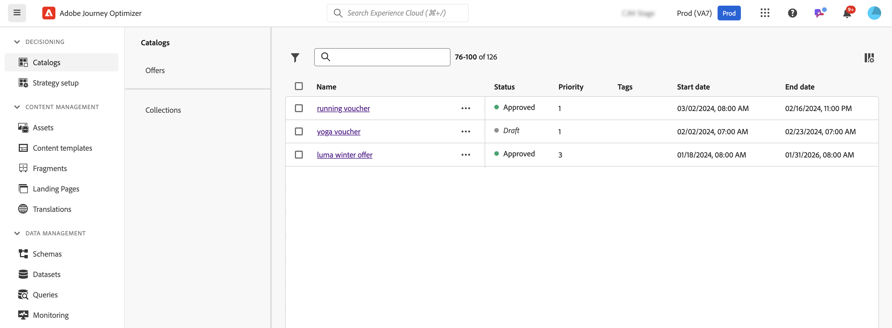

# Introdução aos recursos de decisão em [!DNL Journey Optimizer] {#gs-decision}

Os recursos de decisão do [!DNL Journey Optimizer] permitem que você forneça as melhores ofertas e experiências personalizadas aos seus clientes em todos os pontos de contato, exatamente nos momentos certos. Esses recursos simplificam a personalização por meio de um catálogo centralizado de ofertas de marketing e um mecanismo de decisão avançado, que usa regras e critérios de classificação para fornecer o conteúdo mais relevante para cada indivíduo.

Principais benefícios:

* Melhor desempenho da campanha fornecendo ofertas personalizadas em vários canais,
* Workflows aprimorados: em vez de criar várias entregas ou campanhas, as equipes de marketing podem aprimorar os workflows criando uma única entrega e variar as ofertas em diferentes partes do modelo,
* Controle a quantidade de vezes que uma oferta é exibida em campanhas e clientes.

Atualmente, o [!DNL Journey Optimizer] fornece as duas soluções principais detalhadas abaixo.

## Decisão {#decisioning}

Nossa estrutura de decisão de última geração, projetada para unificar os fluxos de trabalho existentes do Journey Optimizer e estabelecer a base para o gerenciamento de catálogos de conteúdo adicionais. Ofertas de decisão:

* Gerenciamento de catálogo de itens baseado em esquema: aumente a flexibilidade associando metadados personalizados a cada oferta
* Regras flexíveis de coleta: agrupe facilmente as ofertas para avaliação futura com base em vários critérios
* Configuração atualizada da política de decisão e da estratégia de seleção: permitir a reutilização dos componentes de decisão
* Recursos de experimentação: testar a lógica de decisão em relação a outros componentes do conteúdo para medir o desempenho

O Experience Decisioning é compatível com o canal de experiência baseada em código.

➡️ [Introdução à Decisão](../experience-decisioning/gs-experience-decisioning.md)

## Gestão de decisões {#decision-management}

Nosso recurso estabelecido na Journey Optimizer, a Gestão de decisões, usa uma biblioteca central de ofertas de marketing e um mecanismo de decisão que aplica regras e restrições aos perfis do cliente em tempo real, aproveitando os dados do Adobe Experience Platform para fornecer a oferta certa na hora certa.

Atualmente, o Gerenciamento de decisões é compatível com quatro canais: Email, Mensagens no aplicativo, Notificações por push e SMS.

➡️ [Introdução ao Gerenciamento de decisão](../offers/get-started/starting-offer-decisioning.md)
