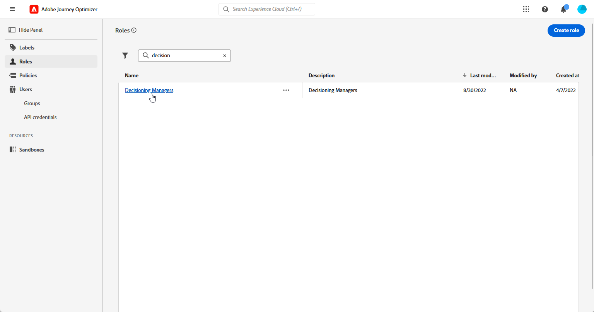

# Introdução à Escolha de experiências {#get-started-experience-decisioning}

>[!AVAILABILITY]
>
>No momento, a Escolha de experiências está disponível apenas para algumas organizações (disponibilidade limitada). Para obter acesso, entre em contato com seu representante da Adobe.
>
>Por enquanto, o recurso não está disponível para clientes que compraram as ofertas complementares do Adobe **Healthcare Shield** e **Privacy and Security Shield**.

## O que é o Experience Decisioning {#about}

A Escolha de experiências simplifica a personalização oferecendo um catálogo centralizado de ofertas de marketing conhecidas como “itens de decisão”, além de um mecanismo de decisão sofisticado. Esse mecanismo usa regras e critérios de classificação para selecionar e apresentar os itens de decisão mais relevantes para cada pessoa.

Esses itens de decisão são perfeitamente integrados em uma grande variedade de superfícies de entrada através do [novo canal de experiência baseado em código](https://experienceleague.adobe.com/en/docs/journey-optimizer/using/code-based-experience/get-started-code-based), agora acessível em campanhas do Journey Optimizer. As políticas de decisão da Escolha de experiências estão disponíveis para uso somente em campanhas de experiência baseadas em código.

## Principais etapas do Experience Decisioning {#steps}

As principais etapas para trabalhar com o Experience Decisioning são as seguintes:

1. **Atribuir permissões apropriadas**. O Experience Decisioning só está disponível para usuários com acesso a uma **[!UICONTROL função]** relacionada ao Experience Decisioning, como Gerentes de decisão. Se não conseguir acessar o Experience Decisioning, suas permissões deverão ser estendidas.

   +++Saiba como atribuir a função de Gerentes de decisão

   1. Para atribuir uma função a um usuário no produto [!DNL Permissions], navegue até a guia **[!UICONTROL Funções]** e selecione Gerenciadores de decisão.

      

   1. Na guia **[!UICONTROL Usuários]**, clique em **[!UICONTROL Adicionar usuário]**.

      

   1. Digite o nome de usuário ou endereço de email ou selecione o usuário na lista e clique em **[!UICONTROL Salvar]**.

      Se o usuário não foi criado anteriormente, consulte a [documentação Adicionar usuários](https://experienceleague.adobe.com/pt-br/docs/experience-platform/access-control/ui/users).

      

   O usuário deve receber um email de redirecionamento para sua instância.

+++

1. **Configurar atributos personalizados**: adapte o catálogo de itens aos seus requisitos específicos, configurando atributos personalizados no esquema do catálogo.

1. **Crie itens de decisão** para mostrar ao seu público-alvo direcionado.

1. **Organizar com coleções**: use coleções para categorizar itens de decisão com base em regras baseadas em atributos. Incorpore coleções nas estratégias de seleção para determinar qual coleção de itens de decisão deve ser considerada.

1. **Criar regras de decisão**: as regras de decisão são usadas em itens de decisão e/ou estratégias de seleção para determinar para quem um item de decisão pode ser mostrado.

1. **Implementar métodos de classificação**: crie métodos de classificação e aplique-os nas estratégias de decisão para determinar a ordem de prioridade para selecionar itens de decisão.

1. **Criar estratégias de seleção**: crie estratégias de seleção que aproveitem coleções, regras de decisão e métodos de classificação para identificar os itens de decisão adequados para exibição em perfis.

1. **Incorpore uma política de decisão à sua campanha baseada em código**: as políticas de decisão combinam várias estratégias de seleção para determinar os itens de decisão qualificados a serem exibidos para o público-alvo desejado.
