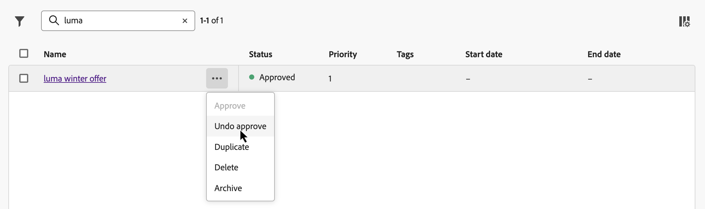

# Criar o primeiro item de decisão {#items}

>[!CONTEXTUALHELP]
>id="ajo_exd_items"
>title="Gerenciar itens de decisão"
>abstract="O Journey Optimizer permite gerar ofertas de marketing, conhecidas como itens de decisão, que você pode criar e organizar em catálogos e coleções centralizados. Atualmente, todos os itens de decisão criados são consolidados em um único catálogo de “Ofertas”. Nessa tela, você também pode acessar o esquema do catálogo clicando em **Editar esquema** e criar atributos personalizados para itens de decisão."
>additional-url="https://experienceleague.adobe.com/docs/journey-optimizer/using/decisioning/experience-decisioning/decision-items/catalogs.html?lang=pt-BR" text="Configurar o catálogo de itens"

O Journey Optimizer permite gerar ofertas de marketing, conhecidas como itens de decisão, que você pode criar e organizar em catálogos e coleções centralizados. Eles são compostos de atributos padrão e personalizados projetados para se alinharem com precisão às suas necessidades. Além disso, incorporam restrições de perfil que permitem definir para quem um item de decisão pode ser exibido.

Antes de criar um item de decisão, verifique se você criou uma **regra de decisão** se deseja definir condições para determinar para quem o item de decisão pode ser mostrado. [Saiba como criar regras de decisão](rules.md).

Para criar um item de decisão, navegue até **[!UICONTROL Decisão]** > **[!UICONTROL Catálogos]**, clique em **[!UICONTROL Criar item]** e siga as etapas detalhadas nas seções abaixo.

## Definir os atributos do item de decisão {#attributes}

>[!CONTEXTUALHELP]
>id="ajo_exd_item_priority"
>title="Defina a prioridade do item de decisão"
>abstract="Se um perfil for qualificado para vários itens, a prioridade permitirá a comparação entre esse item de decisão e outros. Uma prioridade mais alta concede ao item precedência sobre outros."

>[!CONTEXTUALHELP]
>id="ajo_exd_item_custom_attributes"
>title="Definir os atributos personalizados"
>abstract="Atributos personalizados são atributos específicos adaptados às suas necessidades que podem ser atribuídos a um item de decisão. Eles são criados no esquema de catálogo dos itens de decisão. Esta seção só será exibida se você tiver adicionado pelo menos um atributo personalizado ao esquema de catálogo."
>additional-url="https://experienceleague.adobe.com/docs/journey-optimizer/using/decisioning/experience-decisioning/decision-items/catalogs.html?lang=pt-BR" text="Configurar o catálogo de itens"

Comece definindo os atributos padrão e personalizados do item de decisão:

1. Forneça um nome e uma descrição.
1. Especifique datas de início e término. O item só será considerado pelo mecanismo de decisão nessas datas.
1. Defina a **[!UICONTROL Prioridade]** do item de decisão em comparação a outros, se um perfil se qualificar para vários itens. Uma prioridade mais alta concede ao item precedência sobre outros.

   >[!NOTE]
   >
   >A prioridade é um tipo de dados inteiro. Todos os atributos que são tipos de dados inteiros devem conter valores inteiros (sem decimais).

1. O campo **Tags** permite atribuir Tags unificadas do Adobe Experience Platform aos itens de decisão. Isso permite classificá-los facilmente e melhorar a pesquisa. [Saiba como trabalhar com tags](../start/search-filter-categorize.md#tags)

1. Especifique atributos personalizados (opcional). Atributos personalizados são atributos específicos adaptados às suas necessidades que podem ser atribuídos a um item de decisão. Eles são definidos no schema do catálogo dos itens de decisão. [Saiba como trabalhar com catálogos](catalogs.md)

1. Após definir os atributos do item de decisão, clique em **[!UICONTROL Avançar]**.

## Configurar a elegibilidade do item de decisão {#eligibility}

>[!CONTEXTUALHELP]
>id="ajo_exd_item_constraints"
>title="Adicionar públicos-alvo ou regras de decisão"
>abstract="Por padrão, todos os perfis estão qualificados para receber o item de decisão, mas você pode usar públicos-alvo ou regras para restringir o item somente a perfis específicos."
>additional-url="https://experienceleague.adobe.com/docs/journey-optimizer/using/audiences-profiles-identities/audiences/about-audiences.html?lang=pt-BR" text="Usar públicos-alvo"
>additional-url="https://experienceleague.adobe.com/docs/journey-optimizer/using/decisioning/experience-decisioning/selection/rules.html?lang=pt-BR" text="Usar regras de decisão"

Por padrão, todos os perfis estarão qualificados para receber o item de decisão, mas você pode usar públicos ou regras para restringir o item somente a perfis específicos, ambas as soluções correspondentes a usos diferentes. Expanda a seção abaixo para obter mais informações:

+++Uso de públicos-alvo vs. regras de decisão

Basicamente, a saída de um público-alvo é uma lista de perfis, enquanto uma regra de decisão é uma função executada sob demanda em relação a um único perfil durante o processo de decisão.

* **Públicos-alvo**: por um lado, os públicos-alvo são um grupo de perfis do Adobe Experience Platform que correspondem a uma determinada lógica com base em atributos de perfil e eventos de experiência. No entanto, o Gerenciamento de ofertas não recalcula o público-alvo, que pode não estar atualizado ao apresentar a oferta.

* **Regras de decisão**: por outro lado, uma regra de decisão se baseia nos dados disponíveis no Adobe Experience Platform e determina para quem uma oferta pode ser exibida. Uma vez selecionada em uma oferta ou em uma decisão para um determinado posicionamento, a regra é executada sempre que uma decisão é tomada, o que garante que cada perfil receba a melhor e mais recente oferta.

+++

* Para limitar a apresentação do item de decisão aos membros de um ou vários públicos-alvo da Adobe Experience Platform, selecione a opção **[!UICONTROL Visitantes que se encaixam em um ou vários públicos-alvo]**, adicione um ou vários públicos-alvo do painel esquerdo e combine-os usando os operadores lógicos **[!UICONTROL And]** / **[!UICONTROL Or]**. [Saiba mais sobre públicos](../audience/about-audiences.md).

* Para associar uma regra de decisão específica ao item de decisão, selecione **[!UICONTROL Por regra]** e arraste a regra desejada do painel esquerdo para a área central. [Saiba mais sobre regras de decisão](rules.md).

Ao selecionar públicos ou regras de decisão, você pode ver informações sobre os perfis qualificados estimados. Clique em **[!UICONTROL Atualizar]** para atualizar os dados.

>[!NOTE]
>
>As estimativas de perfil não estão disponíveis quando os parâmetros da regra incluem dados que não estão no perfil, como dados de contexto. Por exemplo, uma regra de elegibilidade que exige que o tempo atual seja ≥ 80 graus.

## Definir regras de limitação {#capping}

O limite é usado como uma restrição para definir o número máximo de vezes que uma oferta pode ser apresentada. Limitar o número de vezes que os usuários obtêm ofertas específicas permite evitar o excesso de solicitações de seus clientes e, portanto, otimizar cada ponto de contato com a melhor oferta. Você pode criar até 10 limites para um determinado item de decisão.

>[!NOTE]
>
>
>O valor do contador de limite pode levar até 3 segundos para ser atualizado. Por exemplo, digamos que você esteja exibindo um banner da Web com uma oferta no seu site. Se um determinado usuário navegar para a próxima página do seu site em menos de 3 segundos, o valor do contador não será incrementado para esse usuário.

Para definir regras de limite para o item de decisão, clique no botão **[!UICONTROL Criar limite]** e siga estas etapas:

1. Defina qual **[!UICONTROL Evento de limite]** será considerado para aumentar o contador.

   * **[!UICONTROL Evento de decisão]** (valor padrão): número máximo de vezes que uma oferta pode ser apresentada.
   * **[!UICONTROL Impressão]** (somente canais de entrada): número máximo de vezes que a oferta pode ser exibida a um usuário.
   * **[!UICONTROL Cliques]**: número máximo de vezes que um usuário pode clicar no item de decisão.
   * **[!UICONTROL Evento personalizado]**: você pode definir um evento personalizado que será usado para limitar o número de vezes que o item é enviado. Por exemplo, você pode limitar o número de resgates até que correspondam a 10.000 ou até que um determinado perfil tenha resgatado uma vez. Para fazer isso, use esquemas [Adobe Experience Platform XDM](https://experienceleague.adobe.com/docs/experience-platform/xdm/home.html?lang=pt-BR){target="_blank"} para criar uma regra de evento personalizada.

   >[!NOTE]
   >
   >Para todos os eventos de limite, exceto o evento de decisão, o feedback da gestão de decisões pode não ser coletado automaticamente, o que pode resultar no aumento incorreto do contador de limite. Para garantir que cada evento de limite seja rastreado e contabilizado no contador de limite, verifique se o esquema usado para coletar eventos de experiência inclui o grupo de campos correto para esse evento. Informações detalhadas sobre a coleta de dados estão disponíveis na Documentação da gestão de decisões da Journey Optimizer:
   >* [Coleta de dados de gerenciamento de decisão](../offers/data-collection/data-collection.md)
   >* [Configurar a coleção de dados](../offers/data-collection/schema-requirement.md)

1. Escolha o tipo de limite:

   * Selecione **[!UICONTROL No total]** para definir quantas vezes o item pode ser proposto entre o público-alvo combinado, ou seja, entre todos os usuários. Por exemplo, se você for um retailer eletrônico com um &quot;contrato de portaria de TV&quot;, desejará que a oferta seja retornada apenas 200 vezes em todos os perfis.

   * Selecione **[!UICONTROL Por perfil]** para definir quantas vezes a oferta pode ser proposta ao mesmo usuário. Por exemplo, se você for um banco com uma oferta de &quot;Cartão de crédito Platinum&quot;, não desejará que essa oferta seja exibida mais de 5 vezes por perfil. Na verdade, você acredita que, se o usuário tiver visto a oferta cinco vezes e não tiver atuado nela, ele terá uma chance maior de agir na próxima melhor oferta.

1. No campo **[!UICONTROL Limite de contagem de limite]**, especifique o número de vezes que a oferta pode ser apresentada a todos os usuários ou por perfis, dependendo do tipo de limite selecionado. O número deve ser um inteiro maior que 0.

   Por exemplo, você definiu um evento de limite personalizado, como o número de check-outs que são considerados. Se você inserir 10 no campo **[!UICONTROL Limite de contagem de limite]**, nenhuma outra oferta será enviada após 10 check-outs.

1. Na lista suspensa **[!UICONTROL Redefinir frequência de limite]**, defina a frequência com que o contador de limite é redefinido. Para fazer isso, defina o período de tempo para a contagem (diariamente, semanalmente ou mensalmente) e insira o número de dias/semanas/meses de sua escolha. Por exemplo, se você deseja que a contagem de limite seja redefinida a cada 2 semanas, selecione **[!UICONTROL Semanalmente]** na lista suspensa correspondente e digite **2** no outro campo.

   >[!NOTE]
   >
   >A redefinição do contador de limite de frequência ocorre às **12h UTC**, no dia definido ou no primeiro dia da semana/mês quando aplicável. O dia de início da semana é **domingo**. Qualquer duração escolhida não pode exceder **2 anos** (ou seja, o número correspondente de meses, semanas ou dias).
   >
   >Depois de publicar seu item de decisão, você não poderá alterar o período de tempo (mensal, semanal ou diário) selecionado para a frequência. Você ainda pode editar o limite de frequência se o item tiver o status **[!UICONTROL Rascunho]** e nunca tiver sido publicado antes com o limite de frequência habilitado.

1. Clique em **[!UICONTROL Criar]** para confirmar a criação da regra de limitação. Você pode criar até 10 regras para um único item de decisão. Para fazer isso, clique no botão **[!UICONTROL Criar limite]** e repita as etapas acima.

   

1. Depois que as regras de qualificação e limite do item de decisão forem definidas, clique em **[!UICONTROL Avançar]** para revisar e salvar o item.

1. O item de decisão agora aparece na lista, com o status **[!UICONTROL Rascunho]**. Quando estiver pronto para ser apresentado aos perfis, clique no botão de reticências e selecione **[!UICONTROL Aprovar]**.

   

<!--* Identifying how many times a given customer has been shown a decision item. 
If a marketer wants to determine how many times a specific customer has been shown an offer, they can do that. Go to Profiles menu, Attributes tab. You'll see all counter values. The alphanumeric string is associated to the offer. To make the map, go to an item, in the URL check the last alphanumeric strings. D stands for day, w stands for week, m for month. "Ce" custom event-->

## Gerenciar itens de decisão {#manage}

Na lista de itens de decisão, você pode editar um item de decisão, alterar seu status (**Rascunho**, **Aprovado**, **Arquivado**), duplicá-lo ou excluí-lo.

Para modificar um item de decisão, abra-o, faça suas modificações e salve-o.

Selecionar um item de decisão ou clicar no botão de reticências permite as ações descritas abaixo.

* **[!UICONTROL Aprovar]**: define o status do item de decisão como Aprovado.
* **[!UICONTROL Desfazer aprovação]**: define o status do item de decisão de volta para **[!UICONTROL Rascunho]**.
* **[!UICONTROL Duplicar]**: cria um item de decisão com atributos e restrições idênticos. Por padrão, o novo item tem o status **[!UICONTROL Rascunho]**.
* **[!UICONTROL Excluir]**: remove o item de decisão da lista.

  >[!IMPORTANT]
  >
  >Depois de excluído, o item de decisão e seu conteúdo não estarão mais acessíveis. Essa ação não pode ser desfeita.

  Os itens de oferta aprovados não poderão ser excluídos se forem usados em uma coleção ou em uma decisão. Para excluí-los, altere o status para &quot;Rascunho&quot;. Para fazer isso, clique no botão de reticências e selecione **[!UICONTROL Desfazer aprovação]**.

  

* **[!UICONTROL Arquivar]**: define o status do item de decisão como **[!UICONTROL Arquivado]**. O item de decisão ainda está disponível na lista, mas você não pode definir seu status novamente como **[!UICONTROL Rascunho]** ou **[!UICONTROL Aprovado]**. Você só pode duplicá-la ou excluí-la.
