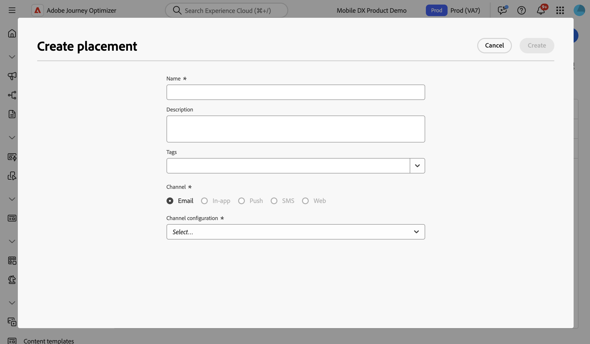

# Trabalhar com posicionamentos {#create-decision}

>[!BEGINSHADEBOX]

**Nesta página:** crie inserções e associe-as a políticas de decisão em seus emails para que os itens de decisão corretos apareçam no local correto e você possa acompanhar seu desempenho.

>[!ENDSHADEBOX]

## Sobre posicionamentos {#about}

Uma inserção é um container usado para mostrar itens de decisão. Isso ajuda a garantir que o conteúdo de oferta correto seja exibido no local certo na mensagem.

Ao adicionar uma política de decisão a um email, é necessário associar uma disposição ao componente que mostrará os itens de decisão retornados. Isso permite, por exemplo, rastrear o desempenho do item de decisão em diferentes posicionamentos no relatório.

A lista de posicionamentos está acessível no menu **[!UICONTROL Configuração de estratégia]**. Os filtros estão disponíveis para ajudá-lo a recuperar inserções de acordo com uma superfície de canal ou tags específicas.

>[!NOTE]
>
>Por enquanto, os posicionamentos estão disponíveis somente para o canal de email.

## Criar uma inserção {#create}

Para criar uma inserção, siga estas etapas:

1. Navegue até o menu **[!UICONTROL Configuração de estratégia]**, selecione **[!UICONTROL Email]** e clique no botão **[!UICONTROL Criar posicionamento]**.

   Você também pode criar uma disposição diretamente do designer de email ao adicionar uma política de decisão. [Saiba como associar um posicionamento a um componente de email](../experience-decisioning/create-decision.md#save)

1. Defina as propriedades da disposição:

   

   * **[!UICONTROL Nome]**: o nome do posicionamento. Defina um nome significativo para recuperá-lo mais facilmente.
   * **[!UICONTROL Descrição]**: uma descrição do posicionamento.
   * **[!UICONTROL Marcas]**: atribuir Marcas Unificadas do Adobe Experience Platform ao posicionamento. Isso permite classificá-los facilmente e melhorar a pesquisa. [Saiba como trabalhar com tags](../start/search-filter-categorize.md#tags)
   * **[!UICONTROL Canal]**: o canal para o qual o posicionamento será usado. Por enquanto, os posicionamentos só estão disponíveis para emails.
   * **[!UICONTROL Configuração de canal]**: associe uma configuração de canal ao posicionamento. [Saiba como definir as configurações de canal](../configuration/channel-surfaces.md).

1. Clique em **[!UICONTROL Criar]**.

Depois que a disposição é criada, ela é exibida na lista de disposições ao adicionar uma política de decisão a um email. Você pode selecioná-la para exibir suas propriedades e editá-la. [Saiba como criar políticas de decisão](../experience-decisioning/create-decision.md)

