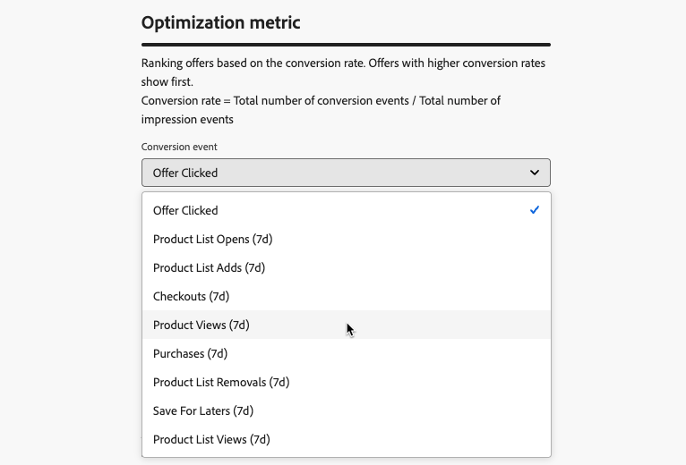
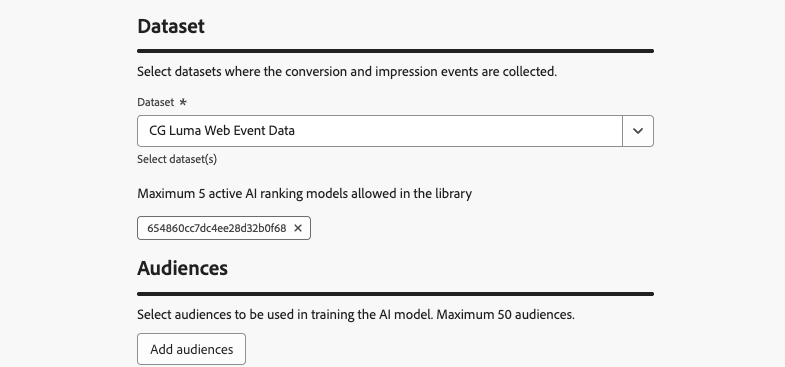

# Criar modelos de IA {#create-ai-models}

O [!DNL Journey Optimizer] permite que você crie **modelos de IA** para classificar ofertas com base em suas metas comerciais.

>[!CAUTION]
>
>Para criar, editar ou excluir modelos de IA, você deve ter a permissão **Gerenciar estratégias de classificação**. [Saiba mais](../../administration/high-low-permissions.md#manage-ranking-strategies)

## Criar um modelo de IA {#create-ranking-strategy}

>[!CONTEXTUALHELP]
>id="ajo_exd_ai_model_metric"
>title="Métrica de otimização"
>abstract="O [!DNL Journey Optimizer] classifica as ofertas com base na **taxa de conversão** (taxa de conversão = número total de eventos de conversão / número total de eventos de impressão). A taxa de conversão é calculada com base em dois tipos de métrica: **eventos de impressão** (ofertas exibidas) e **eventos de conversão** (ofertas que resultam em cliques por email ou pela web). Esses eventos são captados automaticamente por meio do SDK da web ou do SDK móvel fornecido."

Para criar um modelo de IA, siga as etapas abaixo:

1. Crie um conjunto de dados em que os eventos de conversão serão coletados. [Saiba como](../data-collection/create-dataset.md)

1. Navegue até o menu **[!UICONTROL Decisão]** > **[!UICONTROL Configuração de estratégia]** e selecione **[!UICONTROL modelos de IA]**.

   

   Todos os modelos de IA criados até o momento estão listados.

1. Clique no botão **[!UICONTROL Criar modelo de IA]**.

1. Especifique um nome exclusivo e, se necessário, uma descrição para o modelo de IA.

1. Selecione o tipo de modelo de IA que deseja criar:

   * **[!UICONTROL A otimização automática]** otimiza as ofertas com base no desempenho de ofertas anteriores. [Saiba mais](auto-optimization-model.md)
   * **[!UICONTROL A otimização personalizada]** otimiza e personaliza ofertas com base nos públicos e no desempenho da oferta. [Saiba mais](personalized-optimization-model.md)

   

1. A seção **[!UICONTROL Métrica de otimização]** fornece informações sobre o evento de conversão usado pelo modelo de IA para calcular a classificação das ofertas.

   O [!DNL Journey Optimizer] classifica as ofertas com base na **taxa de conversão** (taxa de conversão = número total de eventos de conversão / número total de eventos de impressão). A taxa de conversão é calculada usando dois tipos de métricas:
   * **Eventos de impressão** (ofertas exibidas)
   * **Eventos de conversão** (ofertas que resultam em cliques por email ou pela Web).

   Esses eventos são capturados automaticamente usando a Web SDK ou a SDK móvel fornecida. Saiba mais na visão geral do [Adobe Experience Platform Web SDK](https://experienceleague.adobe.com/docs/experience-platform/edge/home.html?lang=pt-BR).

+++ Otimização de modelos nas métricas [!DNL Customer Journey Analytics] personalizadas

   >[!NOTE]
   >
   >Este recurso só está disponível para [!DNL Customer Journey Analytics] clientes com direitos de administrador.
   >
   >Antes de começar, verifique se você integrou o Journey Optimizer ao Customer Journey Analytics para exportar conjuntos de dados do Journey Optimizer para suas visualizações de dados padrão. [Saiba como aproveitar [!DNL Journey Optmizer] os dados em [!DNL Customer Journey Analytics]](../../reports/cja-ajo.md)

   **[!UICONTROL Os modelos de otimização personalizada]** são um tipo de modelo de IA que permite definir metas comerciais e utilizar dados do cliente para treinar modelos orientados para negócios a fim de fornecer ofertas personalizadas e maximizar KPIs.

   Por padrão, os modelos de otimização personalizados usam **cliques de oferta** como métrica de otimização. Se você estiver trabalhando com o [!DNL Customer Journey Analytics], o [!DNL Decisioning] permitirá que você aproveite suas próprias métricas personalizadas para otimizar seu modelo.

   Para fazer isso, selecione o tipo de modelo **[!UICONTROL Otimização personalizada]** e expanda o menu suspenso **[!UICONTROL Evento de conversão]**. Todas as métricas da sua [!DNL Customer Journey Analytics] [visualização de dados](https://experienceleague.adobe.com/pt-br/docs/analytics-platform/using/cja-dataviews/data-views){target="_blank"} padrão são exibidas na lista. Selecione a métrica em que deseja otimizar seu modelo.

   {width=85%}

   >[!NOTE]
   >
   >Por padrão, as métricas em [!DNL Customer Journey Analytics] usam um modelo de atribuição &quot;Último contato&quot;, que atribui 100% do crédito ao ponto de contato que ocorre mais recentemente antes da conversão.
   >
   >Embora seja possível modificar o modelo de atribuição, nem todos os modelos de atribuição são ideais para a otimização do modelo de IA. Recomendamos selecionar cuidadosamente um modelo de atribuição que se alinhe às suas metas de otimização para garantir a precisão e o desempenho do modelo.
   >
   >Para obter mais detalhes sobre modelos de atribuição disponíveis e orientação sobre seu uso, consulte a [[!DNL Customer Journey Analytics] documentação](https://experienceleague.adobe.com/pt-br/docs/analytics-platform/using/cja-dataviews/component-settings/attribution){target="_blank"}

+++

1. Selecione os conjuntos de dados nos quais os eventos de conversão e impressão são coletados. Saiba como criar esses conjuntos de dados [nesta seção](../data-collection/create-dataset.md).

   {width=85%}

   >[!CAUTION]
   >
   >Somente os conjuntos de dados criados a partir de esquemas associados ao grupo de campos **[!UICONTROL Evento de experiência - Interações de apresentação]** (anteriormente conhecido como mixin) são exibidos na lista suspensa.

1. Se você estiver criando um modelo de IA **[!UICONTROL Otimização personalizada]**, selecione os segmentos a serem usados para treinar o modelo de IA.

   <!--➡️ [Discover this feature in video](#video)-->

   >[!NOTE]
   >
   >Você pode selecionar até 5 públicos-alvo.

1. Salve e ative o modelo de IA.

<!--At this point, you must have:

* created the AI model,
* defined which type of event you want to capture - offer displayed (impression) and/or offer clicked (conversion),
* and in which dataset you want to collect the event data.-->

Agora, sempre que uma oferta for exibida e/ou clicada, você desejará que o evento correspondente seja capturado automaticamente pelo grupo de campos **[!UICONTROL Evento de experiência - Interações de apresentação]** usando o [Adobe Experience Platform Web SDK](https://experienceleague.adobe.com/docs/experience-platform/edge/web-sdk-faq.html?lang=pt-BR#what-is-adobe-experience-platform-web-sdk%3F){target="_blank"} ou o Mobile SDK.

Para enviar tipos de evento (oferta exibida ou oferta clicada), você deve definir o valor correto para cada tipo de evento em um evento de experiência enviado para o Adobe Experience Platform. [Saiba como](../data-collection/schema-requirement.md)

<!--
## How-to video {#video}

Learn how to create a personalized optimization model and how to apply it to a decision.

>[!VIDEO](https://video.tv.adobe.com/v/3445956?quality=12&captions=por_br)-->
