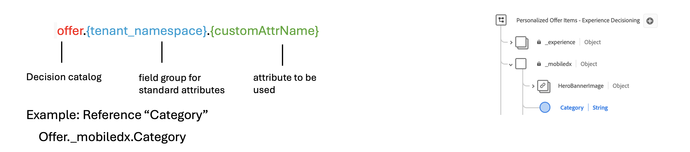

# Criar fórmulas de classificação {#create-ranking-formulas}

**As fórmulas de classificação** permitem definir regras que determinam qual oferta deve ser apresentada primeiro, em vez de considerar as pontuações de prioridade.

Para criar essas regras, o construtor de fórmulas de IA no **[!UICONTROL Adobe Journey Optimizer]** fornece maior flexibilidade e controle sobre como as ofertas são classificadas. Em vez de depender apenas de uma prioridade de oferta estática, agora é possível definir fórmulas de classificação personalizadas que combinam pontuações do modelo de IA, prioridades de oferta, atributos de perfil, atributos de oferta e sinais contextuais por meio de uma interface guiada.

Essa abordagem permite ajustar dinamicamente a classificação de ofertas com base em qualquer combinação de propensão orientada por IA, valor comercial e contexto em tempo real, facilitando o alinhamento da decisão com as metas de marketing e as necessidades do cliente. O construtor de fórmulas do AI é compatível com fórmulas simples ou avançadas, dependendo de quanto controle você deseja aplicar.

Depois que uma fórmula de classificação é criada, é possível atribuí-la a uma [estratégia de seleção](../selection-strategies.md). Se várias ofertas forem elegíveis para serem apresentadas ao usar essa estratégia de seleção, o mecanismo de decisão usará a fórmula selecionada para calcular qual oferta entregar primeiro.

➡️ [Conheça este recurso no vídeo](#video)

## Medidas de proteção e limitações {#ranking-guardrails}

Antes de criar fórmulas de classificação, lembre-se das seguintes restrições:

* O construtor de fórmulas de IA não oferece suporte a [modelos de otimização personalizados](personalized-optimization-model.md) que usam métricas contínuas.
* Quando um modelo de IA é usado em uma fórmula de classificação, os dados não são refletidos no [Relatório de taxa de conversão para tráfego de Retenção e Orientado por Modelo](../../reports/campaign-global-report-cja-code.md#conversion-rate).
* A profundidade do aninhamento em uma fórmula de classificação é limitada a 30 níveis, medidos pela contagem de `)` na sequência de caracteres do PQL.
* Uma sequência de fórmula de classificação pode ter até 8 KB para caracteres codificados em UTF-8 (8.000 caracteres ASCII ou 2.000-4.000 caracteres não ASCII).
* Os períodos de pesquisa não são permitidos em fórmulas de classificação (por exemplo, eventos de experiência do último mês). As tentativas de salvar essas fórmulas acionam um erro.
* [Otimização de fórmula habilitada por IA](#optimize) aplica-se apenas a fórmulas de classificação cuja expressão PQL baseada em código é maior que **2 KB** no tamanho codificado UTF-8; fórmulas menores não são analisadas.

## Criar a fórmula de classificação e definir propriedades {#create-ranking-formula}

>[!CONTEXTUALHELP]
>id="ajo_exd_config_formulas"
>title="Criar fórmulas de classificação"
>abstract="As fórmulas permitem definir regras que determinarão qual item de decisão deverá ser apresentado primeiro, ao invés de considerar as pontuações de prioridade dos itens. Após a criação de uma fórmula de classificação, é possível atribuí-la a uma estratégia de seleção."

Para criar uma fórmula de classificação, siga as etapas abaixo.

1. Acesse o menu **[!UICONTROL Configuração de estratégia]** e selecione a guia **[!UICONTROL Fórmulas de classificação]**. A lista de fórmulas criadas anteriormente é exibida.

   

1. Clique em **[!UICONTROL Criar fórmula]**.

1. Especifique o nome da fórmula e adicione uma descrição, se desejar.

   {width="80%"}

1. Opcionalmente, clique em **[!UICONTROL Selecionar modelo de IA]** para definir o modelo que será usado como referência para criar sua fórmula de classificação.

   Toda vez que você se refere a uma pontuação de modelo ao definir sua fórmula abaixo, o modelo de IA selecionado será usado.

1. Defina as condições que determinarão a pontuação de classificação para os itens de decisão correspondentes. É possível:

   * Preencha a seção **[!UICONTROL Critérios]** usando o [construtor de fórmulas](#ranking-select-criteria) e/ou
   * Clique em **[!UICONTROL Alternar para o editor de código]** para definir ou refinar a lógica de classificação com o [PQL no editor de código](#ranking-code-editor).

## Usar dados da Adobe Experience Platform {#aep-data}

Na seção **[!UICONTROL Pesquisa de conjunto de dados]**, você pode usar dados do Adobe Experience Platform para ajustar dinamicamente a lógica de classificação para refletir as condições do mundo real.

Isso é especialmente útil para atributos que mudam com frequência, como disponibilidade de produto ou preço em tempo real. [Saiba como usar dados do Adobe Experience Platform para a tomada de decisão](../aep-data-exd.md)


## Definir critérios usando o construtor de fórmulas {#ranking-select-criteria}

Defina os **critérios** que determinarão a pontuação de classificação para os itens de decisão correspondentes.

Com uma interface intuitiva, você pode ajustar as decisões ajustando as pontuações da IA (propensão), o valor de oferta (prioridade), as alavancas contextuais e as propensões do perfil externo — individualmente ou em combinação — para otimizar cada interação. <!--Whether you are maximizing revenue, promoting strategic offers, or balancing business goals with real-time context, the formula builder gives you total control in defining ranking strategies.-->

<!--{width="80%"}-->

1. Se necessário, clique em **[!UICONTROL Alternar para o editor de código]** para adicionar uma expressão que use a **sintaxe do PQL** junto com o construtor de fórmulas. Essa opção complementa os campos da interface do usuário nas etapas abaixo, para que você possa combinar ambas as abordagens na mesma fórmula de classificação. Para obter mais informações sobre como usar a sintaxe do PQL, consulte a [documentação dedicada](https://experienceleague.adobe.com/docs/experience-platform/segmentation/pql/overview.html?lang=pt-BR). A sintaxe para atributos de item de decisão e exemplos de copiar e colar são fornecidos na seção [Usar o editor de código](#ranking-code-editor).

   

   >[!NOTE]
   >
   >Alternar para o editor de código adiciona entrada baseada em expressão aos seus critérios e não remove os outros campos da interface do usuário.

1. Na seção **[!UICONTROL Critério 1]**, especifique os itens de decisão aos quais você deseja aplicar uma pontuação de classificação fazendo o seguinte:
   * selecione um [atributo de item de decisão](../items.md#attributes)
   * selecionar um operador lógico
   * adicionar uma condição correspondente - você pode digitar um valor ou selecionar um atributo de perfil ou [dados de contexto](../context-data.md)

   {width="70%"}

1. Como opção, você pode especificar elementos adicionais para refinar as condições de correspondência para seus critérios serem verdadeiros.

   {width="80%"}

   Por exemplo, você definiu o Critério 1, como o *Tempo* atributo personalizado *É igual* à condição *aquecimento*. Além disso, você pode adicionar outra condição, como se a primeira condição fosse atendida e se a temperatura excedesse 75 graus no momento da solicitação, o Critério 1 seria verdadeiro.<!--Add a screenshot with the example-->

1. Crie uma expressão que atribuirá uma pontuação de classificação aos itens de decisão que atenderem à condição definida acima. Você pode referenciar qualquer um dos seguintes:

   * a pontuação obtida do modelo de IA que você selecionou opcionalmente na seção **[!UICONTROL Detalhes]** [acima](#create-ranking-formula);
   * a prioridade do item de decisão, que é um valor atribuído manualmente ao [criar um item de decisão](../items.md#attributes); <!--If a profile qualifies for multiple decision items, a higher priority grants the item precedence over others.-->
   * qualquer atributo que possa existir no perfil, como qualquer pontuação de propensão derivada externamente;
   * um valor estático que pode ser atribuído em um formato livre;
   * qualquer combinação de todos os itens acima.

   {width="70%"}

   >[!NOTE]
   >
   >Clique no ícone ao lado do campo para adicionar variáveis predefinidas.

1. Clique em **[!UICONTROL Adicionar critério]** para adicionar um ou mais critérios quantas vezes forem necessárias. A lógica é a seguinte:
   * Se o primeiro critério for verdadeiro para um determinado item de decisão, ele terá precedência sobre os próximos.
   * Se não for verdadeiro, o mecanismo de decisão passará para o segundo critério e assim por diante.

1. No último campo, é possível criar uma expressão que será atribuída a todos os itens de decisão que não atendam aos critérios acima.

   {width="70%"}

   +++Exemplo de fórmula de classificação

   {width="80%"}

   Se a região do item de decisão (atributo personalizado) for igual ao rótulo geográfico do perfil (atributo de perfil), a pontuação de classificação expressa aqui (que é uma combinação da prioridade do item de decisão, da pontuação do modelo de IA e de um valor estático) será aplicada a todos os itens de decisão que atenderem a essa condição.

   +++

1. Quando a fórmula estiver pronta, clique em **[!UICONTROL Criar]**.

Agora é possível acessar a fórmula de classificação na lista para exibir seus detalhes e editá-la ou excluí-la. Ele está pronto para ser usado em uma [estratégia de seleção](../selection-strategies.md) para classificar itens de decisão qualificados.

## Definir critérios usando o editor de código {#ranking-code-editor}

Use **[!UICONTROL Alternar para o editor de código]** quando quiser gravar ou editar a lógica de classificação como uma expressão **PQL**.


>[!NOTE]
>
>Esta ação impedirá a reversão para a exibição padrão do construtor desta fórmula.

Você pode aproveitar os atributos de perfil, [dados de contexto](../context-data.md) e [atributos de item de decisão](../items.md#attributes).

Por exemplo, você deseja aumentar a prioridade de todas as ofertas com o atributo &quot;quente&quot; se o tempo real estiver quente. Para fazer isso, o **contextData.weather=hot** foi passado na chamada de decisão.

{width="80%"}

Para aproveitar os atributos relacionados aos itens de decisão nas fórmulas, siga a sintaxe correta no código da fórmula de classificação. Expanda cada seção para obter mais informações:

+++Aproveitar atributos padrão de itens de decisão


+++

+++Aproveitar atributos personalizados de itens de decisão



+++

Você pode criar muitas fórmulas de classificação diferentes com base em código de acordo com suas necessidades. Abaixo estão alguns exemplos.

+++Aumente as ofertas com determinado atributo de oferta com base no atributo de perfil

Se o perfil estiver na cidade correspondente à oferta, duplique a prioridade para todas as ofertas nessa cidade.

**Fórmula de classificação:**

```
if( offer.characteristics.get("city") = homeAddress.city, offer.rank.priority * 2, offer.rank.priority)
```

+++

+++Impulsione ofertas em que a data final seja anterior a 24 horas a partir de agora

**Fórmula de classificação:**

```
if( offer.selectionConstraint.endDate occurs <= 24 hours after now, offer.rank.priority * 3, offer.rank.priority)
```

+++

+++Aumente as ofertas com base na propensão dos clientes para comprar o produto oferecido

Você pode aumentar a pontuação de uma oferta com base em uma pontuação de propensão do cliente.

Neste exemplo, o locatário da instância é *_salesvelocity* e o esquema de perfil contém um intervalo de pontuações armazenadas em uma matriz:


Diante disso, para um perfil como:

```
{"_salesvelocity": {"individualScoring": [
                    {"core": {
                            "category":"insurance",
                            "propensityScore": 96.9
                        }},
                    {"core": {
                            "category":"personalLoan",
                            "propensityScore": 45.3
                        }},
                    {"core": {
                            "category":"creditCard",
                            "propensityScore": 78.1
                        }}
                    ]}
}
```

+++

+++Impulsionar ofertas com base no CEP e na receita anual de um perfil

Neste exemplo, o sistema sempre tenta mostrar uma oferta de correspondência de CEP primeiro e retorna a uma oferta geral se nenhuma correspondência for encontrada, evitando mostrar ofertas destinadas a outros códigos postais.

```pql
if( offer._luma.offerDetails.zipCode = _luma.zipCode,luma.annualIncome / 1000 + 10000, if( not offer.luma.offerDetails.zipCode,_luma.annualIncome / 1000, -9999) )
```

O que a fórmula faz:

* Se a oferta tiver o mesmo CEP do usuário, atribua a ele uma pontuação muito alta para que seja escolhido primeiro.
* Se a oferta não tiver um CEP (é uma oferta geral), atribua a ela uma pontuação normal com base na renda do usuário.
* Se a oferta tiver um CEP diferente do usuário, atribua a ela uma pontuação muito baixa para que não seja selecionada.

+++

+++Aumentar ofertas com base em dados de contexto

[!DNL Journey Optimizer] permite que você impulsione determinadas ofertas com base nos dados de contexto que estão sendo transmitidos na chamada. Por exemplo, se `contextData.weather=hot` for passado, a prioridade de todas as ofertas com `attribute=hot` deverá ser aumentada.

>[!NOTE]
>
>Para obter informações detalhadas sobre como passar dados de contexto<!-- using the **Edge Decisioning** and **Decisioning** APIs-->, consulte [esta seção](../context-data.md).

Observe que ao usar a API **Decisioning**, os dados de contexto são adicionados ao elemento do perfil no corpo da solicitação, como no exemplo abaixo:

```
"xdm:profiles": [
{
    "xdm:identityMap": {
        "crmid": [
            {
            "xdm:id": "CRMID1"
            }
        ]
    },
    "xdm:contextData": [
        {
            "@type":"_xdm.context.additionalParameters;version=1",
            "xdm:data":{
                "xdm:weather":"hot"
            }
        }
    ]
    
}],
```

+++

## Otimização de fórmulas alimentadas por IA {#optimize}

O [!DNL Journey Optimizer] pode analisar automaticamente fórmulas de classificação e sugerir simplificações que preservem a lógica original. Somente fórmulas cuja expressão PQL é maior que **2 KB** (codificado em UTF-8) são qualificadas, expressões menores não são analisadas. Quando uma simplificação é encontrada, um indicador vermelho é exibido ao lado do nome da fórmula na lista.


>[!NOTE]
>
>A otimização de fórmulas alimentadas por IA depende dos mesmos recursos de IA gerativos que o **Assistente de IA** e usa os mesmos controles de acesso. Os usuários devem receber a permissão **[!UICONTROL Gerar Conteúdo]** no recurso **[!UICONTROL Assistente de IA]**. Para obter detalhes, consulte o [Assistente de IA de acesso](../../content-management/gs-generative.md#generative-access).

Para otimizar uma fórmula de classificação:

1. Na lista de fórmulas de classificação, clique no ícone indicador vermelho ao lado do nome da fórmula.

1. A janela **[!UICONTROL Otimizar]** é aberta, exibindo a expressão PQL original junto com a versão sugerida pela IA.

   

1. Para validar se ambas as expressões produzem resultados de classificação idênticos, clique em **[!UICONTROL Baixar Análise de Otimização (TSV)]** para baixar um arquivo que mostra como os perfis simulados são avaliados em relação a cada versão.

1. Depois de satisfeito, clique em **[!UICONTROL Aplicar]** para substituir a expressão original pela expressão otimizada.

## Vídeo tutorial {#video}

Saiba como usar o Construtor de fórmulas de IA no Adobe Journey Optimizer para criar estratégias de classificação de ofertas personalizadas.

>[!VIDEO](https://video.tv.adobe.com/v/3464446/?learn=on&enablevpops)
