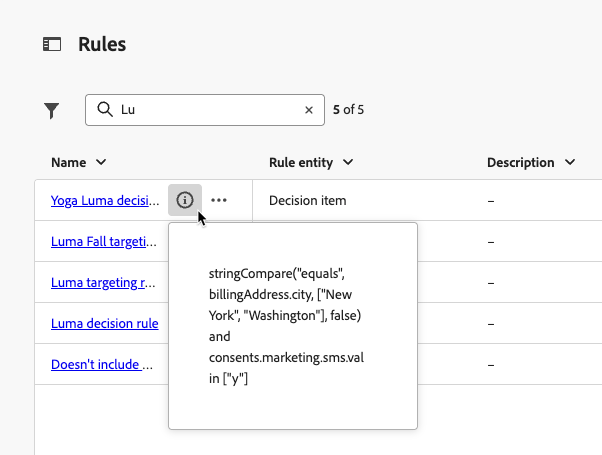

# Criar regras {#rules}

>[!CONTEXTUALHELP]
>id="ajo_exd_config_rules"
>title="Criar regras"
>abstract="Você pode criar dois tipos de regras: **regras de decisão** que podem ser usadas em itens de decisão ou estratégias de seleção, para controlar quais itens devem ser apresentados a qual público-alvo, ou **regras de direcionamento** para determinar segmentos específicos de público-alvo qualificados para receber conteúdo personalizado ou para inserir um caminho de jornada específico.  Ao criar uma regra de decisão, você pode selecionar **[!UICONTROL Habilitar pesquisa de conjunto de dados]** para usar os dados do Adobe Experience Platform. Isso permite definir critérios de elegibilidade com base em atributos dinâmicos e externos, garantindo que os itens de decisão sejam exibidos somente quando forem relevantes. "

## Sobre regras {#about}

Em [!DNL Journey Optimizer], você pode criar dois tipos de regras reutilizáveis:

* [Regras de decisão](#decision-rules)
* [Regras de direcionamento](#targeting-rules)

### Regras de decisão {#decision-rules}

As regras de decisão permitem definir o público-alvo dos itens de decisão aplicando restrições, diretamente no nível do item de decisão ou em uma estratégia de seleção específica. Isso permite controlar com precisão quais itens devem ser apresentados a quem.

Por exemplo, vamos considerar um cenário onde você tem itens de decisão com produtos relacionados a Yoga projetados para mulheres. Com as regras de decisão, é possível especificar que esses itens só devem ser exibidos para perfis cujo gênero seja &quot;Feminino&quot; e que tenham indicado um &quot;Ponto de interesse&quot; em &quot;Yoga&quot;.

>[!NOTE]
>
>Além das regras de decisão em nível de estratégia de seleção e item, você também pode definir o público-alvo desejado no nível da campanha. [Saiba mais](../campaigns/create-campaign.md#audience)

### Regras de direcionamento {#targeting-rules}

>[!AVAILABILITY]
>
>As regras de direcionamento estão atualmente em Disponibilidade limitada. Entre em contato com o representante da Adobe para obter acesso.
>
>Observe que esse recurso só está disponível para organizações que compraram a oferta complementar do **Decisioning**. Ele será implantado progressivamente para todos os clientes.

As regras de direcionamento permitem determinar as qualificações específicas que devem ser atendidas para que um cliente seja qualificado para receber conteúdo personalizado ou inserir um caminho de jornada específico, com base em segmentos de público-alvo específicos, o que permite direcionar subpúblicos-alvo em suas jornadas e campanhas.

Muitas vezes, eles são uma combinação de vários atributos, além de eventos de comportamento do cliente e dados de contexto. Para economizar tempo e esforço, você pode criar regras de direcionamento uma vez e reutilizá-las em suas jornadas e campanhas, com a capacidade de modificá-las rapidamente em linha no momento da criação.

É possível usar essas regras:

* Ao criar [direcionamento de otimização de conteúdo](../campaigns/campaigns-message-optimization.md#targeting) em jornadas ou campanhas;
* Ao compilar [otimização de caminho de jornada](../building-journeys/optimize.md#targeting).

➡️ [Conheça este recurso no vídeo](#video)

## Regras de acesso {#access}

A lista de regras está acessível no menu **[!UICONTROL Decisão]** > **[!UICONTROL Configuração de estratégia]**.

As seguintes ações estão disponíveis:

* Você pode filtrar na entidade de regra (**[!UICONTROL Item de decisão]** ou **[!UICONTROL Direcionamento]** - [Saiba mais](#about)).

* Selecione uma regra clicando no seu nome e edite-a usando o construtor de regras. [Saiba como](#create)

* No botão **[!UICONTROL Mais ações]** localizado ao lado de cada item, você pode:

   * Se você selecionou a entidade **[!UICONTROL Item de decisão]**, adicione a regra a um pacote para exportá-lo para outra sandbox. Saiba como [exportar objetos para outra sandbox](../configuration/copy-objects-to-sandbox.md).
   * Duplique uma regra.
   * Excluir uma regra.

{width=100%}

* Clique no ícone **[!UICONTROL Mais informações]** para exibir a fórmula que compõe a regra.

{width=60%}

## Criar uma regra {#create}

Para criar uma regra, siga estas etapas:

1. Navegue até **[!UICONTROL Decisão]** > **[!UICONTROL Configuração de estratégia]** > **[!UICONTROL Regras]** e clique no botão **[!UICONTROL Criar regra]**.

1. Selecione a entidade de regra para especificar para qual tipo de objeto a regra está sendo criada.

   {width=90%}

   * **[!UICONTROL Item de decisão]** - A regra pode ser aplicada em um [item de decisão](#decision-rules) no contexto da Decisão;
   * **[!UICONTROL Direcionamento]** - A regra pode ser usada ao criar regras de [direcionamento](#targeting-rules), como parte da [otimização de conteúdo](../campaigns/campaigns-message-optimization.md#targeting) em uma campanha ou jornada, na [Atividade Otimizar jornada](../building-journeys/optimize.md#targeting).

1. Se você criar uma regra de **[!UICONTROL Item de decisão]**, poderá selecionar **[!UICONTROL Habilitar pesquisa de conjunto de dados]** para usar dados do Adobe Experience Platform para enriquecer sua lógica de decisão com dados externos. Isso é especialmente útil para atributos que mudam com frequência, como disponibilidade de produtos ou preços em tempo real.

   >[!AVAILABILITY]
   >
   >Esse recurso está atualmente disponível para todos os clientes como uma versão beta pública. Entre em contato com o representante de sua conta se desejar obter acesso. [Saiba como usar dados do Adobe Experience Platform para a tomada de decisão](../experience-decisioning/aep-data-exd.md)

1. A tela de criação da regra é aberta. Nomeie a regra e forneça uma descrição.

1. Crie a regra para atender às suas necessidades usando o Construtor de segmentos do Adobe Experience Platform. Para fazer isso, você pode aproveitar várias fontes de dados, como:
   * Atributos do perfil;
   * Atributos de item de decisão - disponíveis apenas ao criar uma regra de **[!UICONTROL Item de decisão]**;
   * Públicos-alvo;
   * Dados de contexto provenientes do Adobe Experience Platform. [Saiba como aproveitar os dados de contexto](context-data.md)

   {width=85%}

   >[!NOTE]
   >
   >O Construtor de segmentos fornecido para criar regras apresenta algumas especificidades em comparação à usada com o serviço de Segmentação do Adobe Experience Platform. No entanto, o processo global descrito na documentação é válido para regras de compilação em [!DNL Journey Optimizer]. [Saiba como criar definições de segmento](../audience/creating-a-segment-definition.md)

1. À medida que você adiciona e configura novos campos no espaço de trabalho, o painel **[!UICONTROL Propriedades de público-alvo]** exibe informações sobre os perfis estimados pertencentes ao público-alvo. Clique em **[!UICONTROL Atualizar estimativa]** para atualizar os dados.

   {width=85%}

   >[!NOTE]
   >
   >Estimativas de perfil não estão disponíveis quando os parâmetros da regra incluem dados que não estão armazenados no perfil, como dados de contexto.

1. Quando a regra estiver pronta, clique em **[!UICONTROL Criar]**. A regra criada aparece na lista e, de acordo com a entidade criada, está disponível para uso:

   * Em **itens de decisão** e **estratégias de seleção** para controlar a apresentação de itens de decisão a perfis;
   * Ou ao criar o **direcionamento** em otimização de conteúdo ou de caminho.

>[!NOTE]
>
>A profundidade do aninhamento em uma regra é limitada a 30 níveis. Isso é medido pela contagem dos parênteses de fechamento `)` na cadeia de caracteres do PQL.
>
>Uma sequência de regras pode ter até 15 KB para caracteres codificados em UTF-8. É equivalente a 15.000 caracteres ASCII (1 byte cada) ou 3.750-7.500 caracteres não ASCII (2-4 bytes cada).
>
>[Saiba mais sobre as Medidas de proteção e limitações das Regras de elegibilidade](decisioning-guardrails.md#eligibility-rules)

## Vídeo tutorial {#video}

Saiba como criar, duplicar e aplicar **regras de direcionamento** reutilizáveis no Adobe Journey Optimizer para personalizar campanhas com eficiência com base em atributos de cliente, como região, idioma e comportamento, economizando tempo e melhorando a precisão do público-alvo.

>[!VIDEO](https://video.tv.adobe.com/v/3476127/?quality=12)
