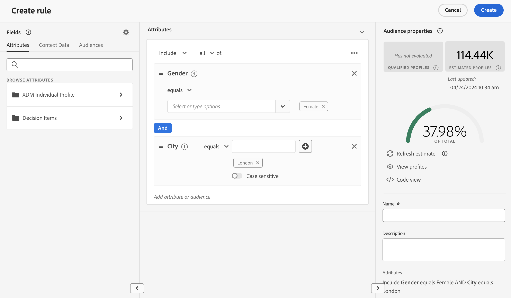
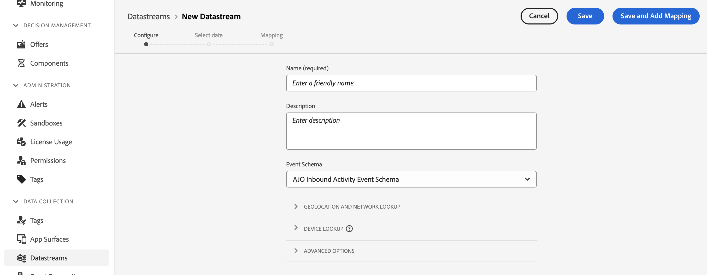

# Regras de decisão {#rules}

>[!CONTEXTUALHELP]
>id="ajo_exd_config_rules"
>title="Criar regras de decisão"
>abstract="As regras de decisão permitem definir o público-alvo dos itens de decisão aplicando restrições diretamente no nível do item de decisão ou em uma estratégia de seleção específica. Isso permite controlar com precisão quais itens devem ser apresentados a quem."

>[!BEGINSHADEBOX &quot;O que você encontrará neste guia de documentação&quot;]

* [Introdução ao Experience Decisioning](gs-experience-decisioning.md)
* Gerencie seus itens de decisão: [Configurar o catálogo de itens](catalogs.md) - [Criar itens de decisão](items.md) - [Gerenciar coleções de itens](collections.md)
* Configurar a seleção dos itens: **[Criar regras de decisão](rules.md)** - [Criar métodos de classificação](ranking.md)
* [Criar estratégias de seleção](selection-strategies.md)
* [Criar políticas de decisão](create-decision.md)

>[!ENDSHADEBOX]

As regras de decisão permitem definir o público-alvo dos itens de decisão aplicando restrições diretamente no nível do item de decisão ou em uma estratégia de seleção específica. Isso permite controlar com precisão quais itens devem ser apresentados a quem.

Por exemplo, vamos considerar um cenário onde você tem itens de decisão com produtos relacionados a Yoga projetados para mulheres. Com as regras de decisão, é possível especificar que esses itens só devem ser exibidos para perfis cujo gênero seja &quot;Feminino&quot; e que tenham indicado um &quot;Ponto de interesse&quot; em &quot;Yoga&quot;.

>[!NOTE]
>
>Além das regras de decisão em nível de estratégia de seleção e item, você também pode definir o público-alvo desejado no nível da campanha. [Saiba mais](../campaigns/create-campaign.md#audience)

A lista de regras de decisão está acessível no **[!UICONTROL Configuração]** / **[!UICONTROL Regras de decisões]** menu.

## Criar uma regra de decisão {#create}

Para criar uma regra de decisão, siga estas etapas:

1. Navegue até **[!UICONTROL Configuração]** / **[!UICONTROL Regras de decisão]** e clique em **[!UICONTROL Criar regra]** botão.

1. A tela de criação de regras de decisão é aberta. Nomeie a regra e forneça uma descrição.

1. Crie a regra de decisão para atender às suas necessidades usando o Construtor de segmentos do Adobe Experience Platform. Para fazer isso, você pode aproveitar várias fontes de dados, como atributos de perfil, públicos-alvo ou dados de contexto provenientes da Adobe Experience Platform. [Saiba como aproveitar os dados de contexto nas regras de decisão](#context-data)

   

   >[!NOTE]
   >
   >O Construtor de segmentos fornecido para criar regras de decisão apresenta algumas especificidades em comparação à usada com o serviço de Segmentação do Adobe Experience Platform.  No entanto, o processo global descrito na documentação ainda é válido para criar regras de decisões. [Saiba como criar definições de segmento](../audience/creating-a-segment-definition.md)

1. À medida que você adiciona e configura novos campos no espaço de trabalho, a variável **[!UICONTROL Propriedades do público]** exibe informações sobre os perfis estimados pertencentes ao público. Clique em **[!UICONTROL Atualizar estimativa]** para atualizar dados.

   >[!NOTE]
   >
   >As estimativas de perfil não estão disponíveis quando os parâmetros da regra incluem dados que não estão no perfil, como dados de contexto.

1. Quando a regra de decisão estiver pronta, clique em **[!UICONTROL Salvar]**. A regra criada aparece na lista e está disponível para uso em itens de decisão e estratégias de seleção para controlar a apresentação de itens de decisão para perfis.

## Aproveitar dados de contexto em regras de decisão {#context-data}

A tela de criação de regras do Experience Decisioning permite aproveitar todas as informações disponíveis no Adobe Experience Platform para criar regras de decisão. Por exemplo, você pode projetar uma regra de decisão que exija que o tempo atual seja ≥ 80 graus.

Para fazer isso, primeiro é necessário definir os dados que deseja disponibilizar no Experience Decisioning. Depois de concluídos, esses dados se integram perfeitamente ao Experience Decisioning na **[!UICONTROL Dados de contexto]** guia disponível ao criar uma regra de decisão.

As etapas para alimentar o Experience Decisioning com dados do Adobe Experience Platform são as seguintes:

1. Criar um **Esquema do evento de experiência**  no Adobe Experience Platform e em seus componentes **conjunto de dados**. [Saiba como criar esquemas](https://experienceleague.adobe.com/en/docs/experience-platform/xdm/ui/resources/schemas){target="_blank"}

1. Criar um novo fluxo de dados do Adobe Experience Platform:

   1. Navegue até a **[!UICONTROL Datastreams]** e selecione **[!UICONTROL Nova sequência de dados]**.

   1. No **[!UICONTROL Esquema de evento]** selecione o schema de Evento de experiência criado anteriormente e clique em **[!UICONTROL Salvar]**.

      

   1. Clique em **[!UICONTROL Adicionar serviço]** e selecione &quot;Adobe Experience Platform&quot; como o serviço. No **[!UICONTROL Conjunto de dados do evento]** selecione o conjunto de dados de evento criado anteriormente e ative a variável **[!UICONTROL Adobe Journey Optimizer]** opção.

      

Depois que a sequência de dados é salva, as informações do conjunto de dados selecionado são buscadas automaticamente e integradas ao Experience Decisioning, normalmente ficando disponíveis em aproximadamente 24 horas.

Para obter mais orientações sobre como trabalhar com o Adobe Experience Platform, explore os seguintes recursos:

* [Esquemas do Experience Data Model (XDM)](https://experienceleague.adobe.com/en/docs/experience-platform/xdm/schema/composition){target="_blank"}
* [Conjuntos de dados](https://experienceleague.adobe.com/en/docs/experience-platform/catalog/datasets/overview){target="_blank"}
* [Datastreams](https://experienceleague.adobe.com/en/docs/experience-platform/datastreams/overview){target="_blank"}
