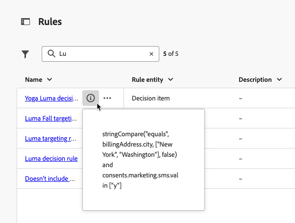
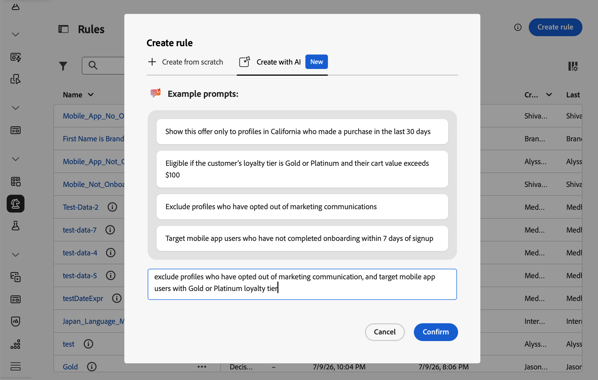
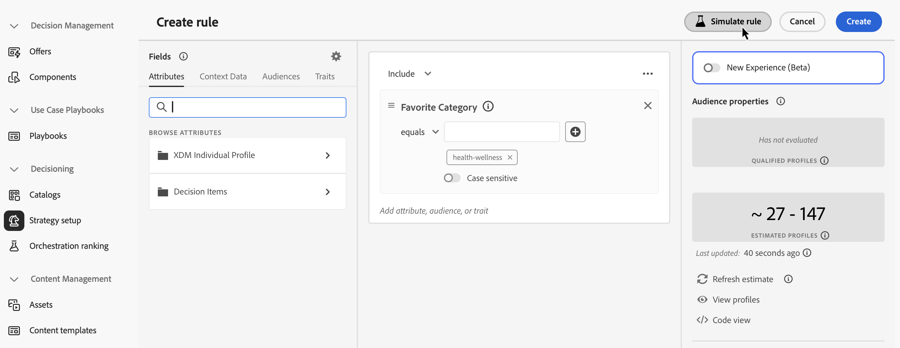
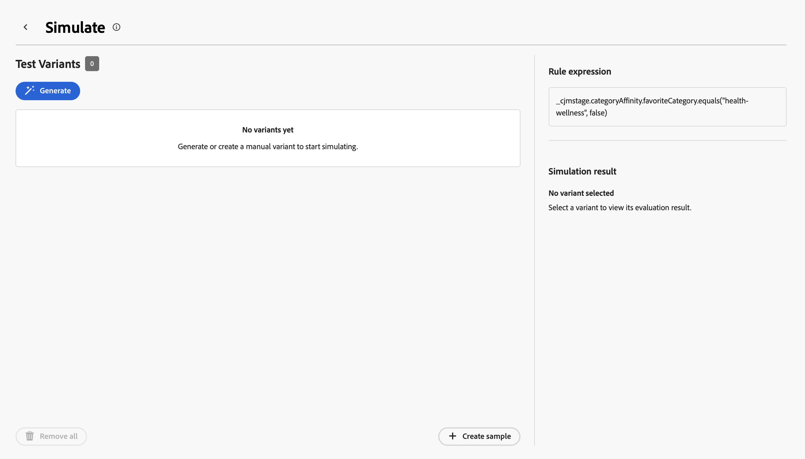
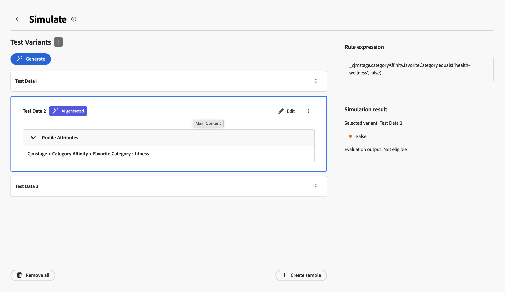
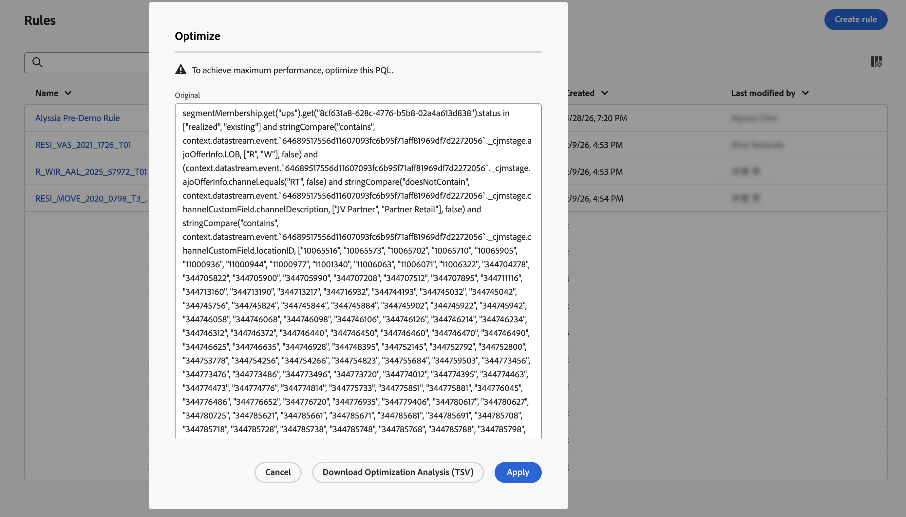

# Criar regras {#rules}

>[!BEGINSHADEBOX]

**Nesta página:** crie regras de decisão e de direcionamento reutilizáveis, para que você possa controlar quais itens de decisão e conteúdo personalizado serão exibidos para quais públicos em suas campanhas e jornadas.

>[!ENDSHADEBOX]

>[!CONTEXTUALHELP]
>id="ajo_exd_config_rules"
>title="Criar regras"
>abstract="É possível criar dois tipos de regras: **regras de decisão**, que podem ser usadas em itens de decisão ou estratégias de seleção para controlar quais itens devem ser apresentados a qual público-alvo, ou **regras de direcionamento**, que determinam os segmentos específicos de público-alvo qualificados para receber conteúdo personalizado ou entrar em um caminho de jornada específico.  Ao criar uma regra de decisão, é possível selecionar **[!UICONTROL Habilitar pesquisa de conjunto de dados]** para usar os dados do Adobe Experience Platform. Isso permite definir critérios de elegibilidade com base em atributos dinâmicos e externos, garantindo que os itens de decisão sejam exibidos somente quando forem relevantes."

## Sobre regras {#about}

Em [!DNL Journey Optimizer], você pode criar dois tipos de regras reutilizáveis:

* [Regras de decisão](#decision-rules)
* [Regras de direcionamento](#targeting-rules)

### Regras de decisão {#decision-rules}

As regras de decisão permitem definir o público-alvo dos itens de decisão aplicando restrições, diretamente no nível do item de decisão ou em uma estratégia de seleção específica. Isso permite controlar com precisão quais itens devem ser apresentados a quem.

Por exemplo, vamos considerar um cenário onde você tem itens de decisão com produtos relacionados a Yoga projetados para mulheres. Com as regras de decisão, é possível especificar que esses itens só devem ser exibidos para perfis cujo gênero seja &quot;Feminino&quot; e que tenham indicado um &quot;Ponto de interesse&quot; em &quot;Yoga&quot;.

>[!NOTE]
>
>Além das regras de decisão em nível de estratégia de seleção e item, você também pode definir o público-alvo desejado no nível da campanha. [Saiba mais](../campaigns/create-campaign.md#audience)

### Regras de direcionamento {#targeting-rules}

>[!AVAILABILITY]
>
>As regras de direcionamento estão atualmente em Disponibilidade limitada. Entre em contato com o representante da Adobe para obter acesso.
>
>Observe que esse recurso só está disponível para organizações que compraram a oferta complementar do **Decisioning**. Ele será implantado progressivamente para todos os clientes.

As regras de direcionamento permitem determinar as qualificações específicas que devem ser atendidas para que um cliente seja qualificado para receber conteúdo personalizado ou inserir um caminho de jornada específico, com base em segmentos de público-alvo específicos, o que permite direcionar subpúblicos-alvo em suas jornadas e campanhas.

Muitas vezes, eles são uma combinação de vários atributos, além de eventos de comportamento do cliente e dados de contexto. Para economizar tempo e esforço, você pode criar regras de direcionamento uma vez e reutilizá-las em suas jornadas e campanhas, com a capacidade de modificá-las rapidamente em linha no momento da criação.

É possível usar essas regras:

* Ao criar [direcionamento de otimização de conteúdo](../building-journeys/path-targeting.md) em jornadas ou campanhas;
* Ao compilar [otimização de caminho de jornada](../building-journeys/path-targeting.md).

➡️ [Conheça este recurso no vídeo](#video)

## Regras de acesso {#access}

A lista de regras está acessível no menu **[!UICONTROL Decisão]** > **[!UICONTROL Configuração de estratégia]**.

As seguintes ações estão disponíveis:

* Você pode filtrar na entidade de regra (**[!UICONTROL Item de decisão]** ou **[!UICONTROL Direcionamento]** - [Saiba mais](#about)).

* Selecione uma regra clicando no seu nome e edite-a usando o construtor de regras. [Saiba como](#create)

* No botão **[!UICONTROL Mais ações]** localizado ao lado de cada item, você pode:

  * Se você selecionou a entidade **[!UICONTROL Item de decisão]**, adicione a regra a um pacote para exportá-lo para outra sandbox. Saiba como [exportar objetos para outra sandbox](../configuration/copy-objects-to-sandbox.md).
  * Duplique uma regra.
  * Excluir uma regra.

{width=100%}

* Clique no ícone **[!UICONTROL Mais informações]** para exibir a fórmula que compõe a regra.

{width=60%}

## Criar uma regra {#create}

Para criar uma regra, siga estas etapas:

1. Navegue até **[!UICONTROL Decisão]** > **[!UICONTROL Configuração de estratégia]** > **[!UICONTROL Regras]** e clique no botão **[!UICONTROL Criar regra]**.

1. Na caixa de diálogo **[!UICONTROL Criar regra]**, escolha uma das seguintes guias:

   * **[!UICONTROL Crie do zero]** para continuar no fluxo de criação da regra.
   * **[!UICONTROL Crie com IA]** para usar a criação assistida por IA. Descreva a regra que deseja criar e depois confirme. Você será redirecionado para o construtor de regras e o Assistente de IA gerará uma sugestão de regra no painel direito. Para obter mais informações sobre como gerar uma regra usando IA, consulte a seção [Criar uma regra com IA](#build-rule-with-ai).

     >[!NOTE]
     >
     >Esse recurso está disponível para organizações com acesso aos recursos do Adobe AI.

1. Se você escolher **[!UICONTROL Criar do zero]**, selecione a entidade de regra para especificar para qual tipo de objeto a regra está sendo criada.

   {width=90%}

   * **[!UICONTROL Item de decisão]** - A regra pode ser aplicada em um [item de decisão](#decision-rules) no contexto da Decisão;
   * **[!UICONTROL Direcionamento]** - A regra pode ser usada ao criar regras de [direcionamento](#targeting-rules), como parte da [otimização de conteúdo](../building-journeys/path-targeting.md) em uma campanha ou jornada, na [Atividade Otimizar jornada](../building-journeys/path-targeting.md).

   Se você criar uma regra de **[!UICONTROL Item de decisão]**, poderá selecionar **[!UICONTROL Habilitar pesquisa de conjunto de dados]** para usar dados do Adobe Experience Platform para enriquecer sua lógica de decisão com dados externos. Isso é especialmente útil para atributos que mudam com frequência, como disponibilidade de produtos ou preços em tempo real. [Saiba como usar dados do Adobe Experience Platform para a tomada de decisão](../experience-decisioning/aep-data-exd.md)

1. A tela de criação da regra é aberta. Nomeie a regra e forneça uma descrição.

1. Crie a regra para atender às suas necessidades usando o Construtor de segmentos do Adobe Experience Platform. Para fazer isso, você pode aproveitar várias fontes de dados, como:
   * Atributos do perfil;
   * Atributos de item de decisão - disponíveis apenas ao criar uma regra de **[!UICONTROL Item de decisão]**;
   * Públicos-alvo;
   * Dados de contexto provenientes do Adobe Experience Platform. [Saiba como aproveitar os dados de contexto](context-data.md)

   {width=85%}

   >[!NOTE]
   >
   >O Construtor de segmentos fornecido para criar regras apresenta algumas especificidades em comparação à usada com o serviço de Segmentação do Adobe Experience Platform. No entanto, o processo global descrito na documentação é válido para regras de compilação em [!DNL Journey Optimizer]. [Saiba como criar definições de segmento](../audience/creating-a-segment-definition.md)

1. À medida que você adiciona e configura novos campos no espaço de trabalho, o painel **[!UICONTROL Propriedades de público-alvo]** exibe informações sobre os perfis estimados pertencentes ao público-alvo. Clique em **[!UICONTROL Atualizar estimativa]** para atualizar os dados.

   {width=85%}

   >[!NOTE]
   >
   >Estimativas de perfil não estão disponíveis quando os parâmetros da regra incluem dados que não estão armazenados no perfil, como dados de contexto.

1. Quando a regra estiver pronta, clique em **[!UICONTROL Criar]**. A regra criada aparece na lista e, de acordo com a entidade criada, está disponível para uso:

   * Em **itens de decisão** e **estratégias de seleção** para controlar a apresentação de itens de decisão a perfis;
   * Ou ao criar o **direcionamento** em otimização de conteúdo ou de caminho.

>[!NOTE]
>
>A profundidade do aninhamento em uma regra é limitada a 30 níveis. Isso é medido pela contagem dos parênteses de fechamento `)` na cadeia de caracteres do PQL.
>
>Uma sequência de regras pode ter até 15 KB para caracteres codificados em UTF-8. É equivalente a 15.000 caracteres ASCII (1 byte cada) ou 3.750-7.500 caracteres não ASCII (2-4 bytes cada).
>
>[Saiba mais sobre as Medidas de proteção e limitações das Regras de elegibilidade](decisioning-guardrails.md#eligibility-rules)

## Criar uma regra com IA {#build-rule-with-ai}

>[!NOTE]
>
>Esse recurso está disponível para organizações com acesso aos recursos do Adobe AI. Ela só está disponível para um conjunto de organizações (disponibilidade limitada). Para obter acesso, entre em contato com um representante da Adobe.
>
>No momento, a geração de regras assistidas por IA não oferece suporte à geração de expressões baseadas em dados de contexto de Jornada.

Você pode iniciar a criação de regras assistidas por IA a partir de dois locais:

* Na caixa de diálogo Criar regra, na guia **[!UICONTROL Criar com IA]**:

  {width=85%}

* No construtor de regras, usando o botão **[!UICONTROL Assistente de IA]**.

  {width=85%}

No painel Assistente de IA, descreva a regra que deseja criar em linguagem simples. O Assistente de IA gera uma sugestão de regra, que pode ser aplicada ao construtor ou descartada.

>[!CAUTION]
>
>Quando você clica em **[!UICONTROL Aplicar ao construtor]**, a regra gerada pela IA substitui qualquer lógica de regra existente atualmente incorporada na tela do construtor.

## Simular sua regra {#simulate-rules}

Antes de usar uma regra em sua estratégia de decisão ou campanha, você pode testá-la com dados de amostra ou gerados para validar a lógica da regra e garantir que ela se comporte conforme esperado.

1. Abra uma regra existente ou [crie uma nova](#create) e clique no botão **[!UICONTROL Simular regra]**.

   

1. A tela de simulação é aberta com várias seções:

   

   * **Variantes de teste**: onde você gera ou cria variantes de teste manuais
   * **Expressão de regra**: exibe a definição de regra para referência
   * **Resultado da simulação**: mostra se o Perfil será qualificado por esta Regra ou não

1. Adicione variantes de teste com os atributos exigidos pela regra usando um dos dois métodos abaixo:
   * Para criar uma amostra manual, selecione o botão **[!UICONTROL Criar amostra]**.
   * Para gerar variantes de teste usando IA, clique no botão **[!UICONTROL Gerar]**.

>[!NOTE]
>
>A geração de variantes de teste baseada em IA está disponível para organizações com acesso aos recursos do Adobe AI.

A seção Variantes de teste é preenchida automaticamente com as amostras criadas ou geradas. Cada variante inclui atributos usados na regra. É possível editar os valores de campo diretamente para simular diferentes cenários.

Para exibir os resultados da avaliação da regra, selecione uma variante de teste na lista. A área Resultado da simulação mostra se o Perfil será qualificado por essa Regra ou não.

No exemplo abaixo, a primeira variante de teste mostra um resultado de simulação **[!UICONTROL Aprovado]**, enquanto a segunda variante de teste mostra um resultado de **[!UICONTROL Falha]**.

| Passar exemplo | Exemplo reprovado |
| --- | --- |
|  |  |
| Os dados da variante atendem a todas as condições da regra, portanto, o perfil se qualifica para a regra. | Uma ou mais condições não foram atendidas, portanto, o perfil não se qualifica para a regra. |

## Otimização de regras habilitada por IA {#optimize}

O [!DNL Journey Optimizer] pode analisar regras automaticamente e sugerir simplificações que preservem a lógica original. Somente as regras cuja expressão PQL é maior que **2 KB** (codificado em UTF-8) são qualificadas, expressões menores não são analisadas. Quando uma simplificação é encontrada, um indicador vermelho **[!UICONTROL Otimizar]** aparece ao lado da regra no inventário.

>[!NOTE]
>
>A otimização de regras habilitada por IA depende dos mesmos recursos de IA gerativa que **Gerar conteúdo** e usa os mesmos controles de acesso. Os usuários devem receber a permissão **[!UICONTROL Gerar Conteúdo]** no recurso **[!UICONTROL Assistente de IA]**. Para obter detalhes, consulte [Acessar Gerar Conteúdo](../content-management/gs-generative.md#generative-access).

Para otimizar uma regra:

1. No inventário de regras, clique no ícone indicador vermelho ao lado do nome da regra.

1. A janela **[!UICONTROL Otimizar]** é aberta, exibindo a expressão PQL original junto com a versão sugerida pela IA.

   

1. Para validar se ambas as expressões se comportam de forma idêntica, clique em **[!UICONTROL Análise de Otimização de Download (TSV)]** para baixar um arquivo que mostra como os perfis simulados são avaliados em relação a cada versão.

1. Depois de satisfeito, clique em **[!UICONTROL Aplicar]** para substituir a expressão original pela expressão otimizada.

## Vídeo tutorial {#video}

Saiba como criar, duplicar e aplicar **regras de direcionamento** reutilizáveis no Adobe Journey Optimizer para personalizar campanhas com eficiência com base em atributos de cliente, como região, idioma e comportamento, economizando tempo e melhorando a precisão do público-alvo.

>[!VIDEO](https://video.tv.adobe.com/v/3476132/?captions=por_br&quality=12)
