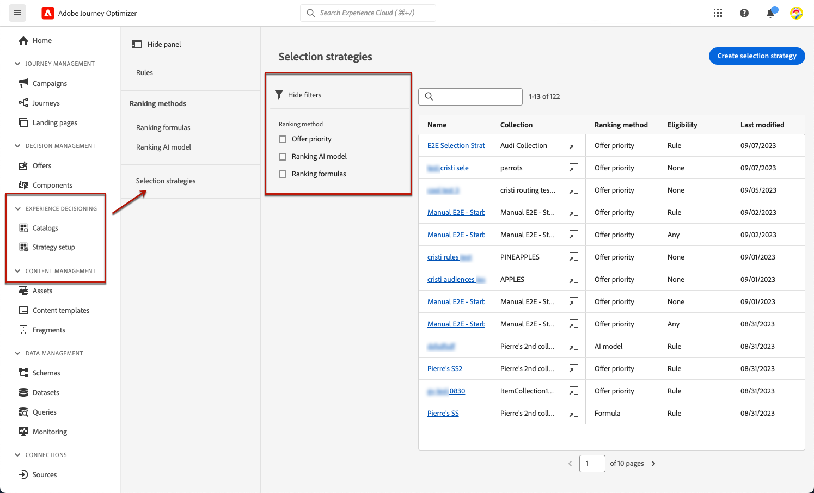

# Criar estratégias de seleção {#selection-strategies}

>[!CONTEXTUALHELP]
>id="ajo_exd_config_strategies"
>title="Defina as estratégias de seleção"
>abstract="Uma estratégia de seleção é um item reutilizável, que consiste em uma coleção associada a uma restrição de elegibilidade e um método de classificação para determinar as ofertas a serem exibidas quando selecionadas em uma política de decisão."
>additional-url="https://experienceleague.adobe.com/docs/journey-optimizer/using/experience-decisioning/create-decision.html?lang=pt-BR" text="Criar políticas de decisão"

>[!CONTEXTUALHELP]
>id="ajo_exd_strategy_eligibility"
>title="Restringir os perfis elegíveis"
>abstract="Você pode restringir a seleção de ofertas para essa estratégia de seleção. Por padrão, todos os perfis são elegíveis, mas você pode usar públicos-alvo ou regras para limitar a seleção de ofertas somente a perfis específicos."
>additional-url="https://experienceleague.adobe.com/docs/journey-optimizer/using/audiences-profiles-identities/audiences/about-audiences.html?lang=pt-BR" text="Usar públicos-alvo"
>additional-url="https://experienceleague.adobe.com/docs/journey-optimizer/using/experience-decisioning/selection/rules.html?lang=pt-BR" text="Usar regras de decisão"

>[!BEGINSHADEBOX]

O que há neste guia de documentação:

* [Introdução ao Offer Decisioning](gs-experience-decisioning.md)
* Gerencie seus itens de decisão
   * [Configurar o catálogo de itens](catalogs.md)
   * [Criar itens de decisão](items.md)
   * [Gerenciar coleções de itens](collections.md)
* Configurar a seleção de itens
   * [Criar regras de decisão](rules.md)
   * [Criar métodos de classificação](ranking.md)
* **[Criar estratégias de seleção](selection-strategies.md)**
* [Criar políticas de decisão](create-decision.md)

>[!ENDSHADEBOX]

Uma estratégia de seleção é um item reutilizável, que consiste em uma coleção associada a uma restrição de qualificação e um método de classificação para determinar as ofertas a serem exibidas quando selecionadas em uma [política de decisão](create-decision.md).

## Acessar e gerenciar estratégias de seleção

1. Ir para **[!UICONTROL Experience Decisioning]** > **[!UICONTROL Configuração]** > **[!UICONTROL Estratégias de seleção]**.

1. Todas as estratégias de seleção criadas até agora estão listadas. Os filtros estão disponíveis para ajudá-lo a recuperar estratégias de acordo com o método de classificação.

   

1. Clique em um nome de estratégia de seleção para editá-lo.

1. A coleção, o método de classificação e a qualificação selecionados para cada estratégia também são exibidos. Você pode clicar no ícone ao lado do nome de cada coleção para editar diretamente uma coleção.

   

## Criar uma estratégia de seleção

Para criar uma estratégia de seleção, siga as etapas abaixo.

1. No **[!UICONTROL Estratégias de seleção]** inventário, clique em **[!UICONTROL Criar estratégia de seleção]**.

   

1. Adicione um nome para a estratégia.

   >[!NOTE]
   >
   >Atualmente, apenas o padrão **[!UICONTROL Ofertas]** catálogo está disponível.

1. Preencha os detalhes para sua estratégia de seleção, começando pelo nome.

   

1. Selecione o [coleção](collections.md) que contém as ofertas a serem consideradas.

1. Use o **[!UICONTROL Elegibilidade]** para restringir a seleção de ofertas para essa estratégia de seleção.

   

   * Para restringir a seleção das ofertas aos membros de um público-alvo do Experience Platform, selecione **[!UICONTROL Públicos-alvo]** e escolha um público na lista. [Saiba como trabalhar com públicos](../audience/about-audiences.md)

   * Se quiser adicionar uma restrição de seleção com uma regra de decisão, use o **[!UICONTROL Regra de decisão]** e selecione a regra de sua escolha. [Saiba como criar uma regra](rules.md)

1. Defina o método de classificação que deseja usar para selecionar a melhor oferta para cada perfil. [Saiba mais](#select-ranking-method)

   

   * Por padrão, se várias ofertas forem qualificadas para essa estratégia, a variável [Prioridade da oferta](#offer-priority) O método usa o valor definido nas ofertas.

   * Se quiser usar uma pontuação calculada específica para escolher qual oferta qualificada fornecer, selecione [Fórmula](#ranking-formula) ou [Modelo de IA](#ai-ranking).

1. Clique em **[!UICONTROL Criar]**. Agora ele está pronto para ser usado em um [decisão](create-decision.md)

## Selecionar um método de classificação {#select-ranking-method}

>[!CONTEXTUALHELP]
>id="ajo_exd_strategy_ranking"
>title="Definir como classificar ofertas"
>abstract="Se várias ofertas são elegíveis para uma determinada estratégia de seleção, escolha o método que selecionará a melhor oferta para cada perfil ao criar uma estratégia de seleção: prioridade ou fórmula de classificação."
>additional-url="https://experienceleague.adobe.com/docs/journey-optimizer/using/experience-decisioning/create-decision.html?lang=pt-BR" text="Criar políticas de decisão"

Se várias ofertas estiverem qualificadas para uma determinada estratégia de seleção, você poderá escolher o método que selecionará a melhor oferta para cada perfil ao criar uma estratégia de seleção. Você pode classificar ofertas por:

* [Prioridade da oferta](#offer-priority)
* [Fórmula](#ranking-formula)
* [Classificação de IA](#ai-ranking)

### Prioridade da oferta {#offer-priority}

Por padrão, quando várias ofertas são qualificadas para uma determinada inserção em uma decisão, os itens com a maior **prioridade** será entregue aos clientes primeiro.

As pontuações de prioridade de ofertas são atribuídas ao criar um [item de decisão](items.md).

### Fórmula de classificação {#ranking-formula}

Além da prioridade de oferta, o Journey Optimizer permite criar **fórmulas de classificação**. Essas fórmulas determinam qual oferta deve ser apresentada primeiro para determinada inserção, em vez de considerar as pontuações de prioridade das ofertas.

Por exemplo, você pode aumentar a prioridade de todas as ofertas em que a data de término for inferior a 24 horas a partir de agora ou impulsionar ofertas da categoria &quot;em execução&quot; se o ponto de interesse do perfil for &quot;em execução&quot;. Saiba como criar uma fórmula de classificação no [nesta seção](ranking.md).

Depois de criada, é possível usar essa fórmula em uma estratégia de seleção. Se várias ofertas estiverem qualificadas para serem apresentadas ao usar essa estratégia de seleção, a decisão usará a fórmula selecionada para calcular qual oferta entregar primeiro.

### Classificação de IA {#ai-ranking}

Você também pode usar um sistema de modelo treinado que classifica automaticamente as ofertas para exibição em determinado perfil ao selecionar um modelo de IA. Saiba como criar um modelo de IA no [nesta seção](ranking.md).

Depois que um modelo de IA é criado, você pode usá-lo em uma estratégia de seleção. Se várias ofertas forem qualificadas, o sistema de modelo treinado determinará qual oferta deve ser apresentada primeiro para essa estratégia de seleção.
