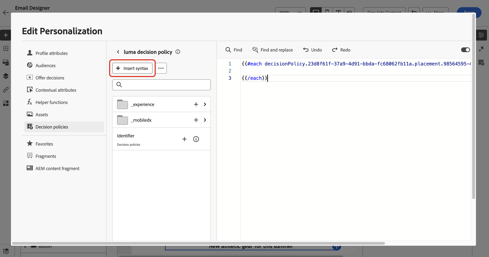
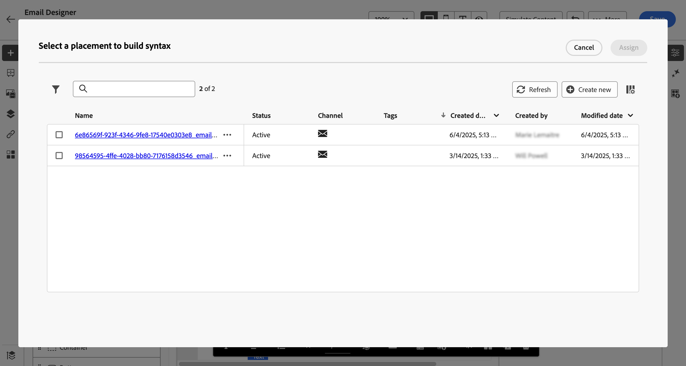
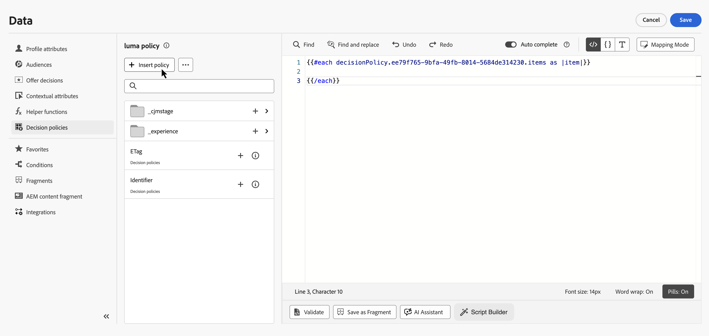
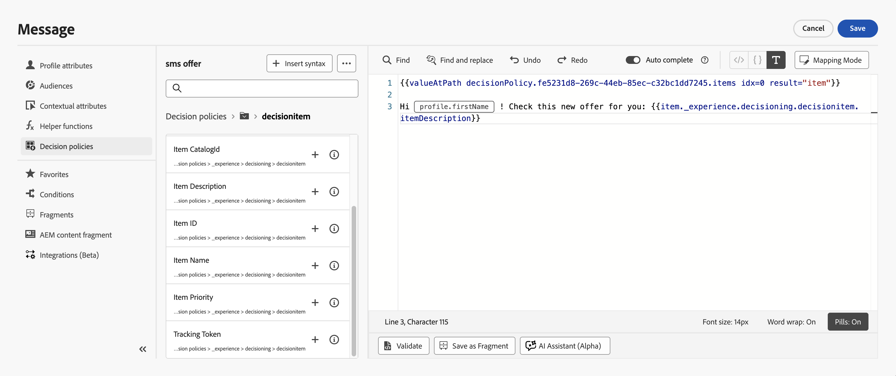

# Usar políticas de decisão em mensagens {#create-decision}

Depois de adicionar uma política de decisão ao conteúdo, você pode usar atributos de itens de decisão retornados para personalização. Para fazer isso, primeiro insira o código da política de decisão no seu conteúdo.

>[!CAUTION]
>
>As políticas de decisão estão disponíveis a todos os clientes para os canais **Experiência baseada em código**, **Email**, **SMS**, **Notificação por push** e **Correspondência direta**.

## Inserir o código de política de decisão {#insert}

>[!BEGINTABS]

>[!TAB Experiência baseada em código]

1. Edite sua experiência baseada em código e navegue até a **[!UICONTROL Política de decisão]**.

2. Selecione **[!UICONTROL Inserir política]** para adicionar o código de política de decisão.

   

>[!NOTE]
>
>Para experiências baseadas em código, se a política de decisão contiver itens de decisão, incluindo fragmentos, você poderá aproveitar esses fragmentos no código de política de decisão. [Saiba como aproveitar fragmentos](fragments-decision-policies.md)

>[!TAB Email]

1. Abra o **Editor do Personalization** e navegue até **[!UICONTROL Políticas de decisão]**.

2. Selecione **[!UICONTROL Inserir sintaxe]** para adicionar o código da política de decisão.

   

   >[!NOTE]
   >
   >Se a opção de inserção não for exibida, talvez uma política de decisão já esteja configurada para o componente principal.

3. Se nenhum posicionamento tiver sido atribuído ainda ao componente, selecione um na lista e clique em **[!UICONTROL Atribuir]**.

   

   >[!NOTE]
   >
   >Se você usar várias políticas de decisão no mesmo email (por exemplo, uma para o cabeçalho e outra para o rodapé), a mesma oferta será desduplicada entre os posicionamentos: não é renderizada duas vezes. A segunda política de decisão não retornará nenhum conteúdo e exibirá um espaço em branco, a menos que você tenha configurado uma oferta de fallback, nesse caso, o fallback será exibido.

Você também pode inserir o código da política de decisão ao usar o **[!UICONTROL Código seu próprio]** no Designer de email. Navegue até **[!UICONTROL Políticas de decisão]** e selecione **[!UICONTROL Inserir sintaxe]** — a interface de seleção de posicionamento será exibida para que você possa atribuir um posicionamento diretamente. [Saiba como codificar seu próprio conteúdo de email](../email/code-content.md).

>[!AVAILABILITY]
>
>A inserção de políticas de decisão no **[!UICONTROL Codifique o seu próprio modo]** está com a Disponibilidade Limitada.

>[!NOTE]
>
>No modo **[!UICONTROL Codifique você mesmo]**, somente um item de decisão pode ser retornado por política, pois o componente **[!UICONTROL Grade de Repetição]** não está disponível.

>[!TAB SMS]

1. Abra o **Editor do Personalization** e navegue até **[!UICONTROL Políticas de decisão]**.

2. Selecione **[!UICONTROL Inserir sintaxe]** para adicionar o código da política de decisão.

   

>[!TAB Push]

1. Abra o **Editor do Personalization** e navegue até **[!UICONTROL Políticas de decisão]**.

2. Selecione **[!UICONTROL Inserir sintaxe]** para adicionar o código da política de decisão.

   

>[!IMPORTANT]
>
>O Experience Decisioning com notificações por push requer uma versão específica do Mobile SDK. Antes de implementar este recurso, verifique as [notas de versão](https://developer.adobe.com/client-sdks/home/release-notes){target="_blank"} para identificar a versão necessária e se você atualizou adequadamente. Você também pode exibir todas as versões do SDK disponíveis para sua plataforma [nesta seção](https://developer.adobe.com/client-sdks/home/current-sdk-versions){target="_blank"}.

>[!TAB Correspondência direta]

1. Na configuração do arquivo de extração, abra o **Personalization Editor** (por exemplo, no campo **[!UICONTROL Dados]** de uma coluna).

2. Navegue até **[!UICONTROL Políticas de decisão]** e selecione **[!UICONTROL Inserir política]** para adicionar o código da sua política de decisão.

   

3. Use os atributos do item de decisão retornado como dados da coluna para que as informações da oferta selecionada sejam incluídas no arquivo de extração de cada perfil.

>[!ENDTABS]

O código de política de decisão é adicionado. Agora você pode usar atributos dos itens de decisão retornados para personalizar seu conteúdo.

>[!NOTE]
>
>Para canais de experiência baseada em código, email e correspondência direta, repita essa sequência uma vez por item de decisão que deseja retornar. Por exemplo, se você optou por retornar 2 itens ao [criar a decisão](create-decision-policy.md), repita a sequência duas vezes. Para canais SMS e Push, somente um item de decisão pode ser retornado.

## Personalizar com atributos de item de decisão {#attributes}

Depois de ter adicionado o código de uma política de decisão em seu conteúdo, todos os atributos dos itens de decisão retornados ficam disponíveis para personalização. [Saiba como trabalhar com personalização](../personalization/personalize.md).

Os atributos são armazenados no [esquema de catálogo](catalogs.md) de &quot;Ofertas&quot;. Eles são exibidos nas seguintes pastas do editor de personalização:
* **Atributos personalizados**: `_\<imsOrg\>` pasta
* **Atributos padrão**: `_experience` pasta

Atributos de item de decisão e atributos contextuais não são suportados por padrão em fragmentos [!DNL Journey Optimizer]. No entanto, você pode usar variáveis globais, conforme descrito abaixo.

Para adicionar um atributo, clique no ícone **`+`** ao lado do atributo. Você pode adicionar quantos atributos forem necessários. Você também pode incluir outros atributos de personalização, como dados de perfil.

* Para os canais **Email**, **Code-based** e **Direct Mail**, coloque os atributos entre o loop `#each` usando colchetes `[ ]` e adicione uma vírgula antes de fechar a marca `/each`.

  +++Veja o exemplo

  

  +++

* Para canais **SMS** e **Push**, insira atributos após o código de sintaxe da política de decisão. Essa sintaxe deve ser sempre mantida na linha 1.

  +++Veja o exemplo

  

  +++

  >[!NOTE]
  >Se você inserir um atributo de ativo de imagem no conteúdo de SMS ou Push (por exemplo, no título ou no corpo), o valor do atributo será exibido como um URL. A própria imagem não é renderizada nesses campos.

* Para habilitar o rastreamento de item de decisão, adicione o atributo `trackingToken`: `trackingToken: {{item._experience.decisioning.decisionitem.trackingToken}}`

## Visualizar e testar o conteúdo

Depois de criar o conteúdo, visualize-o e teste-o antes de ativar a jornada ou campanha. Os itens de decisão são renderizados com base nos perfis selecionados na interface de simulação. [Saiba como visualizar e testar o conteúdo](../content-management/preview-test.md).

## Próximas etapas {#final-steps}

Quando o conteúdo estiver pronto, revise e publique sua campanha ou jornada:

* [Publicar uma jornada](../building-journeys/publish-journey.md)
* [Revisar e ativar uma campanha](../campaigns/review-activate-campaign.md)

Para experiências baseadas em código, assim que o desenvolvedor fizer uma chamada de API ou SDK para buscar conteúdo para a superfície definida na configuração do canal, as alterações serão aplicadas à página da Web ou aplicativo.

## Exibir detalhes da política de decisão do resumo da campanha {#decision-policy-summary}

Quando uma ação ou uma [campanha](../campaigns/get-started-with-campaigns.md) acionada por API usa políticas de decisão em seu conteúdo, a página de resumo da campanha exibe uma seção **[!UICONTROL Políticas de decisão]** listando todas as políticas usadas na campanha.

Você também pode acessar os detalhes técnicos de cada política de decisão e copiá-los para a área de transferência, o que pode ser útil para solucionar problemas com o Suporte da Adobe ou com sua equipe de engenharia.

+++ Para acessar os detalhes da política de decisão e as informações técnicas, siga as etapas abaixo.

1. Abra o resumo da campanha clicando em **[!UICONTROL Revisar para ativar]** durante [configuração](../campaigns/review-activate-campaign.md#action-campaign-review) ou abrindo uma campanha da lista **[!UICONTROL Campanhas]**.

1. Na seção **[!UICONTROL Políticas de decisão]**, todas as políticas usadas na campanha são listadas.

   

1. Selecione uma política de decisão ou clique em **[!UICONTROL Exibir tudo]**. É possível revisar os detalhes de cada política, incluindo:

   * As estratégias usadas na política de decisão
   * O número de itens a serem retornados
   * A coleção, o método de classificação e as regras de qualificação usados para cada estratégia de seleção
   * A oferta substituta usada se nenhum item de decisão for qualificado

   

1. Clique em uma coleção para exibir todos os itens de decisão que ela contém.

1. Clique em um item de decisão para acessar seus detalhes e editá-los se necessário. Ele será aberto em uma nova guia do navegador. Como alternativa, clique em **[!UICONTROL Exibir item]** para exibir itens de decisão que não estão em uma coleção.

   

1. Você também pode exibir informações sobre os métodos de classificação e as regras de qualificação usadas para cada estratégia de seleção.

   {width="80%"}

1. De volta ao resumo da campanha, você também pode selecionar uma política de decisão na seção **[!UICONTROL Ações]** e clicar no ícone **Informações** para acessar os detalhes técnicos da política de decisão.

   

1. Clique no ícone **Copiar para a área de transferência** para copiar uma representação JSON da política de decisão para a área de transferência.

   O JSON copiado inclui o nome e a ID da organização, o nome da sandbox, a ID da política de decisão e a estrutura completa da política de decisão. Você pode compartilhar essas informações com o Suporte da Adobe ou com sua equipe de engenharia para solucionar problemas de políticas de decisão com mais rapidez.

+++

## Usar painéis de relatórios

Para ver o desempenho de suas decisões, você pode visualizar métricas de decisão prontas para uso no relatório de campanha ou jornada ou criar painéis personalizados do Customer Journey Analytics para medir o desempenho e obter insights sobre como as políticas e ofertas de decisão são fornecidas e envolvidas. [Saiba mais sobre os relatórios de decisão](cja-reporting.md).

