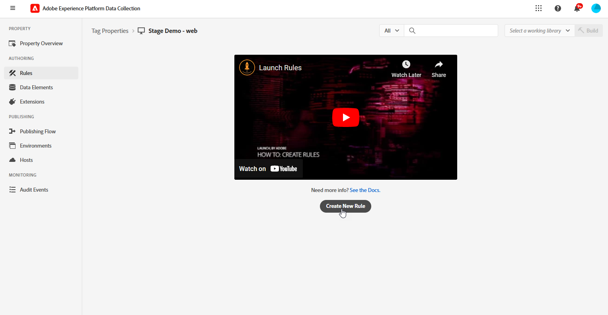
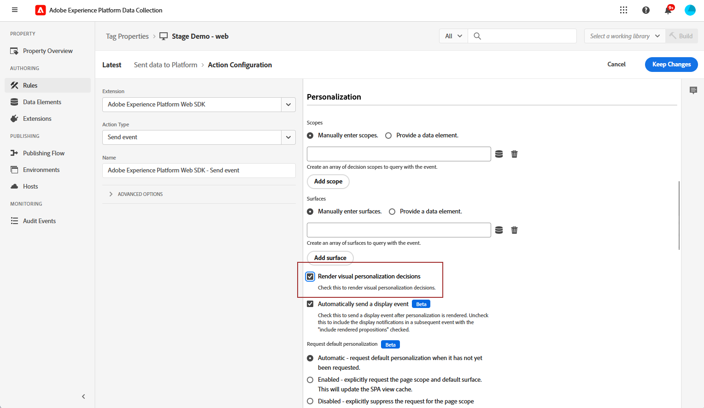

# Configurar o canal da Web no aplicativo {#configure-in-app-web}

## Pré-requisitos {#prerequisites}

* Verifique se você está usando a versão mais recente da sua extensão do **Adobe Experience Platform Web SDK**.

* Instale a extensão **Adobe Experience Platform Web SDK** nas **Propriedades da marca** e habilite a opção **Armazenamento da Personalization**.

  Essa configuração é essencial para armazenar históricos de eventos no cliente, um pré-requisito para a implementação de Regras de frequência no construtor de regras. [Saiba mais](https://experienceleague.adobe.com/docs/experience-platform/tags/extensions/client/web-sdk/web-sdk-extension-configuration.html?lang=pt-BR)

  

## Configurar regra Enviar dados para plataforma {#configure-sent-data-trigger}

1. Acesse a instância da **Coleção de Dados da Adobe Experience Platform** e navegue até as **Propriedades da Marca** configuradas com a extensão **Adobe Experience Platform Web SDK**.

1. No menu **Criação**, selecione **Regras** e **Criar nova regra** ou **Adicionar regra**.

   

1. Na seção **Eventos**, clique em **Adicionar** e configure-a da seguinte maneira:

   * **Extensão**: principal

   * **Tipo De Evento**: Biblioteca Carregada (Início Da Página).

   

1. Clique em **Manter alterações** para salvar a configuração do Evento.

1. Na seção **Actions**, clique em **Add** e configure-a da seguinte maneira:

   * **Extensão**: Adobe Experience Platform Web SDK

   * **Tipo de ação**: enviar evento

   

1. Na seção **Personalization** do seu tipo **Ação**, habilite a opção **Renderizar decisões de personalização visual**.

   

1. Na seção **Contexto de Decisão**, defina os pares **Chave** e **Valor** que determinam qual experiência fornecer.

   

1. Salve sua configuração de **Ação** clicando em **Manter alterações**.

1. Navegue até o menu **Fluxo de publicação**. Crie uma nova **Biblioteca** ou selecione uma **Biblioteca** existente e adicione a **Regra** recém-criada a ela. [Saiba mais](https://experienceleague.adobe.com/docs/experience-platform/tags/publish/libraries.html?lang=pt-BR#create-a-library)

1. Na sua **Biblioteca**, selecione **Salvar e criar no desenvolvimento**.

   

## Configurar regra manual {#configure-manual-trigger}

1. Acesse a instância da **Coleção de Dados da Adobe Experience Platform** e navegue até as **Propriedades da Marca** configuradas com a extensão **Adobe Experience Platform Web SDK**.

1. No menu **Criação**, selecione **Regras** e **Criar nova regra** ou **Adicionar regra**.

   

1. Na seção **Eventos**, clique em **Adicionar** e configure-a da seguinte maneira:

   * **Extensão**: principal

   * **Tipo de evento**: clique

   

1. Na **Configuração de clique**, defina o **Seletor** que será avaliado.

   

1. Clique em **Manter alterações** para salvar a configuração de **Evento**.

1. Na seção **Actions**, clique em **Add** e configure-a da seguinte maneira:

   * **Extensão**: Adobe Experience Platform Web SDK

   * **Tipo de ação**: avaliar conjuntos de regras

   

1. Na seção **Avaliar ação dos conjuntos de regras** do seu tipo de **Ação**, habilite a opção **Renderizar decisões de personalização visual**.

   

1. Na seção **Contexto de Decisão**, defina os pares **Chave** e **Valor** que determinam qual experiência fornecer.

1. Acesse o menu **Fluxo de publicação**, crie uma nova **Biblioteca** ou selecione uma **Biblioteca** existente e adicione sua **Regra** recém-criada. [Saiba mais](https://experienceleague.adobe.com/docs/experience-platform/tags/publish/libraries.html?lang=pt-BR#create-a-library)

1. Na sua **Biblioteca**, selecione **Salvar e criar no desenvolvimento**.

   

## Criar uma configuração da Web no aplicativo {#in-app-config}

1. Acesse o menu **[!UICONTROL Canais]** > **[!UICONTROL Configurações gerais]** > **[!UICONTROL Configurações de canal]** e clique em **[!UICONTROL Criar configuração de canal]**.

   

1. Insira um nome e uma descrição (opcional) para a configuração e selecione o canal a ser configurado.

   >[!NOTE]
   >
   > Os nomes devem começar com uma letra (A-Z). Ele só pode conter caracteres alfanuméricos. Também é possível usar os caracteres de sublinhado `_`, ponto `.` e hífen `-`.

1. Para atribuir rótulos de uso de dados personalizados ou de núcleo à configuração, você pode selecionar **[!UICONTROL Gerenciar acesso]**. [Saiba mais sobre o OLAC (Controle de Acesso em Nível de Objeto)](../administration/object-based-access.md).

1. Selecione **[!UICONTROL Ação de marketing]**(s) para associar políticas de consentimento às mensagens que usam essa configuração. Todas as políticas de consentimento associadas à ação de marketing são utilizadas para respeitar as preferências dos clientes. [Saiba mais](../action/consent.md#surface-marketing-actions)

1. Selecione o canal **Mensagens no aplicativo**.

1. Defina uma configuração de aplicativo. Você tem duas opções para fazer alterações:

   * Você pode inserir uma **[!UICONTROL URL da página]** para aplicar alterações a uma página específica.

   * É possível criar uma regra para direcionar vários URLs que seguem o mesmo padrão.

+++ Como criar uma regra de correspondência de Páginas.

      1. Selecione **[!UICONTROL Regra de correspondência de páginas]** como configuração de aplicativo e insira sua **[!UICONTROL URL da página]**.

      1. Na janela **[!UICONTROL Editar regra de configuração]**, defina seus critérios para os campos **[!UICONTROL Domínio]** e **[!UICONTROL Página]**.
      1. Nos menus suspensos de condição, personalize ainda mais seus critérios.

         Aqui, por exemplo, para editar elementos exibidos em todas as páginas de produtos de vendas do site Luma, selecione Domínio > Começa com > Luma e Página > Contém > vendas.

         

      1. Clique em **[!UICONTROL Adicionar outra regra de página]** para criar outra regra, se necessário.

      1. Selecione a **[!UICONTROL URL padrão de criação e visualização]**.

      1. Salve as alterações. A regra é exibida na tela **[!UICONTROL Criar campanha]**.

+++

1. Envie sua configuração da Web no aplicativo.

Agora você pode [criar uma Web no aplicativo](../in-app/create-in-app-web.md) dentro de uma campanha.
