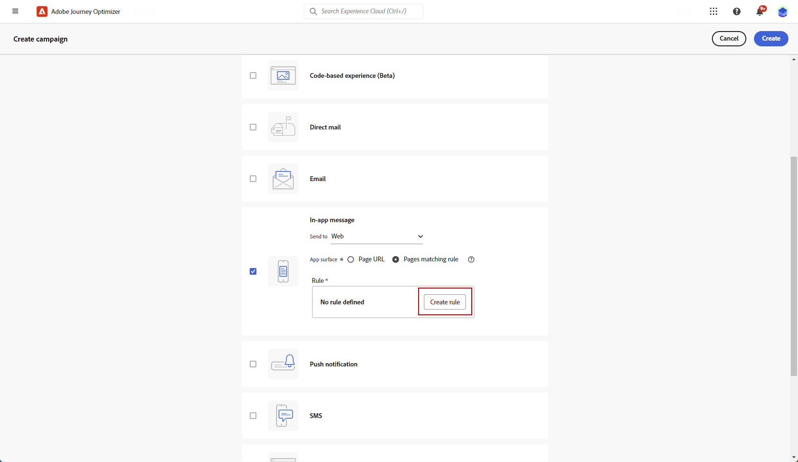
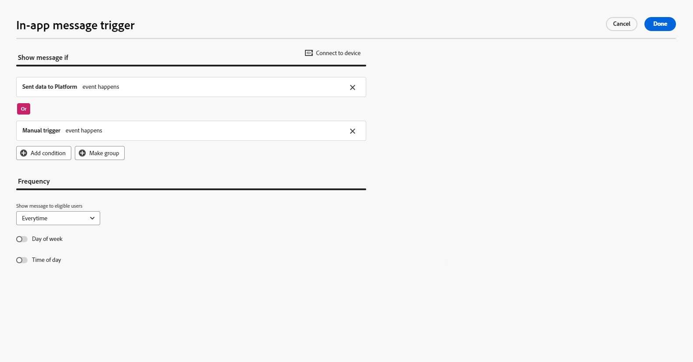

# Criar uma mensagem no aplicativo da Web {#create-in-app-web}

## Configurar o canal da Web no aplicativo {#configure-web-inapp}

Para configurar seu canal no aplicativo da Web, siga as etapas abaixo:

* Instale a extensão de tag do SDK da Web para oferecer suporte a Mensagens no aplicativo da Web. [Saiba mais](https://experienceleague.adobe.com/docs/experience-platform/tags/extensions/client/web-sdk/web-sdk-extension-configuration.html?lang=en)

* Personalize seus acionadores. As mensagens no aplicativo da Web são compatíveis com dois tipos de acionadores: dados enviados para a plataforma e acionadores manuais. [Saiba mais](https://experienceleague.adobe.com/docs/experience-platform/edge/personalization/ajo/web-in-app-messaging.html)

## Criar sua campanha de mensagens no aplicativo da Web {#create-inapp-web-campaign}

1. Acesse o menu **[!UICONTROL Campanhas]** e clique em **[!UICONTROL Criar campanha]**.

1. Na seção **[!UICONTROL Properties]**, selecione quando o tipo de execução da campanha será: Scheduled ou API-trigger. Saiba mais sobre tipos de campanha em [esta página](../campaigns/create-campaign.md#campaigntype).

1. Na seção **[!UICONTROL Ações]**, escolha a **[!UICONTROL mensagem no aplicativo]**. Na lista suspensa **[!UICONTROL Enviar para]**, selecione Web.

   

1. Defina uma superfície do aplicativo. Você tem duas opções para fazer alterações:

   * Você pode inserir uma **[!UICONTROL URL da página]** para aplicar alterações a uma página específica.

   * É possível criar uma regra para direcionar vários URLs que seguem o mesmo padrão.

+++ Como criar uma regra de correspondência de Páginas.

      1. Selecione **[!UICONTROL Páginas que correspondem à regra]** como Superfície do aplicativo.
      1. Clique em **[!UICONTROL Criar regra]**.

         

      1. Na janela **[!UICONTROL Editar regra de superfície]**, defina seus critérios para os campos **[!UICONTROL Domínio]** e **[!UICONTROL Página]**.
      1. Nos menus suspensos de condição, personalize ainda mais seus critérios.

         Aqui, por exemplo, para editar elementos exibidos em todas as páginas de produtos de vendas do site Luma, selecione Domínio > Começa com > Luma e Página > Contém > vendas.

         

      1. Salve as alterações. A regra é exibida na tela **[!UICONTROL Criar campanha]**.

+++

   

1. Após selecionar e configurar a superfície do aplicativo, clique em **[!UICONTROL Criar]**.

## Definir a campanha de mensagens no aplicativo da Web {#configure-inapp}

1. Na seção **[!UICONTROL Propriedades]**, insira as descrições de **[!UICONTROL Título]** e **[!UICONTROL Descrição]**.

1. Para atribuir rótulos de uso de dados personalizados ou principais à mensagem no aplicativo, selecione **[!UICONTROL Gerenciar acesso]**. [Saiba mais](../administration/object-based-access.md).

1. Clique no botão **[!UICONTROL Selecionar público-alvo]** para definir o público-alvo a ser direcionado na lista de públicos-alvo disponíveis do Adobe Experience Platform. [Saiba mais](../audience/about-audiences.md).

   

1. No campo **[!UICONTROL Namespace de identidade]**, escolha o namespace a ser usado para identificar os indivíduos do público selecionado. [Saiba mais](../event/about-creating.md#select-the-namespace).

1. No menu **[!UICONTROL Ação]**, você pode encontrar as configurações definidas anteriormente como **[!UICONTROL Superfície do aplicativo]**. Você pode fazer alterações aqui, se necessário, ou atualizar sua regra clicando em **[!UICONTROL Editar Regra]**.

1. Clique em **[!UICONTROL Criar experimento]** para começar a configurar seu experimento de conteúdo e criar tratamentos para medir seu desempenho e identificar a melhor opção para seu público-alvo. [Saiba mais](../content-management/content-experiment.md)

1. Clique em **[!UICONTROL Editar acionadores]** para escolher o(s) evento(s) e os critérios que acionarão sua mensagem. Os construtores de regras permitem que os usuários especifiquem critérios e valores que, quando atendidos, acionam um conjunto de ações, como o envio de uma mensagem no aplicativo.

   1. Clique na lista suspensa de eventos para alterar o Acionador, se necessário.

      +++Consulte os Acionadores disponíveis.

      | Pacote | Acionador | Definição |
      |---|---|---|
      | Plataforma | Dados enviados para a plataforma | Acionado quando o aplicativo móvel emite um evento de experiência de borda para enviar dados ao Adobe Experience Platform. Normalmente, a chamada de API [sendEvent](https://developer.adobe.com/client-sdks/documentation/edge-network/api-reference/#sendevent) da extensão do AEP Edge. |
      | Manual | Acionador manual | Dois elementos de dados associados: uma chave, que é uma constante que define o conjunto de dados (por exemplo, gênero, cor, preço), e um valor, que é uma variável que pertence ao conjunto (por exemplo, masculino/feminino, verde, 100). |

+++

   1. Clique em **[!UICONTROL Adicionar condição]** se desejar que o gatilho considere vários eventos ou critérios.

   1. Escolha a condição **[!UICONTROL Or]** se quiser adicionar mais **[!UICONTROL Triggers]** para expandir ainda mais sua regra.

      

   1. Escolha a condição **[!UICONTROL And]** se quiser adicionar uma **[!UICONTROL Característica]** personalizada e ajustar melhor sua regra.

      +++Consulte as Características disponíveis.

      | Pacote | Traço | Definição |
      |---|---|---|
      | Plataforma | Tipo de evento XDM | Disparado quando o tipo de evento especificado é atendido. |
      | Plataforma | Valor do XDM | Acionado quando o valor XDM especificado é atendido. |
+++

      

   1. Clique em **[!UICONTROL Criar grupo]** para agrupar acionadores.

1. Escolha a frequência do acionador quando a mensagem no aplicativo estiver ativa. As opções disponíveis são as seguintes:

   * **[!UICONTROL A cada]**: sempre mostrar a mensagem quando os eventos selecionados no menu suspenso **[!UICONTROL Acionador do aplicativo móvel]** ocorrerem.
   * **[!UICONTROL Uma vez]**: mostrar esta mensagem somente na primeira vez que os eventos selecionados no menu suspenso **[!UICONTROL Acionador do aplicativo móvel]** ocorrerem.
   * **[!UICONTROL Até clicar]**: mostrar esta mensagem quando os eventos selecionados no menu suspenso **[!UICONTROL Acionador do aplicativo móvel]** ocorrerem até que um evento de interação seja enviado pelo SDK com uma ação de &quot;clicado&quot;.
   * **[!UICONTROL X número de vezes]**: mostrar esta mensagem X vez.

1. Se necessário, escolha qual **[!UICONTROL Dia da semana]** ou **[!UICONTROL Hora do dia]** a mensagem no aplicativo será exibida.

1. As campanhas são projetadas para serem executadas em uma data específica ou em uma frequência recorrente. Saiba como configurar o **[!UICONTROL Cronograma]** da sua campanha no [nesta seção](../campaigns/create-campaign.md#schedule).

   

1. Agora você pode começar a criar seu conteúdo com o botão **[!UICONTROL Editar conteúdo]**. [Saiba mais](design-in-app.md)

   

**Tópicos relacionados:**

* [Teste e envie sua mensagem no aplicativo](send-in-app.md)
* [Relatório no aplicativo](../reports/campaign-global-report.md#inapp-report)
* [Configuração no aplicativo](inapp-configuration.md)
