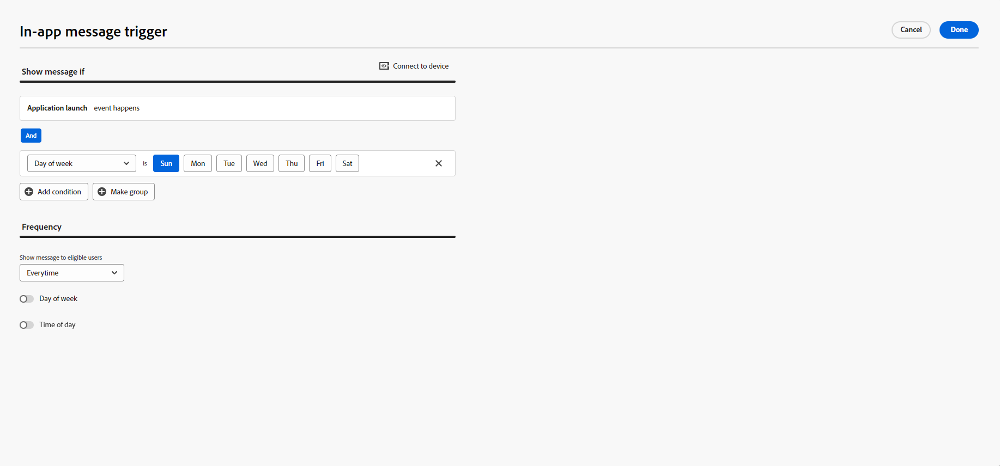

# Criação de uma mensagem no aplicativo {#create-in-app}

>[!CONTEXTUALHELP]
>id="ajo_campaigns_inapp_triggers"
>title="Gerenciar acionadores no aplicativo"
>abstract="Controle os acionadores com eficiência selecionando os eventos e critérios específicos que ativarão as mensagens. O construtor de regras permite definir condições e valores precisos. Quando essas condições são atendidas, elas iniciam uma série de ações, incluindo a entrega de mensagens no aplicativo."

Você pode adicionar uma mensagem no aplicativo em uma campanha ou em uma jornada. Siga as etapas detalhadas abaixo para criar uma mensagem no aplicativo em ambos os contextos.

Observe que as mensagens no aplicativo não são afetadas pela escolha do usuário de aceitar ou recusar as notificações por push no sistema operacional.

>[!BEGINTABS]

>[!TAB Adicionar uma mensagem no aplicativo a uma jornada]

Para adicionar uma mensagem no aplicativo em uma jornada, siga estas etapas:

1. Abra a jornada e arraste e solte uma atividade **[!UICONTROL No aplicativo]** da seção **[!UICONTROL Ações]** da paleta.

   Quando um perfil atinge o fim da jornada, todas as mensagens no aplicativo exibidas para ele expiram automaticamente. Por esse motivo, uma atividade Wait é adicionada automaticamente após a atividade no aplicativo para garantir o tempo adequado.

   

1. Insira um **[!UICONTROL Rótulo]** e uma **[!UICONTROL Descrição]** para a mensagem.

1. Escolha sua [Configuração no aplicativo](inapp-configuration.md#channel-prerequisites) para usar.

   

1. Agora você pode começar a criar seu conteúdo com o botão **[!UICONTROL Editar conteúdo]**. [Saiba mais](design-in-app.md)

1. Clique em **[!UICONTROL Editar acionadores]** para escolher o(s) evento(s) e os critérios que acionarão sua mensagem. Os construtores de regras permitem que os usuários especifiquem critérios e valores que, quando atendidos, acionam um conjunto de ações, como o envio de uma mensagem no aplicativo.

   

   1. Clique na lista suspensa de eventos para alterar o Acionador, se necessário.

      +++Consulte os Acionadores disponíveis.

      | Pacote | Acionador | Definição |
      |---|---|---|
      | Enviar dados para a Platform | Dados enviados para a plataforma | Acionado quando o aplicativo móvel emite um evento de experiência de borda para enviar dados ao Adobe Experience Platform. Normalmente, a chamada de API [sendEvent](https://developer.adobe.com/client-sdks/documentation/edge-network/api-reference/#sendevent) da extensão do AEP Edge. |
      | Rastreamento principal | Rastrear ação | Acionado quando a funcionalidade herdada oferecida na API de código móvel [trackAction](https://developer.adobe.com/client-sdks/documentation/mobile-core/api-reference/#trackaction) é chamada. |
      | Rastreamento principal | Rastrear estado | Acionado quando a funcionalidade herdada oferecida na API de código móvel [trackState](https://developer.adobe.com/client-sdks/documentation/mobile-core/api-reference/#trackstate) é chamada. |
      | Rastreamento principal | Coletar PII | Acionado quando a funcionalidade herdada oferecida na API de código móvel [collectPII](https://developer.adobe.com/client-sdks/documentation/mobile-core/api-reference/#collectpii) é chamada. |
      | Ciclo de vida do aplicativo | Inicialização do aplicativo | Acionadas a cada execução, incluindo falhas e instalações. Também é acionado em um resumo do plano de fundo quando o tempo limite da sessão do ciclo de vida é excedido. |
      | Ciclo de vida do aplicativo | Instalação do aplicativo | Disparado na primeira execução após a instalação ou reinstalação. |
      | Ciclo de vida do aplicativo | Atualização de aplicativo | Disparado na primeira execução após uma atualização ou quando o número da versão é alterado. |
      | Ciclo de vida do aplicativo | Fechamento do aplicativo | Disparado quando o aplicativo é fechado. |
      | Ciclo de vida do aplicativo | Falha de aplicativo | Disparado quando o aplicativo não estiver em segundo plano antes do fechamento. O evento é enviado quando o aplicativo é iniciado após a falha. O relatório de falha do Adobe Mobile não implementa um gerenciador de exceção global não detectado. |
      | Places | Inserir POI | Acionado pela SDK do Places quando o cliente insere o Ponto de interesse (POI) que você configurou. |
      | Places | POI de saída | Acionado pela SDK do Places quando o cliente sair do ponto de interesse (POI) que você configurou. |

+++

   1. Clique em **[!UICONTROL Adicionar condição]** se desejar que o gatilho considere vários eventos ou critérios.

   1. Escolha a condição **[!UICONTROL Or]** se quiser adicionar mais **[!UICONTROL Triggers]** para expandir ainda mais sua regra.

      

   1. Escolha a condição **[!UICONTROL And]** se desejar adicionar **[!UICONTROL Características]** e ajustar melhor sua regra.

      +++Consulte as Características disponíveis.

      | Pacote | Traços | Definição |
      |---|---|---|
      | Informações do dispositivo | Nome da operadora | Acionado quando um dos nomes da operadora da lista é atendido. |
      | Informações do dispositivo | Nome do dispositivo | Acionado quando um dos nomes do dispositivo é atendido. |
      | Informações do dispositivo | Localidade | Acionado quando um dos idiomas da lista é atendido. |
      | Informações do dispositivo | Versão do sistema operacional | Disparado quando uma das versões do sistema operacional especificadas é atendida. |
      | Informações do dispositivo | Versão anterior do sistema operacional | Disparado quando uma das versões anteriores do sistema operacional é atendida. |
      | Informações do dispositivo | Modo de execução | Acionado se o modo Executar for aplicativo ou extensão. |
      | Ciclo de vida do aplicativo | ID do aplicativo | Acionado quando a ID do aplicativo especificada é atendida. |
      | Ciclo de vida do aplicativo | Dia da semana | Acionado quando o dia da semana especificado é atendido. |
      | Ciclo de vida do aplicativo | Dia desde a primeira visita | Disparado quando o número especificado de dias desde a primeira utilização é atingido. |
      | Ciclo de vida do aplicativo | Dia desde a última visita | Disparado quando o número especificado de dias desde a última utilização é atingido. |
      | Ciclo de vida do aplicativo | Dia desde a atualização | Disparado quando o número especificado de dias desde a última atualização é atingido. |
      | Ciclo de vida do aplicativo | Data de instalação | Disparado quando a data de instalação especificada é atingida. |
      | Ciclo de vida do aplicativo | Lançamentos | Disparado quando o número especificado de inicializações é atingido. |
      | Ciclo de vida do aplicativo | Hora do dia | Disparado quando o horário especificado é cumprido. |
      | Places | POI atual | Acionado pela SDK do Places quando o cliente insere o Ponto de interesse (POI) especificado. |
      | Places | Último POI inserido | Acionado pelo Places SDK, dependendo do último Ponto de interesse (POI) inserido pelo cliente. |
      | Places | Último POI de saída | Acionado pelo Places SDK, dependendo do último Ponto de interesse (POI) encerrado pelo cliente. |

+++

      

   1. Clique em **[!UICONTROL Criar grupo]** para agrupar acionadores.

      

   1. Escolha a frequência do acionador quando a mensagem no aplicativo estiver ativa:

      * **[!UICONTROL Mostrar sempre]**: sempre mostrar a mensagem quando os eventos selecionados no menu suspenso **[!UICONTROL Acionador do aplicativo móvel]** ocorrerem.
      * **[!UICONTROL Mostrar uma vez]**: mostrar esta mensagem somente na primeira vez que os eventos selecionados no menu suspenso **[!UICONTROL Acionador do aplicativo móvel]** ocorrerem.
      * **[!UICONTROL Mostrar até clicar]**: mostra esta mensagem quando os eventos selecionados no menu suspenso **[!UICONTROL Acionador do aplicativo móvel]** ocorrerem até que um evento de interação seja enviado pela SDK com uma ação de &quot;clicado&quot;.

1. Se necessário, conclua o fluxo de jornada arrastando e soltando ações ou eventos adicionais. [Saiba mais](../building-journeys/about-journey-activities.md)

1. Quando a mensagem no aplicativo estiver pronta, finalize a configuração e publique sua jornada para ativá-la.

Para obter mais informações sobre como configurar uma jornada, consulte [esta página](../building-journeys/journey-gs.md).

>[!NOTE]
>
>Se quiser mostrar uma mensagem no aplicativo logo após enviar uma notificação por push, use uma atividade **Wait** para permitir que o tempo de carga da mensagem no aplicativo seja propagado. Normalmente, recomenda-se uma espera de 5 a 15 minutos, mas os tempos exatos podem variar dependendo da complexidade da carga útil e das necessidades de personalização.

>[!TAB Adicionar uma mensagem no aplicativo a uma campanha]

Para adicionar uma mensagem no aplicativo em uma campanha, siga estas etapas:

1. Acesse o menu **[!UICONTROL Campanhas]** e clique em **[!UICONTROL Criar campanha]**.

1. Selecione o tipo de campanha que deseja executar

   * **Agendado - Marketing**: execute a campanha imediatamente ou em uma data especificada. As campanhas programadas são destinadas ao envio de mensagens de marketing. Eles são configurados e executados na interface do usuário do.

   * **Acionado por API - Marketing/Transacional**: execute a campanha usando uma chamada de API. As campanhas acionadas por API destinam-se ao envio de mensagens de marketing ou transacionais, ou seja, mensagens enviadas após uma ação executada por um indivíduo: redefinição de senha, compra de carrinho etc.

1. Na seção **[!UICONTROL Propriedades]**, insira as descrições de **[!UICONTROL Título]** e **[!UICONTROL Descrição]**.

1. Para atribuir rótulos de uso de dados personalizados ou principais à mensagem no aplicativo, selecione **[!UICONTROL Gerenciar acesso]**. [Saiba mais](../administration/object-based-access.md).

1. Clique no botão **[!UICONTROL Selecionar público-alvo]** para definir o público-alvo a ser direcionado na lista de públicos-alvo disponíveis do Adobe Experience Platform. [Saiba mais](../audience/about-audiences.md).

   

1. No campo **[!UICONTROL Namespace de identidade]**, escolha o namespace a ser usado para identificar os indivíduos do público selecionado. [Saiba mais](../event/about-creating.md#select-the-namespace).

1. Na seção **[!UICONTROL Actions]**, escolha a **[!UICONTROL mensagem no aplicativo]** e selecione ou crie uma nova configuração.

   Saiba mais sobre a Configuração no aplicativo [nesta página](inapp-configuration.md).

   

1. Clique em **[!UICONTROL Criar experimento]** para começar a configurar seu experimento de conteúdo e criar tratamentos para medir seu desempenho e identificar a melhor opção para seu público-alvo. [Saiba mais](../content-management/content-experiment.md)

1. Clique em **[!UICONTROL Editar acionadores]** para escolher o(s) evento(s) e os critérios que acionarão sua mensagem. Os construtores de regras permitem que os usuários especifiquem critérios e valores que, quando atendidos, acionam um conjunto de ações, como o envio de uma mensagem no aplicativo.

   1. Clique na lista suspensa de eventos para alterar o Acionador, se necessário.

      +++Consulte os Acionadores disponíveis.

      | Pacote | Acionador | Definição |
      |---|---|---|
      | Enviar dados para a Platform | Dados enviados para a plataforma | Acionado quando o aplicativo móvel emite um evento de experiência de borda para enviar dados ao Adobe Experience Platform. Normalmente, a chamada de API [sendEvent](https://developer.adobe.com/client-sdks/documentation/edge-network/api-reference/#sendevent) da extensão do AEP Edge. |
      | Rastreamento principal | Rastrear ação | Acionado quando a funcionalidade herdada oferecida na API de código móvel [trackAction](https://developer.adobe.com/client-sdks/documentation/mobile-core/api-reference/#trackaction) é chamada. |
      | Rastreamento principal | Rastrear estado | Acionado quando a funcionalidade herdada oferecida na API de código móvel [trackState](https://developer.adobe.com/client-sdks/documentation/mobile-core/api-reference/#trackstate) é chamada. |
      | Rastreamento principal | Coletar PII | Acionado quando a funcionalidade herdada oferecida na API de código móvel [collectPII](https://developer.adobe.com/client-sdks/documentation/mobile-core/api-reference/#collectpii) é chamada. |
      | Ciclo de vida do aplicativo | Inicialização do aplicativo | Acionadas a cada execução, incluindo falhas e instalações. Também é acionado em um resumo do plano de fundo quando o tempo limite da sessão do ciclo de vida é excedido. |
      | Ciclo de vida do aplicativo | Instalação do aplicativo | Disparado na primeira execução após a instalação ou reinstalação. |
      | Ciclo de vida do aplicativo | Atualização de aplicativo | Disparado na primeira execução após uma atualização ou quando o número da versão é alterado. |
      | Ciclo de vida do aplicativo | Fechamento do aplicativo | Disparado quando o aplicativo é fechado. |
      | Ciclo de vida do aplicativo | Falha de aplicativo | Disparado quando o aplicativo não estiver em segundo plano antes do fechamento. O evento é enviado quando o aplicativo é iniciado após a falha. O relatório de falha do Adobe Mobile não implementa um gerenciador de exceção global não detectado. |
      | Places | Inserir POI | Acionado pela SDK do Places quando o cliente insere o Ponto de interesse (POI) que você configurou. |
      | Places | POI de saída | Acionado pela SDK do Places quando o cliente sair do ponto de interesse (POI) que você configurou. |

+++

   1. Clique em **[!UICONTROL Adicionar condição]** se desejar que o gatilho considere vários eventos ou critérios.

   1. Escolha a condição **[!UICONTROL Or]** se quiser adicionar mais **[!UICONTROL Triggers]** para expandir ainda mais sua regra.

      

   1. Escolha a condição **[!UICONTROL And]** se desejar adicionar **[!UICONTROL Características]** e ajustar melhor sua regra.

      +++Consulte as Características disponíveis.

      | Pacote | Traços | Definição |
      |---|---|---|
      | Informações do dispositivo | Nome da operadora | Acionado quando um dos nomes da operadora da lista é atendido. |
      | Informações do dispositivo | Nome do dispositivo | Acionado quando um dos nomes do dispositivo é atendido. |
      | Informações do dispositivo | Localidade | Acionado quando um dos idiomas da lista é atendido. |
      | Informações do dispositivo | Versão do sistema operacional | Disparado quando uma das versões do sistema operacional especificadas é atendida. |
      | Informações do dispositivo | Versão anterior do sistema operacional | Disparado quando uma das versões anteriores do sistema operacional é atendida. |
      | Informações do dispositivo | Modo de execução | Acionado se o modo Executar for aplicativo ou extensão. |
      | Ciclo de vida do aplicativo | ID do aplicativo | Acionado quando a ID do aplicativo especificada é atendida. |
      | Ciclo de vida do aplicativo | Dia da semana | Acionado quando o dia da semana especificado é atendido. |
      | Ciclo de vida do aplicativo | Dia desde a primeira visita | Disparado quando o número especificado de dias desde a primeira utilização é atingido. |
      | Ciclo de vida do aplicativo | Dia desde a última visita | Disparado quando o número especificado de dias desde a última utilização é atingido. |
      | Ciclo de vida do aplicativo | Dia desde a atualização | Disparado quando o número especificado de dias desde a última atualização é atingido. |
      | Ciclo de vida do aplicativo | Data de instalação | Disparado quando a data de instalação especificada é atingida. |
      | Ciclo de vida do aplicativo | Lançamentos | Disparado quando o número especificado de inicializações é atingido. |
      | Ciclo de vida do aplicativo | Hora do dia | Disparado quando o horário especificado é cumprido. |
      | Places | POI atual | Acionado pela SDK do Places quando o cliente insere o Ponto de interesse (POI) especificado. |
      | Places | Último POI inserido | Acionado pelo Places SDK, dependendo do último Ponto de interesse (POI) inserido pelo cliente. |
      | Places | Último POI de saída | Acionado pelo Places SDK, dependendo do último Ponto de interesse (POI) encerrado pelo cliente. |

+++

      

   1. Clique em **[!UICONTROL Criar grupo]** para agrupar acionadores.

1. Escolha a frequência do acionador quando a mensagem no aplicativo estiver ativa. As opções disponíveis são as seguintes:

   * **[!UICONTROL A cada]**: sempre mostrar a mensagem quando os eventos selecionados no menu suspenso **[!UICONTROL Acionador do aplicativo móvel]** ocorrerem.
   * **[!UICONTROL Uma vez]**: mostrar esta mensagem somente na primeira vez que os eventos selecionados no menu suspenso **[!UICONTROL Acionador do aplicativo móvel]** ocorrerem.
   * **[!UICONTROL Até clicar]**: mostrar esta mensagem quando os eventos selecionados no menu suspenso **[!UICONTROL Acionador do aplicativo móvel]** ocorrerem até que um evento de interação seja enviado pela SDK com uma ação de &quot;clicado&quot;.
   * **[!UICONTROL X número de vezes]**: mostrar esta mensagem X vez.

1. Se necessário, escolha qual **[!UICONTROL Dia da semana]** ou **[!UICONTROL Hora do dia]** a mensagem no aplicativo será exibida.

1. As campanhas são projetadas para serem executadas em uma data específica ou em uma frequência recorrente. Saiba como configurar o **[!UICONTROL Cronograma]** da sua campanha no [nesta seção](../campaigns/create-campaign.md#schedule).

   

1. Agora você pode começar a criar seu conteúdo com o botão **[!UICONTROL Editar conteúdo]**. [Saiba mais](design-in-app.md)

   

>[!ENDTABS]

## Vídeos tutoriais{#video}

* O vídeo abaixo mostra como criar, configurar e publicar mensagens no aplicativo em suas campanhas.

  +++Ver vídeo

  >[!VIDEO](https://video.tv.adobe.com/v/3410430?quality=12&learn=on)

+++

* O vídeo abaixo mostra como configurar e analisar experimentos de conteúdo para mensagens no aplicativo de teste A/B.

  +++Ver vídeo

  >[!VIDEO](https://video.tv.adobe.com/v/3419898/?learn=on&autoplay=true)

+++

* O vídeo abaixo mostra como criar uma mensagem no aplicativo em uma jornada e como testar e publicar sua jornada.

  +++Ver vídeo

  >[!VIDEO](https://video.tv.adobe.com/v/3423077/?learn=on&autoplay=true)

+++

**Tópicos relacionados:**

* [Criar mensagem no aplicativo](design-in-app.md)
* [Teste e envie sua mensagem no aplicativo](send-in-app.md)
* [Relatório no aplicativo](../reports/campaign-global-report-cja-inapp.md)
* [Configuração no aplicativo](inapp-configuration.md)