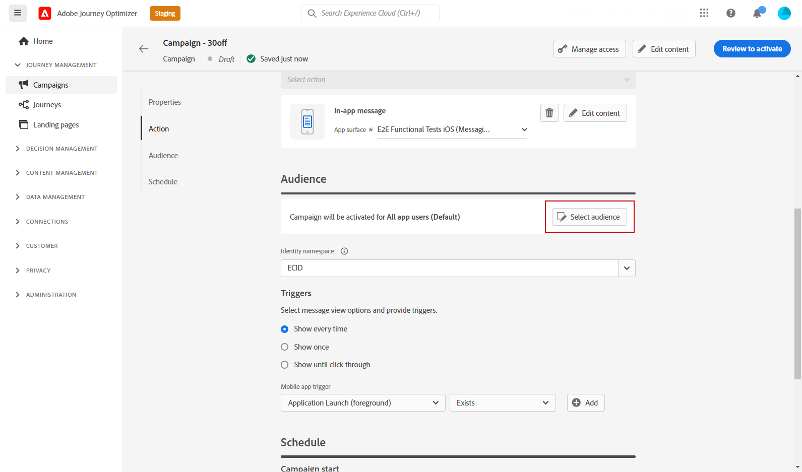

# Criar uma mensagem no aplicativo {#create-in-app}

## Criar uma campanha e uma mensagem no aplicativo{#create-in-app-in-a-campaign}

Para criar uma mensagem no aplicativo, siga as etapas abaixo:

1. Acesse o **[!UICONTROL Campanhas]** , em seguida, clique em **[!UICONTROL Criar campanha]**.

1. No **[!UICONTROL Propriedades]** especifique quando deseja executar a campanha.

1. No **[!UICONTROL Ações]** escolha a **[!UICONTROL Mensagem no aplicativo]** e **[!UICONTROL Superfície do aplicativo]** configurado anteriormente para a mensagem no aplicativo. Em seguida, clique em **[!UICONTROL Criar]**.

   [Saiba mais sobre a configuração no aplicativo](inapp-configuration.md).

   

1. No **[!UICONTROL Propriedades]** edite o **[!UICONTROL Título]** e **[!UICONTROL Descrição]**.

1. Para atribuir rótulos de uso de dados personalizados ou principais à página inicial, selecione **[!UICONTROL Gerenciar acesso]**. [Saiba mais](../administration/object-based-access.md).

1. Clique no botão **[!UICONTROL Seleção do público-alvo]** para definir o público-alvo a ser direcionado a partir da lista de segmentos disponíveis do Adobe Experience Platform. [Saiba mais](../segment/about-segments.md).

   

1. No **[!UICONTROL Namespace de identidade]** , escolha o namespace a ser usado para identificar os indivíduos do segmento selecionado. [Saiba mais](../event/about-creating.md#select-the-namespace).

1. Escolha a frequência do acionador quando a mensagem no aplicativo estiver ativa:

   * **[!UICONTROL Mostrar sempre]**: Sempre mostrar a mensagem quando os eventos selecionados no **[!UICONTROL Acionador do aplicativo móvel]** ocorre.
   * **[!UICONTROL Mostrar uma vez]**: Mostrar esta mensagem somente na primeira vez que os eventos selecionados no **[!UICONTROL Acionador do aplicativo móvel]** ocorre.
   * **[!UICONTROL Mostrar até o click-through]**: Mostrar esta mensagem quando os eventos forem selecionados no **[!UICONTROL Acionador do aplicativo móvel]** ocorre até que um evento de interação seja enviado pelo SDK com uma ação &quot;clicada&quot;.

1. No **[!UICONTROL Acionador do aplicativo móvel]** selecione os eventos e critérios que acionarão sua mensagem:

   1. Na lista suspensa esquerda, selecione o evento necessário para acionar a mensagem.
   1. Na lista suspensa direita, selecione a validação necessária no evento selecionado.
   1. Clique no botão **[!UICONTROL Adicionar]** se desejar que o acionador considere vários eventos ou critérios. Em seguida, repita as etapas acima.
   1. Selecione como seus eventos são vinculados, por exemplo **[!UICONTROL E]** se desejar **both** aciona como true para que uma mensagem seja exibida e **[!UICONTROL Ou]** se quiser que a mensagem seja exibida, se **ou** dos acionadores são verdadeiros.

   

1. Escolha o evento que aciona sua mensagem do **[!UICONTROL Acionador do aplicativo móvel]**
lista suspensa.

   Ao escolher um acionador, você escolhe qual ação do usuário faz com que a mensagem no aplicativo seja exibida.

   

1. As campanhas são projetadas para serem executadas em uma data específica ou em uma frequência recorrente. Saiba como configurar o **[!UICONTROL Agendar]** da sua campanha em [esta seção](../campaigns/create-campaign.md#schedule).

   

1. Agora você pode começar a projetar seu conteúdo com a variável **[!UICONTROL Editar conteúdo]** botão.

   

## Enviar mensagens no aplicativo{#in-app-send}

### Visualizar no dispositivo {#preview-device}

Você pode visualizar a notificação no aplicativo em um dispositivo específico.

1. Clique em **[!UICONTROL Visualizar no dispositivo]**.

   

1. No **[!UICONTROL Conectar-se ao dispositivo]** , clique em **[!UICONTROL Iniciar]**.

1. Digite no **[!UICONTROL URL básica]** do seu aplicativo e clique em **[!UICONTROL Próximo]**.

   

1. Verifique o código QR com seu dispositivo e insira o código PIN exibido.

A mensagem no aplicativo agora pode ser acionada diretamente no dispositivo, permitindo que você visualize e revise a mensagem em um dispositivo real.

### Revisar e ativar sua notificação no aplicativo{#in-app-review}

Depois que a mensagem no aplicativo é criada e o conteúdo é definido e personalizado, é possível revisá-la e ativá-la.

Para fazer isso, siga as etapas abaixo:

1. Use o **[!UICONTROL Revisar para ativar]** para exibir um resumo da mensagem.

   O resumo permite modificar sua campanha, se necessário, e verificar se algum parâmetro está incorreto ou ausente.

   

1. Verifique se a campanha está configurada corretamente e clique em **[!UICONTROL Ativar]**.

Sua campanha agora está ativada. A notificação no aplicativo configurada na campanha é enviada imediatamente ou na data especificada.

Depois de enviado, você pode medir o impacto de suas mensagens no aplicativo no relatório de Campanha. Para obter mais informações sobre relatórios, consulte [esta seção](inapp-report.md).

**Tópicos relacionados:**

* [Criar mensagem no aplicativo](design-in-app.md)
* [Relatório no aplicativo](inapp-report.md)
* [Configuração no aplicativo](inapp-configuration.md)
