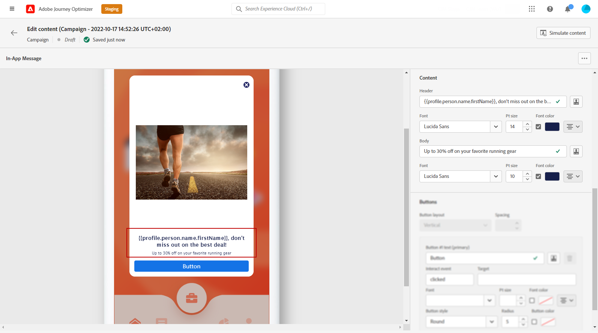
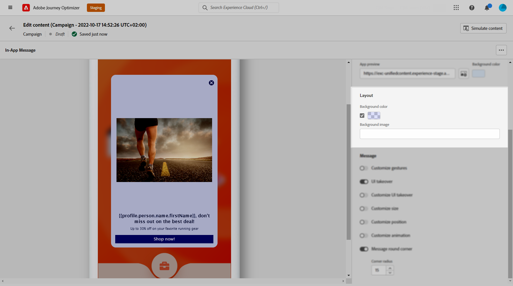

# Projetar o conteúdo no aplicativo {#design-content}

É possível editar o conteúdo no aplicativo para configurar as opções de experiência, incluindo o layout e a exibição da mensagem, o texto e as opções de botão.

Para configurar o conteúdo da mensagem, clique no link **[!UICONTROL Editar conteúdo]** e use as opções na seção à direita da tela para criar o conteúdo da mensagem no aplicativo.

O **[!UICONTROL Formatação avançada]** ativar a alternância ativa opções adicionais para personalizar a experiência.

Depois que a mensagem no aplicativo é criada e o conteúdo é definido e personalizado, é possível revisá-la e ativá-la. As notificações serão enviadas de acordo com o agendamento da campanha. Saiba mais [nesta página](create-in-app.md#in-app-send).

## Layout de mensagem {#message-layout}

No **[!UICONTROL Layout da mensagem]** selecione uma das quatro opções de layout diferentes para escolher, dependendo das suas necessidades de mensagens.

* **[!UICONTROL Tela cheia]**: Esse tipo de layout cobre a tela inteira do dispositivo do público-alvo.

   É compatível com mídias (imagem, vídeo), texto e componentes de botão.

* **[!UICONTROL Modal]**: Esse layout aparece em uma janela grande com estilo de alerta. O aplicativo ainda fica visível em segundo plano.

   É compatível com mídias (imagem, vídeo), texto e componentes de botão.

* **[!UICONTROL Banner]**: Esse tipo de layout é exibido como uma mensagem de alerta de SO nativo.

   Você só pode adicionar uma **[!UICONTROL Cabeçalho]** e **[!UICONTROL Corpo]** à sua mensagem.

* **[!UICONTROL Personalizado]**: O modo de mensagem personalizada permite importar e editar diretamente uma de suas mensagens de HTML pré-configuradas.

   * Selecionar **[!UICONTROL Compor]** para inserir ou colar seu código de HTML bruto.

      Use o painel esquerdo para aproveitar os recursos de personalização do Journey Optimizer. Para obter mais informações, consulte [esta seção](../personalization/personalize.md).

   * Selecionar **[!UICONTROL Importar]** para importar o HTML ou o arquivo .zip contendo o conteúdo do HTML.

## Guia Content {#content-tab}

No **Conteúdo** , é possível definir e personalizar: o conteúdo da notificação e o estilo da **Fechar** botão. Também é possível adicionar uma mídia à notificação no aplicativo e adicionar botões de ação a partir dessa guia.

### Botão Fechar {#close-button}

Escolha a **[!UICONTROL Estilo]** do seu **[!UICONTROL Botão Fechar]**.

Os estilos disponíveis são:

* **[!UICONTROL Simples]**
* **[!UICONTROL Círculo]**
* **[!UICONTROL Imagem personalizada]** de um URL de mídia ou seus ativos.

+++Mais opções com formatação avançada

Se a variável **[!UICONTROL Modo de formatação avançado]** estiver ativado, você pode verificar a variável **[!UICONTROL Cor]** para escolher a cor e a opacidade do botão.

+++

### Mídia {#add-media}

O **[!UICONTROL Mídia]** permite adicionar mídia à mensagem no aplicativo para criar uma experiência atraente para o usuário final.

Digite seu URL de mídia ou clique no link **[!UICONTROL Selecionar ativos]** ícone para adicionar diretamente ativos armazenados na biblioteca de Ativos à mensagem no aplicativo. [Saiba mais sobre o gerenciamento de ativos](../design/assets-essentials.md).
Você também pode adicionar um **[!UICONTROL Texto alternativo]** para aplicativos de leitura de tela.

+++Mais opções com formatação avançada

Se a variável **[!UICONTROL Modo de formatação avançado]** estiver ativada, você poderá personalizar a variável **[!UICONTROL Altura máxima]** e **[!UICONTROL Largura máxima]** da sua mídia.

+++

### Cabeçalho e corpo {#title-body}

Para compor sua mensagem, insira o conteúdo no **[!UICONTROL Cabeçalho]** e **[!UICONTROL Corpo]** campos.

Use o **[!UICONTROL Personalização]** ícone para adicionar personalização. Saiba mais sobre a personalização no Adobe Journey Optimizer Expression Editor [nesta seção](../personalization/personalize.md).

+++Mais opções com formatação avançada

Se a variável **[!UICONTROL Modo de formatação avançado]** estiver ativado, você pode escolher **[!UICONTROL Cabeçalho]** e **[!UICONTROL Corpo]**:

* o **[!UICONTROL Fonte]**
* o **[!UICONTROL Tamanho do Pt]**
* o **[!UICONTROL Cor da fonte]**
* o **[!UICONTROL Alinhamento]**
+++

### Botões {#add-buttons}

Adicione botões para que os usuários interajam com a mensagem no aplicativo.

Para personalizar o botão:

1. Edite o campo de texto Botão nº 1 (primário) . Também é possível usar a variável **[!UICONTROL Personalização]** ícone para definir o conteúdo e os dados de personalização.

1. Escolha sua **[!UICONTROL Evento Interact]** que define a ação do botão depois que os usuários interagiram com ele.

1. Insira seu URL da Web ou deep link no **[!UICONTROL Target]** campo.

1. Para adicionar vários botões, clique em **[!UICONTROL Botão Adicionar]**.

+++Mais opções com formatação avançada

Se a variável **[!UICONTROL Modo de formatação avançado]** estiver ativado, você pode escolher **[!UICONTROL Botões]**:

* o **[!UICONTROL Fonte]**
* o **[!UICONTROL Tamanho do Pt]**
* o **[!UICONTROL Cor da fonte]**
* o **[!UICONTROL Alinhamento]**
* o **[!UICONTROL Estilo do botão]**
* o **[!UICONTROL Raio]**
* o **[!UICONTROL Cor do botão]**

+++

## Configurações  Guia {#settings-tab}

No **Configurações** , é possível definir o layout da mensagem e pré-visualizar a mensagem no aplicativo. Também é possível acessar opções avançadas de formatação.

### Visualização {#preview-tab}

O **[!UICONTROL Visualização do aplicativo]** permite adicionar um plano de fundo atrás da mensagem no aplicativo:

* Uma mídia de um link de URL.

* Um ativo da biblioteca de Ativos.

* Uma cor de plano de fundo.

### Layout {#layout-options}

O **[!UICONTROL Imagem de plano de fundo]** permite adicionar um plano de fundo à mensagem no aplicativo:

* Uma mídia de um link de URL.

* Uma cor de plano de fundo.

### Mensagem {#message-tab}

A opção de aquisição da interface do usuário, habilitada por padrão, permite escurecer o plano de fundo por trás da mensagem no aplicativo para enfatizar o foco no conteúdo.

+++Mais opções com formatação avançada

Se a variável **[!UICONTROL Modo de formatação avançado]** estiver ativada, você poderá personalizar ainda mais sua mensagem com as seguintes opções:

* **[!UICONTROL Personalizar gestos]**: O permite personalizar o que é a interação de deslizamento do usuário. Se a opção Dismiss estiver selecionada, você poderá adicionar um evento interact personalizado e/ou destino do target.

* **[!UICONTROL Personalizar a aquisição da interface do usuário]**: permite selecionar uma cor para exibir no plano de fundo e sua opacidade.

* **[!UICONTROL Personalizar tamanho]**: O permite ajustar a largura e a altura da notificação no aplicativo.

* **[!UICONTROL Personalizar posição]**: O permite personalizar a posição das mensagens no aplicativo na tela dos usuários. É possível alterar os alinhamentos Vertical e Horizontal.

* **[!UICONTROL Personalizar animação]**: O permite personalizar as animações Exibir e Dispensar, por exemplo, se a notificação no aplicativo for exibida à esquerda ou na parte superior do dispositivo do usuário.

* **[!UICONTROL Canto arredondado da mensagem]**: permite adicionar um canto arredondado à notificação no aplicativo, alterando o **[!UICONTROL Raio do canto]**.

+++

**Tópicos relacionados:**

* [Criar mensagem no aplicativo](create-in-app.md)
* [Relatório no aplicativo](inapp-report.md)
* [Configuração no aplicativo](inapp-configuration.md)

