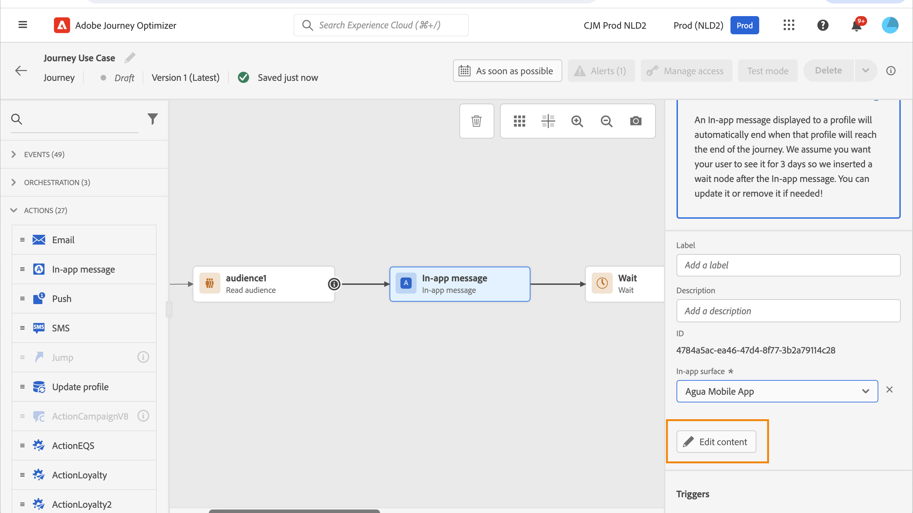

# Criar seu conteúdo no aplicativo {#design-content}

>[!CONTEXTUALHELP]
>id="ajo_campaigns_inapp_content"
>title="Definir o conteúdo no aplicativo"
>abstract="Personalize o conteúdo e o estilo das mensagens no aplicativo. Você também pode adicionar botões de ação e mídias para tornar as mensagens mais cativantes e efetivas."

É possível editar o conteúdo no aplicativo para configurar as opções de experiência:

* Em uma **[!UICONTROL Campanha]**, no menu **[!UICONTROL Ação]**, para configurar o conteúdo da mensagem, clique no botão **[!UICONTROL Editar conteúdo]**.

  

* Em uma **[!UICONTROL Jornada]**, no menu avançado de sua **[!UICONTROL Ação]** no aplicativo, você pode começar a criar seu conteúdo com o botão **[!UICONTROL Editar conteúdo]**.

  

O botão de alternância **[!UICONTROL Formatação avançada]** ativa opções adicionais para personalizar a experiência.

Depois que a mensagem no aplicativo for criada e o conteúdo definido e personalizado, você poderá revisá-la e ativá-la. As notificações serão enviadas de acordo com o agendamento da campanha. Saiba mais [nesta página](send-in-app.md).

## Layout da mensagem {#message-layout}

>[!CONTEXTUALHELP]
>id="ajo_campaigns_inapp_authoring_message_layout"
>title="Definir o conteúdo no aplicativo"
>abstract="O layout da mensagem fornece modelos usados com frequência para criar uma moldura para sua mensagem. O layout personalizado fornece opções para fazer upload ou compor mensagens HTML personalizadas."

Na seção **[!UICONTROL Layout da Mensagem]**, selecione uma das quatro opções de layout diferentes a serem escolhidas, dependendo das suas necessidades.

* **[!UICONTROL Tela cheia]**: esse tipo de layout cobre a tela inteira do dispositivo do público-alvo.

  É compatível com mídias (imagem, vídeo), texto e componentes de botão.

* **[!UICONTROL Modal]**: esse layout aparece em uma janela grande com estilo de alerta. O aplicativo ainda fica visível em segundo plano.

  É compatível com mídias (imagem, vídeo), texto e componentes de botão.

* **[!UICONTROL Banner]**: esse tipo de layout aparece como uma mensagem de alerta de SO nativo.

  Você só pode adicionar um **[!UICONTROL Cabeçalho]** e um **[!UICONTROL Corpo]** à sua mensagem.

* **[!UICONTROL Personalizado]**: o modo de mensagem personalizada permite importar e editar diretamente uma de suas mensagens HTML pré-configuradas.

   * Selecione **[!UICONTROL Compor]** para inserir ou colar seu código de HTML bruto.

     Use o painel esquerdo para aproveitar os recursos de personalização do Journey Optimizer. Para obter mais informações, consulte [esta seção](../personalization/personalize.md).

   * Selecione **[!UICONTROL Importar]** para importar o arquivo HTML ou .zip que contenha o conteúdo HTML.

## Guia Conteúdo {#content-tab}

Na guia **Conteúdo**, é possível definir e personalizar o conteúdo da notificação e o estilo do botão **Fechar**. Você também pode adicionar uma mídia à notificação no aplicativo e adicionar botões de ação nesta guia.

### Botão Fechar {#close-button}

>[!CONTEXTUALHELP]
>id="ajo_campaigns_inapp_authoring_close"
>title="Escolha o estilo do botão Fechar."
>abstract="A seção do botão de fechamento da mensagem fornece a opção de selecionar variações desse botão e permite fazer upload de uma imagem personalizada."

Escolha o **[!UICONTROL Estilo]** do seu **[!UICONTROL botão Fechar]**.

Os estilos disponíveis são:

* **[!UICONTROL Simples]**
* **[!UICONTROL Círculo]**
* **[!UICONTROL Imagem personalizada]** de uma URL de mídia ou de sua Assets.

+++Mais opções com formatação avançada

Se o **[!UICONTROL Modo de formatação avançado]** estiver ativado, você poderá marcar a opção **[!UICONTROL Cor]** para escolher a cor e a opacidade do botão.

+++

### Mídia {#add-media}

>[!CONTEXTUALHELP]
>id="ajo_campaigns_inapp_authoring_media"
>title="Adicione mídias à mensagem do aplicativo e crie uma experiência cativante para o usuário final."
>abstract="Forneça um link direto para o conteúdo ou use o seletor de ativos para escolher a mídia no Asset Essentials e adicioná-la à mensagem."

O campo **[!UICONTROL Mídia]** permite adicionar mídia à mensagem no aplicativo para criar uma experiência atraente para o usuário final.

Digite sua URL de mídia ou clique no ícone **[!UICONTROL Selecionar Assets]** para adicionar diretamente os ativos armazenados na biblioteca do Assets à mensagem no aplicativo. [Saiba mais sobre o gerenciamento de ativos](../content-management/assets.md).
Você também pode adicionar um **[!UICONTROL texto alternativo]** para aplicativos de leitura de tela.

+++Mais opções com formatação avançada

Se o **[!UICONTROL Modo de formatação avançado]** estiver ativado, você poderá personalizar a **[!UICONTROL Altura máxima]** e a **[!UICONTROL Largura máxima]** da mídia.

+++

### Conteúdo {#title-body}

>[!CONTEXTUALHELP]
>id="ajo_campaigns_inapp_authoring_content"
>title="Para compor a mensagem, insira o conteúdo nos campos Cabeçalho e Corpo."
>abstract="Os textos do cabeçalho e do corpo podem ser adicionados aqui. Para incluir tokens de personalização, abra a caixa de diálogo de personalização."

Para redigir a mensagem, insira o conteúdo nos campos **[!UICONTROL Cabeçalho]** e **[!UICONTROL Corpo]**.

Use o ícone **[!UICONTROL Personalization]** para adicionar personalização. Saiba mais sobre a personalização no editor de personalização do Adobe Journey Optimizer [nesta seção](../personalization/personalize.md).

+++Mais opções com formatação avançada

Se o **[!UICONTROL Modo de formatação avançado]** estiver ativado, você poderá escolher para seu **[!UICONTROL Cabeçalho]** e **[!UICONTROL Corpo]**:

* a **[!UICONTROL Fonte]**
* o **[!UICONTROL Pt tamanho]**
* a **[!UICONTROL Cor da Fonte]**
* o **[!UICONTROL Alinhamento]**
+++

### Botões {#add-buttons}

>[!CONTEXTUALHELP]
>id="ajo_campaigns_inapp_authoring_buttons"
>title="Adicione botões para a interação com mensagens no aplicativo."
>abstract="Esta seção permite adicionar botões de “chamada para ação” à mensagem. É possível incluir texto e destinos personalizados para cada botão."

Adicione botões para a interação com mensagens no aplicativo.

Para personalizar o botão:

1. Edite o campo Button #1 text (primary). Você também pode usar o ícone **[!UICONTROL Personalization]** para definir dados de conteúdo e personalização.

1. Escolha o **[!UICONTROL Interagir evento]** que define a ação do botão depois que os usuários interagiram com ele.

1. Insira sua URL da Web ou deep link no campo **[!UICONTROL Target]**.

1. Para adicionar vários botões, clique em **[!UICONTROL Botão Adicionar]**.

+++Mais opções com formatação avançada

Se o **[!UICONTROL Modo de formatação avançado]** estiver ativado, você poderá escolher para seus **[!UICONTROL Botões]**:

* a **[!UICONTROL Fonte]**
* o **[!UICONTROL Pt tamanho]**
* a **[!UICONTROL Cor da Fonte]**
* o **[!UICONTROL Alinhamento]**
* o **[!UICONTROL estilo do botão]**
* o **[!UICONTROL Raio]**
* a **[!UICONTROL cor do botão]**

+++

## Guia Configurações {#settings-tab}

Na guia **Configurações**, é possível definir o layout da mensagem e pré-visualizar a mensagem no aplicativo. Você também pode acessar opções avançadas de formatação.

### Visualização {#preview-tab}

>[!CONTEXTUALHELP]
>id="ajo_campaigns_inapp_authoring_preview"
>title="Visualize a mensagem no aplicativo."
>abstract="Esta é a imagem de visualização que será exibida quando a mensagem for enviada para o resumo de mensagens do dispositivo."

>[!NOTE]
>
>A visualização só está disponível para mensagens móveis no aplicativo.

A **[!UICONTROL Visualização do aplicativo]** permite que você adicione um plano de fundo por trás da mensagem no aplicativo:

* Uma mídia de um link de URL.

* Um ativo da sua biblioteca Assets.

* Uma cor de fundo.

### Layout {#layout-options}

>[!CONTEXTUALHELP]
>id="ajo_campaigns_inapp_authoring_layout"
>title="Definir o layout da mensagem no aplicativo."
>abstract="Esta seção permite adicionar um plano de fundo para a mensagem no aplicativo. Isso requer que a opção “Controle da interface” esteja habilitada."

O campo **[!UICONTROL Imagem de plano de fundo]** permite adicionar um plano de fundo à mensagem no aplicativo:

* Uma mídia de um link de URL.

* Uma cor de fundo.

### Mensagem {#message-tab}

>[!CONTEXTUALHELP]
>id="ajo_campaigns_inapp_authoring_message_advanced"
>title="Definir as configurações avançadas da mensagem."
>abstract="Esta seção permite aprimorar a personalização do conteúdo no aplicativo, especialmente se a “Formatação avançada” estiver habilitada."

A opção de controle de interface do usuário, habilitada por padrão, permite escurecer o plano de fundo por trás da mensagem no aplicativo para enfatizar o foco no conteúdo.

+++Mais opções com formatação avançada

Se o **[!UICONTROL Modo de formatação avançado]** estiver ativado, você poderá personalizar ainda mais sua mensagem com as seguintes opções:

* **[!UICONTROL Personalizar gestos]**: permite personalizar o que é a interação de deslizamento do usuário. Se a opção ignorar for selecionada, você poderá adicionar um evento de interação personalizado e/ou destino de destino.

* **[!UICONTROL Personalizar tomada de controle da interface do usuário]**: permite selecionar uma cor para exibir no plano de fundo e sua opacidade.

* **[!UICONTROL Personalizar tamanho]**: permite ajustar a largura e a altura das notificações no aplicativo.

* **[!UICONTROL Personalizar posição]**: permite personalizar a posição das mensagens no aplicativo na tela dos usuários. É possível alterar os alinhamentos Vertical e Horizontal.

* **[!UICONTROL Personalizar animação]**: permite que você personalize suas animações Exibir e Ignorar, por exemplo, se a notificação no aplicativo aparecer à esquerda ou na parte superior do dispositivo do usuário.

* **[!UICONTROL Canto arredondado da mensagem]**: permite que você adicione o canto arredondado à sua notificação no aplicativo alterando o **[!UICONTROL Raio do canto]**.

+++

**Tópicos relacionados:**

* [Criar mensagem no aplicativo](create-in-app.md)
* [Relatório no aplicativo](../reports/campaign-global-report-cja-inapp.md)
* [Configuração no aplicativo](inapp-configuration.md)

## Vídeo tutorial{#video}

O vídeo abaixo mostra como criar e testar suas mensagens no aplicativo.

>[!VIDEO](https://video.tv.adobe.com/v/3410471?quality=12&learn=on)
