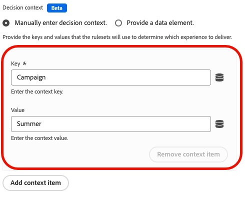

# Configurar o suporte a mensagens no aplicativo da Web no Web SDK

As mensagens no aplicativo são notificações que podem ser enviadas aos usuários no aplicativo web, guiando-os a pontos de interesse específicos.

É possível usar essas notificações para diferentes propósitos, como promover novos recursos, apresentar ofertas especiais ou facilitar a integração do usuário.

Ao usar mensagens no aplicativo, você pode se envolver efetivamente com seu público-alvo e orientá-los para aspectos importantes de seu aplicativo.

## Pré-requisitos {#prerequisites}

### Versão da extensão de tag do Web SDK {#extension-version}

A funcionalidade de mensagens no aplicativo da Web exige a versão mais recente da extensão de tag do Web SDK.

### Configurar uma CSP para mensagens no aplicativo da Web {#csp}

Ao configurar mensagens no aplicativo da Web, você deve incluir a seguinte diretiva na CSP:

```
default-src  blob:;
```

Para obter mais informações sobre como configurar uma CSP, consulte a [documentação sobre Coleção de dados](https://experienceleague.adobe.com/docs/experience-platform/edge/use-cases/configuring-a-csp.html){target="_blank"}.

## Configurar mensagens no aplicativo da Web usando a extensão de tag da Web SDK {#tag-extension}

Consulte a [página de configuração da extensão de tag do Web SDK](https://experienceleague.adobe.com/docs/experience-platform/tags/extensions/client/web-sdk/web-sdk-extension-configuration.html){target="_blank"} para entender onde você pode encontrar as configurações descritas abaixo.

Depois de [instalar](https://experienceleague.adobe.com/docs/experience-platform/tags/extensions/client/web-sdk/web-sdk-extension-configuration.html#install-the-web-sdk-tag-extension){target="_blank"} a extensão de tag do Web SDK, siga as etapas abaixo para configurar a extensão para Mensagens no Aplicativo Web.

Na seção **[!UICONTROL Personalization]**, marque a opção **[!UICONTROL Habilitar armazenamento de personalização]**. Essa opção permite que o Web SDK acompanhe quais experiências foram vistas pelo usuário em carregamentos de página.


As mensagens no aplicativo da Web são compatíveis com dois tipos de acionadores:

* [Envio de dados para o Experience Platform](#send-data-platform)
* [Acionamento manual das mensagens](#manual-trigger)

Consulte as seções a seguir para configurar a extensão de tag do Web SDK de acordo com os acionadores que deseja usar.

### Etapas de configuração para o gatilho **[!UICONTROL Enviar dados para a Experience Platform]** {#send-data-platform}

1. Selecione a propriedade da marca que contém sua extensão do Web SDK e [crie uma nova regra](https://experienceleague.adobe.com/docs/experience-platform/tags/ui/managing-resources/rules.html#create-a-rule){target="_blank"} com as seguintes configurações:

   * **[!UICONTROL Extensão]**: [!UICONTROL Núcleo]
   * **[!UICONTROL Tipo de Evento]**: [!UICONTROL Biblioteca Carregada (Início da Página)]

   

1. Selecione **[!UICONTROL Manter alterações]** para salvar a configuração do evento.

1. Agora é necessário adicionar uma ação à regra criada, na seção [!DNL Actions], selecione **[!UICONTROL Adicionar]**.

   Usar as seguintes configurações de **[!UICONTROL Ação]**:

   * **[!UICONTROL Extensão]**: [!UICONTROL Adobe Experience Platform Web SDK]
   * **[!UICONTROL Tipo de ação]**: [!UICONTROL Enviar evento]

   

1. No lado direito da tela, na seção **[!UICONTROL Personalization]**, habilite a opção **[!UICONTROL Renderizar decisões de personalização visual]**.

   

1. No lado direito da tela, na seção **[!UICONTROL Contexto de decisão]**, defina os pares de **[!UICONTROL Chave]**/**[!UICONTROL Valor]** que você usou na configuração da campanha para se qualificar para a mensagem no aplicativo.

   

1. Selecione **[!UICONTROL Manter alterações]** para salvar sua configuração.

1. Em seguida, você deve adicionar a regra recém-criada à biblioteca de propriedades da tag. Para fazer isso, vá para **[!UICONTROL Fluxo de publicação]** e selecione a regra criada anteriormente.

   

1. Depois de adicionar a regra à biblioteca, selecione **[!UICONTROL Salvar e criar no desenvolvimento]**.

   

O processo de configuração agora está concluído e sua mensagem está pronta para ser exibida aos usuários.

### Etapas de configuração para usar acionadores manuais {#manual-trigger}

1. Selecione a propriedade da marca que contém sua extensão do Web SDK e [crie uma nova regra](https://experienceleague.adobe.com/docs/experience-platform/tags/ui/managing-resources/rules.html#create-a-rule){target="_blank"} com as seguintes configurações:

   * **[!UICONTROL Extensão]**: [!UICONTROL Núcleo]
   * **[!UICONTROL Tipo de Evento]**: [!UICONTROL Clique]

1. Defina o acionador de um elemento específico na página, identificado por um seletor de CSS de sua escolha.

   

1. É necessário adicionar uma ação à regra criada. Na seção [!DNL Actions], selecione **[!UICONTROL Adicionar]** e use as seguintes configurações de **[!UICONTROL Ação]**:

   * **[!UICONTROL Extensão]**: [!UICONTROL Adobe Experience Platform Web SDK]
   * **[!UICONTROL Tipo de ação]**: [!UICONTROL Avaliar conjuntos de regras]

   

1. No lado direito da tela, habilite a opção **[!UICONTROL Renderizar decisões de personalização visual]**.

   

1. No lado direito da tela, na seção **[!UICONTROL Contexto de decisão]**, defina os pares de **[!UICONTROL Chave]**/**[!UICONTROL Valor]** que você usou na configuração da campanha para se qualificar para a mensagem no aplicativo.

   

1. Selecione **[!UICONTROL Manter alterações]** para salvar sua configuração.

1. Adicione a regra recém-criada à biblioteca de propriedades da tag. Para fazer isso, vá para **[!UICONTROL Fluxo de publicação]** e selecione a regra criada anteriormente.

   

1. Depois de adicionar a regra à biblioteca, selecione **[!UICONTROL Salvar e criar no desenvolvimento]**.

   

O processo de configuração agora está concluído e sua mensagem está pronta para ser exibida aos usuários.

## Configurar mensagens no aplicativo da Web usando a biblioteca JavaScript do Web SDK {#js-library}

Como alternativa ao uso da extensão de tag do Web SDK, você também pode configurar Mensagens no aplicativo Web diretamente da biblioteca JavaScript do Web SDK.

Você pode exibir mensagens no aplicativo da Web do Adobe Journey Optimizer de duas maneiras.

### Método 1: buscar automaticamente o conteúdo de personalização {#automatic}

Para que o Web SDK busque automaticamente o conteúdo de personalização no carregamento da página, use o comando `sendEvent`, conforme mostrado no exemplo abaixo.

```js
  alloy("sendEvent", {
      renderDecisions: true,
      personalization: {
          surfaces: ['#welcome']
      }
  });
```

### Método 2: buscar manualmente o conteúdo de personalização com base na ação do usuário {#manual}

Para mostrar o conteúdo de personalização somente depois que o usuário executar uma ação específica, use o comando `evaluateRulesets` como mostrado no exemplo abaixo.

Neste exemplo, o conteúdo de personalização é exibido quando um usuário clica no botão **[!UICONTROL Comprar agora]** no seu site.

```js
 alloy("evaluateRulesets", {
     renderDecisions: true,
     personalization: {
         decisionContext: {
             "userAction": "buy_now"
         }
     }
 });
```

### Configurar armazenamento de personalização {#personalization-storage}

Você pode optar por mostrar mensagens no aplicativo aos usuários por um número definido de vezes, ou sempre que eles visitarem uma página, por meio da opção de configuração `personalizationStorageEnabled`.

Na [configuração do Web SDK](https://experienceleague.adobe.com/docs/experience-platform/edge/fundamentals/configuring-the-sdk.html){target="_blank"}, defina a opção `personalizationStorageEnabled` de acordo com suas necessidades:

* O `personalizationStorageEnabled: true` aciona a mensagem no aplicativo com a frequência que você definiu na sua [campanha](create-in-app-web.md#configure-inapp).
* `personalizationStorageEnabled: false` aciona a mensagem no aplicativo em cada carregamento de página.
