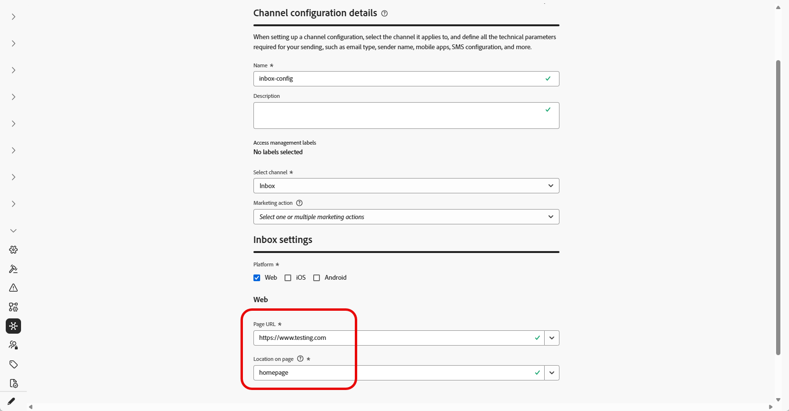

# Configurar Caixa de entrada {#inbox-configuration}

Antes de oferecer experiências com o cartão de Conteúdo por meio da Caixa de Entrada, defina uma **Configuração de canal da Caixa de Entrada** em **[!UICONTROL Configurações de canal]**. Essa configuração vincula a superfície ao consentimento, aos rótulos de acesso opcionais e ao local em que a experiência é exibida na Web ou no seu aplicativo iOS ou Android. Siga as etapas abaixo para criar uma configuração:

1. Acesse o menu **[!UICONTROL Canais]** > **[!UICONTROL Configurações gerais]** > **[!UICONTROL Configurações de canal]** e clique em **[!UICONTROL Criar configuração de canal]**.

   

1. Insira um nome e uma descrição (opcional) para a configuração.

   >[!NOTE]
   >
   > Os nomes devem começar com uma letra (A-Z). Ele só pode conter caracteres alfanuméricos. Também é possível usar os caracteres de sublinhado `_`, ponto `.` e hífen `-`.

1. Para atribuir rótulos de uso de dados personalizados ou de núcleo à configuração, você pode selecionar **[!UICONTROL Gerenciar acesso]**. [Saiba mais sobre o OLAC (Controle de Acesso em Nível de Objeto)](../administration/object-based-access.md).

1. Selecione o canal **[!UICONTROL Caixa de entrada]**.

   

1. Selecione **[!UICONTROL Ação de marketing]**(s) para associar políticas de consentimento às mensagens que usam essa configuração. Todas as políticas de consentimento associadas à ação de marketing são utilizadas para respeitar as preferências dos clientes. [Saiba mais](../action/consent.md#surface-marketing-actions)

1. Selecione a plataforma para a qual a experiência da Caixa de entrada será aplicada.

   

1. Para a Web:

   * Na **[!UICONTROL URL da Página]**, digite ou selecione a URL da página onde a caixa de entrada deve aparecer. Use esta opção quando a experiência for limitada a uma página.

   * Em **[!UICONTROL Local na página]**, defina o posicionamento na página, por exemplo, a região ou o identificador que seu site usa para a superfície da caixa de entrada. [Saiba mais](../web/web-configuration.md)

     

1. Para iOS e Android:

   * Em **[!UICONTROL ID do aplicativo]**, insira ou selecione o identificador do aplicativo para que a configuração se aplique à compilação correta do iOS ou do Android.

   * Em **[!UICONTROL Local ou caminho dentro do aplicativo]**, especifique a tela, rota ou contêiner em que os usuários devem abrir a caixa de entrada.

1. Envie suas alterações.

Agora é possível selecionar sua configuração ao criar a experiência da Caixa de entrada.

➡️ [Siga as etapas detalhadas nesta página](inbox-create.md)
