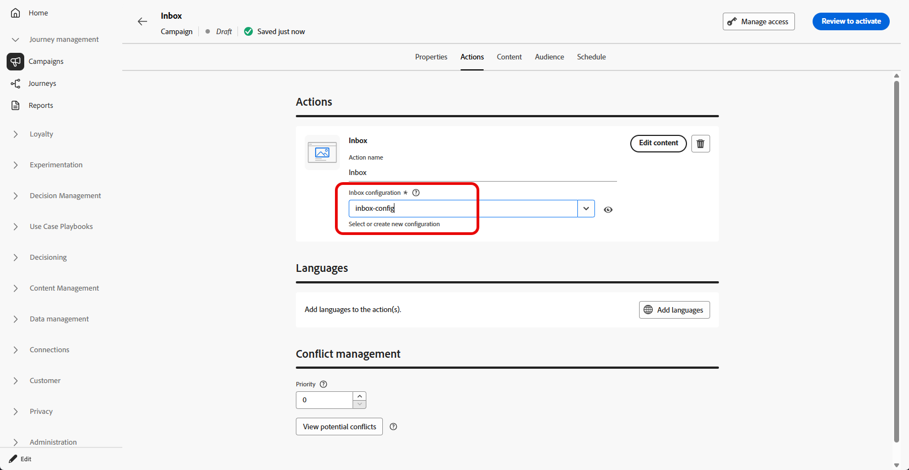

# Criar uma caixa de entrada {#inbox-create}

Antes de criar uma caixa de entrada, conclua as etapas da [Configuração da caixa de entrada](inbox-configuration.md). A configuração de canal identifica o aplicativo ou site de destino, a página ou regra e o posicionamento onde a caixa de entrada é renderizada.

Para criar uma caixa de entrada de mensagem por meio de uma campanha, siga estas etapas:

1. Crie uma campanha. [Saiba mais](../campaigns/create-campaign.md)

1. Selecione o tipo de campanha que deseja executar:

   * **[!UICONTROL Agendado - Marketing]**: execute a campanha imediatamente ou em uma data especificada. As campanhas agendadas têm como objetivo enviar mensagens de **marketing**. Eles são configurados e executados na interface do usuário do.

   * **[!UICONTROL Acionado por API - Marketing/Transacional]**: execute a campanha usando uma chamada de API. As campanhas acionadas por API têm como objetivo enviar **mensagens de marketing** ou **mensagens transacionais**, ou seja, mensagens enviadas após uma ação executada por um indivíduo: redefinição de senha, compra de carrinho etc. [Saiba como acionar uma campanha usando APIs](../campaigns/api-triggered-campaigns.md)

1. Na guia **[!UICONTROL Propriedades]**, especifique um nome e uma descrição para a campanha.

1. Na guia **[!UICONTROL Ação]**, selecione a ação **[!UICONTROL Caixa de Entrada]**.

   

1. Selecione ou crie uma nova [configuração da Caixa de Entrada](inbox-configuration.md).

   

1. Acesse a guia Conteúdo para criar sua mensagem usando o designer de conteúdo. [Saiba mais](inbox-design.md)

1. Na guia **[!UICONTROL Público-alvo]**, clique no botão **[!UICONTROL Selecionar público-alvo]** para exibir a lista de públicos-alvo disponíveis do Adobe Experience Platform. [Saiba mais sobre públicos-alvo](../audience/about-audiences.md).

1. No campo **[!UICONTROL Namespace de identidade]**, escolha o namespace a ser usado para identificar os indivíduos do segmento selecionado. [Saiba mais sobre namespaces](../event/about-creating.md#select-the-namespace)

1. Você pode agendar sua campanha para uma data específica ou definir para recorrência em intervalos regulares. [Saiba mais](../campaigns/create-campaign.md#schedule)

1. Revise e ative sua campanha para enviar mensagens para a caixa de entrada.

Agora você pode escolher esta Caixa de Entrada ao criar sua [Campanha de cartão de conteúdo](../content-card/create-content-card.md).
