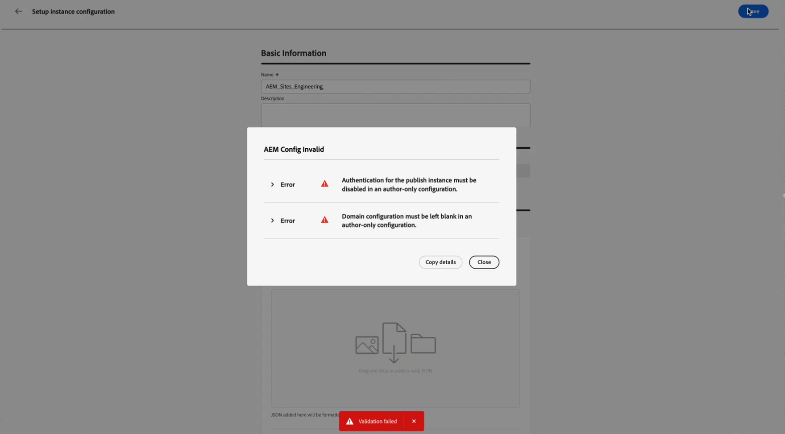

# Configurar o acesso ao repositório do Adobe Experience Manager {#aem-admin-settings}

>[!BEGINSHADEBOX]

**Nesta página:** saiba como os administradores conectam uma sandbox a um repositório do Adobe Experience Manager, configurando acesso somente de autor ou de publicação, domínios personalizados e autenticação, para que os profissionais de marketing possam usar Fragmentos de conteúdo do AEM em suas jornadas e campanhas.

>[!ENDSHADEBOX]

>[!CONTEXTUALHELP]
>id="ajo_admin_aem_content_fragment_configuration"
>title="Configuração do Adobe Experience Manager"
>abstract="Conecte uma sandbox a um repositório do Adobe Experience Manager definindo o acesso como somente de autor ou de publicação, domínios personalizados e autenticação para que os profissionais de marketing possam usar fragmentos de conteúdo do Adobe Experience Manager em suas jornadas e campanhas."

>[!CONTEXTUALHELP]
>id="ajo_admin_aem_configure_instance"
>title="Configuração de instância"
>abstract="Selecione o tipo de configuração de instância apropriado para a configuração.  Configuração somente para autores: use fragmentos de conteúdo da instância de autor do AEM. A configuração da instância de publicação e as atualizações em tempo real não são compatíveis. Configuração da instância de publicação: definir configurações da instância de publicação. Opcionalmente, ative a opção “Enviar token para a instância de publicação” para fornecer credenciais de serviço para autenticação."

>[!CONTEXTUALHELP]
>id="ajo_admin_aem_send_token"
>title="Enviar token para a instância de publicação"
>abstract="Quando habilitado, as credenciais de serviço são enviadas para autenticar solicitações à instância de publicação. Insira um JSON de credencial de serviço válido abaixo."

>[!CONTEXTUALHELP]
>id="ajo_admin_aem_service_credential"
>title="Colar credencial de serviço JSON"
>abstract="Cole o JSON das credenciais de serviço do Adobe Experience Manager. Ela será formatada e validada automaticamente."
>additional-url=""

>[!CONTEXTUALHELP]
>id="ajo_admin_aem_custom_domain"
>title="Domínio personalizado"
>abstract="Opcional. Forneça um domínio personalizado caso “your-publish-instance.adobeaemcloud.com” esteja bloqueado e não consiga buscar conteúdo para a sua organização."

O Adobe Journey Optimizer integra-se com **[!DNL Adobe Experience Manager as a Cloud Service]** e **[!DNL Adobe Experience Manager Managed Service]** para que você possa usar **Fragmentos de conteúdo** em Jornadas e Campanhas. Por padrão, os **Fragmentos de conteúdo** são lidos do repositório de publicação do Adobe Experience Manager. Os administradores podem alternar para somente autor ou ajustar o acesso de publicação no menu **[!UICONTROL Integração do AEM]**.

➡️ Quando o repositório estiver configurado, continue com [Trabalhe com os Fragmentos de conteúdo do Experience Manager](../integrations/aem-fragments.md) para as tarefas de criação e seleção no Journey Optimizer.

## Configurar repositórios {#configure-ui}

>[!NOTE]
>
> **[!UICONTROL A Integração do AEM]** salva as configurações do repositório **por sandbox**. Cada sandbox mantém suas próprias integrações e elas não se aplicam a sandboxes.

O Journey Optimizer armazena uma integração por organização, sandbox e repositório do Adobe Experience Manager. Se você salvar uma nova integração para essa mesma combinação, ela substituirá as configurações anteriores, somente a configuração mais recente será mantida.

➡️ [Descubra este recurso para o Adobe Experience Manager Managed Service em vídeo](#video)

Para configurar o repositório:

1. Acesse **[!UICONTROL Administração]** > **[!UICONTROL Canais]** > **[!UICONTROL Integração com o AEM]**.

1. Clique em **[!UICONTROL Criar configuração]**.

   

1. Escolha um método de configuração:

   * Para o repositório **[!DNL Adobe Experience Manager Managed Services]**, insira um hostname do repositório que termine com `adobecqms.net` no campo **[!UICONTROL hostname do repositório AMS]**.

     

   * Se você usa **[!DNL Adobe Experience as a Cloud Service]**, escolha qual repositório configurar e clique em **[!UICONTROL Avançar]**.

     Além disso, você pode clicar em **[!UICONTROL Exibir]** para acessar este repositório.

     >[!IMPORTANT]
     >
     >Salvar uma nova configuração para a mesma organização, sandbox e repositório **substitui** a configuração padrão, ou seja, **publicar** repositório.

     

1. Insira um **[!UICONTROL Nome]** e uma **[!UICONTROL Descrição]**.

1. Escolha a configuração no menu suspenso abaixo:

   +++ Configuração somente do autor

   Selecione **[!UICONTROL Configuração somente de autor]** quando o Journey Optimizer precisar ler somente os Fragmentos de conteúdo do ambiente **de autor** do Adobe Experience Manager. A replicação de autor para publicar e atualizações de publicação em tempo real não é compatível.

   

   +++

    

   +++ Configuração da instância de publicação

   Por padrão, todo repositório **[!DNL Adobe Experience Manager as a Cloud Service]** está configurado para usar a instância **publicar**. Você pode continuar com a etapa de teste do Fragmento do conteúdo sem alterar essas configurações.

   Se a sua instância de publicação estiver **autenticada**, ou se você precisar usar um domínio de publicação personalizado, siga as etapas abaixo.

   1. Selecione **[!UICONTROL Configuração da instância de publicação]** para ativar as configurações da instância de publicação.

      

   1. Habilite **[!UICONTROL Enviar token para a instância de publicação]** para que as credenciais de serviço sejam incluídas nas solicitações para a instância de publicação.

   1. Cole uma **[!UICONTROL Credencial de Serviço JSON]** válida para autenticação.

   1. Forneça opcionalmente um domínio personalizado se sua organização não conseguir acessar o host de publicação padrão do AEM (`publish-XX-XX.adobeaemcloud.com`) para buscar conteúdo.

      

   +++

1. Depois de concluir a configuração da instância, escolha um Fragmento de conteúdo para confirmar se a integração funciona.

   

1. Na janela **Supervisor de Conteúdo**, selecione o fragmento que deseja testar e clique em **[!UICONTROL Selecionar]**.

1. Clique em **[!UICONTROL Save]**.

1. Quando você salva com um Fragmento de conteúdo de teste selecionado, a validação é executada automaticamente. Se a validação falhar, uma lista de erros será exibida para que você possa corrigir a configuração.

   

1. Para editar ou desabilitar essa integração de repositório, acesse a configuração criada anteriormente pelo menu **[!UICONTROL Integração do AEM]**.

Ao salvar essa configuração, o Journey Optimizer a armazena para esse repositório na sandbox atual. Você pode usar esse repositório e suas configurações ao navegar e selecionar conteúdo no seletor do **Supervisor de Conteúdo**.

## Vídeo tutorial {#video}

Saiba como os administradores definem as configurações do repositório do Adobe Experience Manager Managed Services no Journey Optimizer para que os profissionais de marketing possam usar Fragmentos de conteúdo em jornadas e campanhas.

>[!VIDEO](https://video.tv.adobe.com/v/3492529?quality=12)
