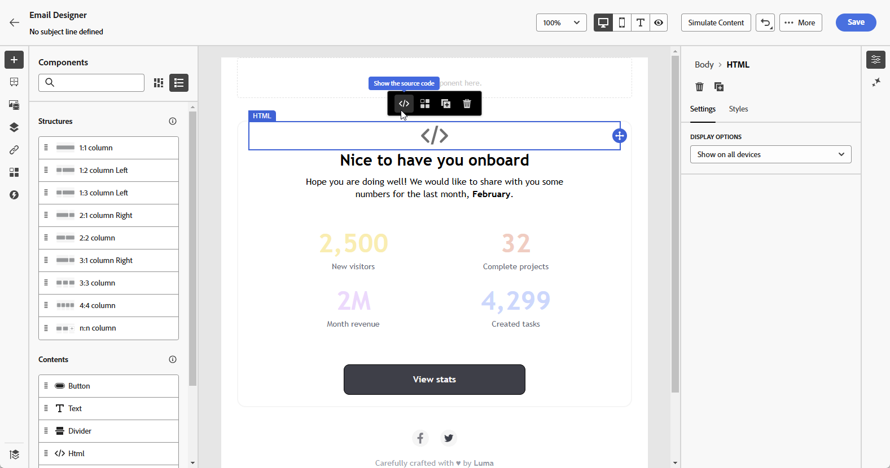
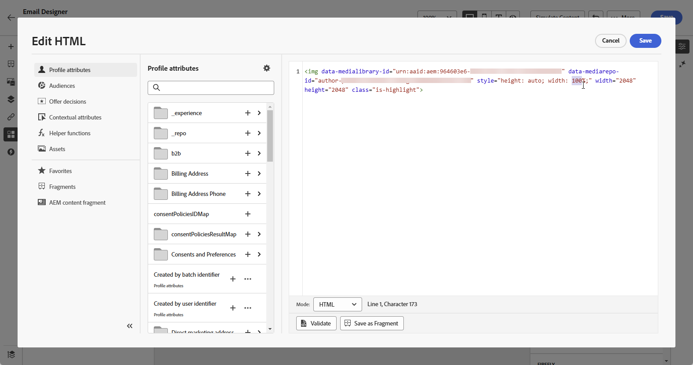
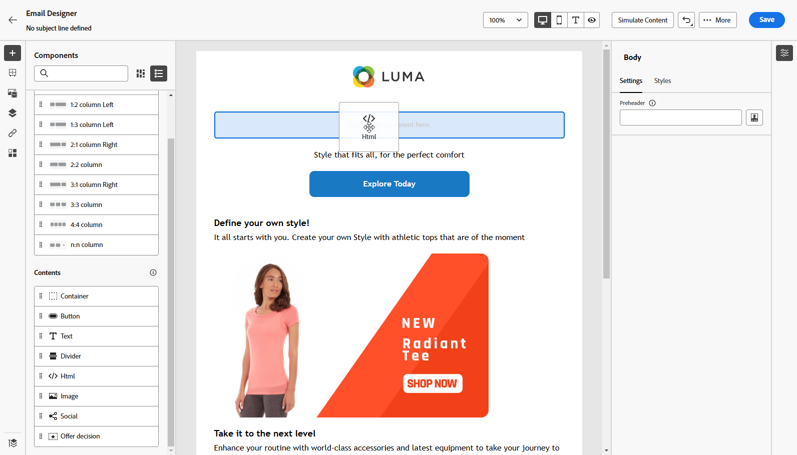
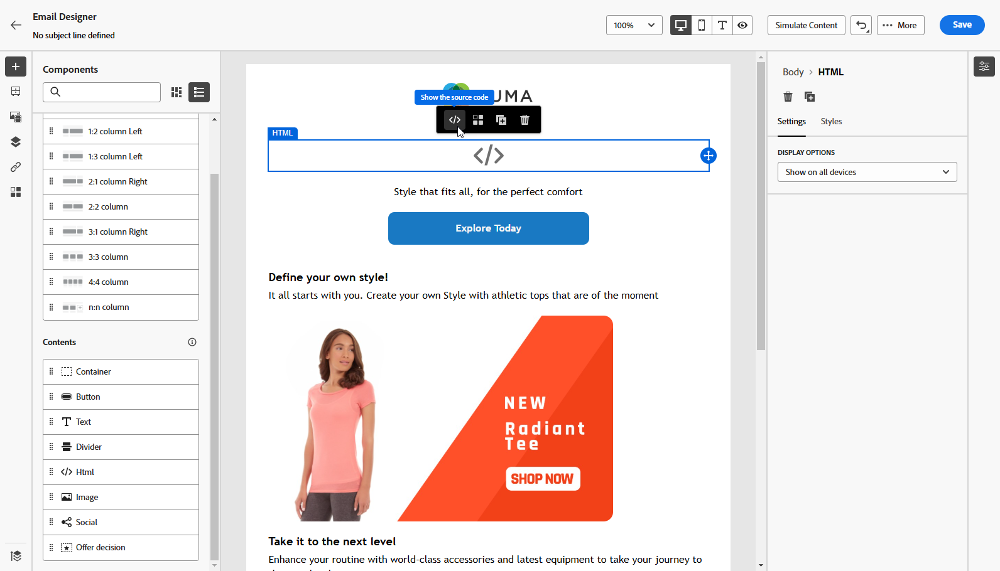
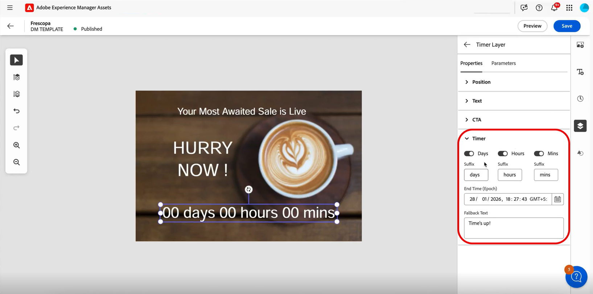
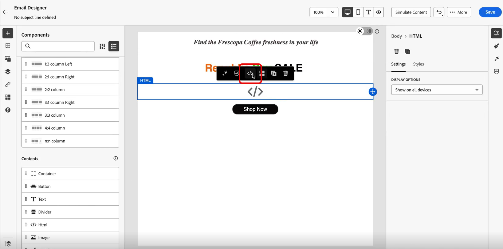

# Trabalhar com mídia dinâmica {#aem-dynamic}

>[!BEGINSHADEBOX]

**Nesta página:** Saiba como inserir, ajustar e personalizar o Adobe Experience Manager dynamic media, incluindo sobreposições de texto e modelos de mídia dinâmica, no conteúdo do Journey Optimizer.

>[!ENDSHADEBOX]

## Introdução à mídia dinâmica {#gs-aem-dynamic}

O seletor de ativos agora é compatível com Dynamic Media, permitindo selecionar e usar facilmente representações de Dynamic Media aprovadas no Journey Optimizer. As alterações feitas em ativos no Adobe Experience Manager são refletidas instantaneamente no conteúdo do Journey Optimizer, garantindo que as versões mais atualizadas estejam sempre em uso, sem a necessidade de atualizações manuais.

Observe que essa integração só está disponível para clientes que usam o Dynamic Media Manager as a Cloud Service.

Para saber mais sobre o Dynamic Media no Adobe Experience Manager as a Cloud Service, consulte a [documentação do Experience Manager](https://experienceleague.adobe.com/en/docs/experience-manager-cloud-service/content/assets/dynamicmedia/dynamic-media){target="_blank"}.

>[!AVAILABILITY]
>
>Para clientes da área de saúde, a integração é habilitada somente mediante o licenciamento das ofertas complementares Journey Optimizer Healthcare Shield e Adobe Experience Manager Extended Security for Healthcare.

## Considerações

* Verifique se o Dynamic Media com OpenAPI está ativado no Adobe Experience Manager as a Cloud Service. [Saiba mais](https://experienceleague.adobe.com/en/docs/experience-manager-cloud-service/content/assets/dynamicmedia/dynamic-media-open-apis/dynamic-media-open-apis-overview#enable-dynamic-media-open-apis){target="_blank"}.

* A integração de mídia dinâmica com o Adobe Journey Optimizer está disponível para o Dynamic Media [modo Scene7](https://experienceleague.adobe.com/en/docs/experience-manager-65/content/assets/dynamic/config-dms7){target="_blank"} e [com OpenAPI](https://experienceleague.adobe.com/en/docs/experience-manager-cloud-service/content/assets/dynamicmedia/dynamic-media-open-apis/dynamic-media-open-apis-overview){target="_blank"}.

* Para ativos do Dynamic Media Scene7, o Journey Optimizer adiciona modificadores padrão (`bfc=off&fmt=png-alpha`) no início da URL. Se sua predefinição também definir `fmt` ou `bfc`, ela terá prioridade, já que o Scene7 usa a última ocorrência de um parâmetro repetido. Para evitar resultados inesperados, remova `fmt`/`bfc` da predefinição ou mova-a antes dos modificadores padrão na URL.

* Por design, o seletor de ativos retorna um formato de URL baseado em `/images`. Se você quiser entregar um ativo em seu formato original, por exemplo, GIF ou SVG, será necessário atualizar manualmente a URL para usar o caminho `/content`. Saiba mais na [documentação de práticas recomendadas do Dynamic Media](https://experienceleague.adobe.com/en/docs/experience-manager-cloud-service/content/assets/dynamicmedia/dm-journey/dm-best-practices#deliver-gif-images){target="_blank"}.

## Adicionar e gerenciar Dynamic media {#dynamic-media}

Aprimore e otimize seu conteúdo para qualquer tela ou navegador inserindo a mídia dinâmica do Adobe Experience Manager as a Cloud Service diretamente no conteúdo do Journey Optimizer.  Em seguida, é possível redimensionar, cortar, aprimorar e fazer outros ajustes, conforme necessário.

<!--
>[!AVAILABILITY]
>
>Older versions of Outlook (including 2016) do not support rendering of content with Dynamic Media.  We are actively working on a permanent fix to enhance compatibility. In the meantime, apply the following guidelines:
>
>* For Dynamic Media Scene7 URLs: Append `?bfc=on` to the image URL. This enables automatic format negotiation, ensuring the most compatible image format is delivered based on the client's capabilities.
>
>* For Dynamic Media with Open API: Use the `.avif` format. This format includes built-in fallback mechanisms to deliver a compatible format when necessary.
>
-->

Para adicionar um ativo do Adobe Experience Manager ao seu conteúdo do HTML, siga estas etapas:

1. Arraste e solte um **[!UICONTROL componente do HTML]** no seu conteúdo.

1. Selecione **[!UICONTROL Mostrar o código-fonte]**.

   

1. No menu **[!UICONTROL Editar HTML]**, navegue até **[!UICONTROL Assets]** e clique em **[!UICONTROL Abrir seletor de ativos]**.

   Como alternativa, você pode copiar e colar o URL do ativo.

   

1. Navegue pelos ativos do AEM e selecione aquele que deseja adicionar ao conteúdo.

1. Ajustar os parâmetros da imagem (por exemplo, altura, largura, rotação, inversão, brilho, matiz etc.) conforme necessário para atender aos requisitos de ativos.

   Para obter uma lista abrangente dos parâmetros de imagem que podem ser adicionados ao URL, consulte a [documentação do Experience Manager](https://experienceleague.adobe.com/en/docs/dynamic-media-developer-resources/image-serving-api/image-serving-api/http-protocol-reference/command-reference/c-command-reference){target="_blank"}.

   

1. Clique em **[!UICONTROL Salvar]**.

Seu conteúdo agora inclui mídia dinâmica. Todas as atualizações feitas no Experience Manager serão exibidas automaticamente no Journey Optimizer.

## Personalizar a sobreposição de texto {#text-overlay}

Personalize facilmente qualquer mídia dinâmica substituindo a sobreposição de texto existente pelo novo texto de sua escolha, o que permite atualizações e personalização ininterruptas.

Por exemplo, usando a funcionalidade de experimentação, é possível atualizar a sobreposição de texto existente, substituindo-a por um texto diferente para cada tratamento, garantindo que ela seja personalizada para cada perfil quando eles abrirem suas mensagens.

>[!AVAILABILITY]
>
>**A personalização da sobreposição de texto** está disponível exclusivamente no modo [Scene7 do Dynamic Media](https://experienceleague.adobe.com/en/docs/experience-manager-65/content/assets/dynamic/config-dms7){target="_blank"}. Como o modo Scene7 não está acessível para clientes do setor de saúde, o conteúdo é renderizado usando uma cópia binária da imagem no Journey Optimizer. Caso tenha alguma exceção, entre em contato com o representante da Adobe.

Para personalizar a sobreposição de texto, siga estas etapas:

1. Arraste e solte um **[!UICONTROL componente do HTML]** no seu conteúdo.

1. Selecione **[!UICONTROL Mostrar o código-fonte]**.

1. No menu **[!UICONTROL Editar HTML]**, acesse **[!UICONTROL Assets]** e **[!UICONTROL Abra o seletor de ativos]**.

   Você também pode simplesmente copiar e colar o URL de ativos.

1. Navegue pelos ativos do AEM e selecione aquele que deseja adicionar ao conteúdo.

1. Substitua a sobreposição pelo texto desejado.

   

1. Atualize os parâmetros de imagens:

   * **Camada**: digite o elemento base onde o texto é colocado.
   * **Size**: atualize o tamanho do bloco de texto.
   * **TextAttr**: ajustar o tamanho da sua fonte de texto.
   * **Pos**: definir a posição do texto na imagem.

   >[!WARNING]
   >
   >O parâmetro Layer é necessário para atualizar a mídia dinâmica.

   

1. Clique em **[!UICONTROL Salvar]**.

O conteúdo agora inclui a sobreposição de texto atualizada.

## Adicionar e gerenciar o modelo de mídia dinâmica {#dynamic-media-template}

Adicione facilmente seu modelo do Dynamic Media no Journey Optimizer e atualize seu conteúdo de mídia sempre que necessário. Agora é possível incorporar campos de personalização à mídia, permitindo criar conteúdo mais personalizado e envolvente no Journey Optimizer.

Saiba mais sobre [Modelo de mídia dinâmica](https://experienceleague.adobe.com/en/docs/dynamic-media-classic/using/template-basics/quick-start-template-basics){target="_blank"}.

>[!AVAILABILITY]
>
>**O modelo de mídia dinâmica** está disponível exclusivamente no [modo Scene7 do Dynamic Media](https://experienceleague.adobe.com/en/docs/experience-manager-65/content/assets/dynamic/config-dms7). Como o modo Scene7 não está acessível para clientes do setor de saúde, o conteúdo não será renderizado. Para quaisquer exceções, entre em contato com o suporte da Experience Manager.

### Com componente de imagem {#image-component}

É possível inserir seu modelo dinâmico diretamente no conteúdo usando o componente de Imagem:

1. Abra a campanha ou jornada e acesse o conteúdo.

1. Arraste e solte um **componente de Imagem** no seu layout.

   Para obter mais informações sobre o componente de Imagem, consulte [esta página](../email/content-components.md).

   

1. Navegue pelos ativos do AEM e selecione o modelo de Dynamic Media que deseja adicionar ao conteúdo.

   

1. Nas **Configurações de imagem**, navegue para acessar os parâmetros do seu modelo de mídia dinâmica.

   Os campos disponíveis dependem dos parâmetros adicionados durante a [criação do modelo](https://experienceleague.adobe.com/en/docs/dynamic-media-classic/using/template-basics/creating-template-parameters#creating_template_parameters){target="_blank"} no Adobe Experience Manager.

   

1. Preencha os diferentes campos e use o editor de personalização para adicionar conteúdo personalizado. Você pode usar qualquer atributo, como o nome do perfil, a cidade ou outros detalhes relevantes, para criar uma experiência mais personalizada.

   Saiba mais sobre a personalização em [esta página](../personalization/personalize.md).

   

1. O conteúdo condicional pode ser aplicado ao componente do Dynamic Media para gerar diferentes variantes do conteúdo. [Saiba mais](../personalization/dynamic-content.md)

1. Clique em **[!UICONTROL Salvar]**.

Depois de executar os testes e validar o conteúdo, você pode enviar a mensagem para o público-alvo.

### Com componente do HTML {#html-component}

Você pode inserir seu modelo dinâmico diretamente no conteúdo usando o componente HTML:

1. Abra a campanha ou jornada e acesse o conteúdo.

1. Arraste e solte um **componente HTML** no seu layout.

   

1. Selecione **[!UICONTROL Mostrar o código-fonte]**.

   

1. No menu **[!UICONTROL Editar HTML]**, acesse **[!UICONTROL Assets]** e **[!UICONTROL Abra o seletor de ativos]**.

   Você também pode simplesmente copiar e colar o URL de ativos.

1. Ajuste os parâmetros de texto da imagem conforme necessário para corresponder aos requisitos do ativo.

   

1. Clique em **[!UICONTROL Salvar]**.

Depois de executar os testes e validar o conteúdo, você pode enviar a mensagem para o público-alvo.

## Inserir timer da contagem regressiva {#countdown}

Crie a urgência e maximize conversões com temporizadores de contagem regressiva do Dynamic Media que são atualizados em tempo real quando os recipients abrem seus emails. Esse recurso é ideal para vendas rápidas, ofertas por tempo limitado e promoções sensíveis ao tempo.

Por exemplo, como comerciante de uma marca de varejo, você está realizando uma venda rápida de 48 horas. Ao usar o cronômetro de contagem regressiva em seus emails promocionais:

* Os recipients que abrirem imediatamente verão &quot;47 horas restantes&quot;
* Os recipients que abrirem 24 horas depois verão &quot;23 horas restantes&quot;
* Os recipients que abrirem após o término da venda verão &quot;Acabou o tempo!&quot;

Para obter mais informações sobre como adicionar temporizadores de contagem regressiva ao seu modelo do Dynamic Media no Adobe Experience Manager, consulte [este documento](assets/do-not-localize/countdown.pdf).

1. Em **[!DNL Adobe Experience Manager]**, crie um modelo de Mídia dinâmica e adicione um componente de timer de contagem regressiva a ele.

   

1. No **[!DNL Journey Optimizer]**, crie uma nova campanha ou abra uma existente e acesse o Designer de email.

1. Arraste e solte um componente do **HTML** ou do **Asset** no seu conteúdo de email.

1. Passe o mouse sobre o componente e clique em **[!UICONTROL Mostrar o código-fonte]** (para componentes do HTML) ou **[!UICONTROL Procurar]** (para componentes do Assets).

   

1. No menu **[!UICONTROL Editar HTML]**, navegue até **[!UICONTROL Assets]** e clique em **[!UICONTROL Abrir seletor de ativos]** para procurar e selecionar seu modelo publicado do Dynamic Media.

   

1. Ative a experiência de pílulas alternando pílulas para Ativado. Isso melhora a legibilidade, ocultando caminhos de atributos longos.

   

1. No menu **[!UICONTROL Atributos personalizados]**, configure os parâmetros de URL personalizáveis conforme necessário para o modelo.

   Clique em **[!UICONTROL Salvar]** quando terminar.

   

1. Como alternativa, você também pode acessar os parâmetros do modelo do Dynamic Media selecionando o ativo no Designer de email e acessando o menu **[!UICONTROL Configurações]**.

   Configure o seguinte:

   * **Texto do banner**: o texto exibido com seu timer
   * **Hora de término**: a data e a hora em que a contagem regressiva expira. Insira a hora somente em GMT (Horário de Greenwich). O sistema não aceita outros fusos horários.
   * **Texto de fallback**: a mensagem mostrada após o término do cronômetro

   

1. Clique em **[!UICONTROL Visualizar]** para exibir o timer com atualizações de contagem regressiva em tempo real e verificar sua configuração.

Quando os recipients abrem o email, eles veem o tempo preciso restante para a promoção. Se ele reabrir o email posteriormente, a contagem regressiva será atualizada automaticamente para refletir o tempo restante atual. Após a data de término, a mensagem padrão será exibida automaticamente.

## Vídeo tutorial {#video}

Saiba como integrar o Adobe Experience Manager Dynamic Media ao Adobe Journey Optimizer para permitir atualizações e personalização de conteúdo em tempo real.

Este tutorial aborda como modificar imagens diretamente no AJO, adicionar sobreposições de texto usando o modo HTML, criar modelos de mídia dinâmica no AEM para hiperpersonalização e personalizar campanhas adaptando o conteúdo para diferentes segmentos de público-alvo. Essa integração permite que os profissionais de marketing criem campanhas envolventes e personalizadas com eficiência, sem alternar entre aplicativos.

>[!VIDEO](https://video.tv.adobe.com/v/3457695/?learn=on&enablevpops=&autoplay=true)

