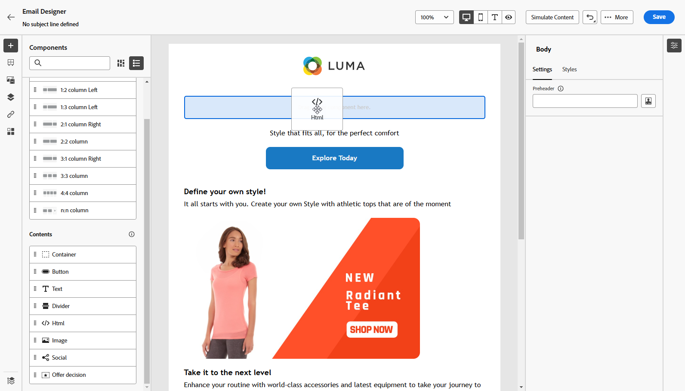

# Trabalhar com o Dynamic Media {#aem-dynamic}

>[!AVAILABILITY]
>
>Esta integração está disponível apenas para um conjunto de organizações (disponibilidade limitada). Para obter acesso, entre em contato com o(a) representante da Adobe.

O seletor de ativos agora é compatível com Dynamic Media, permitindo selecionar e usar facilmente representações de Dynamic Media aprovadas no Journey Optimizer. As alterações feitas em ativos no Adobe Experience Manager são refletidas instantaneamente no conteúdo do Journey Optimizer, garantindo que as versões mais atualizadas estejam sempre em uso, sem a necessidade de atualizações manuais.

Observe que essa integração só está disponível para clientes que usam o Dynamic Media Manager as a Cloud Service.

Para saber mais sobre o Dynamic Media no Adobe Experience Manager as a Cloud Service, consulte a [documentação do Experience Manager](https://experienceleague.adobe.com/pt-br/docs/experience-manager-cloud-service/content/assets/dynamicmedia/dynamic-media){target="_blank"}.

## Adicionar e gerenciar Dynamic media {#dynamic-media}

Aprimore e otimize seu conteúdo para qualquer tela ou navegador inserindo a mídia dinâmica do Adobe Experience Manager as a Cloud Service diretamente no conteúdo do Journey Optimizer.  Em seguida, é possível redimensionar, cortar, aprimorar e fazer outros ajustes, conforme necessário.

1. Arraste e solte um **[!UICONTROL componente do HTML]** no seu conteúdo.

1. Selecione **[!UICONTROL Mostrar o código-fonte]**.

   

1. No menu **[!UICONTROL Editar HTML]**, navegue até **[!UICONTROL Assets]** e clique em **[!UICONTROL Abrir seletor de ativos]**.

   Como alternativa, você pode copiar e colar o URL do ativo.

   

1. Navegue pelos ativos do AEM e selecione aquele que deseja adicionar ao conteúdo.

1. Ajuste os parâmetros da imagem (por exemplo, altura, largura, rotação, inversão, brilho, matiz etc.) conforme necessário para corresponder aos requisitos do ativo.

   Para obter uma lista abrangente dos parâmetros de imagem que podem ser adicionados ao URL, consulte a [documentação do Experience Manager](https://experienceleague.adobe.com/pt-br/docs/dynamic-media-developer-resources/image-serving-api/image-serving-api/http-protocol-reference/command-reference/c-command-reference).

   

1. Clique em **[!UICONTROL Salvar]**.

Seu conteúdo agora inclui mídia dinâmica. Todas as atualizações feitas no Experience Manager serão exibidas automaticamente no Journey Optimizer.

## Personalizar a sobreposição de texto {#text-overlay}

Personalize facilmente qualquer mídia dinâmica substituindo a sobreposição de texto existente pelo novo texto de sua escolha, o que permite atualizações e personalização ininterruptas.

Por exemplo, usando a funcionalidade de experimentação, é possível atualizar a sobreposição de texto existente, substituindo-a por um texto diferente para cada tratamento, garantindo que ela seja personalizada para cada perfil quando eles abrirem suas mensagens.

1. Arraste e solte um **[!UICONTROL componente do HTML]** no seu conteúdo.

1. Selecione **[!UICONTROL Mostrar o código-fonte]**.

1. No menu **[!UICONTROL Editar HTML]**, acesse **[!UICONTROL Assets]** e **[!UICONTROL Abra o seletor de ativos]**.

   Você também pode simplesmente copiar e colar o URL de ativos.

1. Navegue pelos ativos do AEM e selecione aquele que deseja adicionar ao conteúdo.

1. Substitua a sobreposição pelo texto desejado.

   

1. Atualize os parâmetros de imagens:

   * **Camada**: digite o elemento base onde o texto é colocado.
   * **Size**: atualize o tamanho do bloco de texto.
   * **TextAttr**: ajustar o tamanho da sua fonte de texto.
   * **Pos**: definir a posição do texto na imagem.

   >[!WARNING]
   >
   >O parâmetro Layer é necessário para atualizar a mídia dinâmica.

   

1. Clique em **[!UICONTROL Salvar]**.

O conteúdo agora inclui a sobreposição de texto atualizada.

## Adicionar e gerenciar o modelo de mídia dinâmica {#dynamic-media-template}

Adicione facilmente seu modelo do Dynamic Media no Journey Optimizer e atualize seu conteúdo de mídia sempre que necessário. Agora é possível incorporar campos de personalização à mídia, permitindo criar conteúdo mais personalizado e envolvente no Journey Optimizer.

Saiba mais sobre [Modelo de mídia dinâmica](https://experienceleague.adobe.com/pt-br/docs/dynamic-media-classic/using/template-basics/quick-start-template-basics).

### Com componente de imagem {#image-component}

É possível inserir seu modelo dinâmico diretamente no conteúdo usando o componente de Imagem:

1. Abra a campanha ou jornada e acesse o conteúdo.

1. Arraste e solte um **componente de Imagem** no seu layout.

   Para obter mais informações sobre o componente de Imagem, consulte [esta página](../email/content-components.md).

   

1. Navegue pelos ativos do AEM e selecione o modelo de Dynamic Media que deseja adicionar ao conteúdo.

   

1. Nas **Configurações de imagem**, navegue para acessar os parâmetros do seu modelo de mídia dinâmica.

   Os campos disponíveis dependem dos parâmetros adicionados durante a [criação do modelo](https://experienceleague.adobe.com/pt-br/docs/dynamic-media-classic/using/template-basics/creating-template-parameters#creating_template_parameters) no Adobe Experience Manager.

   

1. Preencha os diferentes campos e use o editor de personalização para adicionar conteúdo personalizado. Você pode usar qualquer atributo, como o nome do perfil, a cidade ou outros detalhes relevantes, para criar uma experiência mais personalizada.

   Saiba mais sobre a personalização em [esta página](../personalization/personalize.md).

   

1. O conteúdo condicional pode ser aplicado ao componente do Dynamic Media para gerar diferentes variantes do conteúdo. [Saiba mais](../personalization/dynamic-content.md)

1. Clique em **[!UICONTROL Salvar]**.

Depois de executar os testes e validar o conteúdo, você pode enviar a mensagem para o público-alvo.

### Com componente do HTML {#html-component}

Você pode inserir seu modelo dinâmico diretamente no conteúdo usando o componente HTML:

1. Abra a campanha ou jornada e acesse o conteúdo.

1. Arraste e solte um **componente HTML** no seu layout.

   

1. Selecione **[!UICONTROL Mostrar o código-fonte]**.

   

1. No menu **[!UICONTROL Editar HTML]**, acesse **[!UICONTROL Assets]** e **[!UICONTROL Abra o seletor de ativos]**.

   Você também pode simplesmente copiar e colar o URL de ativos.

1. Ajuste os parâmetros de texto da imagem conforme necessário para corresponder aos requisitos do ativo.

   

1. Clique em **[!UICONTROL Salvar]**.

Depois de executar os testes e validar o conteúdo, você pode enviar a mensagem para o público-alvo.

<!--
## Personalization with Text Overlay

Easily customize any dynamic media by replacing the existing text overlay with new text of your choice, allowing for seamless updates and personalization.

In this example, our goal is to update the existing text overlay by replacing it with a new validity date and adding a personalization block, ensuring it is customized for each profile when they open their messages.

1. Drag and drop an **[!UICONTROL HTML component]** into your content.

1. Select **[!UICONTROL Show the source code]**.

1. From the **[!UICONTROL Edit HTML]** menu, access **[!UICONTROL Assets]** then **[!UICONTROL Open asset selector]**.

    You can also simply copy and paste your assets URL.

1. Browse through your AEM assets and select the one you want to add to your content.

1. Replace the overlay with the desired text.

    Here we change the validity date from 31st December 2024 to the 1st July 2025.

1. Add the required personalization fields to your image.

1. Click **[!UICONTROL Save]**.

Your content now includes your updated text overlay and personalization.

## Add Dynamic media conditional content

Enable conditional content in your dynamic media to better target your audience and deliver a more personalized experience.

1. Drag and drop an **[!UICONTROL HTML component]** into your content.

1. Select **[!UICONTROL Show the source code]**.

1. From the **[!UICONTROL Edit HTML]** menu, access **[!UICONTROL Assets]** then **[!UICONTROL Open asset selector]**.

    You can also simply copy and paste your assets URL.

1. Browse through your AEM assets and select the one you want to add to your content.

1. Once your dynamic media is inserted to your content, select **[!UICONTROL Enable conditional]** content from your HTML component toolbar to create your different user experiences. 

1. From the Variant - 1, click **[!UICONTROL Select condition]** to fine tune your audience.

1. Choose your condition or create a new one if needed and click **[!UICONTROL Select]**.

    [Learn more about conditions](../personalization/create-conditions.md)

1. Select your **[!UICONTROL Component]** and access the **[!UICONTROL Settings]** menu.

1. In the **[!UICONTROL Custom Attributes]** menu, populate the Dynamic Media text and personalization fields to customize the content for your audience.

-->
