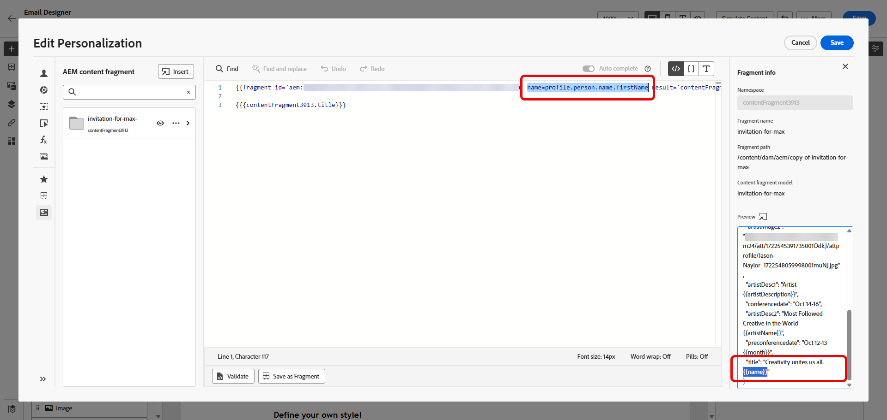

# Fragmentos de conteúdo do Adobe Experience Manager {#aem-fragments}

Ao integrar o Adobe Experience Manager as a Cloud Service com o Adobe Journey Optimizer, agora é possível incorporar facilmente os Fragmentos de conteúdo do AEM ao conteúdo do Journey Optimizer. Essa conexão simplificada simplifica o processo de acesso e aproveitamento do conteúdo do AEM, permitindo a criação de campanhas e jornadas personalizadas e dinâmicas.

Para saber mais sobre os Fragmentos de conteúdo do AEM, consulte [Trabalho com fragmentos de conteúdo](https://experienceleague.adobe.com/en/docs/experience-manager-cloud-service/content/sites/administering/content-fragments/overview){target="_blank"} na documentação do Experience Manager.

>[!AVAILABILITY]
>
>Para clientes da área de saúde, a integração é habilitada somente mediante o licenciamento das ofertas complementares Journey Optimizer Healthcare Shield e Adobe Experience Manager Enhanced Security.

## Limitações {#limitations}

* É recomendável limitar o número de usuários com acesso para publicar fragmentos de conteúdo para reduzir o risco de erros acidentais.

* Para conteúdo multilíngue, somente o fluxo manual é compatível.

* As variações não são suportadas no momento.

## Criar e atribuir uma tag no Experience Manager

Antes de usar o fragmento de conteúdo no Journey Optimizer, é necessário criar uma tag especificamente para o Journey Optimizer:

1. Acesse seu ambiente **Experience Manager**.

1. No menu **Ferramentas**, selecione **Marcação**.

   

1. Clique em **Criar Marca**.

1. Verifique se a ID segue a seguinte sintaxe: `ajo-enabled:{AJO-OrgId}/{AJO-SandboxName}`.

1. Clique em **Criar**.

1. Defina seu Modelo de fragmento de conteúdo conforme detalhado na [documentação do Experience Manager](https://experienceleague.adobe.com/en/docs/experience-manager-cloud-service/content/sites/administering/content-fragments/content-fragment-models){target="_blank"} e atribua a tag do Journey Optimizer recém-criada.

Agora você pode começar a criar e configurar o fragmento de conteúdo para uso posterior no Journey Optimizer. Saiba mais em [documentação do Experience Manager](https://experienceleague.adobe.com/en/docs/experience-manager-cloud-service/content/sites/administering/content-fragments/managing){target="_blank"}.

## Adicionar fragmentos de conteúdo do Experience Manager {#aem-add}

Depois de criar e personalizar os fragmentos de conteúdo do AEM, você pode importá-los para a campanha ou jornada do otimizador de Jornadas.

1. Crie sua [Campanha](../campaigns/create-campaign.md) ou [Jornada](../building-journeys/journey-gs.md).

1. Para acessar o fragmento de conteúdo do AEM, clique no  em qualquer campo de texto ou abra o código-fonte por meio de um componente de conteúdo do HTML.

   

1. No menu **[!UICONTROL Fragmento de Conteúdo do AEM]** no painel esquerdo, clique em **[!UICONTROL Abrir seletor de CF do AEM]**.

   

1. Selecione um **[!UICONTROL Fragmento de conteúdo]** na lista disponível para importar para o conteúdo do Journey Optimizer.

1. Clique em **[!UICONTROL Mostrar filtros]** para ajustar a lista de Fragmentos de conteúdo.

   Por padrão, o filtro de Fragmento de conteúdo é predefinido para exibir somente conteúdo aprovado.

   

1. Depois de selecionar seu **[!UICONTROL Fragmento do conteúdo]**, clique em **[!UICONTROL Selecionar]** para abri-lo.

   

1. Clique em **[!UICONTROL Exibir fragmento]** para exibir as informações do fragmento. Observe que abrir o menu **[!UICONTROL Informações do fragmento]** coloca o editor no modo somente leitura.

   Selecione **[!UICONTROL Visualizar]** no menu à direita para exibir seu fragmento no Adobe Experience Manager.

   

1. Clique no ícone  para acessar o menu avançado do Fragmento:

   * **[!UICONTROL Trocar fragmento]**
   * **[!UICONTROL Explorar referências]**
   * **[!UICONTROL Abrir no AEM]**

   

1. Escolha os campos desejados em seu **[!UICONTROL Fragmento]** para adicionar ao conteúdo.
   <!--
    Note that if you choose to copy the value, any future updates to the Content Fragment will not be reflected in your campaign or journey. However, using dynamic placeholders ensures real-time updates.-->

   

1. Para habilitar a personalização em tempo real, todos os espaços reservados usados em um **[!UICONTROL Fragmento de conteúdo]** devem ser declarados explicitamente pelo usuário como parâmetros na marca auxiliar do fragmento. Você pode mapear esses espaços reservados para atributos de perfil, atributos contextuais, cadeias de caracteres estáticas ou variáveis predefinidas usando os seguintes métodos:

   1. **Mapeamento de Perfil ou de Atributo Contextual**: atribua o espaço reservado a um perfil ou atributo contextual, por exemplo: name = profile.person.name.firstName.

   1. **Mapeamento de Cadeia de Caracteres Estática**: atribua um valor de cadeia de caracteres fixo colocando-o entre aspas duplas; por exemplo: name = &quot;John&quot;.

   1. **Mapeamento de Variáveis**: faça referência a uma variável declarada anteriormente na mesma HTML, por exemplo, name = &#39;variableName&#39;.
Nesse caso, verifique se **_variableName_** está declarado antes de adicionar a ID do fragmento, usando a seguinte sintaxe:

      ```html
       
      ```

   No exemplo abaixo, o espaço reservado **_name_** é mapeado para o atributo **_profile.person.name.firstName_** dentro do fragmento.

   {zoomable="yes"}


1. Clique em **[!UICONTROL Salvar]**. Agora você pode testar e verificar o conteúdo da sua mensagem conforme detalhado em [esta seção](../content-management/preview.md).

Depois de executar os testes e validar o conteúdo, você pode [enviar a campanha](../campaigns/review-activate-campaign.md) ou [publicar a jornada](../building-journeys/publishing-the-journey.md) para o público-alvo.

O Adobe Experience Manager permite identificar as campanhas ou jornadas do Journey Optimizer em que um fragmento de conteúdo está sendo usado.
