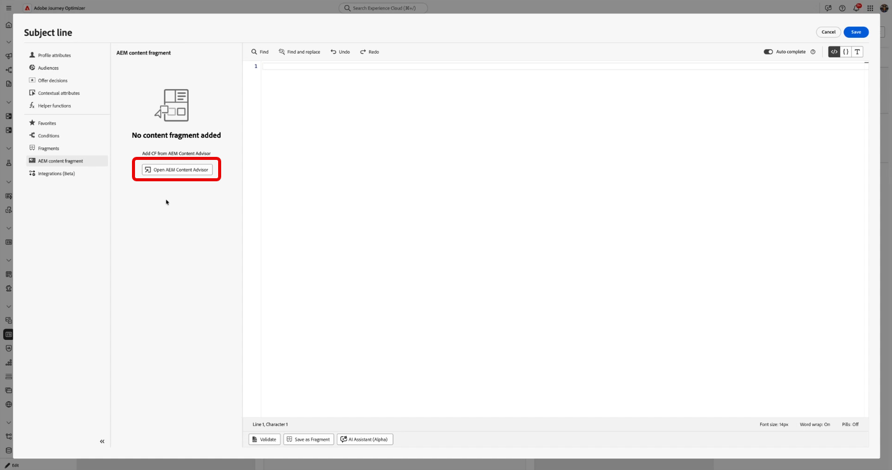
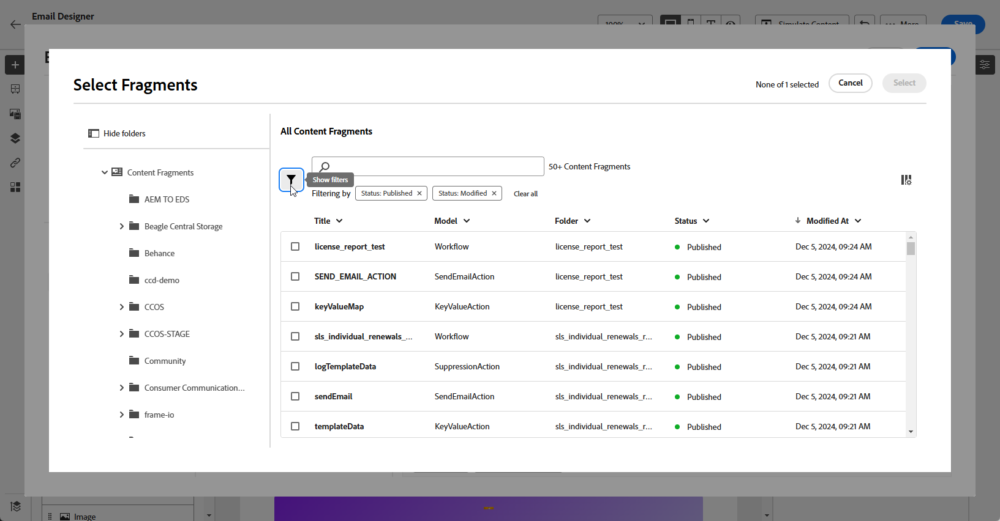

# Trabalhar com fragmentos de conteúdo do Adobe Experience Manager {#aem-fragments}

>[!BEGINSHADEBOX]

As experiências existentes do **Seletor de ativos** e do **Seletor de fragmentos de conteúdo** nos fluxos de trabalho do Adobe Journey Optimizer estão sendo substituídas pelo **Supervisor de conteúdo**. O Supervisor de conteúdo fornece uma interface unificada, habilitada por IA, para detectar e selecionar o Assets, Fragmentos de conteúdo e Mídia dinâmica diretamente nos fluxos de trabalho de criação do AJO. As integrações existentes continuarão a funcionar durante o período de transição.

>[!ENDSHADEBOX]

>[!AVAILABILITY]
>
>Esta integração se aplica ao **Adobe Experience Manager as a Cloud Service Sites**, somente para **Fragmentos de conteúdo**. O Journey Optimizer lê fragmentos da camada **Publicar** (não do Autor).

A integração entre o Adobe Experience Manager e o Journey Optimizer segue esse fluxo de dados:

1. **[Configurar o Dispatcher](https://experienceleague.adobe.com/en/docs/experience-manager-cloud-service/content/sites/administering/content-fragments/content-fragments-with-journey-optimizer#dispatcher-configuration){target="_blank"}**: para permitir que o Journey Optimizer acesse Fragmentos de Conteúdo do Adobe Experience Manager por meio da API de Gerenciamento de Fragmentos de Conteúdo, primeiro configure o Dispatcher. Esse é um pré-requisito para a integração do.

1. **[Criar e criar](https://experienceleague.adobe.com/en/docs/experience-manager-cloud-service/content/sites/administering/content-fragments/managing#creating-a-content-fragment)**: o conteúdo é criado e configurado no Adobe Experience Manager como Fragmentos de Conteúdo.

1. **[Marcação](https://experienceleague.adobe.com/en/docs/experience-manager-cloud-service/content/sites/administering/content-fragments/managing#manage-tags)**: os fragmentos de conteúdo devem ser marcados com a marca específica da Journey Optimizer (`ajo-enabled:{OrgId}/{SandboxName}`).

1. **[Publicar](https://experienceleague.adobe.com/en/docs/experience-manager-cloud-service/content/sites/administering/content-fragments/managing#publishing-and-previewing-a-fragment)**: os fragmentos de conteúdo são publicados no Adobe Experience Manager, tornando-os disponíveis para o Journey Optimizer.

1. **[Acesso](#aem-add)**: o Journey Optimizer busca e exibe os Fragmentos de conteúdo disponíveis da instância de publicação do Adobe Experience Manager em tempo real.

1. **[Integração](#aem-add)**: os Fragmentos de conteúdo são selecionados e integrados em campanhas ou jornadas.

Quando um fragmento de conteúdo é publicado no Adobe Experience Manager, um evento é enviado para atualizar o conteúdo no lado do Journey Optimizer. Se a atualização for bem-sucedida, o Fragmento de conteúdo ficará disponível em aproximadamente 5 minutos para jornadas unitárias e no próximo lote de processamento para casos de uso em lote. Quando a atualização estiver disponível no Journey Optimizer, o conteúdo publicado mais recente será usado em todas as campanhas e jornadas aplicáveis.

>[!AVAILABILITY]
>
>Para clientes da área de saúde, a integração é habilitada somente mediante o licenciamento das ofertas complementares Journey Optimizer Healthcare Shield e Adobe Experience Manager Extended Security for Healthcare.

## Criar e atribuir uma tag no Experience Manager

>[!IMPORTANT]
>
>Para permitir que o Journey Optimizer acesse Fragmentos de conteúdo do Adobe Experience Manager por meio da API de gerenciamento de fragmentos de conteúdo, primeiro [configure o Dispatcher](https://experienceleague.adobe.com/en/docs/experience-manager-cloud-service/content/sites/administering/content-fragments/content-fragments-with-journey-optimizer#dispatcher-configuration){target="_blank"}.

Antes de usar o fragmento de conteúdo no Journey Optimizer, é necessário criar uma tag especificamente para o Journey Optimizer:

1. Acesse seu ambiente **Experience Manager**.

1. No menu **Ferramentas**, selecione **Marcação**.

   

1. Clique em **Criar Marca**.

1. Verifique se a ID segue a seguinte sintaxe: `ajo-enabled:{AJO-OrgId}/{AJO-SandboxName}`.

1. Clique em **Criar**.

1. Defina seu Modelo de fragmento de conteúdo conforme detalhado na [documentação do Experience Manager](https://experienceleague.adobe.com/en/docs/experience-manager-cloud-service/content/sites/administering/content-fragments/content-fragment-models){target="_blank"} e atribua a tag do Journey Optimizer recém-criada.

Essa conexão em tempo real garante que o conteúdo esteja sempre atualizado, mas também significa que quaisquer alterações nos fragmentos publicados afetarão imediatamente as campanhas e jornadas ativas.

Agora você pode começar a criar e configurar o fragmento de conteúdo para uso posterior no Journey Optimizer. Saiba mais em [documentação do Experience Manager](https://experienceleague.adobe.com/en/docs/experience-manager-cloud-service/content/sites/administering/content-fragments/managing){target="_blank"}.

## Adicionar fragmentos de conteúdo do Experience Manager {#aem-add}

Depois de criar e personalizar os fragmentos de conteúdo do AEM, você pode importá-los para a campanha ou jornada do otimizador de Jornadas.

1. Crie sua [Campanha](../campaigns/create-campaign.md) ou [Jornada](../building-journeys/journey-gs.md).

1. Para acessar o fragmento de conteúdo do AEM, clique no  em qualquer campo de texto ou abra o código-fonte por meio de um componente de conteúdo do HTML.

   

1. No menu **[!UICONTROL Fragmento de Conteúdo do AEM]** no painel esquerdo, clique em **[!UICONTROL Abrir o Supervisor de Conteúdo do AEM]**.

   

1. Navegue pela lista e selecione um **[!UICONTROL Fragmento do conteúdo]** para importar para o conteúdo do Journey Optimizer.

   >[!NOTE]
   >
   > Se o fragmento tiver uma ou mais variações **publicadas**, uma lista suspensa **[!UICONTROL Variação]** será exibida no seletor. Se nenhuma **[!UICONTROL Variação]** for selecionada, a variação **Principal** será usada automaticamente. Saiba mais em [Trabalhar com variações de Fragmento de conteúdo](#aem-variations).

1. Clique em **[!UICONTROL Mostrar filtros]** para ajustar a lista de Fragmentos de conteúdo.

   Por padrão, o filtro de Fragmento de conteúdo é predefinido para exibir somente conteúdo aprovado.

   

1. Depois de selecionar seu **[!UICONTROL Fragmento do conteúdo]**, clique em **[!UICONTROL Selecionar]** para adicioná-lo.

   

1. Clique em **[!UICONTROL Exibir fragmento]** para exibir as informações do fragmento. Observe que abrir o menu **[!UICONTROL Informações do fragmento]** coloca o editor no modo somente leitura.

   Selecione **[!UICONTROL Visualizar]** no menu à direita para exibir seu fragmento no Adobe Experience Manager.

   

1. Clique no ícone  para acessar o menu avançado do Fragmento:

   * **[!UICONTROL Trocar fragmento]**
   * **[!UICONTROL Explorar referências]**
   * **[!UICONTROL Abrir no AEM]**

   

1. Escolha os campos desejados em seu **[!UICONTROL Fragmento]** para adicionar ao conteúdo.

   <!--
    Note that if you choose to copy the value, any future updates to the Content Fragment will not be reflected in your campaign or journey. However, using dynamic placeholders ensures real-time updates.
    
    -->

   

1. Para exibir uma URL de imagem que esteja armazenada em um atributo de Fragmento de conteúdo, por exemplo, um caminho ou campo de URL do modelo de fragmento, insira-o no HTML com uma tag `` e o atributo de fragmento como origem, por exemplo:

   ```html
   
   ```

   >[!NOTE]
   >
   >Não há suporte para URLs de imagens relativas do Adobe Experience Manager, use URLs **absolutos**.

1. Selecione **Pills: Off** para habilitar a experiência de pílulas para melhorar a legibilidade, ocultando caminhos de atributos longos.

   

1. Para usar os **espaços reservados para personalização** criados no Adobe Experience Manager dentro do texto do fragmento, defina-os no Fragmento de conteúdo no Adobe Experience Manager da seguinte maneira: `{{name}}`.

   No Journey Optimizer, esses tokens são marcadores de posição. Com a experiência de **pílulas** ativada, elas aparecem na seção **[!UICONTROL Fragmento de conteúdo do AEM]** do painel direito, ao lado dos campos de fragmento.

1. Para habilitar a personalização em tempo real, todos os espaços reservados usados em um **[!UICONTROL Fragmento de conteúdo]** devem ser declarados explicitamente pelo usuário como parâmetros na marca auxiliar do fragmento. Mapeie esses espaços reservados para atributos de perfil, atributos contextuais, cadeias de caracteres estáticas ou variáveis predefinidas da seguinte maneira:

   1. **Mapeamento de Perfil ou de Atributo Contextual**: atribua o espaço reservado a um perfil ou atributo contextual, por exemplo: name = profile.person.name.firstName.

   1. **Mapeamento de Cadeia de Caracteres Estática**: atribua um valor de cadeia de caracteres fixo colocando-o entre aspas duplas; por exemplo: name = &quot;John&quot;.

   1. **Mapeamento de Variáveis**: faça referência a uma variável declarada anteriormente na mesma HTML, por exemplo, name = &#39;variableName&#39;.
Nesse caso, verifique se **_variableName_** está declarado antes de adicionar a ID do fragmento, usando a seguinte sintaxe:

      ```html
       
      ```

   No exemplo abaixo, o espaço reservado **_mês_** é mapeado para o atributo **_profile.person.birthDate_** dentro do fragmento.

   {zoomable="yes"}

1. Clique em **[!UICONTROL Salvar]**. Agora você pode testar e verificar o conteúdo da sua mensagem conforme detalhado em [esta seção](../content-management/preview.md).

   Observe que o Fragmento de conteúdo selecionado permanece ativo para esta mensagem. Ao abrir o Editor do Personalization em outro campo ou bloco de conteúdo, você pode continuar trabalhando com o mesmo fragmento da seção **[!UICONTROL Fragmento de Conteúdo do AEM]** e adicionar mais campos sem reabrir o **[!UICONTROL Abrir Supervisor de Conteúdo do AEM]**.

Depois de executar os testes e validar o conteúdo, você pode [enviar a campanha](../campaigns/review-activate-campaign.md) ou [publicar a jornada](../building-journeys/publish-journey.md) para o público-alvo.

O Adobe Experience Manager permite identificar as campanhas ou jornadas do Journey Optimizer em que um fragmento de conteúdo está sendo usado. Saiba mais em [documentação do Adobe Experience Manager](https://experienceleague.adobe.com/en/docs/experience-manager-cloud-service/content/sites/administering/content-fragments/extension-content-fragment-ajo-external-references){target="_blank"}.

## Trabalhar com variações de Fragmento de conteúdo {#aem-variations}

No Adobe Experience Manager, cada fragmento de conteúdo é composto do seguinte:

* **Principal**: o conteúdo principal do fragmento que sempre existe, não pode ser excluído e é a base para todas as variações.
* **Variações**: uma ou mais permutas de **Main** que os autores criam para canais ou cenários específicos. As variações dentro do fragmento não estão como ativos separados e podem ser comparadas e sincronizadas com **Principal**.

Exemplos de casos de uso de variação:

* Uma versão curta da cópia para uma notificação por push e uma versão mais longa para email.
* Ajustes de tom regionais sem criar um fragmento separado.
* Mensagens específicas do canal (por exemplo, Web em comparação com dispositivos móveis).

➡️ [Saiba mais na documentação do Adobe Experience Manager](https://experienceleague.adobe.com/en/docs/experience-manager-65/content/assets/content-fragments/content-fragments-variations)

O Journey Optimizer permite escolher qual variação usar ao inserir um fragmento, de modo que campanhas ou jornadas diferentes possam depender de representações diferentes do mesmo conteúdo de origem no Adobe Experience Manager sem duplicar fragmentos.

Para selecionar uma variação:

1. Abra uma [campanha](../campaigns/create-campaign.md) ou [jornada](../building-journeys/journey-gs.md).

1. Clique no  em qualquer campo de texto ou abra a fonte do HTML a partir de um componente de conteúdo do HTML.

1. Em **[!UICONTROL Fragmento de Conteúdo do AEM]**, clique em **[!UICONTROL Abrir Supervisor de Conteúdo do AEM]**.

   

1. Para selecionar um Fragmento de Conteúdo do Adobe Experience Manager específico da localidade na exibição de tabela, use **[!UICONTROL Personalizar tabela]** para adicionar a coluna **[!UICONTROL Idioma]**. Os valores de local são exibidos na tabela, permitindo identificar e selecionar o fragmento apropriado.

   

1. Selecione seu **[!UICONTROL Fragmento de conteúdo]**.

1. Clique no  para abrir o menu **[!UICONTROL Detalhes]**. Se o fragmento tiver uma ou mais variações publicadas, uma lista suspensa **[!UICONTROL Variação]** será exibida ao lado dos detalhes do fragmento.

   

1. No menu **[!UICONTROL Detalhes rápidos]**, clique em **[!UICONTROL Explorar referências]** para abrir opções relacionadas no Adobe Experience Manager para obter detalhes de variação, visualização e prova quando disponíveis.

1. Escolha sua variação e clique em **[!UICONTROL Selecionar]**.

   >[!NOTE]
   >
   > Se você não selecionar uma variação ou se o fragmento foi adicionado antes que o suporte à variação estivesse disponível, o Journey Optimizer usará a variação **Principal** automaticamente no momento da entrega.

Depois de inserir um fragmento com uma variação, publicá-lo novamente no Adobe Experience Manager atualiza a cada **variação referenciada** em campanhas ativas ou jornadas automaticamente. As visualizações e provas ainda usam a variação escolhida, com o conteúdo publicado mais recente para essa variação.
