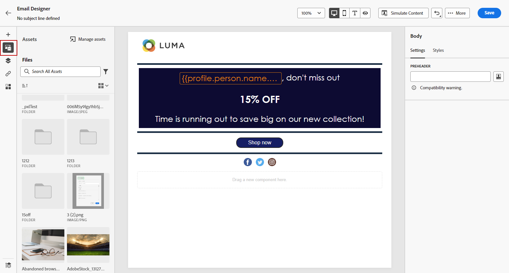

# Criar e gerenciar ativos com [!DNL Experience Manager Assets]{#experience-manager-assets}

## Introdução ao [!DNL Experience Manager Assets] {#get-started-assets}

Junte os fluxos de trabalho de marketing e de criação usando o **[!DNL Adobe Experience Manager Assets]**. Integrado nativamente com o **[!DNL Adobe Journey Optimizer]**, acesse o **[!DNL Assets Essentials]** ou o **[!DNL Assets as a Cloud Service]** para armazenar, gerenciar, descobrir e distribuir ativos digitais. Ele fornece um repositório único e centralizado de ativos que você pode usar para preencher suas mensagens.

O **[!DNL Adobe Experience Manager Assets]** oferece dois espaços de trabalho de ativos colaborativos e centralizados que estendem o sistema criativo e unificam ativos digitais para entrega de experiência:

* **[!DNL Assets as a Cloud Service]**: o Adobe Experience Manager Assets as a Cloud Service oferece uma solução de nuvem fácil de usar para operações eficientes de Gerenciamento de ativos digitais e Mídia dinâmica. Ele incorpora, de maneira contínua, recursos avançados, incluindo Inteligência artificial e Aprendizado de máquina.

  Saiba mais em [documentação do Adobe Experience Manager as a Cloud Service](https://experienceleague.adobe.com/docs/experience-manager-cloud-service/content/assets/overview.html){target="_blank"}.

* **[!DNL Assets Essentials]**: o Experience Manager Assets Essentials é uma solução leve Assets as a Cloud Service para gerenciamento e colaboração unificados de ativos. Com uma interface moderna e simplificada, ele capacita equipes de criação e marketing para armazenar, descobrir e distribuir ativos digitais com facilidade.

  Saiba mais em [Documentação do Adobe Experience Manager Assets Essentials](https://experienceleague.adobe.com/docs/experience-manager-assets-essentials/help/introduction.html){target="_blank"}.

Dependendo do seu contrato, o **[!DNL Adobe Experience Manager Assets Essentials]** ou o **[!DNL Adobe Experience Manager Assets as a Cloud Service]** pode ser acessado diretamente de **[!DNL Adobe Journey Optimizer]** através da seção **[!UICONTROL Assets]** do menu esquerdo. Você também pode acessar ativos e pastas ao [criar um conteúdo de email](../email/get-started-email-design.md).

## Pré-requisitos{#assets-prerequisites}

>[!BEGINTABS]

>[!TAB Adobe Experience Manager Assets Essentials]

Antes de usar o [!DNL Adobe Experience Manager Assets Essentials], você deve adicionar usuários aos **Usuários consumidores do Assets Essentials** e/ou aos **Usuários do Assets Essentials** perfis de produto. Leia mais na [documentação do Assets Essentials](https://experienceleague.adobe.com/docs/experience-manager-assets-essentials/help/get-started-admins/deploy-administer.html#add-user-groups){target="_blank"}.

>[!NOTE]
>Para produtos do Journey Optimizer obtidos antes de 6 de janeiro de 2022, é necessário implantar o **[!DNL Adobe Experience Manager Assets Essentials]** para sua organização. Saiba mais na seção [Implantar o Assets Essentials](https://experienceleague.adobe.com/docs/experience-manager-assets-essentials/help/deploy-administer.html?lang=pt-BR){target="_blank"}.

>[!TAB Adobe Experience Manager Assets as a Cloud Service]

Antes de usar o **[!DNL Adobe Experience Manager Assets as a Cloud Service]**, você deve adicionar usuários ao Assets Cloud Services. Leia mais no [Adobe Experience Manager Assets as a Cloud Service](https://experienceleague.adobe.com/docs/experience-manager-cloud-service/content/security/ims-support.html).

>[!ENDTABS]

## Fazer upload e inserir ativos{#add-asset}

Para importar arquivos para **[!DNL Assets Essentials]** ou **[!DNL Assets as a Cloud Service]**, primeiro é necessário procurar ou criar a pasta em que ela será armazenada. Você poderá inseri-los no conteúdo de email.

1. Na página inicial de [!DNL Adobe Journey Optimizer], selecione a guia **[!UICONTROL Assets]** no menu **[!UICONTROL Gestão de conteúdo]** para acessar **[!DNL Assets Essentials]** ou **[!DNL Assets as a Cloud Service]**.

   

1. Escolha o repositório da Assets no Journey Optimizer. Você pode optar por um repositório do **[!DNL Assets Essentials]** ou do **[!DNL Assets as a Cloud Service]**, desde que seja o proprietário desta solução.

   

+++ Saiba como alternar entre repositórios do Assets.

   Para alterar o repositório do Assets, selecione o ícone Conta no canto superior direito e clique em **[!UICONTROL Selecionar Repositório]**.

   

+++

1. Clique duas vezes em uma pasta na seção central ou na exibição em árvore para abri-la.

   Você também pode clicar em **[!UICONTROL Criar pasta]** para criar uma nova pasta.

   

1. Uma vez na pasta selecionada ou criada, clique em **[!UICONTROL Adicionar Assets]** para carregar um novo ativo para sua pasta.

   

1. Em **[!UICONTROL Carregar arquivos]**, clique em **[!UICONTROL Procurar]** e escolha se deseja **[!UICONTROL Procurar arquivos]** ou **[!UICONTROL Procurar pastas]**.

1. Selecione o arquivo que deseja fazer upload. Quando terminar, clique em **[!UICONTROL Carregar]**. Para saber mais sobre como gerenciar ativos, consulte esta [página](https://experienceleague.adobe.com/docs/experience-manager-assets-essentials/help/manage-organize.html).

1. Para editar ainda mais seus ativos com o Adobe Photoshop Express, clique duas vezes neles. Em seguida, no menu à direita, selecione o ícone **[!UICONTROL Editar modo]**. [Saiba mais](https://experienceleague.adobe.com/docs/experience-manager-assets-essentials/help/edit-images.html){target="_blank"}.

   

1. Em [!DNL Adobe Journey Optimizer], selecione o menu **[!UICONTROL Seletor de ativos]** no painel esquerdo do Email Designer.

   

1. Selecione a pasta **[!UICONTROL Assets]** criada anteriormente. Você também pode pesquisar seu ativo ou pasta na barra de pesquisa.

1. Arraste e solte seu ativo no conteúdo de email.

   

1. É possível personalizar ainda mais seus ativos, como adicionar um link externo ou um texto usando as guias **[!UICONTROL Configurações]** e **[!UICONTROL Estilos]**. [Saiba mais sobre configurações de componentes](../email/content-components.md)

   

   <!--
    After adding your asset to your email, use the **[!UICONTROL Find similar Stock photos]** option to locate Stock photos that match the content, color, and composition of your image. [Learn more about Adobe Stock](stock.md).

    Note that this option is available for licensed/unlicensed Stock images and images from your Assets folder. 

    
    -->

## [!DNL Adobe Experience Manager Assets] Perguntas frequentes {#faq-assets}

+++ Posso continuar usando o repositório combinado do Assets Essentials no Journey Optimizer?

Se você for provisionado em **[!DNL Adobe Experience Manager Assets as a Cloud Service]**, terá acesso aos repositórios **[!DNL Adobe Experience Manager Assets Essentials]** e **[!DNL Adobe Experience Manager Assets as a Cloud Service]** se o usuário tiver as permissões certas. Esses repositórios estão separados e não estão sincronizados. Um usuário no Journey Optimizer poderá ver ambos os repositórios, incluindo outros ambientes aos quais tem direito, como Preparo, Desenvolvimento etc., e deverá poder alternar facilmente entre eles com o seletor de repositório.

+++

+++ Como os ativos são gerenciados? As alterações no Assets as a Cloud Service são refletidas no Journey Optimizer?

**[!DNL Adobe Experience Manager Assets as a Cloud Service]** integra-se ao Journey Optimizer de forma semelhante a **[!DNL Adobe Experience Manager Assets Essentials]**. Quando modificações são feitas em ativos, uma cópia binária é gerada. Observe que as atualizações no **[!DNL Assets as a Cloud Service]** não se propagam automaticamente para campanhas de email ativas. Quaisquer alterações devem ser selecionadas novamente manualmente no Designer de email para garantir a sincronização entre os ativos e as campanhas de email em andamento.

+++

+++ Posso usar URLs do Dynamic Media ao criar emails no Journey Optimizer?

Sim, você pode usar os URLs do Dynamic Media na criação de email do Journey Optimizer. Basta colar os URLs, em vez de selecionar no Seletor de ativos.

+++

+++ O usuário do Journey Optimizer pode fazer alterações no repositório do Adobe Experience Manager Assets as a Cloud Service a partir da interface do Journey Optimizer?

Se o usuário do Journey Optimizer for um usuário padrão **[!DNL Adobe Experience Manager Assets as a Cloud Service]** e tiver a permissão Editar no repositório, ele poderá fazer edições no repositório **[!DNL Adobe Experience Manager Assets as a Cloud Service]**.

+++
