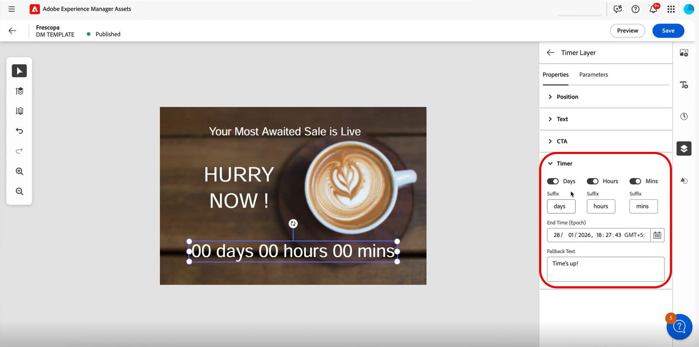
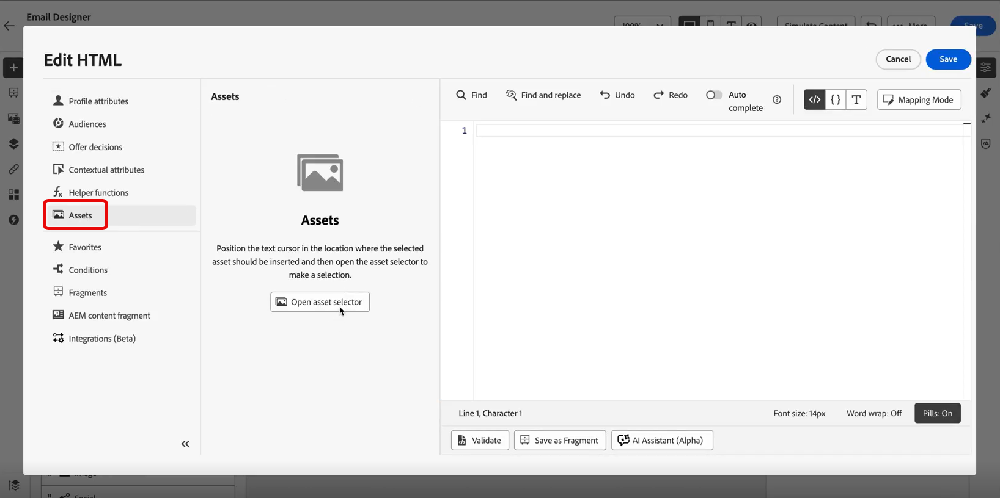

# Inserir timer da contagem regressiva {#countdown}

Crie a urgência e maximize conversões com temporizadores de contagem regressiva do Dynamic Media que são atualizados em tempo real quando os recipients abrem seus emails. Esse recurso é ideal para vendas rápidas, ofertas por tempo limitado e promoções sensíveis ao tempo.

Por exemplo, como comerciante de uma marca de varejo, você está realizando uma venda rápida de 48 horas. Ao usar o cronômetro de contagem regressiva em seus emails promocionais:

* Os recipients que abrirem imediatamente verão &quot;47 horas restantes&quot;
* Os recipients que abrirem 24 horas depois verão &quot;23 horas restantes&quot;
* Os recipients que abrirem após o término da venda verão &quot;Venda encerrada&quot;

Para obter mais informações sobre como adicionar temporizadores de contagem regressiva ao seu modelo do Dynamic Media no Adobe Experience Manager, consulte [este documento](assets/do-not-localize/countdown.pdf).

1. Em **[!DNL Adobe Experience Manager]**, crie um modelo de Mídia dinâmica e adicione um componente de timer de contagem regressiva a ele.

   

1. No **[!DNL Journey Optimizer]**, crie uma nova campanha ou abra uma existente e acesse o Designer de email.

1. Arraste e solte um componente do **HTML** ou do **Asset** no seu conteúdo de email.

1. Passe o mouse sobre o componente e clique em **[!UICONTROL Mostrar o código-fonte]** (para componentes do HTML) ou **[!UICONTROL Procurar]** (para componentes do Assets).

   

1. No menu **[!UICONTROL Editar HTML]**, navegue até **[!UICONTROL Assets]** e clique em **[!UICONTROL Abrir seletor de ativos]** para procurar e selecionar seu modelo publicado do Dynamic Media.

   

1. No menu **[!UICONTROL Atributos personalizados]**, configure os parâmetros de URL personalizáveis conforme necessário para o modelo.

   Clique em **[!UICONTROL Salvar]** quando terminar.

   

1. Selecione o ativo no Designer de email e acesse o menu **[!UICONTROL Configurações]**.

   Configure o seguinte:

   * **Texto do banner**: o texto exibido com seu timer
   * **Hora de término**: a data e a hora em que a contagem regressiva expira. Insira a hora somente em GMT (Horário de Greenwich). O sistema não aceita outros fusos horários.
   * **Texto de fallback**: a mensagem mostrada após o término do cronômetro

   

1. Clique em **[!UICONTROL Visualizar]** para exibir o timer com atualizações de contagem regressiva em tempo real e verificar sua configuração.

Quando os recipients abrem o email, eles veem o tempo preciso restante para a promoção. Se ele reabrir o email posteriormente, a contagem regressiva será atualizada automaticamente para refletir o tempo restante atual. Após a data de término, a mensagem padrão será exibida automaticamente.
