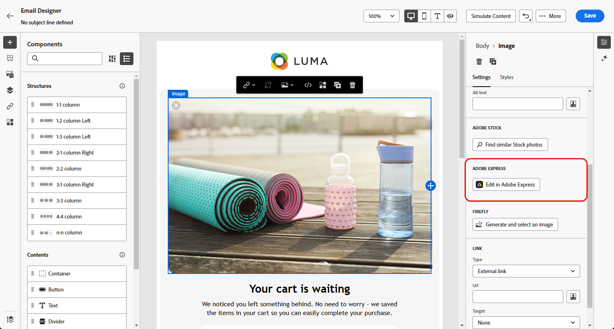

# Editar ativos com o [!DNL Adobe Express]{#express}

>[!CONTEXTUALHELP]
>id="ajo_express_menu"
>title="Integração do Adobe Express"
>abstract="Comece a personalizar seus ativos com a integração do Adobe Express. Esse recurso permite redimensionar imagens, remover planos de fundo, cortar visuais e converter ativos em JPEG ou PNG."

>[!AVAILABILITY]
>
>A integração do Adobe Express no Adobe Journey Optimizer está indisponível para uso com o Healthcare Shield ou o Privacy and Security Shield.

A integração do Adobe Express no Adobe Journey Optimizer permite acessar facilmente as poderosas ferramentas de edição do Adobe Express ao criar conteúdo. Essa integração permite redimensionar imagens, remover planos de fundo, cortar visuais e converter ativos para JPEG ou PNG sem precisar alternar entre as soluções.

Para saber mais sobre o Adobe Express, consulte [esta documentação](https://helpx.adobe.com/br/express/user-guide.html).

Para acessar o menu **[!DNL Adobe Express]**, acesse suas **configurações de imagem** do Designer de email e clique em **[!UICONTROL Editar no Adobe Express]**.

## Redimensionar imagem {#resize}

1. No menu Adobe Express, selecione **[!UICONTROL Redimensionar imagem]**.

   

1. Selecione a **[!UICONTROL Proporção]** que melhor se adapta às proporções do seu ativo.

   

1. Use o controle deslizante para aplicar zoom e cortar seu ativo, e arraste para deslocar e ajustar a área visível.

   

1. Clique em **[!UICONTROL Redefinir]** para restaurar o ativo ao seu estado original.

1. Clique em **[!UICONTROL Aplicar]** assim que o redimensionamento da imagem atender às suas necessidades. Em seguida, **[!UICONTROL Salve]** seu ativo modificado.

1. Na janela **[!UICONTROL Carregar imagem]**, clique em **[!UICONTROL Avançar]** e selecione uma pasta para armazenar o ativo modificado.

   Em seguida, clique em **[!UICONTROL Importar]**.

A imagem agora está pronta para ser usada no conteúdo.

## Remover plano de fundo {#background}

1. No menu Adobe Express, selecione **[!UICONTROL Remover plano de fundo]**.

   

1. O ativo é exibido automaticamente sem o plano de fundo.

   Clique em **[!UICONTROL Aplicar]** para usar isto no seu conteúdo.

   

1. Clique em **[!UICONTROL Salvar]**.

1. Na janela **[!UICONTROL Carregar imagem]**, clique em **[!UICONTROL Avançar]** e selecione uma pasta para armazenar o ativo modificado.

   Em seguida, clique em **[!UICONTROL Importar]**.

A imagem agora está pronta para ser usada no conteúdo.

## Cortar imagem {#crop-image}

1. No menu Adobe Express, selecione **[!UICONTROL Cortar imagem]**.

   

1. Arraste as alças de canto para ajustar e cortar a imagem conforme necessário.

   

1. Clique em **[!UICONTROL Aplicar]** para usar isto no seu conteúdo. Em seguida, **[!UICONTROL Salve]** seu ativo modificado.

1. Na janela **[!UICONTROL Carregar imagem]**, clique em **[!UICONTROL Avançar]** e selecione uma pasta para armazenar o ativo modificado.

   Em seguida, clique em **[!UICONTROL Importar]**.

A imagem agora está pronta para ser usada no conteúdo.

## Converter em JPEG ou PNG {#convert}

1. No menu Adobe Express, selecione **[!UICONTROL Converter em JPEG]** ou **[!UICONTROL Converter em PNG]**, dependendo do formato original da imagem.

   

1. Clique em **[!UICONTROL Aplicar]** para iniciar a conversão.

   

1. Clique em **[!UICONTROL Salvar]**.

1. Com a alteração de formato, é possível salvá-la como uma nova imagem com um nome diferente. Atualize o **[!UICONTROL Nome]** e clique em **[!UICONTROL Salvar]**.

   

1. Na janela **[!UICONTROL Carregar imagem]**, clique em **[!UICONTROL Avançar]** e selecione uma pasta para armazenar o ativo modificado.

   Em seguida, clique em **[!UICONTROL Importar]**.

A imagem agora está pronta para ser usada no conteúdo.
