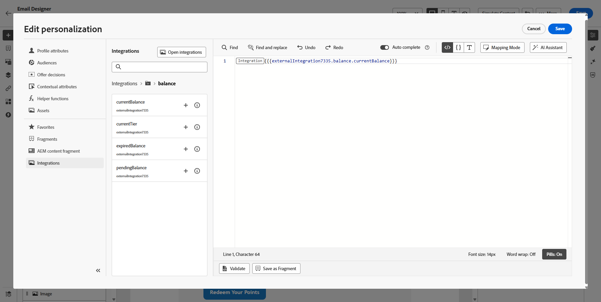

# Trabalhar com integrações {#external-sources}

## Visão geral

O recurso **Integrações** permite a integração perfeita de fontes de dados de terceiros no Adobe Journey Optimizer. Esse recurso simplifica a integração de dados externos e fontes de conteúdo em suas campanhas, permitindo que você forneça mensagens altamente personalizadas e dinâmicas em vários canais.

Você pode usar esse recurso para acessar dados externos e extrair conteúdo de ferramentas de terceiros, como:

* **Pontos de Recompensa** dos sistemas de fidelidade.
* **Informações sobre preços** dos produtos.
* **Recomendações de produto** dos mecanismos de recomendação.
* **Atualizações de logística** como status de entrega.

## Configurar a integração {#configure}

Como administrador, você pode configurar integrações externas seguindo estas etapas:

1. Navegue até a seção **[!UICONTROL Configurações]** no menu esquerdo e clique em **[!UICONTROL Gerenciar]** no cartão **[!UICONTROL Integrações]**.

   Em seguida, clique em **[!UICONTROL Criar integração]** para iniciar uma nova configuração.

   

1. Forneça um **[!UICONTROL Nome]** e uma **[!UICONTROL Descrição]** para a integração.

   >[!NOTE]
   >
   >Esses campos não podem conter espaços.

1. Insira o ponto de extremidade de API **[!UICONTROL URL]**, que pode incluir parâmetros de caminho com variáveis que podem ser definidas usando rótulos e valores padrão.

1. Configure o **[!UICONTROL Modelo de Caminho]** com **[!UICONTROL Nome]** e **[!UICONTROL Valor padrão]**.

   

1. Selecione o **[!UICONTROL Método HTTP]** entre o GET e o POST.

1. Clique em **[!UICONTROL Adicionar cabeçalho]** e/ou **[!UICONTROL Adicionar parâmetros de consulta]** conforme necessário para sua integração. Para cada parâmetro, forneça os seguintes detalhes:

   * **[!UICONTROL Parâmetro]**: um identificador exclusivo usado internamente para fazer referência ao parâmetro.

   * **[!UICONTROL Nome]**: o nome real do parâmetro conforme esperado pela API.

   * **[!UICONTROL Tipo]**: escolha **Constante** para um valor fixo ou **Variável** para entrada dinâmica.

   * **[!UICONTROL Valor]**: insira o valor diretamente para constantes ou selecione um mapeamento de variável.

   * **[!UICONTROL Obrigatório]**: especifique se este parâmetro é obrigatório.

   

1. Escolha um **[!UICONTROL Tipo de Autenticação]**:

   * **[!UICONTROL Sem Autenticação]**: para APIs abertas que não exigem credenciais.

   * **[!UICONTROL Chave de API]**: autentique solicitações usando uma chave de API estática. Insira seu **[!UICONTROL Nome da Chave de API &#x200B;]**, **[!UICONTROL Valor da Chave de API &#x200B;]** e especifique seu **[!UICONTROL Local]**.

   * **[!UICONTROL Autenticação Básica]**: usar a Autenticação Básica HTTP padrão. Insira **[!UICONTROL Nome de usuário]** e **[!UICONTROL Senha]**.

   * **[!UICONTROL OAuth 2.0]**: faça a autenticação usando o protocolo OAuth 2.0. Clique no ícone  para configurar ou atualizar a **[!UICONTROL Carga]**.

   

1. Defina a **[!UICONTROL Configuração de política]**, com o período de **[!UICONTROL Tempo limite]**, para solicitações de API e opte por habilitar a limitação, o cache e/ou tentar novamente.

1. Com o campo **[!UICONTROL Carga de resposta]**, é possível decidir quais campos da saída de exemplo precisam ser usados para a personalização da mensagem.

   Clique no ícone  e cole uma amostra de carga de resposta JSON para detectar automaticamente os tipos de dados.

1. Escolha os campos a serem expostos para personalização e especifique os tipos de dados correspondentes.

   

1. Use **[!UICONTROL Enviar conexão de teste]** para validar a integração.

   Depois de validado, clique em **[!UICONTROL Ativar]**.

## Uso de integrações externas para personalização {#personalization}

Como profissional de marketing, você pode usar integrações configuradas para personalizar seu conteúdo. Siga estas etapas:

1. Acesse o conteúdo da campanha e clique em **[!UICONTROL Adicionar personalização]** a partir do Texto ou dos **[!UICONTROL Componentes]** do HTML.

[Saiba mais sobre componentes](../email/content-components.md)

   

1. Navegue até a seção **[!UICONTROL Integrações]** e clique em **[!UICONTROL Abrir integrações]** para exibir todas as integrações ativas.

   

1. Selecione uma integração e clique em **[!UICONTROL Salvar]**.

   

1. Habilite o modo **[!UICONTROL Pills]** para desbloquear o menu de integração avançado.

   

1. Para concluir a configuração de integração, defina os atributos de integração, que foram especificados anteriormente durante a [configuração](#configure).

   Você pode designar valores a esses atributos usando valores estáticos, que permanecem constantes, ou atributos de perfil, que extraem dinamicamente informações dos perfis do usuário.

   

1. Depois que os atributos de integração forem definidos, você poderá usar os campos de integração no seu conteúdo para mensagens personalizadas clicando no ícone .

   

1. Clique em **[!UICONTROL Salvar]**.

A personalização da sua integração agora é aplicada com sucesso ao seu conteúdo, garantindo que cada recipient receba uma experiência personalizada e relevante com base nos atributos configurados.

