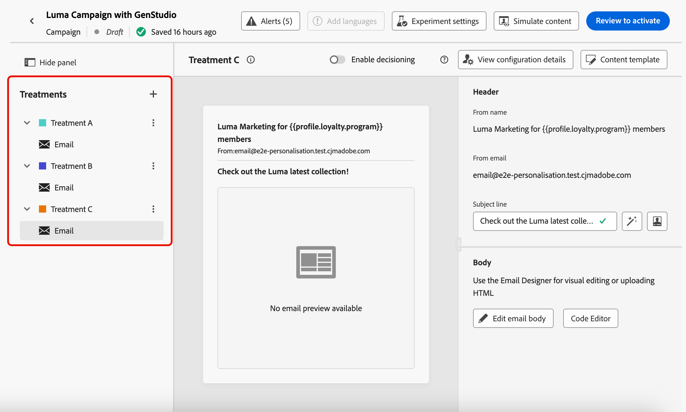

# Introdução à integração do GenStudio {#gs-genstudio}

>[!CONTEXTUALHELP]
>id="ajo_genstudio_button"
>title="Usar um modelo criado com o GenStudio"
>abstract="Graças à integração perfeita com o Adobe GenStudio for Performance Marketing, você pode importar facilmente um modelo do GenStudio aprimorado com a tecnologia de IA da Adobe."

>[!AVAILABILITY]
>
>A integração do GenStudio no [!DNL Adobe Journey Optimizer] não está disponível para uso com as ofertas complementares do **Healthcare Shield** ou **Privacy and Security Shield**.
>
>Esse recurso está disponível somente para o canal de email.

O [Adobe GenStudio for Performance Marketing](https://business.adobe.com/products/genstudio-for-performance-marketing.html){target="_blank"} é um aplicativo generativo de IA que permite que as equipes de marketing criem seus próprios anúncios e emails para impulsionar campanhas de marketing personalizadas e impactantes que seguem os padrões da sua marca e estão em conformidade com as políticas da sua empresa. Ao utilizar a tecnologia de IA do Adobe, ele fornece um conjunto abrangente de ferramentas que simplificam as complexidades da criação e do gerenciamento de conteúdo para que os criadores possam se concentrar na inovação.

Saiba mais sobre [!DNL GenStudio for Performance Marketing] na [documentação](https://experienceleague.adobe.com/pt-br/docs/genstudio-for-performance-marketing/user-guide/home){target="_blank"} dedicada.

>[!INFO]
>
>Para ir além, confira esta [visão geral](https://business.adobe.com/products/genstudio-for-performance-marketing.html#watch-overview){target="_blank"} e uma [demonstração](https://business.adobe.com/products/genstudio-for-performance-marketing.html#demo){target="_blank"} de [!DNL Adobe GenStudio for Performance Marketing].

<!--To access the GenStudio integration in [!DNL Adobe Journey Optimizer] feature, users need to be granted the **xxx** permission. [Learn more](../administration/permissions.md)

>[!IMPORTANT]
>
>* Before starting using this capability, read out related [Guardrails and Limitations](#generative-guardrails).-->

Para aprimorar a eficiência do marketing e manter a consistência da marca, você pode integrar perfeitamente as experiências do [!DNL **GenStudio for Performance Marketing**] com o [!DNL **Adobe Journey Optimizer**]. Isso permite que você aproveite a criação de conteúdo com recursos de orquestração avançada do [!DNL GenStudio].[!DNL Journey Optimizer]

<!---->

<!--Guardrails and limitations {#genstudio-guardrails}

General guidelines for using the GenStudio integration in [!DNL Adobe Journey Optimizer] for email generation are listed below:

See if guidelines/limitations such as the ones listed [here](gs-generative.md#generative-guardrails) for AI Assistant can apply.

The following limitations apply to GenStudio integration in [!DNL Adobe Journey Optimizer]:-->

## Aproveitar os recursos do GenStudio no Journey Optimizer {#use-genstudio}

A integração do [!DNL GenStudio for Performance Marketing] e do [!DNL Journey Optimizer] permite que os profissionais de marketing da sua empresa trabalhem melhor em conjunto para simplificar processos.

Por exemplo, um profissional de marketing técnico, que usa o [!DNL Journey Optimizer] para desenvolver e automatizar campanhas de email, pode colaborar com um profissional de marketing de desempenho que cria conteúdo usando o [!DNL GenStudio].

Com essa integração, ambos podem trabalhar em conjunto para integrar facilmente o conteúdo sob a marca do [!DNL GenStudio] ao [!DNL Journey Optimizer], fornecendo emails envolventes direcionados a segmentos específicos de clientes e impulsionando as vendas.

### Exportar um modelo do HTML do Journey Optimizer para o GenStudio {#export-from-ajo-to-genstudio}

Primeiro, você pode exportar um modelo do HTML [!DNL Journey Optimizer] incluindo as diretrizes da sua marca para [!DNL GenStudio for Performance Marketing]. Siga as etapas abaixo.

1. No [!DNL Journey Optimizer], acesse o conteúdo do seu email em uma jornada ou campanha. [Saiba como](../email/get-started-email-design.md#key-steps)

1. No Designer Email, selecione **[!UICONTROL Exportar HTML]** no botão **[!UICONTROL Mais]**.

   {zoomable="yes"}

1. Carregar este modelo exportado do HTML em [!DNL GenStudio for Performance Marketing]. <!--Make sure you detect the fields that the generative AI uses to insert content in order to create an actionable template.-->

   >[!NOTE]
   >
   >Saiba como carregar um modelo do HTML no [!DNL GenStudio] na seção dedicada do [Guia do Usuário do Adobe GenStudio for Performance Marketing](https://experienceleague.adobe.com/pt-br/docs/genstudio-for-performance-marketing/user-guide/content/templates/use-templates#templates-from-ajo-and-marketo){target="_blank"}.

1. No GenStudio, use esse template para criar várias variações de email com prompts de IA e salvá-las.

   >[!NOTE]
   >
   >Saiba como criar experiências de email na [seção](https://experienceleague.adobe.com/pt-br/docs/genstudio-for-performance-marketing/user-guide/create/create-email-experience){target="_blank"} dedicada do GenStudio.

### Aproveitar as experiências do GenStudio no Journey Optimizer {#leverage-genstudio-experiences}

Para aproveitar as variações de email do [!DNL GenStudio] que você acabou de criar importando-as para o [!DNL Journey Optimizer], siga as etapas abaixo.

1. Em [!DNL Journey Optimizer], [adicione um email](../email/create-email.md) a uma campanha.

1. Na tela de configuração da campanha, acesse a [tela Editar conteúdo](../email/create-email.md#define-email-content) e clique em **[!UICONTROL Editar corpo do email]** para abrir o Email Designer. [Saiba como](../email/get-started-email-design.md#key-steps)

1. Na página inicial do Designer de Email, selecione **[!UICONTROL Importar HTML]** e clique no botão **[!UICONTROL Adobe GenStudio for Performance Marketing]**.

   {zoomable="yes"}

1. Navegue pelas experiências do GenStudio para começar a criar o conteúdo. Você pode filtrar as experiências em vários critérios, como produtos, personas, marcas ou até mesmo cores.

   <!--{zoomable="yes"}-->

1. Selecione uma experiência e clique em **[!UICONTROL Usar]**.

   {zoomable="yes"}

1. Selecione a pasta na qual deseja importar a experiência do GenStudio.

   {zoomable="yes"}

1. O conteúdo selecionado é exibido no Designer de email.

   {zoomable="yes"}

   >[!NOTE]
   >
   >As experiências do GenStudio [criadas a partir de um [!DNL Journey Optimizer] modelo](#export-from-ajo-to-genstudio) são importadas diretamente para o Designer de email. As experiências do GenStudio criadas sem um modelo [!DNL Journey Optimizer] são importadas para o [modo de compatibilidade](../email/existing-content.md).

   Use as [ferramentas de edição de conteúdo de email](../email/content-from-scratch.md) e os [campos de personalização](../personalization/personalize.md) para editar seu email conforme desejado. Salve o conteúdo.

1. Volte para a página de resumo da campanha e clique em **[!UICONTROL Criar experimento]** para usar a experimentação. [Saiba como criar um experimento de conteúdo](../content-management/content-experiment.md)

   <!--{zoomable="yes"}-->

1. Crie vários tratamentos e repita as etapas acima para importar e aproveitar rapidamente as outras variações de experiência de email que você criou no [!DNL GenStudio].

   {zoomable="yes"}

1. Salve as alterações e [ative](../campaigns/review-activate-campaign.md) a campanha.

Após executar o experimento, acompanhe o desempenho dos tratamentos da campanha com o [relatório da campanha de experimentação](../reports/campaign-global-report-cja-experimentation.md). Você pode então interpretar os resultados de seu experimento. [Saiba como](../content-management/get-started-experiment.md#interpret-results)
