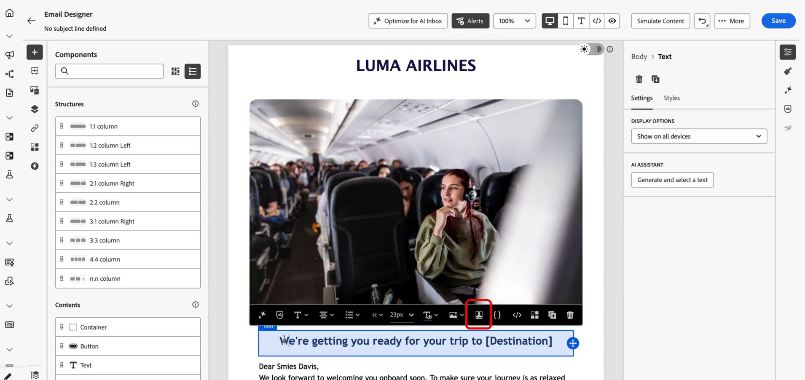

# Uso de integrações externas para personalização {#integrations-personalization}

>[!BEGINSHADEBOX]

**Nesta página:** saiba como os profissionais de marketing aplicam integrações configuradas para personalizar conteúdo de email, SMS e push e encadear uma chamada de API para outra com mensagens dinâmicas e mais avançadas.

>[!ENDSHADEBOX]

Antes de usar integrações externas em seu conteúdo, confirme se um administrador **configurou e ativou** cada integração (ponto de extremidade, autenticação, políticas, carga de resposta e ativação) conforme descrito em [Trabalhar com integrações](integrations.md).

Você pode adicionar até **3** integrações por **[!UICONTROL Fragmento]** e até **5** na mensagem. As integrações provenientes apenas de fragmentos não contam no **5**.

## Aplicar personalização da integração ao seu conteúdo {#apply-integration-personalization}

Como profissional de marketing, você pode usar integrações configuradas para personalizar seu conteúdo. Siga estas etapas:

1. Acesse o conteúdo da campanha e clique em **[!UICONTROL Adicionar personalização]** a partir do Texto ou dos **[!UICONTROL Componentes]** do HTML.

   [Saiba mais sobre componentes](../email/content-components.md)

   

1. Navegue até a seção **[!UICONTROL Integrações]** e clique em **[!UICONTROL Abrir integrações]** para exibir todas as integrações ativas.

   Observe que os **Fragmentos de Journey Optimizer** estão disponíveis com Integrações, mas oferecem suporte somente a canais de saída. Depois que um fragmento é publicado, a adição e o salvamento de novas integrações são desativados para evitar impacto nas jornadas e campanhas existentes.

   

1. Selecione uma integração e clique em **[!UICONTROL Salvar]**.

   

1. Habilite o modo **[!UICONTROL Pills]** para desbloquear o menu de integração avançado.

   

1. Ao criar a personalização da integração, o Auxiliar de integrações inclui um campo **`required`** que define como as falhas ou os dados ausentes interagem com o conteúdo padrão:

   * **`required=true`** (padrão): a renderização para essa mensagem. O envio é excluído com **`ExternalDataLookupExclusion`**, e essa exclusão é registrada no **conjunto de dados de comentários da mensagem**.
   * **`required=false`**: A variável de resultado está definida como **`null`** e a renderização continua. Use texto padrão, fallbacks ou lógica condicional no modelo para que os perfis não recebam conteúdo vazio quando a integração não retornar dados.

     

1. Para concluir a configuração de integração, defina os atributos de integração, que foram especificados anteriormente durante a [configuração](integrations.md#configure).

   Você pode designar valores a esses atributos usando valores estáticos, que permanecem constantes, ou atributos de perfil, que extraem dinamicamente informações dos perfis do usuário.

   

1. Depois que os atributos de integração forem definidos, você poderá usar os campos de integração no seu conteúdo para mensagens personalizadas clicando no ícone .

   

   >[!NOTE]
   >
   >Os tokens no modelo devem usar somente campos expostos pelo administrador na configuração de integração. Por exemplo, `{{weatherResponse.temperature}}` é válido quando `temperature` é exposto; `{{weatherResponse.humidity}}` é rejeitado no editor se `humidity` não foi exposto.

1. Clique em **[!UICONTROL Salvar]**.

A personalização da sua integração agora é aplicada com sucesso ao seu conteúdo, garantindo que cada recipient receba uma experiência personalizada e relevante com base nos atributos configurados.


## Mapear uma chamada de API para outra {#map-integration-chain}

É possível encadear integrações para que os resultados de uma chamada alimentem a próxima, por exemplo, segmentos de caminho, cabeçalhos ou parâmetros de consulta. As chamadas são executadas em ordem na mesma mensagem, que aceita personalização mais avançada sem código personalizado.

Antes de começar, verifique se:

* Um administrador configurou e ativou todas as integrações necessárias. Consulte [Configurar a integração](integrations.md).
* Espaços reservados para caminhos de variáveis, cabeçalhos e parâmetros de consulta são configurados na configuração de integração com rótulos voltados para o profissional de marketing.
* O administrador expôs os campos de resposta necessários na **[!UICONTROL carga de resposta]** de cada integração para que apareçam ao criar.

O exemplo abaixo usa uma integração de reserva que retorna um número de voo da reserva do perfil e, em seguida, uma integração de informações de voo que usa esse número para o status ativo (atrasos, destino). Você mapeia as entradas da segunda integração para a resposta da primeira chamada.

1. Abra a mensagem ou fragmento e abra o editor de personalização.

   

1. Em **[!UICONTROL Integrações]**, clique em **[!UICONTROL Abrir integrações]**.

   

1. Adicione a integração cuja resposta alimentará a próxima chamada, por exemplo, dados de reserva ou reserva que incluem o identificador de voo.

   

1. (Opcional) Abra o menu da **[!UICONTROL função auxiliar]** e adicione um auxiliar, por exemplo, a função `Let`, se desejar vincular uma variável nomeada à resposta de reserva.

   >[!NOTE]
   >
   > Somente os campos expostos na **[!UICONTROL carga de resposta]** definida pelo administrador estão disponíveis. Você não pode fazer referência a propriedades que não foram expostas na configuração.

1. Se você usar uma variável auxiliar, mapeie essa variável para o campo que a integração de reservas retorna para uso downstream, por exemplo, o número do voo na carga do passageiro ou da reserva.

   

1. No menu **[!UICONTROL Abrir integrações]**, adicione a segunda integração, por exemplo, status de voo.

   

1. Na segunda integração, abra **[!UICONTROL Atributos de integrações]**. Para cada entrada que deve reutilizar dados da primeira chamada, como uma variável de caminho, cabeçalho ou parâmetro de consulta, selecione uma origem de mapeamento da primeira resposta de integração.

   Na experiência **[!UICONTROL Pills]**, você pode mapear a saída da primeira chamada diretamente para a entrada da segunda chamada sem uma instrução `Let`. Se você usou `Let`, é possível mapear através dessa variável.

   

1. Insira tokens da segunda integração em seu conteúdo com o controle , por exemplo, destino da resposta de informações de voo.

   

1. Salve o conteúdo.

Em **[!UICONTROL Simulação]** ou enviar, o Journey Optimizer executa integrações em ordem: a primeira chamada usa o contexto do perfil configurado, e seu resultado cria a segunda solicitação. A execução de uma determinada integração na simulação ou no momento do envio depende da configuração e do canal.


<!--
## Use Adobe Target data in templates {#use-adobe-target-in-templates}

This section explains how to use **Integrations** in Adobe Journey Optimizer to fetch personalization data from **[!DNL Adobe Target]** at send time and use it in message templates. It assumes the Target Delivery API has already been configured as an integration.

For configuration steps, see [Work with Integrations](integrations.md) and the [Adobe Target Recommendations](vendor-integration.md#adobe-target-recommendations) sample.

The Target Delivery API returns a `prefetch.mboxes` array. Each mbox includes an `options` object with `content` and `type` fields. The `type` value determines how you use `content` in your template. Open the tab that matches your mbox response, then follow the steps to use that data in your message.

>[!BEGINTABS]

>[!TAB JSON content]

When `type` is `json`, the `content` field is a **JSON string**. Parse it before you access nested fields. The example below shows a typical Delivery API response for a JSON mbox.

```json
{
  "status": 200,
  "prefetch": {
    "mboxes": [
      {
        "index": 0,
        "name": "SummerOffer",
        "options": {
          "content": "{\"recommendations\":[{\"productId\":\"p101\",\"name\":\"Noise Smartwatch\",\"price\":2999},{\"productId\":\"p205\",\"name\":\"Boat Earbuds\",\"price\":1499}],\"strategy\":\"collaborative-filtering\"}",
          "type": "json"
        }
      }
    ]
  }
}
```

Use three helpers in sequence to fetch, extract, and parse the Target response.

1. **Fetch the Target response.** Call your configured Target integration with `externalDataLookup`. Set `integrationName` to the **[!UICONTROL Name]** of that integration (replace the example placeholder `target_recommendations`). Use the `result` parameter to name the template variable that holds the full Delivery API payload—for example, `targetResponse`.

    ```handlebars
    {{externalDataLookup integrationName="target_recommendations" result="targetResponse"}}
    ```

1. **Extract a specific mbox using valueAtPath.** `valueAtPath` extracts an element from an array by its 0-based index and assigns it to a template variable. Use the `idx` parameter to specify which element to access.

    ```handlebars
    {{valueAtPath targetResponse.prefetch.mboxes idx=0 result="summerOffer"}}
    ```

    | Parameter | Description |
    | --- | --- |
    | `path` | Path to the array (positional, no keyword) |
    | `idx` | 0-based index for array access (optional) |
    | `result` | Variable name to store the extracted value |

    >[!NOTE]
    >
    > If `idx` is out of bounds, rendering throws an exception. Guard invalid indexes with `` when the index may be invalid. PQL expressions cannot be used as the path. **Available since release 2025.9.0.**

1. **Parse the JSON string using parseJson.** The mbox `options.content` field is a raw JSON string. `parseJson` converts it into a structured object whose fields can then be accessed directly in the template.

    ```handlebars
    {{parseJson jsonStr=summerOffer.options.content result="summerOfferContent"}}
    ```

    | Parameter | Description |
    | --- | --- |
    | `jsonStr` | Path to the string field containing valid JSON |
    | `result` | Variable name to store the parsed object |

    >[!NOTE]
    >
    > If the JSON string is invalid or the reference is null, `result` is set to `null` — no rendering error is thrown. Test with your actual Target response to confirm the content is valid JSON. **Available since: 2026.6.0**

1. **Access the data.** Once parsed, use dot notation to access fields from `summerOfferContent`. To render a list of recommendations:

    ```handlebars
    {{externalDataLookup integrationName="target_recommendations" result="targetResponse"}}
    {{valueAtPath targetResponse.prefetch.mboxes idx=0 result="summerOffer"}}
    {{parseJson jsonStr=summerOffer.options.content result="summerOfferContent"}}

    Strategy: {{summerOfferContent.strategy}}
    {{#each summerOfferContent.recommendations as |rec|}}
      {{rec.name}} — {{rec.price}}
    {{/each}}
    ```

>[!TAB HTML content]

When `type` is `html`, the `content` field is a ready-to-render HTML string. You do not need to parse it. The example below shows a typical Delivery API response for an HTML mbox.

```json
{
  "status": 200,
  "prefetch": {
    "mboxes": [
      {
        "index": 0,
        "name": "SummerOffer",
        "options": {
          "content": "<div class=\"offer\"><h2>Summer Sale</h2><p>50% off Smartwatch</p></div>",
          "type": "html"
        }
      }
    ]
  }
}
```

Fetch and extract the mbox, then render `content` directly. Skip `parseJson`.

```handlebars
{{externalDataLookup integrationName="target_recommendations" result="targetResponse"}}
{{valueAtPath targetResponse.prefetch.mboxes idx=0 result="summerOffer"}}
{{{summerOffer.options.content}}}
```

>[!NOTE]
>
> Use **triple braces** `{{{...}}}` to render HTML content as-is. Double braces `{{...}}` will escape HTML entities and render raw tag strings instead of the HTML.

>[!ENDTABS]

-->

## Vídeo tutorial {#video}

Este vídeo mostra como as **Integrações** conectam o Adobe Journey Optimizer a APIs externas para que você possa receber dados e conteúdo em **canais de saída**, email, SMS e push, para personalizações mais relevantes.

>[!VIDEO](https://video.tv.adobe.com/v/3484118/?learn=on)
