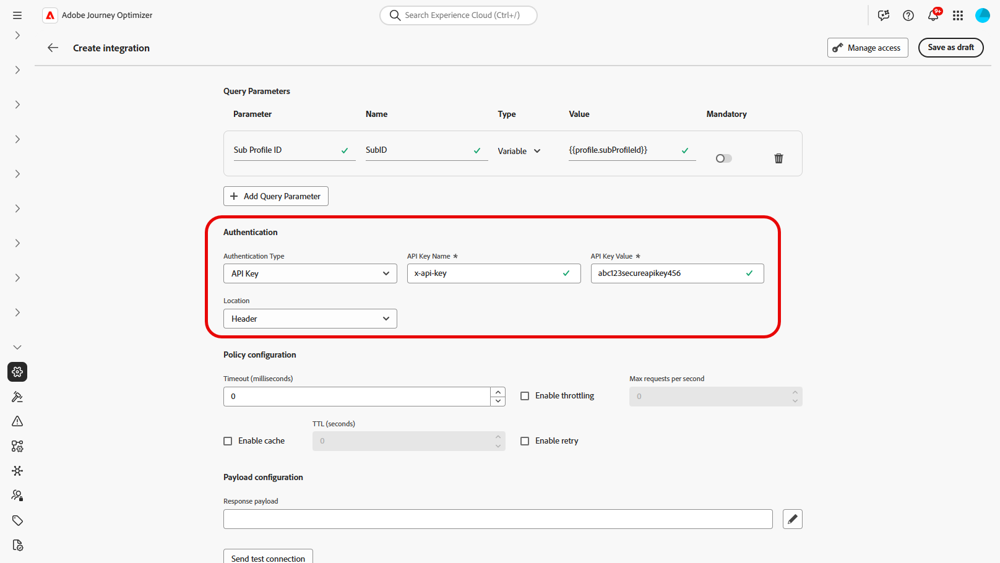

# Trabalhar com integrações {#external-sources}

## Visão geral

O recurso **Integrações** vincula o Adobe Journey Optimizer a sistemas de terceiros cujos dados e conteúdo combinável você já gerencia em outro lugar. Você pode exibir esse material durante a criação e no momento do envio, o que suporta experiências mais responsivas e personalizadas nos canais que você usa no Journey Optimizer.

Você pode usar esse recurso para acessar dados externos e extrair conteúdo de ferramentas de terceiros, como:

* **Pontos de Recompensa** dos sistemas de fidelidade.
* **Informações sobre preços** dos produtos.
* **Recomendações de produto** dos mecanismos de recomendação.
* **Atualizações de logística** como status de entrega.

Para começar a usar Integrações, os usuários precisam receber as permissões **[!UICONTROL Gerenciar configuração de integração do AJO]** e **[!UICONTROL Exibir configuração de integração do AJO]**. [Saiba mais sobre permissões](../administration/permissions.md)

+++ Saiba como atribuir permissões relacionadas a integrações

1. No produto **[!UICONTROL Permissões]**, abra a guia **[!UICONTROL Funções]** e selecione a **[!UICONTROL função]** desejada.

1. Clique em **[!UICONTROL Editar]** para modificar as permissões.

1. Adicione o recurso **[!UICONTROL Configuração de integração do AJO]** e selecione as permissões de Integrações apropriadas no menu suspenso.

   

1. Clique em **[!UICONTROL Salvar]** para aplicar as alterações.

   As permissões de todos os usuários já atribuídos a essa função serão atualizadas automaticamente.

1. Para atribuir essa função a novos usuários, navegue até a guia **[!UICONTROL Usuários]** no painel **[!UICONTROL Funções]** e clique em **[!UICONTROL Adicionar usuário]**.

1. Insira o nome do usuário, seu endereço de email ou escolha na lista e clique em **[!UICONTROL Salvar]**.

Se o usuário não foi criado anteriormente, consulte [esta documentação](https://experienceleague.adobe.com/pt-br/docs/experience-platform/access-control/abac/permissions-ui/users).

+++

## Configurar a integração {#configure}

>[!AVAILABILITY]
>
> Esse recurso de integração é restrito aos canais de saída (Email, SMS e Push) e oferece suporte a pull JSON ou HTML.

Como administrador, você pode configurar integrações externas seguindo estas etapas:

1. Navegue até a seção **[!UICONTROL Configurações]** no menu esquerdo e clique em **[!UICONTROL Gerenciar]** no cartão **[!UICONTROL Integrações]**.

   Em seguida, clique em **[!UICONTROL Criar integração]** para iniciar uma nova configuração.

   

1. Opcionalmente, cole um comando **cURL** para preencher automaticamente a URL, o método HTTP, os cabeçalhos e os parâmetros de consulta.

1. Forneça um **[!UICONTROL Nome]** e uma **[!UICONTROL Descrição]** para a integração.

   >[!NOTE]
   >
   >O campo **[!UICONTROL Nome]** não pode conter espaços.

1. Insira o ponto de extremidade de API **[!UICONTROL URL]**.

   Para variáveis de caminho, envolva um rótulo com chaves duplas na URL, por exemplo, `https://api.example.com/v1/products/{{productId}}`, e defina cada espaço reservado em **[!UICONTROL Modelo de caminho]**.

1. Configure o **[!UICONTROL Modelo de Caminho]** com o **[!UICONTROL Nome]** e o **[!UICONTROL Valor padrão]** para cada espaço reservado adicionado à URL.

   Observe que **[!UICONTROL Name]** é um rótulo voltado para o profissional de marketing apenas no editor, ele não é enviado na solicitação de API.

   

1. Selecione o **[!UICONTROL Método HTTP]** entre GET e POST.

1. Clique em **[!UICONTROL Adicionar cabeçalho]** e/ou **[!UICONTROL Adicionar parâmetros de consulta]** conforme necessário para sua integração. Para cada parâmetro, forneça os seguintes detalhes:

   * **[!UICONTROL Parâmetro]**: o cabeçalho real ou o nome do parâmetro de consulta conforme esperado pela API.

   * **[!UICONTROL Nome]**: um rótulo compatível com o profissional de marketing para esse parâmetro, os autores o selecionam ao mapear valores em campanhas.

   * **[!UICONTROL Tipo]**: escolha **Constante** para um valor fixo ou **Variável** para entrada dinâmica.

   * **[!UICONTROL Valor]**: insira o valor diretamente para constantes ou selecione um mapeamento de variável.

   * **[!UICONTROL Obrigatório]**: especifique se este parâmetro é obrigatório. Para parâmetros obrigatórios **[!UICONTROL Variable]**, se nenhum valor for resolvido em tempo de execução e nenhum padrão for fornecido, a geração de solicitações falhará com um erro e a chamada de API de saída não será feita.

   

1. Escolha um **[!UICONTROL Tipo de Autenticação]**:

   * **[!UICONTROL Sem Autenticação]**: para APIs abertas que não exigem credenciais.

   * **[!UICONTROL Chave de API]**: autentique solicitações usando uma chave de API estática. Insira seu **[!UICONTROL Nome da Chave de API &#x200B;]**, **[!UICONTROL Valor da Chave de API &#x200B;]** e especifique seu **[!UICONTROL Local]**.

   * **[!UICONTROL Autenticação Básica]**: usar a Autenticação Básica HTTP padrão. Insira **[!UICONTROL Nome de usuário]** e **[!UICONTROL Senha]**.

   * **[!UICONTROL OAuth 2.0]**: faça a autenticação usando o protocolo OAuth 2.0. Clique no ícone  para configurar ou atualizar a **[!UICONTROL Carga]**.

   

1. Defina a **[!UICONTROL Configuração de política]**, como o período de **[!UICONTROL Tempo limite]**, para solicitações de API e opte por habilitar a limitação, o cache e/ou tentar novamente.

   >[!NOTE]
   >
   >Com a limitação ativada, as taxas compatíveis são de 50 a 5000 TPS. Os limites se aplicam à **integração**, não a cada ponto de extremidade de API.
   >
   >Com a repetição habilitada, outras falhas são repetidas **três** vezes por padrão, com **200 ms**, **400 ms** e **800 ms** entre tentativas.

1. Com o campo **[!UICONTROL Carga de resposta]**, é possível decidir quais campos da saída de exemplo precisam ser usados para a personalização da mensagem.

   Clique no ícone  e cole uma amostra de carga de resposta JSON para detectar automaticamente os tipos de dados.

1. Escolha os campos a serem expostos para personalização e especifique os tipos de dados correspondentes.

   

   >[!NOTE]
   >
   >A configuração **[!UICONTROL Carga de resposta]** define a resposta esperada para criação, incluindo qualquer esquema aplicado nessa etapa. Os profissionais de marketing podem fazer referência somente a campos expostos, os tokens para outros caminhos falham na validação no editor.

1. Use **[!UICONTROL Enviar conexão de teste]** para validar a integração. [Saiba mais sobre como testar sua conexão](#connection)

   Depois de validado, clique em **[!UICONTROL Ativar]**.

1. Acesse a integração recém-criada para:

   * **Atualização**: alterar somente detalhes de **Autenticação** e **configuração de política**. As atualizações se aplicam a jornadas e campanhas ativas. Antes de salvar as alterações, use o menu **[!UICONTROL Explorar referências]** para confirmar onde a integração é usada.
   * **Arquivar**: arquivar uma configuração de Integração.

   

Após a ativação, clique no ícone do  para acessar o menu **[!UICONTROL Explorar referências]** e revisar o uso dessa configuração, incluindo jornadas e campanhas que dependem dele.

### Comportamento e limites de tempo de envio {#configure-send-time}

No momento do envio, as respostas da API externa podem ter até **4 MB** por padrão. Qualquer coisa maior é tratada como um erro de integração e **não haverá tentativa** quando a falha for causada pelo tamanho da resposta.

As chamadas respeitam a taxa de **limitação** que você configurou: o Journey Optimizer agenda tentativas até esse limite mesmo quando o sistema externo está inativo ou retornando erros. Se o **cache** estiver habilitado, somente respostas **bem-sucedidas** serão armazenadas e reutilizadas até que o cache **TTL** definido expire; respostas com falha nunca serão armazenadas em cache.

Cada mensagem em fila também carrega uma janela de validade (TTL). Se o processamento for atrasado e uma mensagem ultrapassar essa janela, o sistema **a descartará** e emitirá um evento **`MessageValidityExclusion`** para que o trabalho obsoleto seja liberado da fila e os recursos permaneçam disponíveis.

## Testando sua conexão {#connection}

**[!UICONTROL Enviar conexão de teste]** valida a URL do ponto de extremidade, a autenticação e a estrutura da solicitação em relação à API de destino antes da ativação, o que reduz o risco de falhas de tempo de execução durante o processamento da mensagem.

1. Quando a URL, o método HTTP, os cabeçalhos e os parâmetros de consulta forem definidos, clique em **[!UICONTROL Enviar conexão de teste]** para executar um teste de conectividade e confirmar a configuração.

1. Na caixa de diálogo **[!UICONTROL Enviar conexão de teste]**, insira valores padrão para quaisquer espaços reservados de **[!UICONTROL Variável]** no caminho de URL, cabeçalhos e parâmetros de consulta.

   Esses valores são incluídos na solicitação de teste. O Journey Optimizer chama o endpoint e relata se a conexão teve êxito ou falhou.

   

1. Se o teste retornar uma resposta bem-sucedida, selecione **[!UICONTROL Usar como carga de resposta]** para copiar o corpo da resposta no campo **[!UICONTROL Carga de resposta]**, consulte a etapa 10 em [Configurar a integração](#configure), onde os tipos de dados podem ser detectados e os campos podem ser selecionados para personalização.

   

1. Se o teste não for bem-sucedido, expanda o menu suspenso **[!UICONTROL Erro]** para examinar os detalhes da falha, atualize a configuração de integração conforme necessário e execute **[!UICONTROL Enviar conexão de teste]** novamente.

   

Depois que o teste for bem-sucedido, selecione **[!UICONTROL Ativar]** na configuração de integração. Consulte [Configurar a integração](#configure).

