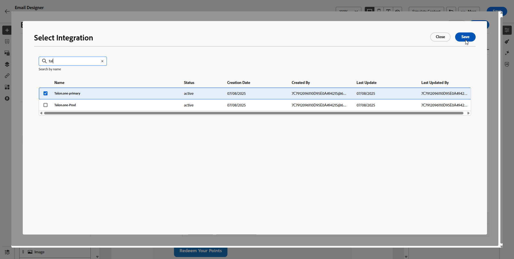

# Trabalhar com integrações {#external-sources}

>[!BEGINSHADEBOX]

Índice:

* **[Trabalhar com integrações](integrations.md)**
* [Introdução](vendor-integration-gs.md)
* [Fornecedores disponíveis](vendor-integration.md)
* [Perguntas frequentes](vendor-integration-faq.md)

>[!ENDSHADEBOX]

## Visão geral

O recurso **Integrações** vincula o Adobe Journey Optimizer a sistemas de terceiros cujos dados e conteúdo combinável você já gerencia em outro lugar. Você pode exibir esse material durante a criação e no momento do envio, o que suporta experiências mais responsivas e personalizadas nos canais que você usa no Journey Optimizer.

Você pode usar esse recurso para acessar dados externos e extrair conteúdo de ferramentas de terceiros, como:

* **Pontos de Recompensa** dos sistemas de fidelidade.
* **Informações sobre preços** dos produtos.
* **Recomendações de produto** dos mecanismos de recomendação.
* **Atualizações de logística** como status de entrega.

Para começar a usar Integrações, os usuários precisam receber as permissões **[!UICONTROL Gerenciar configuração de integração do AJO]** e **[!UICONTROL Exibir integração do AJO]**. [Saiba mais sobre permissões](../administration/permissions.md)

+++ Saiba como atribuir permissões relacionadas a integrações

1. No produto **[!UICONTROL Permissões]**, abra a guia **[!UICONTROL Funções]** e selecione a **[!UICONTROL função]** desejada.

1. Clique em **[!UICONTROL Editar]** para modificar as permissões.

1. Adicione o recurso **[!UICONTROL Configuração de integração do AJO]** e selecione as permissões de Integrações apropriadas no menu suspenso.

   

1. Clique em **[!UICONTROL Salvar]** para aplicar as alterações.

   As permissões de todos os usuários já atribuídos a essa função serão atualizadas automaticamente.

1. Para atribuir essa função a novos usuários, navegue até a guia **[!UICONTROL Usuários]** no painel **[!UICONTROL Funções]** e clique em **[!UICONTROL Adicionar usuário]**.

1. Insira o nome do usuário, seu endereço de email ou escolha na lista e clique em **[!UICONTROL Salvar]**.

Se o usuário não tiver sido criado anteriormente, consulte [esta documentação](https://experienceleague.adobe.com/pt-br/docs/experience-platform/access-control/abac/permissions-ui/users).

+++

## Configurar a integração {#configure}

>[!AVAILABILITY]
>
> Esse recurso de integração é restrito a canais de saída (Email, SMS e Push) e fornece dados em formatos JSON ou HTML. Observe que a API é somente leitura e oferece suporte somente às operações de recuperação.

Como administrador, você pode configurar integrações externas seguindo estas etapas:

1. Navegue até a seção **[!UICONTROL Configurações]** no menu esquerdo e clique em **[!UICONTROL Gerenciar]** no cartão **[!UICONTROL Integrações]**.

   Em seguida, clique em **[!UICONTROL Criar integração]** para iniciar uma nova configuração.

   

1. Opcionalmente, cole um comando **cURL** para preencher automaticamente a URL, o método HTTP, os cabeçalhos e os parâmetros de consulta.

1. Forneça um **[!UICONTROL Nome]** e uma **[!UICONTROL Descrição]** para a integração.

   >[!NOTE]
   >
   >Esses campos não podem conter espaços.

1. Insira o ponto de extremidade de API **[!UICONTROL URL]**, que pode incluir parâmetros de caminho com variáveis que podem ser definidas usando rótulos e valores padrão.

1. Configure o **[!UICONTROL Modelo de Caminho]** com **[!UICONTROL Nome]** e **[!UICONTROL Valor padrão]**.

   

1. Selecione o **[!UICONTROL Método HTTP]** entre o GET e o POST.

1. Clique em **[!UICONTROL Adicionar cabeçalho]** e/ou **[!UICONTROL Adicionar parâmetros de consulta]** conforme necessário para sua integração. Para cada parâmetro, forneça os seguintes detalhes:

   * **[!UICONTROL Parâmetro]**: um identificador exclusivo usado internamente para fazer referência ao parâmetro.

   * **[!UICONTROL Nome]**: o nome real do parâmetro conforme esperado pela API.

   * **[!UICONTROL Tipo]**: escolha **Constante** para um valor fixo ou **Variável** para entrada dinâmica.

   * **[!UICONTROL Valor]**: insira o valor diretamente para constantes ou selecione um mapeamento de variável.

   * **[!UICONTROL Obrigatório]**: especifique se este parâmetro é obrigatório.

   

1. Escolha um **[!UICONTROL Tipo de Autenticação]**:

   * **[!UICONTROL Sem Autenticação]**: para APIs abertas que não exigem credenciais.

   * **[!UICONTROL Chave de API]**: autentique solicitações usando uma chave de API estática. Insira seu **[!UICONTROL Nome da Chave de API &#x200B;]**, **[!UICONTROL Valor da Chave de API &#x200B;]** e especifique seu **[!UICONTROL Local]**.

   * **[!UICONTROL Autenticação Básica]**: usar a Autenticação Básica HTTP padrão. Insira **[!UICONTROL Nome de usuário]** e **[!UICONTROL Senha]**.

   * **[!UICONTROL OAuth 2.0]**: faça a autenticação usando o protocolo OAuth 2.0. Clique no ícone  para configurar ou atualizar a **[!UICONTROL Carga]**.

   

1. Defina a **[!UICONTROL Configuração de política]**, como o período de **[!UICONTROL Tempo limite]**, para solicitações de API e opte por habilitar a limitação, o cache e/ou tentar novamente.

   Quando a limitação está habilitada, as taxas com suporte variam de **50** TPS (mínimo) a **5000** TPS (máximo).
Quando a repetição está habilitada, outras falhas seguem **três** tentativas por padrão, com **200 ms**, **400 ms** e **800 ms** entre tentativas sucessivas.

1. Com o campo **[!UICONTROL Carga de resposta]**, é possível decidir quais campos da saída de exemplo precisam ser usados para a personalização da mensagem.

   Clique no ícone  e cole uma amostra de carga de resposta JSON para detectar automaticamente os tipos de dados.

1. Escolha os campos a serem expostos para personalização e especifique os tipos de dados correspondentes.

   

   >[!NOTE]
   >
   >A configuração **[!UICONTROL Carga de resposta]** define a resposta esperada para criação, incluindo qualquer esquema aplicado nessa etapa. Os profissionais de marketing podem fazer referência somente a campos expostos, os tokens para outros caminhos falham na validação no editor.

1. Use **[!UICONTROL Enviar conexão de teste]** para validar a integração.

   Depois de validado, clique em **[!UICONTROL Ativar]**.

### Comportamento e limites de tempo de envio {#configure-send-time}

No momento do envio, as respostas da API externa podem ter até **4 MB** por padrão. Qualquer coisa maior é tratada como um erro de integração e **não haverá tentativa** quando a falha for causada pelo tamanho da resposta.

As chamadas respeitam a taxa de **limitação** que você configurou: o Journey Optimizer agenda tentativas até esse limite mesmo quando o sistema externo está inativo ou retornando erros. Se o **cache** estiver habilitado, somente respostas **bem-sucedidas** serão armazenadas e reutilizadas até que o cache **TTL** definido expire; respostas com falha nunca serão armazenadas em cache.

Cada mensagem em fila também carrega uma janela de validade (TTL). Se o processamento for atrasado e uma mensagem ultrapassar essa janela, o sistema **a descartará** e emitirá um evento **`MessageValidityExclusion`** para que o trabalho obsoleto seja liberado da fila e os recursos permaneçam disponíveis.

## Uso de integrações externas para personalização {#personalization}

Antes de usar integrações externas para personalização, observe que o agendamento e o isolamento de chamadas de integração dependem do contexto de execução:

* **Execução em lote** (campanhas em lote, campanhas orquestradas e campanhas de marketing acionadas por API): cada execução em lote opera em um ambiente dedicado e isolado. Portanto, as execuções em lote simultâneas que chamam sistemas externos não disputam ou obstruem uns aos outros.

* **Execução unitária** (jornadas unitárias, jornadas em lote e campanhas transacionais acionadas por API): o tráfego de integração é isolado por sandbox de marca, portanto, uma API externa lenta para uma marca não atrasa outra. Em sua sandbox, as integrações simultâneas podem atrasar brevemente outras mensagens com backup em integração; cada mensagem é tentada por até 12 horas antes da expiração.

Como profissional de marketing, você pode usar integrações configuradas para personalizar seu conteúdo. Siga estas etapas:

1. Acesse o conteúdo da campanha e clique em **[!UICONTROL Adicionar personalização]** a partir do Texto ou dos **[!UICONTROL Componentes]** do HTML.

   [Saiba mais sobre componentes](../email/content-components.md)

   

1. Navegue até a seção **[!UICONTROL Integrações]** e clique em **[!UICONTROL Abrir integrações]** para exibir todas as integrações ativas.

   Observe que os Fragmentos de conteúdo estão disponíveis com Integrações, mas são compatíveis apenas com canais de saída, e a publicação de entrada não será bem-sucedida. Depois que um fragmento é publicado, a adição e o salvamento de novas integrações são desativados para evitar impacto nas jornadas e campanhas existentes.

   

1. Selecione uma integração e clique em **[!UICONTROL Salvar]**.

   

1. Habilite o modo **[!UICONTROL Pills]** para desbloquear o menu de integração avançado.

   

1. Ao criar a personalização da integração, o Auxiliar de integrações inclui um campo **`required`** que define como as falhas ou os dados ausentes interagem com o conteúdo padrão:

   * **`required=true`** (padrão): a renderização para essa mensagem. O envio é excluído com **`ExternalDataLookupExclusion`**, e essa exclusão é registrada no **conjunto de dados de comentários da mensagem**.
   * **`required=false`**: A variável de resultado está definida como **`null`** e a renderização continua. Use texto padrão, fallbacks ou lógica condicional no modelo para que os perfis não recebam conteúdo vazio quando a integração não retornar dados.

     

1. Para concluir a configuração de integração, defina os atributos de integração, que foram especificados anteriormente durante a [configuração](#configure).

   Você pode designar valores a esses atributos usando valores estáticos, que permanecem constantes, ou atributos de perfil, que extraem dinamicamente informações dos perfis do usuário.

   

1. Depois que os atributos de integração forem definidos, você poderá usar os campos de integração no seu conteúdo para mensagens personalizadas clicando no ícone .

   

   >[!NOTE]
   >
   >Os tokens no modelo devem usar somente campos expostos pelo administrador na configuração de integração. Por exemplo, `{{weatherResponse.temperature}}` é válido quando `temperature` é exposto; `{{weatherResponse.humidity}}` é rejeitado no editor se `humidity` não foi exposto.

1. Clique em **[!UICONTROL Salvar]**.

A personalização da sua integração agora é aplicada com sucesso ao seu conteúdo, garantindo que cada recipient receba uma experiência personalizada e relevante com base nos atributos configurados.

