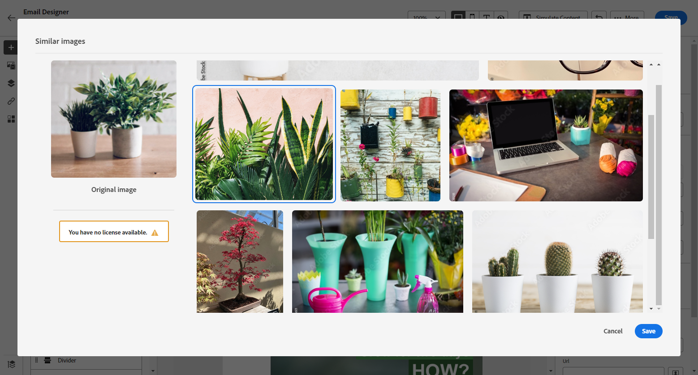
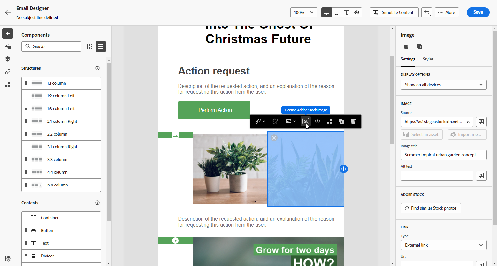

# Trabalhar com [!DNL Adobe Stock] imagens {#stock}

## Introdução ao [!DNL Adobe Stock] {#get-started-stock}

O plug-in de integração do Designer de email para o [!DNL Adobe Stock] e [!DNL Adobe Journey Optimizer] fornece aos clientes uma maneira fácil de navegar, licenciar e salvar imagens para uso na criação de mensagens.

O [Adobe Stock](https://helpx.adobe.com/br/stock/get-started.html){target="_blank"} fornece acesso a milhões de fotos, vídeos, ilustrações e elementos gráficos vetoriais de alta qualidade, com curadoria e isentos de royalties. Você pode optar por comprar um pacote de crédito para licenciar ativos ou comprar apenas uma licença Padrão ou Estendida para o ativo necessário. O Adobe Stock também fornece uma coleção gratuita de ativos.

Com o [!DNL Adobe Journey Optimizer], você pode fazer upload de imagens para seus emails diretamente do [!DNL Adobe Stock] e adicioná-las à pasta **[!UICONTROL Ativos]** usando a opção **[!UICONTROL Encontrar fotos do Adobe Stock]**. Além disso, a opção **[!UICONTROL Encontrar fotos semelhantes do Stock]** ajuda a encontrar imagens que correspondam ao conteúdo, à cor e à composição do ativo usado na entrega.

## Permissões{#stock-permissions}

As opções **[!UICONTROL Localizar fotos do Adobe Stock]** e **[!UICONTROL Localizar imagem semelhante]** estão disponíveis para usuários com acesso a um Perfil de Produto do AEM Assets Essentials.

Para obter mais informações, consulte a [documentação do Experience Manager Assets](https://experienceleague.adobe.com/docs/experience-manager-assets-essentials/help/get-started-admins/deploy-administer.html?lang=pt-BR#add-users-to-essentials){target="_blank"}.

## Inserir uma imagem de [!DNL Adobe Stock] {#add-stock-image}

Para adicionar imagens de [!DNL Adobe Stock] ao seu conteúdo, siga as etapas abaixo:

1. Na seção **[!UICONTROL Componentes do conteúdo]** do Designer de email, arraste e solte uma **Imagem**.

1. Clique no botão **[!UICONTROL Localizar fotos do Adobe Stock]** no lado esquerdo do Designer de email.

   

1. Navegue pela biblioteca ou insira um termo no campo de pesquisa.

   

1. Selecione a imagem escolhida e clique em **[!UICONTROL Salvar]**.

   Se a imagem selecionada não for licenciada, você deverá [obter a licença](#license-stock-image).

## Localizar fotos semelhantes {#similar-stock-image}

Você pode substituir qualquer imagem existente no seu conteúdo de email por uma foto do [!DNL Adobe Stock]. Observe que essa opção está disponível para todas as imagens: imagens do Stock licenciadas/não licenciadas e imagens da sua pasta Assets.

Para procurar fotos semelhantes, siga as etapas abaixo:

1. Selecione a imagem a ser substituída.
1. Clique no botão **[!UICONTROL Localizar fotos semelhantes do Stock]** para exibir ativos em [!DNL Adobe Stock] que correspondam ao conteúdo, cor e composição da imagem.

   

1. Selecione a imagem escolhida e clique em **[!UICONTROL Salvar]**.

   

   Se a imagem selecionada não for licenciada, você deverá [obter a licença](#license-stock-image).

1. Personalize sua imagem, se necessário, com as guias **[!UICONTROL Configurações]** e **[!UICONTROL Estilos]**. [Saiba mais sobre configurações de componentes](../email/content-components.md).

## Obter a licença de [!DNL Adobe Stock] {#license-stock-image}

Se sua imagem já estiver licenciada, ela será representada pelo ícone . Caso contrário, você deve licenciá-lo.

Para licenciar e baixar a imagem, siga as etapas abaixo:

1. Selecione-a e clique no ícone **[!UICONTROL Licenciar imagem do Adobe Stock]**.

   

   Você será redirecionado ao site [!DNL Adobe Stock] para comprar a licença.

   

1. No site do [!DNL Adobe Stock], você precisa comprar seu ativo para baixar a imagem e remover a marca d&#39;água.

   Essa compra depende do seu plano ou assinatura da Adobe Stock. Observe que, se você tiver várias contas do Adobe Stock, será redirecionado para a última ID do Stock usada. Nesse caso, verifique se você está conectado à conta correta antes de licenciar seu ativo.

   Para obter mais informações sobre planos e preços da Adobe Stock, consulte a [documentação do Adobe Stock](https://stock.adobe.com/plans){target="_blank"}.

   >[!WARNING]
   > Se um email incluindo uma imagem não licenciada for enviado, a imagem manterá seu formulário não licenciado com a marca d&#39;água.

1. Após concluir a compra, você pode voltar ao email no [!DNL Adobe Journey Optimizer] e selecionar **[!UICONTROL Importar imagem de estoque]** para importar a imagem licenciada para seus ativos.

   

1. Selecione em qual pasta armazenar o ativo. Para obter mais informações sobre [!DNL Experience Manager Assets], consulte esta [página](assets.md#get-started-assets).

## Tópicos relacionados{#stock-related-topics}

* [Design de email no Journey Optimizer](../email/get-started-email-design.md)
* [Configurações de componentes para design de email](../email/content-components.md)
* [Introdução ao Adobe Stock](https://helpx.adobe.com/br/stock/get-started.html){target="_blank"}.

